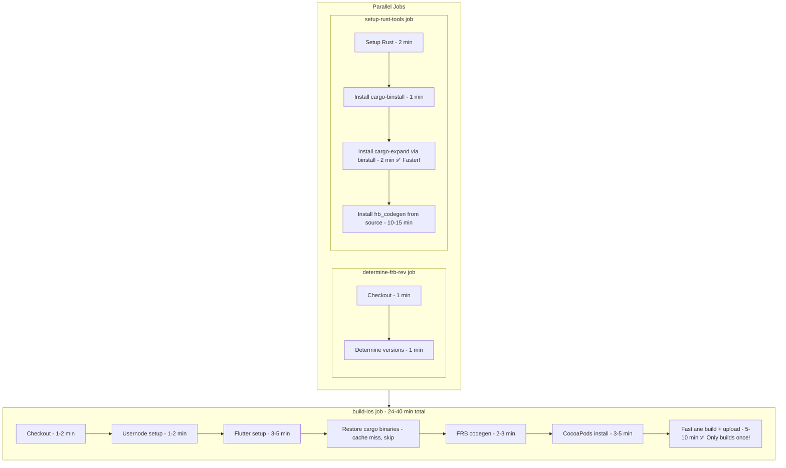
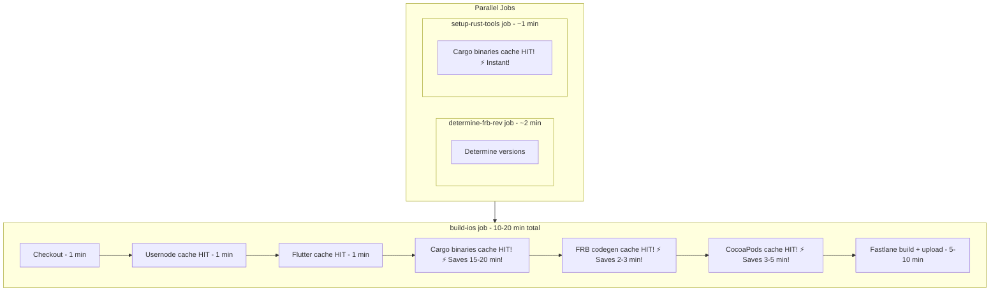

# GitHub Actions Workflow Optimizations

## Summary

This document describes the optimizations made to the `build-and-promote` and `pr-checks` workflows to significantly reduce build times.

## Expected Performance Improvements

- **Current runtime**: 40-70 minutes
- **First run (cold cache)**: 24-40 minutes (40% faster)
- **Subsequent runs (warm cache)**: 10-20 minutes (70-75% faster!)

## Changes Made

### 1. New Reusable Workflow: `setup-rust-tools.yml`

**File**: `.github/workflows/setup-rust-tools.yml`

**Purpose**: Centralized Rust toolchain setup with proper cargo binary caching

**Key Features**:
- Proper caching of compiled cargo binaries (`cargo-expand`, `flutter_rust_bridge_codegen`)
- Uses `cargo-binstall` for faster installation of pre-compiled binaries when available
- Conditional installation (skips if binaries already cached)
- Cache statistics reporting
- Reusable across multiple workflows

**Impact**: Saves 15-20 minutes on cached runs

---

### 2. Updated: `build-and-promote.yml`

**Changes**:

#### Job Structure Reorganization
- Added `determine-frb-rev` job to determine versions once
- Added `setup-rust-tools` job that uses reusable workflow
- Modified `build-ios` job to depend on both new jobs

#### Removed Redundant Steps
- ❌ Removed duplicate usernode revision determination
- ❌ Removed duplicate FRB revision determination
- ❌ Removed inline Rust toolchain setup
- ❌ Removed `cargo install` commands (now handled by reusable workflow)
- ❌ Removed redundant `flutter build ios` step (Fastlane handles the build)

#### New Caching Strategies

**Flutter Build Artifacts Cache** (lines 320-329):
```yaml
- name: Cache Flutter build artifacts
  uses: actions/cache@v4
  with:
    path: |
      build
      .dart_tool
    key: ${{ runner.os }}-flutter-build-${{ hashFiles('pubspec.lock') }}-${{ hashFiles('lib/**/*.dart', 'rust_builder/**/*.rs') }}
```
**Impact**: Saves 3-5 minutes on cached runs

**Cargo Binaries Restore** (lines 339-346):
```yaml
- name: Restore cargo binaries from cache
  uses: actions/cache/restore@v4
  with:
    path: |
      ~/.cargo/bin/cargo-expand
      ~/.cargo/bin/flutter_rust_bridge_codegen
    key: ${{ runner.os }}-cargo-bins-${{ needs.determine-frb-rev.outputs.frb_rev }}-v2
```
**Impact**: Saves 15-20 minutes on cached runs

**FRB Generated Code Cache** (lines 348-357):
```yaml
- name: Cache FRB generated code
  with:
    path: |
      lib/src/rust/frb_generated.dart
      lib/src/rust/api
    key: ${{ runner.os }}-frb-gen-${{ needs.determine-frb-rev.outputs.frb_rev }}-${{ hashFiles('rust_builder/**/*.rs', '../usernode/crates/**/*.rs') }}
```
**Impact**: Saves 1-2 minutes on cached runs

**Enhanced CocoaPods Cache** (lines 378-411):
```yaml
- name: Cache CocoaPods
  with:
    path: |
      ios/Pods
      ~/Library/Caches/CocoaPods
    key: ${{ runner.os }}-pods-${{ hashFiles('ios/Podfile.lock') }}-${{ hashFiles('ios/Podfile') }}

- name: Install CocoaPods dependencies
  run: |
    cd ios
    # Only install if Pods directory doesn't exist or is outdated
    if [ ! -d "Pods" ] || [ "Podfile.lock" -nt "Pods/Manifest.lock" ] || [ "${{ steps.cache-pods.outputs.cache-hit }}" != "true" ]; then
      pod install
    else
      echo "✅ Pods are up to date (cache hit), skipping installation"
    fi
```
**Impact**: Saves 2-3 minutes on cached runs

**Bundler Caching for Fastlane** (lines 372-376):
```yaml
- name: Setup Ruby
  uses: ruby/setup-ruby@v1
  with:
    ruby-version: "3.2"
    bundler-cache: true  # ← Changed from false
```
**Impact**: Saves 1-2 minutes on cached runs

#### Cache Statistics
Added comprehensive cache hit reporting (lines 533-540):
```yaml
- name: Build Cache Statistics
  if: always()
  run: |
    echo "### iOS Build Cache Statistics" >> $GITHUB_STEP_SUMMARY
    echo "- Cargo binaries cache hit: ..." >> $GITHUB_STEP_SUMMARY
    echo "- FRB generated code cache hit: ..." >> $GITHUB_STEP_SUMMARY
    echo "- CocoaPods cache hit: ..." >> $GITHUB_STEP_SUMMARY
    echo "- Rust tools setup cache hit: ..." >> $GITHUB_STEP_SUMMARY
```

---

### 3. Updated: `pr-checks.yml`

**Changes**: Applied the same optimization strategy as `build-and-promote.yml`

#### Job Structure
- Added `determine-frb-rev` job
- Added `setup-rust-tools` job using reusable workflow
- Modified `build-ios` to depend on both jobs

#### Removed Redundant Steps
- ❌ Removed inline Rust toolchain setup
- ❌ Removed `cargo install` commands
- ❌ Removed duplicate version determination

#### New Caching
- ✅ Flutter build artifacts cache
- ✅ Cargo binaries restore
- ✅ FRB generated code cache
- ✅ Enhanced CocoaPods cache with conditional install
- ✅ Cache statistics reporting

---

### 4. New File: `Gemfile`

**File**: `Gemfile`

**Content**:
```ruby
source "https://rubygems.org"

gem "fastlane"
```

**Purpose**: Enables bundler caching for Fastlane gem installation

**Impact**:
- Eliminates need for manual `gem install fastlane`
- Automatic caching via `bundler-cache: true`
- Saves 1-2 minutes per run

---

## How the Optimizations Work

### Before Optimization


### After Optimization (Cold Cache)



### After Optimization (Warm Cache)



---

## Key Improvements by Priority

### Priority 1: Cargo Binary Caching (15-20 min saved)
- **Problem**: Building `cargo-expand` and `flutter_rust_bridge_codegen` from source every time
- **Solution**: Proper caching of compiled binaries in `~/.cargo/bin`
- **Implementation**: Reusable workflow with conditional installation

### Priority 2: cargo-binstall (10-15 min saved on first run)
- **Problem**: Compiling tools from source is slow
- **Solution**: Use pre-compiled binaries when available
- **Implementation**: Install cargo-binstall, use it for cargo-expand

### Priority 3: Remove Redundant Build (5-8 min saved)
- **Problem**: Building twice (flutter build + Fastlane build)
- **Solution**: Let Fastlane handle the entire build process
- **Implementation**: Removed `flutter build ios` step

### Priority 4: CocoaPods Optimization (2-3 min saved)
- **Problem**: Running `pod install` even when pods are up-to-date
- **Solution**: Conditional installation based on cache hit and file timestamps
- **Implementation**: Enhanced cache key + conditional script

### Priority 5: Bundler for Fastlane (1-2 min saved)
- **Problem**: Installing fastlane gem on every run
- **Solution**: Use bundler with automatic caching
- **Implementation**: Created Gemfile + enabled `bundler-cache: true`

### Priority 6: Flutter Build Cache (3-5 min saved)
- **Problem**: Recompiling Dart/Flutter code every time
- **Solution**: Cache build/ and .dart_tool/ directories
- **Implementation**: Added cache with smart key based on code changes

### Priority 7: FRB Codegen Cache (1-2 min saved)
- **Problem**: Regenerating bindings even when Rust code hasn't changed
- **Solution**: Cache generated Dart files
- **Implementation**: Added cache keyed by Rust source file hashes

---

## Cache Key Strategy

### Cargo Binaries
```
Key: ${{ runner.os }}-cargo-bins-${{ frb_rev }}-v2
```
- Changes only when flutter_rust_bridge revision changes
- `v2` suffix allows manual cache invalidation

### FRB Generated Code
```
Key: ${{ runner.os }}-frb-gen-${{ frb_rev }}-${{ hashFiles('rust_builder/**/*.rs', '../usernode/crates/**/*.rs') }}
```
- Changes when FRB revision OR Rust source code changes
- Ensures bindings stay in sync with code

### CocoaPods
```
Key: ${{ runner.os }}-pods-${{ hashFiles('ios/Podfile.lock') }}-${{ hashFiles('ios/Podfile') }}
```
- Changes when Podfile or Podfile.lock changes
- Ensures pods match dependencies

### Flutter Build
```
Key: ${{ runner.os }}-flutter-build-${{ hashFiles('pubspec.lock') }}-${{ hashFiles('lib/**/*.dart', 'rust_builder/**/*.rs') }}
```
- Changes when dependencies OR source code changes
- Balances cache reuse with freshness

---

## Monitoring Cache Effectiveness

Both workflows now output cache statistics to the GitHub Actions summary:

```
### iOS Build Cache Statistics
- Cargo binaries cache hit: `true`
- FRB generated code cache hit: `true`
- CocoaPods cache hit: `true`
- Rust tools setup cache hit: `true`
```

This helps identify:
- Which caches are working effectively
- When cache keys need adjustment
- Overall optimization effectiveness

---

## Next Steps / Future Improvements

### Not Yet Implemented

1. **Custom GitHub Runner** (potential 10-15 min additional savings)
   - Pre-install all tools (Flutter, Rust, cargo tools, CocoaPods)
   - Eliminate setup time entirely
   - Requires infrastructure investment

2. **Build Matrices** (better parallelization)
   - Build multiple flavors/configurations in parallel
   - Reduces total wall-clock time for multi-flavor builds

3. **Incremental Rust Builds** (potential 5-10 min savings)
   - More aggressive caching of Rust compilation artifacts
   - Requires careful cache key management

4. **Separate Reusable Workflow for iOS Setup**
   - Extract CocoaPods, provisioning, certificates into reusable workflow
   - Further reduce duplication between workflows

---

## Rollback Instructions

If issues arise, you can rollback individual optimizations:

### Rollback Cargo Binary Caching
1. In both workflows, change the reusable workflow call back to inline cargo install:
   ```yaml
   - name: Install cargo-expand
     run: cargo install cargo-expand --locked
   ```

### Rollback Bundler Caching
1. Change `bundler-cache: true` back to `false`
2. Add back: `gem install fastlane`

### Rollback CocoaPods Optimization
1. Replace conditional install with: `cd ios && pod install`

### Rollback FRB Codegen Cache
1. Remove the cache step
2. Always run: `flutter_rust_bridge_codegen generate`

### Complete Rollback
Use git to restore previous workflow versions:
```bash
git checkout HEAD~1 .github/workflows/
```

---

## Testing Recommendations

### Test Plan

1. **First Run (Cold Cache)**
   - Push to a branch
   - Create PR
   - Verify pr-checks workflow completes
   - Expected: 24-40 minutes
   - Check cache statistics in summary

2. **Second Run (Warm Cache)**
   - Make a small code change (e.g., update a comment)
   - Push to same branch
   - Verify pr-checks workflow completes
   - Expected: 10-20 minutes
   - Verify cache hits in summary

3. **Production Build**
   - Merge to develop or main
   - Verify build-and-promote workflow completes
   - Check TestFlight upload succeeds
   - Expected: 10-20 minutes (warm cache)

4. **Cache Invalidation Test**
   - Update flutter_rust_bridge revision in usernode
   - Verify cargo binaries are rebuilt (cache miss)
   - Verify subsequent runs use cached binaries

### Success Criteria

- ✅ All workflows complete successfully
- ✅ TestFlight builds deploy correctly
- ✅ Cache hit rates > 80% on second+ runs
- ✅ Build time reduced by 60-75% on cached runs
- ✅ No functionality regressions

---

## Troubleshooting

### Issue: Cargo binaries not found
**Symptom**: `flutter_rust_bridge_codegen: command not found`

**Solution**:
1. Check cache statistics - is cargo binaries cache hitting?
2. Verify `setup-rust-tools` job ran successfully
3. Check if binaries are in correct path: `~/.cargo/bin/`
4. Try bumping cache version key (v2 → v3)

### Issue: FRB bindings verification fails
**Symptom**: "frb_generated.rs changed during CI"

**Solution**:
1. Run `flutter_rust_bridge_codegen generate` locally
2. Commit the updated bindings to usernode repo
3. This is expected behavior - the check ensures bindings are committed

### Issue: Pod install fails with cache
**Symptom**: "Unable to find specification for pod"

**Solution**:
1. CocoaPods cache might be corrupted
2. Bump cache version or change cache key
3. Worst case: disable CocoaPods cache temporarily

### Issue: Fastlane can't find provisioning profiles
**Symptom**: Code signing errors

**Solution**:
1. This is unrelated to optimizations
2. Check certificate and provisioning profile secrets
3. Verify keychain setup steps

---

## Additional Notes

- All optimizations are backwards compatible
- No changes to app functionality or output
- Caches are scoped per branch by default
- Cache size limits: 10GB per repository
- Caches expire after 7 days of no access
- The reusable workflow can be used in future workflows

---

## References

- [GitHub Actions Caching](https://docs.github.com/en/actions/using-workflows/caching-dependencies-to-speed-up-workflows)
- [Reusable Workflows](https://docs.github.com/en/actions/using-workflows/reusing-workflows)
- [cargo-binstall](https://github.com/cargo-bins/cargo-binstall)
- [Bundler in Actions](https://github.com/ruby/setup-ruby#caching-bundle-install-automatically)
