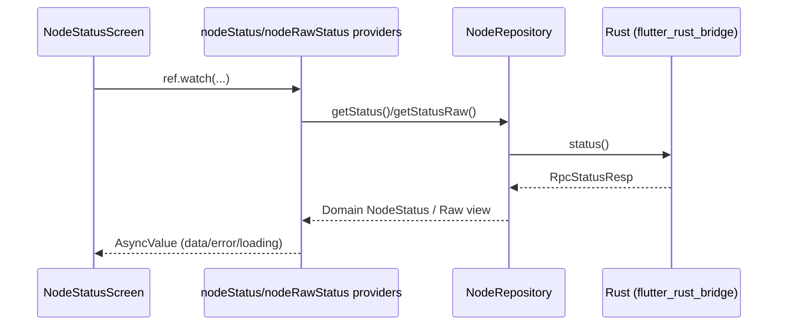
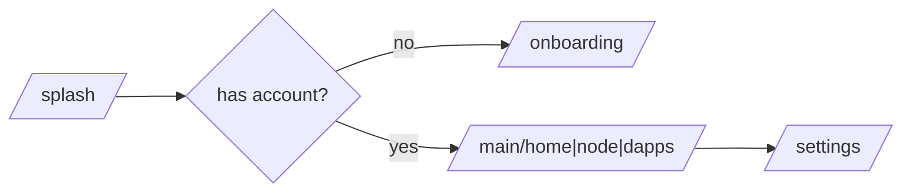
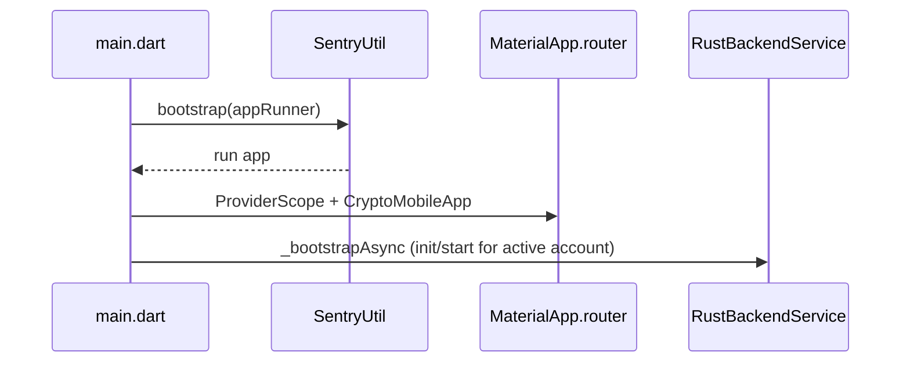

# Usernode Mobile App (Flutter)

Usernode is a feature‑first Flutter app that lets users run/observe a node, view status/peers/blocks, use a crypto wallet, and manage preferences. The app is provider‑driven (Riverpod), uses go_router for navigation, and integrates with a Rust backend via flutter_rust_bridge.

• Architecture: Presentation → Domain → Data
• State/DI: Riverpod (AsyncNotifier/Notifier)
• Navigation: go_router + ShellRoute
• Backend: Rust via flutter_rust_bridge
• Telemetry: Optional Sentry (dsn via dart‑define)
• Theming: Material 3 + persisted ThemeMode (System/Light/Dark)

## Quick Start

See RUNNING.md for commands, flags, and testing. Common flags:

```
flutter run \
  --dart-define=APP_ENV=staging \
  --dart-define=API_BASE_URL=https://api.example.com \
  --dart-define=SENTRY_DSN=your_sentry_dsn \
  --dart-define=USE_RESULT_PROVIDERS=true
```

## Architecture (at a glance)

```mermaid
flowchart LR
  subgraph Presentation
    UI[Widgets/Screens]
    CTRL[Controllers/Providers]
  end
  subgraph Domain
    ENT[Entities]
    REPOI[Repository Interfaces]
  end
  subgraph Data
    REPO[Repository Impl]
    DS[Datasources (FRB, Storage, HTTP)]
  end
  UI --> CTRL
  CTRL --> REPOI
  REPOI <-- REPO
  REPO --> DS
  DS --> REPO
  REPO --> CTRL
```

### Data flow (Node example)



### Navigation



### Startup



## Project Structure

```
lib/
  core/        # cross-cutting: routing, theme, DI, errors, config, telemetry
  features/    # feature-first modules (node, wallet, settings, home, etc)
  gen_l10n/    # generated localization
  main.dart    # entrypoint
```

Key files:
- core/di/providers.dart — repository + app providers (themeMode, toggles)
- core/routing/app_router.dart — go_router with ShellRoute and /settings
- features/node/... — Node UI + providers (raw status, mempool, etc.)
- features/settings/... — Settings screen with ThemeMode + Build Info

## Configuration & Flags

- APP_ENV, API_BASE_URL, VERBOSE_LOGGING — read by AppConfig
- SENTRY_DSN — optional; if omitted, Sentry remains disabled
- USE_RESULT_PROVIDERS — switch NodeStatusScreen to result‑based providers for mempool/slots

## State & Error Handling

- Riverpod controllers expose AsyncValue<T> to the UI
- AppError + Result<T> for typed errors and optional result‑based paths
- Node repository returns Result<NodeStatus?>; data providers map exceptions to AppError

## Theming

- Material 3 with CardThemeData polish
- themeModeProvider persists ThemeMode (SharedPreferences)
- Change theme in /settings or via quick toggle on Node/Home/Profile

## Testing & CI

- flutter test runs provider + widget tests (Node, Wallet, Settings, Router)
- CI: .github/workflows/flutter_ci.yml (format/analyze/tests on PRs)

## Contributing

See CONTRIBUTING.md for a step‑by‑step checklist and examples:
- Adding a new feature (Domain/Data/Presentation/Routing/Tests)
- Converting screens to providers
- Writing tests with provider overrides

## Running

See RUNNING.md for commands, flags, theme tips, and test notes.

### Environment Configuration

### IDE Configuration

#### VS Code (Recommended)

```json
// .vscode/settings.json
{
  "dart.flutterSdkPath": "/path/to/flutter",
  "editor.formatOnSave": true,
  "editor.codeActionsOnSave": {
    "source.organizeImports": true
  },
  "dart.lineLength": 120,
  "[dart]": {
    "editor.rulers": [120],
    "editor.selectionHighlight": false,
    "editor.suggest.snippetsPreventQuickSuggestions": false,
    "editor.suggestSelection": "first",
    "editor.tabCompletion": "onlySnippets",
    "editor.wordBasedSuggestions": false
  }
}
```

#### Required Extensions

- Flutter
- Dart
- Flutter Widget Snippets
- Awesome Flutter Snippets
- Flutter Tree
- GitLens

#### iOS Simulator Rust Build Fix

These steps fix the error when building Rust code with C++ (e.g., datachannel-sys) for iOS simulator.

##### 1. Add Rust target for iOS simulator

```bash
rustup target add aarch64-apple-ios-sim
```

##### 2. Set compilers to Xcode's clang/clang++

```bash
export CC_aarch64_apple_ios_sim="$(xcrun --sdk iphonesimulator -f clang)"
export CXX_aarch64_apple_ios_sim="$(xcrun --sdk iphonesimulator -f clang++)"
```

##### 3. Configure SDKROOT and flags

```bash
export SDKROOT="$(xcrun --sdk iphonesimulator --show-sdk-path)"
export CFLAGS_aarch64_apple_ios_sim="--sysroot=$SDKROOT"
export CXXFLAGS_aarch64_apple_ios_sim="--sysroot=$SDKROOT -stdlib=libc++ -std=c++17"
export RUSTFLAGS="-C link-arg=-stdlib=libc++"
```

##### 4. Fix bindgen target triple and libclang path

```bash
export BINDGEN_EXTRA_CLANG_ARGS_aarch64_apple_ios_sim="-target arm64-apple-ios-simulator -isysroot $SDKROOT -I$SDKROOT/usr/include/c++/v1"
export LIBCLANG_PATH="$(xcode-select -p)/Toolchains/XcodeDefault.xctoolchain/usr/lib"
```

##### 5. Clean previous builds

```bash
cargo clean
rm -rf ~/Library/Developer/Xcode/DerivedData/Runner-*/Build/Intermediates.noindex/Pods.build/Debug-iphonesimulator
cd ios && pod deintegrate && pod install && cd ..
```

##### 6. Rebuild

```bash
# For Flutter
flutter run -d "iPhone 15"

# Or plain Cargo
cargo build -p usernode --target aarch64-apple-ios-sim
```

## Architecture & Design Patterns

### Project Structure

```
lib/
├── constants/          # App-wide constants and configuration
├── l10n/              # Internationalization files
├── screens/           # Application screens/pages
├── theme/             # App theming and styling
├── widgets/           # Reusable UI components
│   └── common/        # Common widgets used across screens
├── models/            # Data models and DTOs
├── services/          # Business logic and API services
├── providers/         # State management providers
├── utils/             # Utility functions and helpers
├── repository/        # Data repository layer
└── main.dart          # Application entry point
```

### Architecture Pattern

The application follows a **Repository Pattern** with **Provider** state management:

```
Presentation Layer (Widgets/Screens)
         ↓
State Management Layer (Providers)
         ↓
Business Logic Layer (Services)
         ↓
Data Access Layer (Repository)
         ↓
Data Sources (API, Local Storage)
```

### Design Patterns Used

#### Repository Pattern

- Abstracts data sources from business logic
- Provides a clean API for data operations
- Enables easy testing and mocking

#### Singleton Pattern

- Used for services like API client, local storage
- Ensures single instance across the app
- Managed through dependency injection

#### Factory Pattern

- Used for creating data models
- Handles different object creation scenarios
- Simplifies object instantiation

### Dependency Injection

Dependencies are managed using:

- Constructor injection for widgets
- Service locator pattern for global services
- Provider pattern for state management

### Navigation Structure

```
SplashScreen
    ↓
MainApp (Bottom Navigation)
├── Home Screen (Index 0)
├── Wallet Screen (Index 1)
└── Node Screen (Index 2)
```

Navigation is handled using Flutter's built-in `Navigator` with `MaterialPageRoute`.

## Code Organization

### Folder Structure

```
lib/
├── constants/
│   └── app_constants.dart      # App-wide constants, navigation items
├── l10n/
│   ├── app_en.arb             # English translations
│   └── app_es.arb             # Spanish translations
├── screens/
│   ├── main_app.dart          # Main navigation container
│   ├── placeholder_screens.dart # Placeholder screens for development
│   └── splash_screen.dart     # App launch screen
├── theme/
│   └── app_theme.dart         # Material 3 theme configuration
├── widgets/
│   └── common/
│       ├── activity_card.dart
│       ├── horizontal_card_scroll.dart
│       ├── liquidity_bridge_card.dart
│       └── multiplier_card.dart
└── main.dart                  # App entry point
```

### File Naming Conventions

#### Dart Files

- **Snake case**: `splash_screen.dart`, `user_profile.dart`
- **Widgets**: `custom_button.dart`, `loading_indicator.dart`
- **Screens**: `home_screen.dart`, `wallet_screen.dart`
- **Models**: `user_model.dart`, `transaction_model.dart`
- **Services**: `auth_service.dart`, `api_service.dart`

#### Classes and Variables

- **Classes**: `PascalCase` - `SplashScreen`, `UserModel`
- **Variables**: `camelCase` - `userName`, `isLoading`
- **Constants**: `camelCase` - `apiBaseUrl`, `splashDuration`
- **Private members**: `_camelCase` - `_controller`, `_fadeAnimation`

### Import Organization

```dart
// 1. Dart core libraries
import 'dart:async';
import 'dart:convert';

// 2. Flutter libraries
import 'package:flutter/material.dart';
import 'package:flutter/services.dart';

// 3. Third-party packages
import 'package:provider/provider.dart';
import 'package:http/http.dart' as http;

// 4. Local imports (relative)
import '../models/user_model.dart';
import '../services/api_service.dart';
import '../utils/helpers.dart';
```

### Code Style Guidelines

- Line length: 120 characters
- Indentation: 2 spaces
- Use trailing commas for better diffs
- Prefer `const` constructors when possible
- Use meaningful variable names
- Add documentation comments for public APIs

## Features Documentation

### Core Features

#### 1. Node Management

**Purpose**: Monitor and manage blockchain nodes
**Implementation**:

- Real-time node status monitoring
- Sync progress tracking
- Node configuration management
  **User Flow**:

1. User navigates to Node tab
2. Views current node status
3. Can configure node settings
4. Monitors sync progress

#### 2. Wallet Integration

**Purpose**: Cryptocurrency wallet management
**Implementation**:

- Multi-chain wallet support
- Balance tracking
- Transaction history
- Asset bridging capabilities
  **User Flow**:

1. User accesses Wallet tab
2. Views portfolio overview
3. Can initiate transactions
4. Reviews transaction history

#### 3. DeFi Operations

**Purpose**: Decentralized finance interactions
**Implementation**:

- Liquidity provision
- Token staking
- Yield farming
- Cross-chain bridging
  **User Flow**:

1. User selects DeFi operation
2. Reviews terms and conditions
3. Confirms transaction
4. Monitors operation status

#### 4. Identity Verification

**Purpose**: Enhanced security and rewards
**Implementation**:

- KYC integration
- Document verification
- Biometric authentication
- Verification status tracking
  **User Flow**:

1. User initiates verification
2. Uploads required documents
3. Completes identity checks
4. Receives verification confirmation

### Feature Implementation Details

#### Splash Screen

- **Location**: `lib/screens/splash_screen.dart:6`
- **Animation**: Fade, scale, and slide transitions
- **Duration**: 3 seconds (configurable)
- **Navigation**: Auto-navigates to MainApp

#### Navigation System

- **Location**: `lib/screens/main_app.dart:5`
- **Type**: Material 3 NavigationBar
- **Tabs**: Home, Wallet, Node
- **Internationalization**: Localized tab labels

#### Theming System

- **Location**: `lib/theme/app_theme.dart:4`
- **Design**: Material 3 with custom color scheme
- **Features**: Light theme, custom typography, component themes

## API Integration

### API Architecture

The application uses RESTful APIs for backend communication:

```dart
// Base API configuration
class ApiConstants {
  static const String baseUrl = 'https://api.usernode.com';
  static const String apiVersion = '/v1';
  static const Duration timeout = Duration(seconds: 30);
}
```

### Authentication

- **Method**: Bearer token authentication
- **Storage**: Secure storage for tokens
- **Refresh**: Automatic token refresh
- **Logout**: Token invalidation

### Error Handling Strategy

```dart
class ApiException implements Exception {
  final String message;
  final int? statusCode;
  final String? errorCode;

  ApiException(this.message, {this.statusCode, this.errorCode});
}
```

### Data Models

Generated using `json_annotation` for type safety:

```dart
@JsonSerializable()
class NodeStatus {
  final String id;
  final String status;
  final DateTime lastSync;

  NodeStatus({required this.id, required this.status, required this.lastSync});

  factory NodeStatus.fromJson(Map<String, dynamic> json) => _$NodeStatusFromJson(json);
  Map<String, dynamic> toJson() => _$NodeStatusToJson(this);
}
```

### Network Configuration

- **Client**: HTTP package with interceptors
- **Timeout**: 30 seconds for API calls
- **Retry Logic**: Automatic retry for failed requests
- **Caching**: Response caching for performance

## State Management

### State Management Solution

**Provider Pattern** is used for state management due to:

- Simplicity and ease of use
- Good performance characteristics
- Excellent debugging support
- Official recommendation from Flutter team

### Global State Structure

```dart
class AppState extends ChangeNotifier {
  User? _currentUser;
  NodeStatus? _nodeStatus;
  List<Transaction> _transactions = [];

  User? get currentUser => _currentUser;
  NodeStatus? get nodeStatus => _nodeStatus;
  List<Transaction> get transactions => _transactions;
}
```

### Local State Management

- **StatefulWidget**: For simple local state
- **Form state**: Using Form widgets and controllers
- **Animation state**: Using AnimationController

### State Persistence

- **User preferences**: SharedPreferences
- **Authentication state**: Secure storage
- **App state**: Hive database for complex objects

## Database & Storage

### Local Storage Solutions

#### SharedPreferences

Used for simple key-value storage:

```dart
// User preferences
static const String _themeKey = 'theme_mode';
static const String _languageKey = 'app_language';
```

#### Secure Storage

For sensitive data like tokens:

```dart
const storage = FlutterSecureStorage();
await storage.write(key: 'auth_token', value: token);
```

#### Hive Database

For complex local data storage:

```dart
@HiveType(typeId: 0)
class CachedNode extends HiveObject {
  @HiveField(0)
  String id;

  @HiveField(1)
  String status;

  @HiveField(2)
  DateTime lastUpdate;
}
```

### Database Schema

```
Boxes:
├── nodes          # Cached node information
├── transactions   # Transaction history
├── user_data      # User profile data
└── app_settings   # Application settings
```

### Data Migration Strategy

- Version-controlled database schemas
- Automatic migration on app updates
- Backup and restore functionality
- Data validation after migration

### Caching Strategy

- **API responses**: 5-minute cache for dynamic data
- **Static data**: Long-term caching
- **Images**: Cached using `cached_network_image`
- **User data**: Persistent local storage

## UI/UX Guidelines

### Design System

#### Color Scheme (Material 3)

```dart
// Primary colors
static final Color primaryColor = Color(0xFF007AFF);
static final Color onPrimary = Colors.white;

// Surface colors
static final Color surface = Colors.white;
static final Color surfaceVariant = Color(0xFFF2F2F7);

// Semantic colors
static final Color success = Color(0xFF30D158);
static final Color warning = Color(0xFFFF9500);
static final Color error = Color(0xFFFF3B30);
```

#### Typography

- **Display Large**: 28px, Weight 600 (Headings)
- **Headline Medium**: 20px, Weight 600 (Section titles)
- **Body Large**: 16px, Weight 400 (Primary text)
- **Body Medium**: 14px, Weight 400 (Secondary text)

#### Spacing System

- **Base unit**: 4px
- **Small**: 8px (2 units)
- **Medium**: 16px (4 units)
- **Large**: 24px (6 units)
- **XLarge**: 32px (8 units)

### Responsive Design

#### Breakpoints

- **Mobile**: < 600px
- **Tablet**: 600px - 1200px
- **Desktop**: > 1200px

#### Adaptive Layouts

```dart
class ResponsiveWidget extends StatelessWidget {
  final Widget mobile;
  final Widget? tablet;
  final Widget? desktop;

  const ResponsiveWidget({
    required this.mobile,
    this.tablet,
    this.desktop,
  });

  @override
  Widget build(BuildContext context) {
    return LayoutBuilder(
      builder: (context, constraints) {
        if (constraints.maxWidth > 1200) {
          return desktop ?? tablet ?? mobile;
        } else if (constraints.maxWidth > 600) {
          return tablet ?? mobile;
        } else {
          return mobile;
        }
      },
    );
  }
}
```

### Accessibility

#### Implementation

- **Semantic labels**: All interactive elements
- **Focus management**: Proper tab order
- **Color contrast**: WCAG AA compliance
- **Text scaling**: Respects system font size
- **Screen readers**: VoiceOver and TalkBack support

```dart
Semantics(
  label: 'Navigate to wallet screen',
  child: IconButton(
    icon: Icon(Icons.account_balance_wallet),
    onPressed: () => _navigateToWallet(context),
  ),
)
```

### Theming

#### Theme Configuration

The app supports system theme detection:

```dart
MaterialApp(
  theme: AppTheme.lightTheme,
  darkTheme: AppTheme.darkTheme, // TODO: Implement dark theme
  themeMode: ThemeMode.system,
)
```

### Custom Widgets

#### Activity Card

- **Purpose**: Display user activities
- **Location**: `lib/widgets/common/activity_card.dart`
- **Features**: Status icons, timestamps, action buttons

#### Horizontal Card Scroll

- **Purpose**: Scrollable card layouts
- **Location**: `lib/widgets/common/horizontal_card_scroll.dart`
- **Features**: Smooth scrolling, card indicators

## Testing

### Testing Strategy

#### Unit Tests

- **Purpose**: Test individual functions and classes
- **Coverage Target**: 80%+ for core business logic
- **Location**: `test/unit/`

```dart
void main() {
  group('NodeService', () {
    test('should fetch node status successfully', () async {
      // Test implementation
    });
  });
}
```

#### Widget Tests

- **Purpose**: Test UI components
- **Coverage Target**: 70%+ for custom widgets
- **Location**: `test/widget/`

```dart
void main() {
  testWidgets('ActivityCard displays correctly', (WidgetTester tester) async {
    await tester.pumpWidget(
      MaterialApp(
        home: ActivityCard(
          title: 'Test Activity',
          status: 'completed',
        ),
      ),
    );

    expect(find.text('Test Activity'), findsOneWidget);
  });
}
```

#### Integration Tests

- **Purpose**: Test complete user flows
- **Coverage Target**: Key user journeys
- **Location**: `integration_test/`

### Test Structure

```
test/
├── unit/
│   ├── models/
│   ├── services/
│   └── utils/
├── widget/
│   ├── screens/
│   └── widgets/
└── integration/
    ├── app_test.dart
    └── flows/
```

### Mocking Strategy

```dart
class MockApiService extends Mock implements ApiService {}
class MockNodeRepository extends Mock implements NodeRepository {}
```

### CI/CD Testing

```yaml
name: Flutter CI

on: [push, pull_request]

jobs:
  test:
    runs-on: ubuntu-latest
    steps:
      - uses: actions/checkout@v2
      - uses: subosito/flutter-action@v2
      - run: flutter pub get
      - run: flutter analyze
      - run: flutter test
```

## Build & Deployment

### Build Configuration

#### Debug Build

```bash
flutter build apk --debug
flutter build ios --debug
```

#### Release Build

```bash
flutter build apk --release
flutter build ios --release --no-codesign
```

#### Build Flavors

```dart
// Define build flavors for different environments
const String flavor = String.fromEnvironment('FLAVOR', defaultValue: 'dev');
```

### Signing Configuration

#### Android Signing

```properties
# android/key.properties
storePassword=***
keyPassword=***
keyAlias=***
storeFile=../keystore.jks
```

#### iOS Signing

- Development certificates for debug builds
- Distribution certificates for release builds
- Provisioning profiles managed in Xcode

### Deployment Process

#### Android Deployment

1. Generate signed APK/AAB
2. Upload to Google Play Console
3. Configure release tracks (internal, alpha, beta, production)
4. Submit for review

#### iOS Deployment

1. Archive app in Xcode
2. Upload to App Store Connect
3. Configure app metadata
4. Submit for App Store review

### Version Management

Version numbers follow semantic versioning:

- **Format**: `MAJOR.MINOR.PATCH+BUILD`
- **Example**: `1.2.3+45`
- **Location**: `pubspec.yaml` version field

### CI/CD Pipeline

```yaml
# GitHub Actions workflow
name: Build and Deploy

on:
  push:
    tags:
      - "v*"

jobs:
  build-android:
    runs-on: ubuntu-latest
    steps:
      - name: Build Android Release
        run: flutter build apk --release

  build-ios:
    runs-on: macos-latest
    steps:
      - name: Build iOS Release
        run: flutter build ios --release --no-codesign
```

## Security Considerations

### Data Encryption

- **At Rest**: Sensitive data encrypted using AES-256
- **In Transit**: HTTPS/TLS 1.3 for all API communications
- **Local Storage**: Secure storage for authentication tokens

### API Security

- **Authentication**: Bearer token with expiration
- **Authorization**: Role-based access control
- **Rate Limiting**: API request throttling
- **Input Validation**: Server-side validation for all inputs

### Code Obfuscation

```bash
# Enable obfuscation for release builds
flutter build apk --release --obfuscate --split-debug-info=debug-info/
```

### Permissions

#### Android Permissions

```xml
<uses-permission android:name="android.permission.INTERNET" />
<uses-permission android:name="android.permission.CAMERA" />
<uses-permission android:name="android.permission.READ_EXTERNAL_STORAGE" />
```

#### iOS Permissions

```xml
<key>NSCameraUsageDescription</key>
<string>This app needs camera access for identity verification</string>
<key>NSPhotoLibraryUsageDescription</key>
<string>This app needs photo library access to select images</string>
```

### Security Best Practices

- Regular dependency updates
- Security audit of third-party packages
- Secure API endpoints
- Input sanitization
- Certificate pinning for API calls

## Performance Optimization

### Performance Monitoring

- **Firebase Performance**: Real-time performance metrics
- **Custom Metrics**: App-specific performance indicators
- **Crash Reporting**: Firebase Crashlytics integration

### Memory Management

- **Widget disposal**: Proper disposal of controllers and streams
- **Image caching**: Efficient image memory management
- **List optimization**: ListView.builder for large lists

### Build Optimization

```dart
// Use const constructors where possible
const SizedBox(height: 16);

// Optimize ListView for large datasets
ListView.builder(
  itemCount: items.length,
  itemBuilder: (context, index) => ItemWidget(items[index]),
);
```

### Image Optimization

- **Format**: WebP for better compression
- **Sizes**: Multiple resolutions for different densities
- **Caching**: Aggressive caching for frequently used images

## Debugging & Troubleshooting

### Common Issues

#### Build Issues

**Problem**: Build failures after dependency updates
**Solution**:

1. Run `flutter clean`
2. Delete `pubspec.lock`
3. Run `flutter pub get`

#### Performance Issues

**Problem**: Slow app startup
**Solution**:

1. Check for synchronous operations in main()
2. Optimize heavy widgets
3. Use lazy loading for data

### Debugging Tools

#### Flutter Inspector

- Widget tree visualization
- Performance overlay
- Layout explorer

#### Debug Console

- Print statements for debugging
- Error stack traces
- Performance metrics

### Logging Strategy

```dart
import 'package:logger/logger.dart';

final Logger logger = Logger(
  printer: PrettyPrinter(),
);

logger.d('Debug message');
logger.i('Info message');
logger.w('Warning message');
logger.e('Error message');
```

### Performance Profiling

```bash
# Profile app performance
flutter run --profile

# Analyze build times
flutter build --analyze-size
```

### Crash Reporting

Firebase Crashlytics integration for production crash monitoring:

```dart
await FirebaseCrashlytics.instance.recordError(
  error,
  stackTrace,
  fatal: false,
);
```

## Third-Party Dependencies

### Core Dependencies

```yaml
dependencies:
  flutter:
    sdk: flutter
  flutter_localizations:
    sdk: flutter

  # UI Components
  cupertino_icons: ^1.0.2

  # Internationalization
  intl: ^0.18.1
```

### Development Dependencies

```yaml
dev_dependencies:
  flutter_test:
    sdk: flutter
  flutter_lints: ^2.0.0
```

### Future Dependencies (Recommendations)

```yaml
# State Management
provider: ^6.0.5

# Network
http: ^1.1.0
dio: ^5.3.2

# Local Storage
shared_preferences: ^2.2.2
flutter_secure_storage: ^9.0.0
hive: ^2.2.3

# UI Enhancement
cached_network_image: ^3.3.0
shimmer: ^3.0.0

# Utilities
logger: ^2.0.1
url_launcher: ^6.2.1

# Firebase (Optional)
firebase_core: ^2.24.2
firebase_crashlytics: ^3.4.9
firebase_analytics: ^10.7.4
```

### Package Justification

- **intl**: Required for internationalization support
- **flutter_localizations**: Flutter's official i18n support
- **cupertino_icons**: iOS-style icons

### Update Strategy

- Monthly dependency reviews
- Automated security updates
- Breaking change assessment
- Staged rollout for major updates

### License Compliance

All dependencies use permissive licenses (MIT, BSD, Apache 2.0)

## Platform-Specific Considerations

### iOS-Specific Features

- **App Transport Security**: Configured for HTTPS
- **Background App Refresh**: Proper background handling
- **Push Notifications**: APNs integration
- **Face ID/Touch ID**: Biometric authentication

### Android-Specific Features

- **Background Services**: WorkManager integration
- **App Bundles**: Android App Bundle support
- **Adaptive Icons**: Dynamic icon theming
- **Scoped Storage**: Android 10+ storage handling

### Platform Channels

For native functionality not available in Flutter:

```dart
class NativeBridge {
  static const MethodChannel _channel = MethodChannel('usernode/native');

  static Future<String> getDeviceInfo() async {
    return await _channel.invokeMethod('getDeviceInfo');
  }
}
```

### Permission Handling

```dart
import 'package:permission_handler/permission_handler.dart';

Future<bool> requestCameraPermission() async {
  PermissionStatus status = await Permission.camera.request();
  return status == PermissionStatus.granted;
}
```

## Maintenance & Updates

### Update Process

#### Flutter SDK Updates

1. Check Flutter announcements
2. Review breaking changes
3. Update in development environment
4. Test thoroughly
5. Deploy to staging
6. Monitor for issues

#### Dependency Updates

```bash
# Check outdated packages
flutter pub outdated

# Update dependencies
flutter pub upgrade

# Update specific package
flutter pub upgrade package_name
```

### Code Review Guidelines

#### Review Checklist

- [ ] Code follows style guidelines
- [ ] Tests are included
- [ ] Documentation is updated
- [ ] Performance considerations addressed
- [ ] Security implications reviewed
- [ ] Accessibility requirements met

#### Approval Process

- Minimum 2 reviewers for core changes
- Automated testing must pass
- Performance impact assessment
- Security review for sensitive changes

### Bug Tracking

- **Platform**: GitHub Issues
- **Labels**: bug, enhancement, documentation
- **Priority**: high, medium, low
- **Assignment**: Team member responsible

### Documentation Updates

- Update README for setup changes
- Document new features
- Update API documentation
- Maintain changelog

## Team Guidelines

## Feature Flags

- Purpose: Gate features behind a simple, central switch so you can show/hide tabs and roll out over time without code changes.
- Files: `lib/config/feature_flags.dart` (logic) and optional `assets/feature_flags.json` (configuration).
- How it works:
  - Defaults are defined in code (currently `home` and `node` enabled; `wallet` gated).
  - Option A — JSON file (recommended for local dev): edit `assets/feature_flags.json`
    - Example:
      - `{ "enabled": ["home", "node"], "order": ["home", "wallet", "node"], "disabled": ["wallet.send"] }`
    - App loads this at startup; no CLI args needed.
  - Option B — CLI overrides: use a compile-time define
    - Enable specific features: `flutter run --dart-define=ENABLED_FEATURES=home,wallet`
    - Enable all features: `flutter run --dart-define=ENABLED_FEATURES=all`
  - Bottom navigation and screens are built from the enabled features.

Notes:

- The order of tabs is controlled by `FeatureFlags.ordered`.
- Unknown values in `ENABLED_FEATURES` are ignored; at least `home` will remain enabled.
- Granular flags (widget-level) supported via keys:
  - Home: `home.cards`, `home.bridgeCard`, `home.verifyCard`, `home.stakeCard`, `home.multiplier`, `home.activity`
  - Wallet: `wallet.send`, `wallet.receive`, `wallet.transactions`
  - Use `disabled` array to hide any of the above (default is on if unspecified).

### Git Workflow

#### Branch Strategy

```
main
├── develop
├── feature/node-status-ui
├── feature/wallet-integration
└── hotfix/critical-bug-fix
```

#### Commit Conventions

```
feat: add node status monitoring
fix: resolve wallet balance calculation
docs: update API documentation
style: format code according to guidelines
refactor: simplify authentication flow
test: add unit tests for user service
```

### Code Review Process

#### Requirements

- All code must be reviewed before merge
- Automated tests must pass
- Code coverage requirements met
- Documentation updated where necessary

#### Review Standards

- Functionality correctness
- Code readability and maintainability
- Performance implications
- Security considerations
- Test coverage adequacy

### Development Standards

#### Coding Standards

- Follow Dart/Flutter style guide
- Use meaningful variable and function names
- Write self-documenting code
- Add comments for complex logic only
- Prefer composition over inheritance

#### Best Practices

- Write tests first (TDD approach)
- Keep functions small and focused
- Use dependency injection
- Handle errors gracefully
- Optimize for readability

### Communication Protocols

#### Daily Standups

- What was accomplished yesterday
- What will be worked on today
- Any blockers or impediments
- Code review requests

#### Weekly Reviews

- Sprint progress assessment
- Technical debt evaluation
- Performance metrics review
- Planning for upcoming features

#### Documentation

- Technical decisions recorded
- Architecture changes documented
- API changes communicated
- Deployment procedures updated

---

## Conclusion

This documentation serves as a comprehensive guide for developing, maintaining, and extending the Usernode Flutter application. Regular updates to this documentation ensure that team members have current and accurate information about the project.

For questions or clarifications about any aspect of the project, please reach out to the development team or create an issue in the project repository.

**Last Updated**: [Current Date]
**Version**: 1.0.0
**Maintainers**: Development Team

## Resources

A few resources to get you started if this is your first Flutter project:

- [Lab: Write your first Flutter app](https://docs.flutter.dev/get-started/codelab)
- [Cookbook: Useful Flutter samples](https://docs.flutter.dev/cookbook)

For help getting started with Flutter development, view the
[online documentation](https://docs.flutter.dev/), which offers tutorials,
samples, guidance on mobile development, and a full API reference.

```

```

```

```
## Quick Start

See RUNNING.md for how to run the app with optional flags, change theme mode, and run tests.

## Project Overview

This app follows a feature‑first, layered architecture (Presentation → Domain → Data) with Riverpod for DI/state, go_router for navigation, and flutter_rust_bridge (FRB) to talk to the Rust backend.

Highlights implemented:
- Provider‑driven UI for Node and Wallet
- go_router with ShellRoute tabs and guards
- Settings screen with persisted ThemeMode (System/Light/Dark)
- Quick theme toggles on Node Status, Home, and Profile
- Optional Result‑based Node providers (toggle via `USE_RESULT_PROVIDERS=true`)
- Lifecycle breadcrumbs + App config from `--dart-define`
- CI workflow (format/analyze/tests)

Useful docs:
- ARCHITECTURE.md — layers, navigation, toggles
- CONTRIBUTING.md — patterns, examples, and a checklist for adding features
- RUNNING.md — flags, theme, tests
