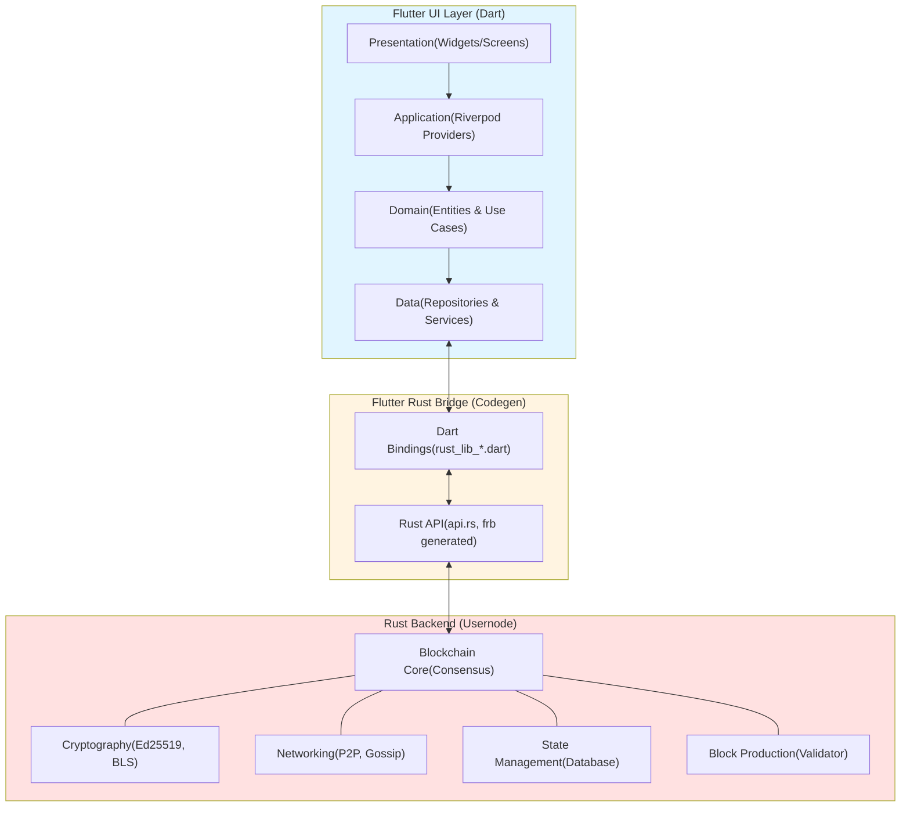
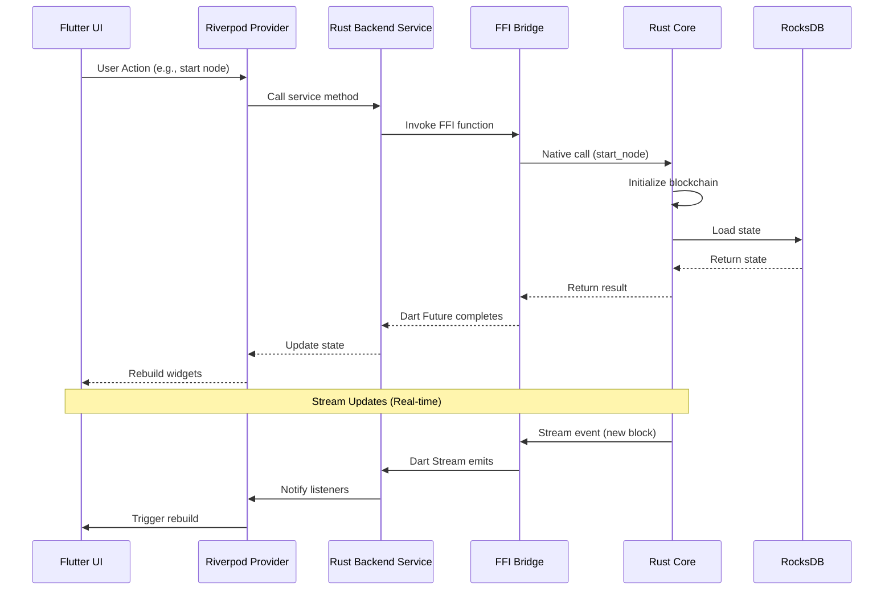
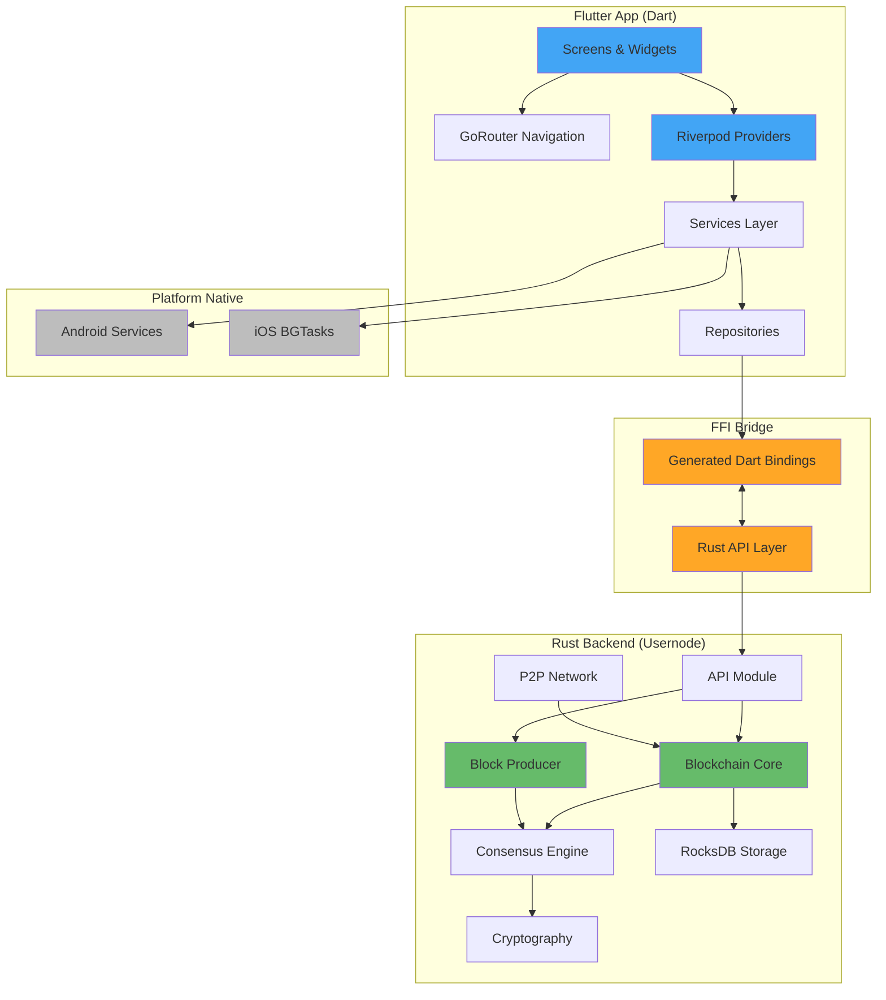
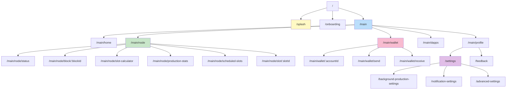
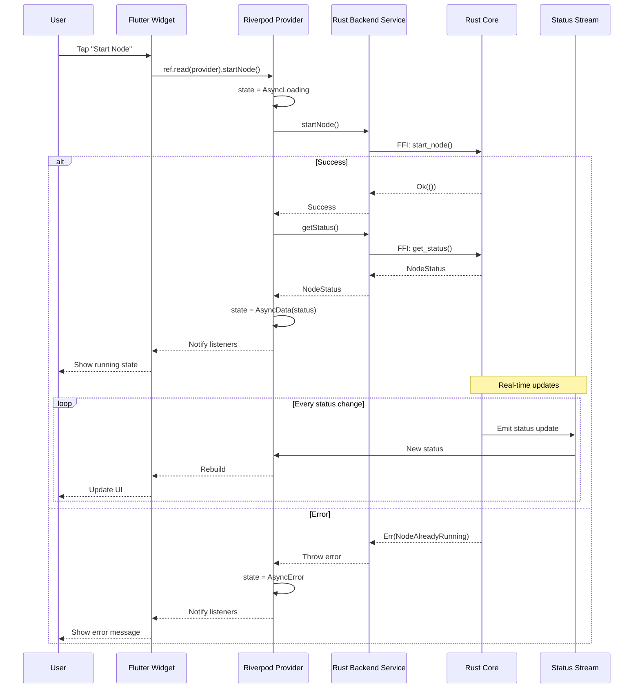
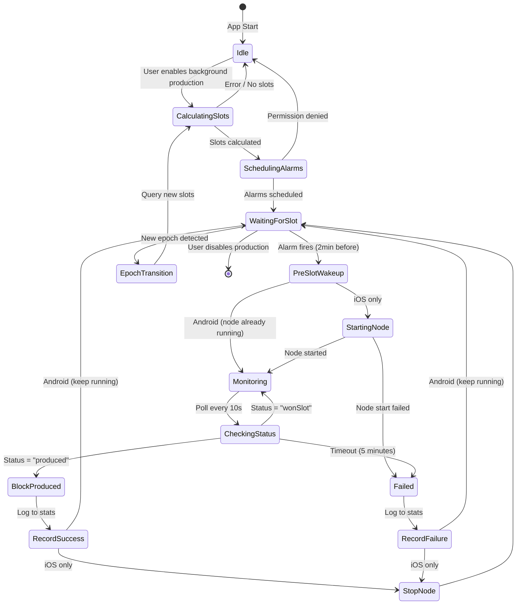

# Usernode Mobile App

<div align="center">


**A New Layer 1 Blockchain Operated & Secured by Users from Their Phones**

[Features](#key-features) • [Architecture](#architecture) • [Setup](#installation--setup) • [Contributing](#contributing)

</div>

---

## ⚠️ IMPORTANT NOTICES

> ### 🧪 Testing Phase
>
> **This application is currently in active development and testing phase.**
>
> For testing purposes, a few accounts/keys may be hardcoded in the application. These hardcoded credentials are **strictly for testing and development purposes only** and will be completely removed before the stable release.
>
> **Do not use this application with real assets or sensitive data until a stable version is officially released.**

> ### 🔐 Security Warning - Private Key Management
>
> This application manages private keys and cryptocurrency assets. **You are solely responsible for:**
>
> - Securing your device and preventing unauthorized access
> - Backing up your private keys and recovery phrases
> - **Loss of private keys means permanent loss of all assets - there is NO recovery mechanism**
> - Never sharing your private keys with anyone
>
> **Keep your device secure. Enable full device encryption and use strong authentication.**

> ### 🧪 Experimental Software - No Warranty
>
> This software is provided "AS IS" without warranty of any kind. The developers and Usernode Labs:
>
> - Make no guarantees about software reliability, security, or fitness for any purpose
> - Are not liable for any loss of funds, data, or damages arising from use of this software
> - Do not guarantee uninterrupted operation or error-free performance
>
> **Use at your own risk.**

> ### 💾 Backup Responsibility
>
> **YOU MUST BACK UP:**
>
> - Your recovery phrase/seed words (write on paper, store securely offline)
> - Your private keys
> - Your wallet addresses
>
> **Without backups, device loss or failure means permanent loss of all assets.**
> Store backups in a secure physical location separate from your device.

---

## Table of Contents

- [⚠️ Important Notices](#️-important-notices)
- [Overview](#overview)
- [Key Features](#key-features)
- [Documentation](#documentation)
- [Architecture](#architecture)
- [Navigation](#navigation)
- [State Management](#state-management)
- [Prerequisites](#prerequisites)
- [Installation / Setup](#installation--setup)
- [Building the Project](#building-the-project)
- [Running the Application](#running-the-application)
- [Project Structure](#project-structure)
- [Development Workflow](#development-workflow)
- [Testing](#testing)
- [Performance Considerations](#performance-considerations)
- [Common Issues / Troubleshooting](#common-issues--troubleshooting)
- [Dependencies](#dependencies)
- [Contributing](#contributing)
- [Deployment / Release](#deployment--release)
- [License](#license)
- [Acknowledgements](#acknowledgements)

---

## Overview

Usernode is a revolutionary mobile application that brings blockchain validator node operation to mobile devices. Built with Flutter for cross-platform UI and Rust for high-performance blockchain operations, Usernode enables users to:

- **Run a full blockchain validator node** directly on their mobile device
- **Participate in block production** and earn rewards
- **Manage cryptocurrency wallet** with secure key storage
- **Monitor blockchain status** in real-time
- **Schedule background block production** with platform-specific optimizations

This is **not a light client** - it's a full validator node with consensus participation, cryptographic operations, and block production capabilities, all optimized for mobile devices.

### Why Rust + Flutter?

- **Rust**: Handles computationally intensive blockchain operations (consensus, cryptography, networking) with memory safety and native performance
- **Flutter**: Provides beautiful, responsive UI with platform-specific optimizations (iOS/Android)
- **FFI Bridge**: Seamless communication between Dart and Rust via `flutter_rust_bridge`

---

## Key Features

### Blockchain Node Management

- Full validator node running on mobile device
- Real-time blockchain synchronization
- Consensus participation and block validation
- Network peer management
- Light Blockchain explorer with block/transaction details

### Wallet & Asset Management

- Secure key generation and storage (using device secure enclave)
- Transaction creation and signing
- Balance tracking and transaction history
- QR code generation for receiving funds
- And much more features to come

### Block Production & Rewards

- **Android background**: `AndroidForegroundTaskController` + exact alarms manage foreground service start/stop with adaptive VRF polling
- **Startup Permission Requests**: Automatic one-time permission requests at app launch (POST_NOTIFICATIONS, SCHEDULE_EXACT_ALARM, battery optimization)
- **Slot Calculator**: Calculate won slots for current epoch
- **Slot Scheduler**: Schedule alarms for upcoming block production windows
- **Slot Monitor**: Real-time monitoring during block production (5-minute windows)
- **Background Production** (Platform-specific):
  - **Android**: Exact alarms + Foreground Service with automatic slot monitoring trigger
  - **iOS**: Three-tier approach (Foreground Keep-Alive, BGTask + Notifications)
- Production statistics and success rate tracking
- Reward tracking and epoch-based analytics

### Advanced Notifications

- Time-sensitive slot production alerts
- Block production success/failure notifications
- Blockchain event notifications
- Custom notification channels and categories

### Monitoring & Analytics

- Node status dashboard
- Real-time blockchain metrics
- Historical data visualization (Limited since the node does not keep the full history of transactions and blocks)
- Performance monitoring
- Production success rate analytics

### Platform-Specific Optimizations

- **Android**: OEM battery optimization guidance (Xiaomi, Samsung, Oppo, etc.)
- **iOS**: Foreground Keep-Alive mode for 99% reliability
- Device reboot handling (automatic alarm rescheduling on Android)
- Battery optimization detection and workarounds

---

## Documentation

For detailed documentation on specific features and workflows, refer to the following guides:

### Background Block Production

- **[Background Block Production](docs/BACKGROUND_PRODUCTION.md)** - Comprehensive guide to background block production system, architecture, and platform-specific implementations
- **[Android Background Block Production Workflow](docs/ANDROID_BACKGROUND_BLOCK_PRODUCTION_WORKFLOW.md)** - Detailed flow diagram and implementation details for Android

### Development & Architecture

- **[Development Agents](AGENTS.md)** - Information about AI development agents and automation tools used in the project

These documents provide in-depth technical details, architecture decisions, and implementation guides that complement this README.

---

## Architecture

### High-Level Overview

Usernode follows a **layered architecture** with clear separation of concerns:



### Communication Method: Flutter Rust Bridge

**Integration Method**: `flutter_rust_bridge` v2.x (with Cargokit for native build integration)

**Bridge Location**:

- Dart side: `lib/rust/` (auto-generated bindings)
- Rust side: `../usernode/crates/usernode/src/api/` (API definitions)
- Build integration: `rust_builder/` (Cargokit configuration)

**How it works**:

1. **Rust API Definition**: Rust functions are annotated and exposed via `api.rs`
2. **Code Generation**: `flutter_rust_bridge_codegen` generates Dart bindings
3. **FFI Layer**: Auto-generated C bindings enable Dart ↔ Rust communication
4. **Type Safety**: Strongly typed interfaces with automatic serialization/deserialization
5. **Async Support**: Rust async functions are exposed as Dart Futures

### Responsibilities of Each Layer

#### Flutter Layer

- **Presentation**: UI rendering, user interactions, animations
- **State Management**: Riverpod providers for reactive state
- **Navigation**: go_router for declarative routing
- **Platform Integration**: Native Android/iOS specific features (alarms, notifications, foreground services)
- **Data Persistence**: Local storage (SharedPreferences, SecureStorage)

#### Rust Layer

- **Blockchain Core**: Consensus algorithms, block validation
- **Cryptography**: Key generation, signing, verification (Ed25519, BLS)
- **Networking**: P2P communication, gossip protocol
- **Database**: RocksDB for blockchain state storage
- **Block Production**: Validator logic, slot calculation
- **Performance-Critical Operations**: All CPU-intensive tasks

### Data Flow



### Architecture Diagram



---

## Navigation

### Routing Solution: go_router

**Version**: 14.2.0

**Router Configuration**: `lib/core/router/app_router.dart`

The app uses `go_router` for type-safe, declarative routing with support for:

- Deep linking
- Route guards (authentication)
- Nested navigation
- Route transitions
- Query parameters and path parameters

### Navigation Structure



### Route Guards & Flow

1. **Splash Screen** (`/splash`): Initial loading, checks if node needs initialization
2. **Onboarding** (`/onboarding`): First-time user setup (only if needed)
3. **Main Navigation** (`/main`): Bottom navigation bar with 5 tabs
   - Home: Dashboard and quick actions
   - Wallet: Asset management
   - Node: Blockchain operations
   - DApps: Decentralized applications
   - Profile: User settings and account management

### Deep Linking

The app supports deep links for:

- Block details: `usernode://block/{blockHeight}`
- Transaction details: `usernode://tx/{txHash}`
- Slot details: `usernode://slot/{slotNumber}`

---

## State Management

### State Management Library: Riverpod 2.5.1

**Approach**: **Hybrid** - Combining `flutter_riverpod` and `hooks_riverpod`

**Provider Types Used**:

- `AsyncNotifierProvider`: For async state that interacts with Rust backend
- `StreamProvider`: For real-time updates from Rust streams
- `StateProvider`: For simple UI state
- `FutureProvider`: For one-time async operations

### Domain States

```dart
// Node Status State
@freezed
class NodeStatus with _$NodeStatus {
  const factory NodeStatus({
    required bool isRunning,
    required SyncStatus syncStatus,
    required int peerCount,
    required BigInt currentSlot,
    required BigInt currentEpoch,
    BlockProducerStatus? blockProducer,
  }) = _NodeStatus;
}

// Blockchain Status
enum SyncStatus {
  notStarted,
  syncing,
  synced,
  error,
}

// Block Production Status
@freezed
class BlockProducerStatus with _$BlockProducerStatus {
  const factory BlockProducerStatus({
    required String status, // idle, wonSlot, producing, produced
    int? currentSlot,
    int? blockHeight,
  }) = _BlockProducerStatus;
}
```

### Interaction with Rust

**Pattern**: Repository → Service → FFI Bridge → Rust

```dart
// Example: NodeStatusProvider
@riverpod
class NodeStatusNotifier extends _$NodeStatusNotifier {
  @override
  Future<NodeStatus> build() async {
    // Initialize with Rust backend
    final status = await ref.read(rustBackendServiceProvider).getStatus();

    // Set up stream for real-time updates
    ref.listen(nodeStatusStreamProvider, (previous, next) {
      next.when(
        data: (status) => state = AsyncData(status),
        loading: () {},
        error: (err, stack) => state = AsyncError(err, stack),
      );
    });

    return status;
  }

  Future<void> startNode() async {
    state = const AsyncLoading();
    state = await AsyncValue.guard(() async {
      await ref.read(rustBackendServiceProvider).startNode();
      return ref.read(rustBackendServiceProvider).getStatus();
    });
  }
}

// Stream Provider for real-time updates
@riverpod
Stream<NodeStatus> nodeStatusStream(NodeStatusStreamRef ref) {
  return ref.read(rustBackendServiceProvider).statusStream();
}
```

### Error Propagation

**Strategy**: Errors from Rust are propagated through the FFI bridge and handled in Dart

```dart
// Rust side (simplified)
pub fn start_node() -> Result<(), RustError> {
    // ... blockchain initialization
    Err(RustError::NodeAlreadyRunning)
}

// Dart side
try {
  await rustBackend.startNode();
} on RustError catch (e) {
  // Handle specific Rust errors
  if (e is NodeAlreadyRunningError) {
    showSnackbar('Node is already running');
  } else {
    showSnackbar('Error: ${e.message}');
  }
}
```

**Error Reporting**: All errors are captured by Sentry with full stack traces (Dart + Rust)

### State Flow Diagram



### State Machine: Block Production Flow



---

## Prerequisites

### Required Tools

- **Flutter SDK**: 3.35.7 (exact version used in CI)

  - Download from: https://flutter.dev/docs/get-started/install

- **Dart SDK**: 3.3.0+ (bundled with Flutter)

- **Rust Toolchain**: 1.70.0 or higher (stable recommended)

  - Install from: https://rustup.rs/

  ```bash
  curl --proto '=https' --tlsv1.2 -sSf https://sh.rustup.rs | sh
  ```

- **Java Development Kit (JDK)**: 17 (required for Android builds)

  - Download from: https://adoptium.net/ or install via package manager
  - Verify: `java -version` should show version 17.x.x

- **flutter_rust_bridge_codegen**: For generating Dart-Rust bindings

  **IMPORTANT**: Must be installed from Usernode-Labs fork matching the exact revision in usernode's Cargo.toml (see installation steps below). Do NOT install from crates.io.

### Platform-Specific Requirements

#### iOS Development

- **macOS**: Required for iOS development
- **Xcode**: 15.0 or higher
- **Ruby**: 3.2 or higher (required for Fastlane and CocoaPods)

  ```bash
  # Check Ruby version
  ruby --version

  # Install via rbenv (recommended)
  brew install rbenv ruby-build
  rbenv install 3.2.0
  rbenv global 3.2.0

  # Or use system Ruby and update
  brew install ruby
  ```

- **Bundler**: For managing Ruby gems
  ```bash
  gem install bundler
  ```
- **CocoaPods**: 1.11.0 or higher
  ```bash
  sudo gem install cocoapods
  ```
- **Fastlane**: For iOS deployment automation (installed via Bundler during setup)
- **iOS Deployment Target**: iOS 14.0+

#### Android Development

- **Android Studio**: 2023.1 or higher (or IntelliJ IDEA with Android plugin)
- **Android SDK**: API Level 21+ (Android 5.0+)
- **Android NDK**: 25.2+ (for Rust compilation)

  ```bash
  # Install via Android Studio SDK Manager (Settings → Appearance & Behavior → System Settings → Android SDK → SDK Tools)
  # Or via command line:
  sdkmanager --install "ndk;25.2.9519653"

  # Set ANDROID_NDK_HOME environment variable (add to ~/.bashrc or ~/.zshrc):
  export ANDROID_NDK_HOME=$HOME/Library/Android/sdk/ndk/25.2.9519653  # macOS
  export ANDROID_NDK_HOME=$HOME/Android/Sdk/ndk/25.2.9519653         # Linux
  ```

- **Rust Android Targets** (ARM64 is primary, others optional):

  ```bash
  # Required for modern devices (CI builds only this)
  rustup target add aarch64-linux-android

  # Optional: for emulators (not used in CI)
  rustup target add x86_64-linux-android     # Intel-based emulators
  ```

### System Requirements

- **Disk Space**: 10+ GB free (for build artifacts and dependencies)
- **RAM**: 8 GB minimum, 16 GB recommended
- **Internet**: Required for blockchain synchronization

---

## Installation / Setup

### 1. Clone the Repositories

This project consists of two repositories:

- Flutter app (this repository)
- Rust usernode (sibling repository)

```bash
# Clone both repositories into the same parent directory
cd ~/projects  # or your preferred location
git clone https://github.com/Usernode-Labs/flutter-mobile-app.git
git clone https://github.com/Usernode-Labs/usernode.git

# Verify structure:
# your-directory/
# ├── flutter-mobile-app/   (Flutter UI - this repo)
# └── usernode/             (Rust backend - sibling repo)
```

### 2. Set Up Rust Backend

```bash
cd ../usernode

# Install Rust dependencies and build
cargo build --release

# Run Rust tests to verify setup
cargo test
```

### 3. Set Up Flutter App

```bash
cd ../flutter-mobile-app

# Get Flutter dependencies
flutter pub get

# Verify Flutter installation
flutter doctor -v
```

### 4. Install flutter_rust_bridge_codegen (Critical Step)

**IMPORTANT**: The flutter_rust_bridge_codegen tool MUST be installed from the Usernode-Labs fork at the exact revision specified in the usernode repository's Cargo.toml. Using the wrong version will cause build failures.

```bash
# Step 1: Extract the FRB revision from usernode's Cargo.toml
cd ../usernode
FRB_REV=$(grep -m1 'flutter_rust_bridge =' crates/usernode/Cargo.toml | sed -E 's/.*rev = "([^"]+)".*/\1/')
echo "FRB Revision: $FRB_REV"

# Step 2: Install flutter_rust_bridge_codegen from the exact revision
cargo install flutter_rust_bridge_codegen \
  --git https://github.com/Usernode-Labs/flutter_rust_bridge \
  --rev "$FRB_REV" \
  --locked

# Step 3: Verify installation
flutter_rust_bridge_codegen --version

# Return to flutter-mobile-app directory
cd ../flutter-mobile-app
```

**Why is this necessary?**

- The usernode Rust backend uses a specific fork and revision of flutter_rust_bridge
- The codegen tool version must exactly match the library version
- Mismatched versions cause compilation errors and FFI incompatibilities

### 5. Generate Dart-Rust Bindings

```bash
# From flutter-mobile-app directory
flutter_rust_bridge_codegen generate

# This will generate:
# - lib/rust/api.dart (Dart bindings)
# - lib/rust/frb_generated.dart (Bridge code)
# - ../usernode/crates/usernode/src/frb_generated.rs (Rust bindings)
```

**Verify the bindings are up-to-date:**

```bash
# Check that usernode's frb_generated.rs hasn't changed
cd ../usernode
git diff --quiet -- crates/usernode/src/frb_generated.rs

# If there are changes, you need to commit them to the usernode repo
# If no changes, you're good to proceed
cd ../flutter-mobile-app
```

### 6. Configure Environment Variables (Optional)

The app uses environment variables for configuration. These are **optional** for local development - the app has sensible defaults.

```bash
# Copy the example file
cp .env.example .env

# Edit .env with your preferences (all optional):
# - APP_ENV: development (default)
# - VERBOSE_LOGGING: false (default)
# - SENTRY_DSN: (empty = disabled)
# - GITHUB_TOKEN: (empty = feedback disabled)
```

**For Production/CI Builds**: See the "Environment Configuration" section below for the full list of environment variables used in CI (PROD*\* and NONPROD*\* variants).

### 7. Platform-Specific Setup

#### iOS Setup

```bash
cd ios

# Install Ruby dependencies (Fastlane, CocoaPods, etc.)
bundle install

# Install CocoaPods dependencies
pod install

# Open Xcode to configure signing
open Runner.xcworkspace
```

In Xcode:

1. Select the "Runner" project
2. Go to "Signing & Capabilities"
3. Select your development team
4. Update the bundle identifier if needed

**Note**: The project uses Fastlane for iOS deployment automation. Bundler manages the Fastlane installation and its dependencies via the Gemfile.

#### Android Setup

```bash
# No additional setup required for Android
# The Gradle build system handles Rust compilation via Cargokit automatically
```

**Advanced Android Setup** (for debugging build issues):

If you need to manually configure the Android NDK for cross-compilation:

```bash
# Set NDK environment variables (usually not needed, but helpful for troubleshooting)
export NDK_ROOT=$ANDROID_NDK_HOME
export BINDGEN_EXTRA_CLANG_ARGS="--sysroot=$NDK_ROOT/toolchains/llvm/prebuilt/darwin-x86_64/sysroot"  # macOS
export BINDGEN_EXTRA_CLANG_ARGS="--sysroot=$NDK_ROOT/toolchains/llvm/prebuilt/linux-x86_64/sysroot"   # Linux

# Set Cargo target-specific compilers (ARM64)
export CARGO_TARGET_AARCH64_LINUX_ANDROID_CC="$NDK_ROOT/toolchains/llvm/prebuilt/darwin-x86_64/bin/aarch64-linux-android24-clang"
export CARGO_TARGET_AARCH64_LINUX_ANDROID_LINKER="$CARGO_TARGET_AARCH64_LINUX_ANDROID_CC"
export CARGO_TARGET_AARCH64_LINUX_ANDROID_AR="$NDK_ROOT/toolchains/llvm/prebuilt/darwin-x86_64/bin/llvm-ar"
```

**Note**: Cargokit handles this automatically during builds. Manual configuration is only needed for debugging.

---

## Building the Project

### Building Rust for Mobile

The Rust backend is automatically compiled during Flutter build via **Cargokit**. However, you can build it manually:

#### For Android

```bash
# Build for all Android architectures
cd ../usernode/crates/usernode

# ARM64 (most modern devices)
cargo build --release --target aarch64-linux-android

# x86_64 (emulator)
cargo build --release --target x86_64-linux-android
```

#### For iOS

```bash
# Build for iOS devices (ARM64)
cargo build --release --target aarch64-apple-ios

# Build for iOS simulator (ARM64 - M1/M2 Macs)
cargo build --release --target aarch64-apple-ios-sim

# Build for iOS simulator (x86_64 - Intel Macs)
cargo build --release --target x86_64-apple-ios
```

### Building Flutter App

#### Debug Build

```bash
# Android debug APK
flutter build apk --debug

# iOS debug build (requires macOS + Xcode)
flutter build ios --debug

# Run on connected device/emulator (auto-builds)
flutter run
```

#### Desktop Builds

Desktop builds currently provide the Social Vibecoding shell; the embedded
validator-node backend remains available only on Android and iOS. Web content
opens in a separate native WebKitGTK (Linux) or WebView2 (Windows) window.

Complete the [installation and setup](#installation--setup), including the
sibling `../usernode` checkout and FRB binding generation, before building.

Install Flutter, Rust, CMake, Ninja, and a native compiler first. Linux also
needs the GTK 3, WebKitGTK 4.1, libsoup 3, and libsecret development packages;
Windows needs Visual Studio 2022 with **Desktop development with C++**.

```bash
# Linux
flutter pub get
flutter build linux --release \
  --dart-define=APP_ENV=production
```

```powershell
# Windows (run in a Developer PowerShell)
flutter pub get
flutter build windows --release `
  --dart-define=APP_ENV=production
```

The `Build Desktop` GitHub Actions workflow produces a downloadable
`usernode-windows-x64` artifact without running the Windows executable.

#### Release Build

**Understanding Build Environments:**

The app supports environment-based builds determined by branch and environment variables:

- **PROD**: For production releases (Play Store, App Store) - triggered by `main` branch
- **NONPROD**: For testing and development - triggered by other branches (develop, feature branches)

**Version Management:**

The project uses `scripts/version_manager.sh` to manage version numbers and build numbers:

```bash
# Get current version for PROD environment
./scripts/version_manager.sh get PROD

# Get current version for NONPROD environment  
./scripts/version_manager.sh get NONPROD

# Set build number (typically done in CI)
./scripts/version_manager.sh set-build 1234

# The version format is MAJOR.MINOR.PATCH+BUILD_NUMBER
# Example: 0.1.2+1234
```

**Android Release Builds:**

```bash
# Build app bundle (environment determined by .env file configuration)
flutter build appbundle \
  --release \
  --dart-define-from-file=.env

# The build environment (PROD/NONPROD) is controlled by:
# - Branch: main = PROD, others = NONPROD (in CI/CD)  
# - Environment variables in .env file (for local builds)

# Build APK for testing
flutter build apk \
  --release \
  --dart-define-from-file=.env

# Optimize build for ARM64 only (faster, matches CI)
CARGOKIT_ONLY_ANDROID_ARM64=1 flutter build appbundle \
  --release \
  --dart-define-from-file=.env
```

**iOS Release Builds:**

```bash
# Build for release (no code signing - Fastlane handles that)
flutter build ios \
  --release \
  --no-codesign \
  --dart-define-from-file=.env

# Build IPA using Fastlane (recommended for App Store)
cd ios
# Environment is determined by BUILD_ENV variable or branch in CI
bundle exec fastlane ios release
cd ..

# Or build IPA directly (if not using Fastlane)
flutter build ipa \
  --release \
  --dart-define-from-file=.env
```

#### Build with Environment Variables

```bash
# Option 1: Using .env file
flutter build apk --release --dart-define-from-file=.env

# Option 2: Inline variables
flutter build apk --release \
  --dart-define=APP_ENV=production \
  --dart-define=VERBOSE_LOGGING=false
```

### Build Optimization Flags

For production builds, additional optimizations can be enabled:

```bash
# Android: Enable Rust LTO and optimization
CARGOKIT_LIPO_ENABLED=1 \
CARGO_PROFILE_RELEASE_LTO=true \
flutter build apk --release --obfuscate --split-debug-info=build/debug-info

# iOS: Enable bitcode and optimization
flutter build ios --release --obfuscate --split-debug-info=build/debug-info
```

---

## Running the Application

### Quick Start

```bash
# Run on connected device/emulator
flutter run

# Run with environment variables
flutter run --dart-define-from-file=.env

# Run with hot reload (development only)
flutter run --debug
```

### Platform-Specific Commands

#### Android

```bash
# List available devices
flutter devices

# Run on specific Android device
flutter run -d <device-id>

# Run on Android emulator
flutter emulators --launch <emulator-name>
flutter run
```

#### iOS

```bash
# Run on iOS simulator
open -a Simulator
flutter run

# Run on physical iOS device
flutter run -d <device-id>

# Run with specific simulator
flutter run -d "iPhone 15 Pro"
```

### Development Tips

```bash
# Hot reload: Press 'r' in the terminal
# Hot restart: Press 'R' in the terminal
# Quit: Press 'q' in the terminal

# Run with verbose logging
flutter run -v

# Clear build cache and rebuild
flutter clean
flutter pub get
flutter run
```

---

## Environment Configuration

### Overview

The app uses environment variables for configuration across different deployment environments. The CI/CD pipeline (GitHub Actions) uses different variable sets based on the branch:

- **main branch** → Production environment (`PROD_*` variables)
- **develop branch** → Non-production environment (`NONPROD_*` variables)

### Environment Variables

The following environment variables are used in production builds:

| Variable               | Description                       | Required | Example                     |
| ---------------------- | --------------------------------- | -------- | --------------------------- |
| `APP_ENV`              | Environment name                  | Yes      | `production`, `development` |
| `VERBOSE_LOGGING`      | Enable verbose logging            | No       | `false`, `true`             |
| `SENTRY_DSN`           | Sentry error tracking DSN         | No       | `https://...@sentry.io/...` |
| `GITHUB_TOKEN`         | GitHub token for feedback         | No       | `ghp_...`                   |
| `USE_RESULT_PROVIDERS` | Enable result providers           | No       | `true`, `false`             |
| `ENABLED_FEATURES`     | Comma-separated enabled features  | No       | `feature1,feature2`         |
| `DISABLED_FEATURES`    | Comma-separated disabled features | No       | `feature3,feature4`         |

### Local Development .env File

For local development, create a `.env` file (optional):

```bash
# Copy example
cp .env.example .env

# Edit with your values
# .env
APP_ENV=development
VERBOSE_LOGGING=true
SENTRY_DSN=
GITHUB_TOKEN=
USE_RESULT_PROVIDERS=true
ENABLED_FEATURES=
DISABLED_FEATURES=
```

### Production/CI Environment Setup

In CI (GitHub Actions), environment variables are managed as GitHub Secrets:

**Production Secrets (for main branch):**

- `PROD_APP_ENV`
- `PROD_VERBOSE_LOGGING`
- `PROD_SENTRY_DSN`
- `PROD_GITHUB_TOKEN`
- `PROD_USE_RESULT_PROVIDERS`
- `PROD_ENABLED_FEATURES`
- `PROD_DISABLED_FEATURES`

**Non-Production Secrets (for develop branch):**

- `NONPROD_APP_ENV`
- `NONPROD_VERBOSE_LOGGING`
- `NONPROD_SENTRY_DSN`
- `NONPROD_GITHUB_TOKEN`
- `NONPROD_USE_RESULT_PROVIDERS`
- `NONPROD_ENABLED_FEATURES`
- `NONPROD_DISABLED_FEATURES`

**Additional CI Secrets:**

- `ANDROID_KEYSTORE_BASE64` - Base64-encoded Android keystore
- `KEYSTORE_PASSWORD` - Android keystore password
- `KEY_PASSWORD` - Android key password
- `KEY_ALIAS` - Android key alias
- `CERTIFICATES_P12` - Base64-encoded iOS certificates (P12 format)
- `CERTIFICATES_PASSWORD` - iOS certificates password
- `KEYCHAIN_PASSWORD` - iOS keychain password
- `PROVISIONING_PROFILES` - Base64-encoded iOS provisioning profiles (tar.gz)
- `APP_STORE_CONNECT_API_KEY_ID` - App Store Connect API key ID
- `APP_STORE_CONNECT_API_ISSUER_ID` - App Store Connect API issuer ID
- `APP_STORE_CONNECT_API_KEY` - App Store Connect API key content
- `GOOGLE_PLAY_SERVICE_ACCOUNT_JSON` - Google Play service account JSON
- `USERNODE_ACCESS_TOKEN` - GitHub token for usernode repo access
- `DISCORD_WEBHOOK_URL` - Discord webhook for build notifications

### Branch-Based Configuration

The GitHub Actions workflow automatically selects the correct environment based on the branch:

```yaml
# main branch
→ Uses PROD_* secrets
→ Builds for PROD environment
→ Deploys to Google Play production track
→ Tags release as v{VERSION}

# develop/other branches
→ Uses NONPROD_* secrets
→ Builds for NONPROD environment
→ Deploys to Google Play internal track
→ Tags build as ci-v{VERSION}-run{RUN_NUMBER}
```

### Using Environment Variables in Builds

```bash
# Local build with .env file
flutter build appbundle --release --dart-define-from-file=.env

# Inline environment variables
flutter build appbundle --release \
  --dart-define=APP_ENV=production \
  --dart-define=VERBOSE_LOGGING=false
```

---

## Project Structure

### Flutter Directory Layout

```
flutter-mobile-app/
├── lib/
│   ├── main.dart                      # App entry point
│   ├── core/                          # Core utilities and shared code
│   │   ├── config/
│   │   │   └── app_config.dart        # Environment configuration
│   │   ├── router/
│   │   │   └── app_router.dart        # go_router configuration
│   │   ├── services/                  # Platform services
│   │   │   ├── platform_alarm_service.dart
│   │   │   ├── slot_scheduler_service.dart
│   │   │   ├── slot_monitor_service.dart
│   │   │   └── background_task_service.dart
│   │   ├── utils/
│   │   │   ├── logger.dart            # Logging utility
│   │   │   ├── sentry.dart            # Error tracking
│   │   │   └── lifecycle.dart         # App lifecycle handling
│   │   └── widgets/                   # Shared widgets
│   │       └── slot_monitoring_status_widget.dart
│   ├── features/                      # Feature modules
│   │   ├── splash/                    # Splash screen
│   │   ├── onboarding/                # First-time user onboarding
│   │   ├── home/                      # Home dashboard
│   │   │   ├── data/                  # Data layer
│   │   │   ├── domain/                # Business logic
│   │   │   └── presentation/          # UI
│   │   ├── wallet/                    # Wallet management
│   │   │   ├── data/
│   │   │   ├── domain/
│   │   │   └── presentation/
│   │   ├── node/                      # Blockchain node
│   │   │   ├── data/
│   │   │   │   ├── repositories/
│   │   │   │   │   └── rust_backend_service.dart  # Main Rust interface
│   │   │   │   └── slot_production_repository.dart
│   │   │   ├── domain/
│   │   │   │   └── entities/
│   │   │   └── presentation/
│   │   │       ├── providers/         # Riverpod providers
│   │   │       └── screens/
│   │   │           ├── node_status_screen.dart
│   │   │           ├── slot_calculator_screen.dart
│   │   │           ├── slot_production_stats_screen.dart
│   │   │           └── block_details_screen.dart
│   │   ├── dapps/                     # Decentralized applications
│   │   ├── profile/                   # User profile
│   │   ├── settings/                  # App settings
│   │   │   └── presentation/
│   │   │       └── screens/
│   │   │           └── background_production_settings_screen.dart
│   │   ├── notifications/             # Notification management
│   │   └── feedback/                  # User feedback
│   └── rust/                          # Generated Rust bindings
│       ├── api.dart                   # Main API interface
│       ├── frb_generated.dart         # Generated bridge code
│       └── node.dart                  # Node-specific bindings
├── rust_builder/                      # Cargokit integration
│   ├── lib/
│   │   └── src/
│   └── cargokit/                      # Cargokit source
├── android/                           # Android native code
│   ├── app/
│   │   └── src/main/kotlin/com/usernode_labs/usernode/
│   │       └── alarm/
│   │           ├── AlarmReceiver.kt
│   │           ├── SlotMonitoringService.kt
│   │           ├── AlarmScheduler.kt
│   │           └── BootRescheduleService.kt
│   └── build.gradle
├── ios/                               # iOS native code
│   ├── Runner/
│   │   ├── AppDelegate.swift
│   │   └── BGTaskSchedulerManager.swift
│   ├── Podfile
│   └── Runner.xcworkspace
├── test/                              # Unit and widget tests
├── integration_test/                  # Integration tests
├── docs/                              # Documentation
│   └── background-block-production.md # Background production guide
├── pubspec.yaml                       # Flutter dependencies
└── README.md                          # This file
```

### Rust Project Structure

```
usernode/                              # Rust backend (sibling repo)
├── crates/
│   └── usernode/
│       ├── src/
│       │   ├── lib.rs                 # Rust library root
│       │   ├── api/                   # FFI API layer
│       │   │   ├── mod.rs
│       │   │   ├── node.rs            # Node operations API
│       │   │   ├── wallet.rs          # Wallet operations API
│       │   │   └── status.rs          # Status stream API
│       │   ├── blockchain/            # Blockchain core
│       │   │   ├── consensus.rs
│       │   │   ├── block.rs
│       │   │   └── validator.rs
│       │   ├── crypto/                # Cryptography
│       │   │   ├── keys.rs
│       │   │   └── signing.rs
│       │   ├── network/               # P2P networking
│       │   │   ├── gossip.rs
│       │   │   └── peers.rs
│       │   ├── storage/               # Database
│       │   │   └── rocksdb.rs
│       │   └── runtime/               # Async runtime
│       │       └── executor.rs
│       ├── Cargo.toml                 # Rust dependencies
│       └── build.rs                   # Build script
└── Cargo.lock
```

### Bridge/FFI Layer Location

**Dart Bindings**: `lib/rust/`

- `api.dart`: Main Rust API interface
- `node.dart`: Node-specific types and functions
- `frb_generated.dart`: Auto-generated bridge code

**Rust API**: `../usernode/crates/usernode/src/api/`

- `node.rs`: Node lifecycle and operations
- `wallet.rs`: Wallet and transaction operations
- `status.rs`: Real-time status streams

**Bridge Configuration**:

- Flutter side: `rust_builder/` (Cargokit)
- Build integration: Automatic via Cargokit during `flutter build`

---

## Development Workflow

### Rust ↔ Flutter Development Cycle

#### 1. Modify Rust Code

```bash
cd ../usernode/crates/usernode

# Make changes to Rust code
vim src/api/node.rs

# Test Rust changes
cargo test

# Build Rust library
cargo build --release
```

#### 2. Regenerate Dart Bindings

```bash
cd ../flutter-mobile-app

# Regenerate bindings when Rust API changes
flutter_rust_bridge_codegen generate

# This must be run whenever you:
# - Add new Rust functions
# - Change function signatures
# - Add new types exposed to Dart
```

#### 3. Update Flutter Code

```bash
# Make changes to Dart code
vim lib/features/node/data/repositories/rust_backend_service.dart

# Hot reload for UI changes (Rust changes require full restart)
# Press 'r' in flutter run terminal
```

#### 4. Test Changes

```bash
# Run Flutter tests
flutter test

# Run on device
flutter run
```

### Hot Reload Limitations

**Hot Reload Works For**:

- ✅ UI changes (widgets, layouts, styles)
- ✅ Dart business logic changes
- ✅ Riverpod provider changes (UI layer)

**Hot Reload Does NOT Work For**:

- ❌ Rust code changes (requires full rebuild)
- ❌ FFI bridge changes (requires codegen + rebuild)
- ❌ Native Android/iOS code changes (requires rebuild)
- ❌ Asset changes (requires hot restart)

**When Rust changes are made**:

```bash
# Stop the app (press 'q')
flutter_rust_bridge_codegen generate  # If API changed
flutter run  # Full rebuild with new Rust code
```

### Debugging Strategies

#### Debugging Flutter (Dart)

```bash
# Run with debugger
flutter run --debug

# Use DevTools
flutter run --debug
# Then press 'd' to open DevTools in browser
```

**In IDE**:

- VS Code: Use Flutter extension with breakpoints
- Android Studio: Use built-in debugger

#### Debugging Rust

**Print Debugging**:

```rust
// In Rust code
println!("Debug: value = {:?}", value);
```

**Logging** (recommended):

```rust
use log::{info, warn, error};

info!("Node started successfully");
warn!("Peer connection unstable");
error!("Failed to produce block: {:?}", err);
```

View Rust logs in Flutter:

```bash
flutter run -v  # Verbose mode shows Rust logs
```

**Debugging with lldb/gdb** (advanced):

```bash
# Attach to running app process (iOS)
lldb -p $(pgrep -f Runner)

# Set breakpoint in Rust code
breakpoint set --name start_node

# Continue execution
continue
```

#### Debugging FFI Bridge Issues

```bash
# Enable FRB debug logging
flutter run --dart-define=FRB_DEBUG=true

# This will show:
# - FFI call timing
# - Serialization/deserialization
# - Error propagation
```

#### Debugging Platform-Specific Code

**Android**:

```bash
# View Android logs
flutter logs
# or
adb logcat | grep -i usernode
```

**iOS**:

```bash
# View iOS logs
flutter logs
# or
xcrun simctl spawn booted log stream --predicate 'process == "Runner"'
```

### Common Development Tasks

```bash
# Clean everything and rebuild
flutter clean
cd ../usernode && cargo clean && cd -
flutter pub get
flutter_rust_bridge_codegen generate
flutter run

# Update dependencies
flutter pub upgrade
cd ../usernode && cargo update && cd -

# Format code
flutter format .
cd ../usernode && cargo fmt && cd -

# Analyze code
flutter analyze
cd ../usernode && cargo clippy && cd -

# Check for outdated packages
flutter pub outdated
cd ../usernode && cargo outdated && cd -
```

---

## Testing

### Rust Tests

```bash
cd ../usernode

# Run all Rust tests
cargo test

# Run specific test module
cargo test blockchain::tests

# Run with logging output
cargo test -- --nocapture

# Run with specific number of threads
cargo test --jobs 4

# Run benchmarks
cargo bench
```

**Test Organization**:

- Unit tests: Inline with code (`#[cfg(test)] mod tests`)
- Integration tests: `tests/` directory
- Benchmarks: `benches/` directory

### Flutter Unit/Widget Tests

```bash
# From flutter-mobile-app directory
flutter test

# Run specific test file
flutter test test/core/services/slot_scheduler_service_test.dart

# Run with coverage
flutter test --coverage
genhtml coverage/lcov.info -o coverage/html
open coverage/html/index.html

# Run widget tests only
flutter test test/features/**/presentation/**/*_test.dart

# Run with verbose output
flutter test --reporter expanded
```

**Test Structure**:

```
test/
├── core/
│   ├── services/
│   │   ├── slot_scheduler_service_test.dart
│   │   └── platform_alarm_service_test.dart
│   └── utils/
│       └── logger_test.dart
├── features/
│   ├── node/
│   │   ├── data/
│   │   │   └── rust_backend_service_test.dart
│   │   └── presentation/
│   │       └── providers/
│   │           └── node_status_provider_test.dart
│   └── wallet/
│       └── presentation/
│           └── screens/
│               └── wallet_screen_test.dart
└── frb/
    ├── frb_bindings_smoke_test.dart
    └── frb_contract_test.dart
```

### Integration Tests

```bash
# Run integration tests
flutter test integration_test

# Run on specific device
flutter test integration_test/app_test.dart -d <device-id>

# Run with logs
flutter test integration_test -v
```

**Integration Test Examples**:

```dart
// integration_test/node_integration_test.dart
testWidgets('Start node and verify status', (tester) async {
  app.main();
  await tester.pumpAndSettle();

  // Navigate to node screen
  await tester.tap(find.byIcon(Icons.dns));
  await tester.pumpAndSettle();

  // Start node
  await tester.tap(find.text('Start Node'));
  await tester.pumpAndSettle(Duration(seconds: 5));

  // Verify node is running
  expect(find.text('Running'), findsOneWidget);
});
```

### Mocking Rust Backend for Tests

```dart
// test/mocks/mock_rust_backend.dart
class MockRustBackend extends Mock implements RustBackend {
  @override
  Future<NodeStatus> getStatus() async {
    return NodeStatus(
      isRunning: true,
      syncStatus: SyncStatus.synced,
      peerCount: 5,
      currentSlot: BigInt.from(12345),
      currentEpoch: BigInt.from(100),
    );
  }
}

// In test
final mockBackend = MockRustBackend();
// Use mockBackend in tests
```

---

## Performance Considerations

### Why Rust is Used

**Rust is used for performance-critical and security-critical operations**:

1. **Cryptography**: Ed25519/BLS signature operations (1000s per second)

   - Zero-cost abstractions
   - Memory safety without garbage collection
   - SIMD optimizations for crypto primitives

2. **Consensus Algorithms**: Block validation and state transitions

   - Predictable performance
   - No GC pauses during critical operations
   - Efficient multi-threading

3. **Database Operations**: RocksDB integration for blockchain state

   - Direct memory management
   - Zero-copy optimizations
   - Efficient serialization with bincode

4. **Networking**: P2P gossip protocol and block propagation
   - Async/await with Tokio (high-performance async runtime)
   - Minimal latency
   - Efficient connection pooling

### FFI Overhead

**FFI Call Overhead**: ~100-500 nanoseconds per call (negligible for most operations)

**Optimization Strategies**:

1. **Batch Operations**: Group multiple operations into single FFI call

   ```dart
   // ❌ Bad: Multiple FFI calls
   for (var tx in transactions) {
     await rust.validateTransaction(tx);
   }

   // ✅ Good: Single batched FFI call
   await rust.validateTransactionBatch(transactions);
   ```

2. **Stream for High-Frequency Updates**: Use Rust streams instead of polling

   ```dart
   // ✅ Good: Stream from Rust
   rustBackend.statusStream().listen((status) {
     // Update UI
   });
   ```

3. **Avoid String Conversions**: Use binary formats for large data

   ```dart
   // ❌ Bad: JSON serialization across FFI
   final json = await rust.getBlockJson(height);
   final block = Block.fromJson(jsonDecode(json));

   // ✅ Good: Binary format (handled by FRB)
   final block = await rust.getBlock(height);
   ```

### Memory Management

**Dart Side**:

- Garbage collected (no manual management needed)
- Large objects (blocks, transactions) are released automatically

**Rust Side**:

- Manual memory management (RAII pattern)
- FFI objects are automatically cleaned up when Dart reference is dropped
- Long-lived objects (node state) are managed by Rust

**Best Practices**:

```rust
// Rust: Use Arc for shared ownership
pub struct Node {
    state: Arc<RwLock<BlockchainState>>,
}

// Dart: No manual cleanup needed
final node = await rustBackend.getNode();
// node is automatically cleaned up when out of scope
```

### Background Work

**Android**:

- Foreground Service keeps process alive (no performance impact)
- Rust node runs continuously (24/7)
- Efficient: ~50-100 MB RAM, <5% CPU when idle

**iOS**:

- BGProcessingTask has 30-second limit (insufficient for block production)
- Solution: Foreground Keep-Alive mode
- Battery impact: ~5-10% per hour (with screen dimmed)

**Performance Metrics**:

- Block validation: ~1-5ms per block
- Signature verification: ~0.5ms per signature
- State transition: ~2-10ms per transaction
- Network latency: ~50-200ms (peer communication)

---

## Common Issues / Troubleshooting

### Build Issues

#### Issue: "No space left on device" during Rust build

**Solution**:

```bash
# Clean build cache
flutter clean
rm -rf build/rust_lib_crypto_mobile_app/
rm -rf /tmp/rust*

# Free up disk space
cargo clean
cd ../usernode && cargo clean && cd -

# Check disk space
df -h
```

#### Issue: "flutter_rust_bridge_codegen: command not found"

**Solution**:

```bash
# Install or update codegen tool
cargo install flutter_rust_bridge_codegen

# Verify installation
flutter_rust_bridge_codegen --version

# Add to PATH if needed
export PATH="$HOME/.cargo/bin:$PATH"
```

#### Issue: "BGTaskSchedulerManager not found" (iOS)

**Solution**:

```bash
# The file exists but isn't in Xcode project
# This was fixed in commit 08305a5
# If you encounter this, update to latest version:
git pull origin main
cd ios && pod install && cd -
```

### Runtime Issues

#### Issue: App hangs when opening Background Production settings (iOS)

**Cause**: Duplicate BGTask registration

**Solution**: Already fixed in the codebase. BGTasks are registered only once during app launch.

#### Issue: Alarms not firing on Android

**Solutions**:

```bash
# 1. Check exact alarm permission
# Settings > Apps > Usernode > Alarms & reminders > Allow

# 2. Disable battery optimization
# Settings > Apps > Usernode > Battery > Unrestricted

# 3. For Xiaomi devices:
# Settings > Apps > Manage apps > Usernode
#   - Battery saver: No restrictions
#   - Autostart: Enable
#   - Display pop-up windows: Enable
```

#### Issue: "Device rebooted and alarms were lost"

**Solution**:

- **Android**: Automatic rescheduling implemented (BootRescheduleService)
- **iOS**: Open app once after reboot to reschedule

#### Issue: Block production missed (iOS)

**Recommendations**:

1. Use Foreground Keep-Alive mode (99% reliability)
2. Enable notifications and respond to alerts
3. Keep device charged and connected to WiFi
4. Disable Low Power Mode

### FFI Bridge Issues

#### Issue: "Failed to load dynamic library"

**Solutions**:

```bash
# Rebuild Rust code
cd ../usernode
cargo clean
cargo build --release
cd ../flutter-mobile-app

# Regenerate bindings
flutter_rust_bridge_codegen generate

# Clean and rebuild Flutter
flutter clean
flutter run
```

#### Issue: Type mismatch errors after Rust changes

**Solution**:

```bash
# Always regenerate bindings after Rust API changes
flutter_rust_bridge_codegen generate

# Check for breaking changes in:
# - lib/rust/api.dart (Dart side)
# - Call sites in Flutter code
```

### Development Issues

#### Issue: Hot reload doesn't pick up changes

**Solution**:

- UI changes: Hot reload works (`r`)
- Rust changes: Full restart required (`R` or restart app)
- Native code changes: Full rebuild required

#### Issue: Rust logs not visible

**Solution**:

```bash
# Run with verbose logging
flutter run -v

# Or enable debug logging in Rust:
# Set RUST_LOG environment variable
export RUST_LOG=debug
flutter run
```

### Environment Issues

#### Issue: ".env file not found" during build

**Solution**:

```bash
# The .env file is optional!
# Option 1: Create from template
cp .env.example .env

# Option 2: Build without .env (uses defaults)
flutter build apk --debug

# Option 3: Use inline defines
flutter build apk --debug --dart-define=APP_ENV=development
```

#### Issue: Sentry errors despite empty SENTRY_DSN

**Solution**: This is expected behavior. Empty DSN disables Sentry initialization. No action needed.

### Getting Help

If you encounter issues not covered here:

1. **Check Logs**:

   ```bash
   flutter logs > app_logs.txt
   ```

2. **Check GitHub Issues**:

   - Search existing issues: https://github.com/Usernode-Labs/flutter-mobile-app/issues
   - Create new issue with logs and reproduction steps

3. **Development Team**:
   - Open an issue or pull request
   - Provide full error logs and system information

---

## Dependencies

### Flutter Dependencies

**Core**:

- `flutter`: ^3.35.0
- `dart`: ^3.3.0

**UI & Navigation**:

- `go_router`: ^14.2.0 - Declarative routing
- `flutter_hooks`: ^0.20.5 - React-like hooks
- `cupertino_icons`: ^1.0.2 - iOS-style icons
- `skeletonizer`: ^2.1.0 - Skeleton loading screens

**State Management**:

- `flutter_riverpod`: ^2.5.1 - State management
- `hooks_riverpod`: ^2.5.1 - Hooks + Riverpod integration

**Rust Integration**:

- `rust_lib_crypto_mobile_app`: (local path) - Rust FFI library
- `flutter_rust_bridge`: (custom fork) - Dart-Rust bridge

**Storage**:

- `shared_preferences`: ^2.2.3 - Key-value storage
- `flutter_secure_storage`: ^9.2.2 - Encrypted storage for keys

**Networking & HTTP**:

- `http`: ^1.1.0 - HTTP client

**Background & Notifications**:

- `flutter_local_notifications`: ^17.0.0 - Local notifications
- `workmanager`: ^0.9.0 - Background task scheduling
- `timezone`: ^0.9.0 - Timezone calculations
- `wakelock_plus`: ^1.2.8 - Keep device awake

**Utilities**:

- `logger`: ^2.0.0 - Logging
- `sentry_flutter`: ^9.7.0 - Error tracking
- `uuid`: ^4.5.1 - UUID generation
- `timeago`: ^3.7.0 - Human-readable time
- `package_info_plus`: ^9.0.0 - App version info
- `device_info_plus`: ^9.0.0 - Device information
- `freezed_annotation`: ^2.4.4 - Code generation annotations
- `collection`: (any) - Collection utilities
- `intl`: (any) - Internationalization

**Dev Dependencies**:

- `flutter_lints`: ^5.0.0 - Linting rules
- `flutter_test`: (sdk) - Testing framework
- `integration_test`: (sdk) - Integration testing
- `mockito`: (if used) - Mocking for tests

### Rust Dependencies

**Core**:

- `tokio`: ^1.0 - Async runtime
- `anyhow`: ^1.0 - Error handling
- `thiserror`: ^1.0 - Error derive macros

**Cryptography**:

- `ed25519-dalek`: ^2.0 - Ed25519 signatures
- `bls12_381`: ^0.8 - BLS signatures
- `sha2`: ^0.10 - SHA-256/512 hashing
- `blake3`: ^1.0 - BLAKE3 hashing

**Serialization**:

- `serde`: ^1.0 - Serialization framework
- `serde_json`: ^1.0 - JSON support
- `bincode`: ^1.0 - Binary encoding

**Database**:

- `rocksdb`: ^0.21 - Embedded database

**Networking**:

- `libp2p`: ^0.53 - P2P networking
- `tokio-util`: ^0.7 - Tokio utilities

**FFI**:

- `flutter_rust_bridge`: ^2.0 - Dart-Rust bridge

**Logging**:

- `log`: ^0.4 - Logging facade
- `env_logger`: ^0.11 - Logger implementation

**Testing**:

- `criterion`: ^0.5 - Benchmarking

---

## Contributing

We welcome contributions! Please follow these guidelines:

### Getting Started

1. **Fork the repository**
2. **Clone your fork**:
   ```bash
   git clone https://github.com/YOUR_USERNAME/flutter-mobile-app.git
   ```
3. **Create a feature branch**:
   ```bash
   git checkout -b feature/your-feature-name
   ```

### Development Guidelines

**Code Style**:

- Dart: Follow [Dart style guide](https://dart.dev/guides/language/effective-dart/style)
- Rust: Follow [Rust style guide](https://doc.rust-lang.org/1.0.0/style/)
- Use provided linters:
  ```bash
  flutter analyze  # Dart
  cargo clippy     # Rust
  ```

**Formatting**:

```bash
flutter format .        # Format Dart code
cargo fmt              # Format Rust code
```

**Testing**:

- Write tests for new features
- Ensure all tests pass before submitting PR
- Maintain test coverage >80%

**Commits**:

- Use conventional commits format:
  - `feat: Add slot monitoring UI`
  - `fix: Resolve memory leak in node sync`
  - `docs: Update installation instructions`
  - `refactor: Simplify error handling`
  - `test: Add unit tests for scheduler`

### Submitting Changes

1. **Push to your fork**:

   ```bash
   git push origin feature/your-feature-name
   ```

2. **Create Pull Request**:

   - Use the PR template
   - Describe your changes
   - Link related issues
   - Add screenshots for UI changes

3. **Code Review**:

   - Address reviewer feedback
   - Keep PR focused and small
   - Update documentation if needed

4. **CI Checks**:
   - Ensure all CI checks pass
   - Fix any linting or test failures

### Project Structure Guidelines

**When adding new features**:

- Follow the existing feature structure:
  ```
  lib/features/your_feature/
  ├── data/           # Repositories, data sources
  ├── domain/         # Entities, use cases
  └── presentation/   # UI, providers
  ```

**When modifying Rust API**:

1. Update Rust code in `../usernode/crates/usernode/src/api/`
2. Run tests: `cargo test`
3. Regenerate bindings: `flutter_rust_bridge_codegen generate`
4. Update Dart code to use new API
5. Document breaking changes

### Areas We Need Help With

- [ ] iOS background production reliability improvements
- [ ] Android OEM-specific battery optimization guides
- [ ] UI/UX enhancements
- [ ] Performance optimizations
- [ ] Documentation improvements
- [ ] Test coverage expansion
- [ ] Internationalization (i18n)
- [ ] Accessibility improvements

---

## Deployment / Release

### Version Management

The project uses `scripts/version_manager.sh` for version management:

```bash
# Get current version for a flavor
./scripts/version_manager.sh get production

# Set build number (CI does this automatically)
./scripts/version_manager.sh set-build <BUILD_NUMBER>
```

Version format: `MAJOR.MINOR.PATCH+BUILD_NUMBER` (e.g., `0.1.2+1234`)

**In CI/CD:**

- Build number is automatically calculated as: `1000 + ${GITHUB_RUN_NUMBER}`
- This ensures incrementing build numbers for each CI run

**Manual version updates** can be done in `pubspec.yaml` if needed:

```yaml
version: 0.1.2+17 # format: MAJOR.MINOR.PATCH+BUILD_NUMBER
```

### Android Release

#### 1. Prepare Release Build

**Release Build (environment determined by .env configuration):**

```bash
# Generate App Bundle (recommended for Play Store)
flutter build appbundle \
  --release \
  --dart-define-from-file=.env

# Or generate APK (for testing)
flutter build apk \
  --release \
  --dart-define-from-file=.env

# Optimize for ARM64 only (faster builds, matches CI)
CARGOKIT_ONLY_ANDROID_ARM64=1 flutter build appbundle \
  --release \
  --dart-define-from-file=.env
```

**Environment Configuration:**
- PROD/NONPROD behavior is controlled by environment variables in `.env` file
- In CI/CD: main branch = PROD, other branches = NONPROD
- App name and version suffixes are determined automatically

#### 2. Sign APK/AAB

Signing is configured in `android/app/build.gradle` with keystore.

**Local Setup (one-time):**

```bash
# 1. Create keystore (if you don't have one)
keytool -genkey -v -keystore ~/usernode-release-key.jks \
  -keyalg RSA -keysize 2048 -validity 10000 \
  -alias usernode

# 2. Create android/key.properties file
cat > android/key.properties << EOF
storePassword=<your_store_password>
keyPassword=<your_key_password>
keyAlias=usernode
storeFile=<path_to_your_keystore>
EOF

# 3. Add key.properties to .gitignore (already done)
# Never commit this file!
```

**CI/CD Setup:**

For GitHub Actions, configure these secrets:

```bash
# Encode your keystore to base64
base64 -i ~/usernode-release-key.jks | pbcopy  # macOS
base64 -w 0 ~/usernode-release-key.jks          # Linux

# Add to GitHub Secrets:
# - ANDROID_KEYSTORE_BASE64 (paste the base64 output)
# - KEYSTORE_PASSWORD
# - KEY_PASSWORD
# - KEY_ALIAS
```

The CI workflow will automatically decode and use the keystore.

#### 3. Test Release Build

```bash
# Install on device
flutter install --release

# Verify:
# - No debug banners
# - Performance is good
# - Background production works
# - All features functional
```

#### 4. Deploy to Play Store

```bash
# Upload via Play Console:
# 1. Go to https://play.google.com/console
# 2. Select app
# 3. Create new release
# 4. Upload build/app/outputs/bundle/release/app-release.aab
# 5. Fill in release notes
# 6. Submit for review
```

### iOS Release

#### 1. Setup Code Signing (Local Development)

```bash
# In Xcode (ios/Runner.xcworkspace):
# 1. Select "Runner" project
# 2. Go to "Signing & Capabilities"
# 3. Select your development team
# 4. Xcode will automatically manage provisioning profiles
```

#### 2. Setup Code Signing (CI/CD)

For GitHub Actions, you need to configure iOS signing certificates and provisioning profiles:

```bash
# 1. Export certificates from Keychain (macOS)
# - Open Keychain Access
# - Find your distribution certificate
# - Right-click → Export → Save as .p12 file

# 2. Encode to base64
base64 -i Certificates.p12 | pbcopy

# 3. Package provisioning profiles
cd ~/Library/MobileDevice/Provisioning\ Profiles
tar -czf profiles.tar.gz *.mobileprovision
base64 -i profiles.tar.gz | pbcopy

# 4. Add to GitHub Secrets:
# - CERTIFICATES_P12 (base64 of P12 file)
# - CERTIFICATES_PASSWORD (P12 password)
# - KEYCHAIN_PASSWORD (temporary keychain password for CI)
# - PROVISIONING_PROFILES (base64 of tar.gz)
# - APP_STORE_CONNECT_API_KEY_ID
# - APP_STORE_CONNECT_API_ISSUER_ID
# - APP_STORE_CONNECT_API_KEY (multiline key content)
```

#### 3. Build iOS Release

**Option 1: Using Fastlane (Recommended - matches CI):**

```bash
# Build Flutter app without code signing
flutter build ios \
  --release \
  --no-codesign \
  --dart-define-from-file=.env

# Use Fastlane to archive, sign, and upload
cd ios
bundle exec fastlane ios release
cd ..
```

**Option 2: Manual Build:**

```bash
# Build IPA with Flutter
flutter build ipa \
  --release \
  --dart-define-from-file=.env

# The IPA will be at: build/ios/ipa/usernode.ipa
```

**Option 3: Xcode Archive (Traditional):**

```bash
# Build with Flutter first
flutter build ios \
  --release \
  --no-codesign \
  --dart-define-from-file=.env

# Open in Xcode
open ios/Runner.xcworkspace

# In Xcode:
# 1. Select "Any iOS Device (arm64)" as target
# 2. Product → Archive
# 3. Wait for archive to complete
# 4. Window → Organizer → Archives
# 5. Select archive → Distribute App
# 6. Follow App Store submission wizard
```

#### 4. Submit for Review

1. Go to [App Store Connect](https://appstoreconnect.apple.com)
2. Select app
3. Create new version
4. Fill in metadata (screenshots, description)
5. Select build
6. Submit for review

### Release Checklist

Before releasing:

**Pre-Build Verification:**

- [ ] Verify flutter_rust_bridge_codegen is installed at correct revision (from usernode's Cargo.toml)
- [ ] Verify usernode repository is up-to-date and checked out to sibling directory
- [ ] Regenerate FRB bindings: `flutter_rust_bridge_codegen generate`
- [ ] Verify FRB generated code is up-to-date in usernode repo:
  ```bash
  cd ../usernode && git diff --quiet -- crates/usernode/src/frb_generated.rs
  ```
- [ ] Update version using version_manager.sh if needed

**Testing:**

- [ ] Run all Flutter tests: `flutter test`
- [ ] Run all Rust tests: `cd ../usernode && cargo test`
- [ ] Check for lint errors: `flutter analyze`
- [ ] Check Rust lint errors: `cd ../usernode && cargo clippy`
- [ ] Test on physical devices (both iOS and Android)
- [ ] Verify background production works end-to-end
- [ ] Test slot monitoring and notifications
- [ ] Test with PROD environment: `flutter run --dart-define-from-file=.env` (with PROD config)
- [ ] Test with NONPROD environment: `flutter run --dart-define-from-file=.env` (with NONPROD config)

**Build Verification:**

- [ ] Build Android release: `flutter build appbundle --release --dart-define-from-file=.env`
- [ ] Build iOS release: `flutter build ios --release --no-codesign --dart-define-from-file=.env`
- [ ] Verify proper code signing (Android keystore, iOS certificates)
- [ ] Verify proper obfuscation if needed

**Final Checks:**

- [ ] Update CHANGELOG.md with release notes
- [ ] Check Sentry integration (error reporting works)
- [ ] Review app permissions (Android manifest / iOS Info.plist)
- [ ] Test on different Android OEMs (Samsung, Xiaomi) if possible
- [ ] Verify all environment variables are correctly configured

**Git & Deployment:**

- [ ] Commit all changes (including FRB generated code in usernode if changed)
- [ ] Create git tag: `git tag v0.1.2`
- [ ] Push tag: `git push origin v0.1.2`
- [ ] Verify CI build passes on tagged commit
- [ ] Monitor CI deployment to app stores

### Hotfix Process

For critical bugs in production:

```bash
# Create hotfix branch from main
git checkout -b hotfix/critical-bug main

# Fix the bug
# ... make changes ...

# Update version (increment patch)
# 0.1.2+17 -> 0.1.3+18

# Test thoroughly
flutter test
flutter build apk --release

# Merge back to main
git checkout main
git merge hotfix/critical-bug

# Deploy immediately
# Follow release process above
```

---

### Useful Log Filters

- Foreground/Background logs:

  `adb logcat | grep -E "(usernode/AndroidForegroundTask)|(freezing.*usernode)|(lifecycle state changed)|(\[usernode/NodeService\] Service)|(usernode/MainActivity)"`

## Acknowledgements

### Technologies

- [Flutter](https://flutter.dev) - UI framework by Google
- [Dart](https://dart.dev) - Programming language for Flutter
- [Rust](https://www.rust-lang.org) - Systems programming language
- [flutter_rust_bridge](https://github.com/fzyzcjy/flutter_rust_bridge) - Rust-Dart FFI bridge
- [Riverpod](https://riverpod.dev) - State management for Flutter
- [go_router](https://pub.dev/packages/go_router) - Declarative routing

### Libraries & Frameworks

- **Blockchain**: RocksDB, libp2p, Tokio
- **Cryptography**: ed25519-dalek, bls12_381, SHA2, BLAKE3
- **Platform Integration**: flutter_local_notifications, workmanager
- **Developer Tools**: Cargokit, Sentry, Logger

### Resources

- [Flutter Documentation](https://docs.flutter.dev)
- [Rust Book](https://doc.rust-lang.org/book/)
- [Flutter Rust Bridge Guide](https://cjycode.com/flutter_rust_bridge/)
- [Riverpod Documentation](https://riverpod.dev/docs/introduction/getting_started)

---

<div align="center">

[GitHub](https://github.com/Usernode-Labs/flutter-mobile-app)

</div>
