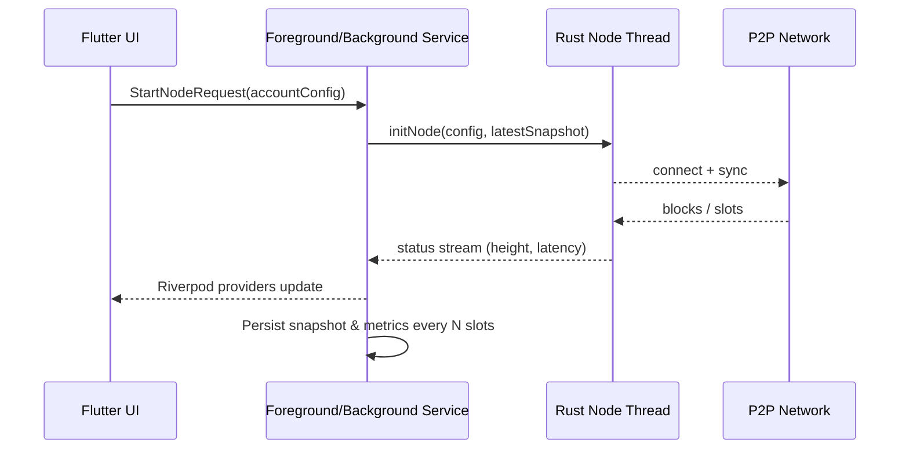
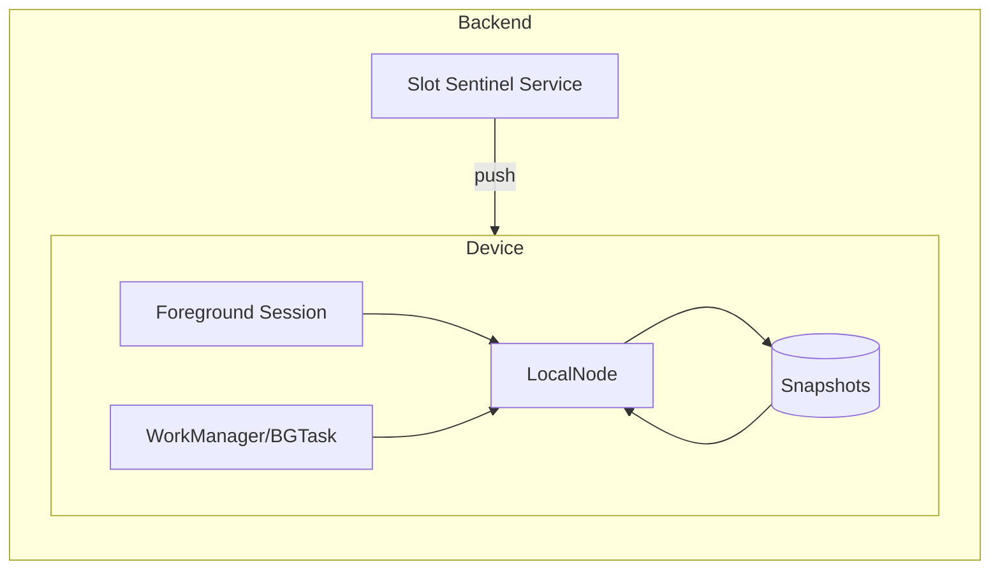
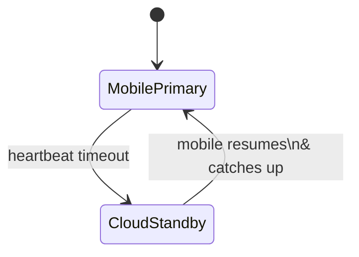

# Block Production Strategy Proposal

This document outlines the options for keeping the Usernode mobile validator in sync and capable of producing blocks on Android and iOS devices. It focuses on resiliency, user experience, and the operational guardrails required when the mobile host is paused or terminated.

> **Goal:** Maintain a trustworthy block producer that prioritizes on-device participation while guaranteeing liveness through graceful degradation and recovery paths.

---

## Objectives & Success Criteria

- **Continuous availability:** Node stays connected, catches up quickly after interruptions, and minimizes missed slots.
- **Deterministic recovery:** Every restart resumes from the latest durable state without manual intervention.
- **Energy & bandwidth awareness:** Respect mobile constraints (battery, thermal throttling, metered data).
- **User safety:** Clearly communicate when block production is delegated and the trust implications.
- **Observability:** Provide enough telemetry to detect stalls, missed slots, or degraded sync speed.

---

## Mobile Constraints Snapshot

| Platform | Keep-Alive Mechanisms | Hard Limits |
| --- | --- | --- |
| **Android** | Foreground Service + persistent notification, `WorkManager` for periodic sync, `JobScheduler` for idle tasks, exact alarms (API 31+ restrictions) | Background execution throttled when battery saver is ON; OEM-level task killers |
| **iOS** | `BGProcessingTask`, `BGAppRefreshTask`, background fetch, push-triggered background notifications, VoIP/Audio background modes (with entitlement) | Tasks capped (≈30s) and throttled when the app is rarely opened; no arbitrary long-running daemons |

### Resource Constraints by Platform

| Resource | Android (API 26+) | iOS (iOS 15+) |
| --- | --- | --- |
| **RAM budget** | ~256–512 MB per app before LMK starts trimming; background services receive `onTrimMemory()` once system falls below ~20% free RAM. Heavy Rust heaps should spill snapshots to disk to avoid LMK kills. | Jetsam limits vary by device tier (~200–500 MB). Surpassing the tier quota causes immediate termination with `JetsamEvent`. Use incremental sync buffers and release FFI caches when not actively producing. |
| **CPU window** | Foreground services can sustain multi-core load; background workers are throttled and may be paused after ~10 min if not foregrounded. Doze + thermal throttling will cap CPU frequency. Aim <40% sustained CPU or migrate to foreground mode. | Background tasks get ~30 s CPU slices; extended runtime possible only with privileged modes (audio, location, VoIP). Thermal pressure or watchdog (20 s unresponsive run loop) will freeze the app. |
| **Battery policies** | Battery saver or OEM “sleep” modes disable background network and exact alarms; expect Doze maintenance windows every 15–60 min. Request battery-optimization exemption for continuous production. | Low Power Mode restricts background fetch and throttles push-triggered wakes; BGProcessing requires `requiresExternalPower=true` for long tasks. |
| **Network** | In Doze, network access allowed only during maintenance windows; WorkManager enforces constraints (unmetered Wi-Fi, charging). Foreground service can keep sockets alive but may still drop on aggressive OEM ROMs. | Background sockets suspended ~5 s after app goes inactive unless using VoIP/PushKit. Push notifications can wake app for ~30 s of networking; background fetch frequency adapts based on usage. |
| **TTL before suspension** | Non-foreground processes typically frozen within 1–2 min after user leaves the app; `WorkManager` jobs get ≤10 min runtime. Foreground service avoids TTL but must keep notification visible. | App transitions to “suspended” within seconds after `sceneDidEnterBackground`. BGProcessing or push wake provides ≤30 s execution; after 3–4 denied launches, the system exponentially backs off future schedules. |

---

## Option Matrix

| Option | Description | Liveness Guarantee | Security Model | Operational Cost |
| --- | --- | --- | --- | --- |
| **A. Always-On Local Producer** | Device runs validator continuously via foreground/background services | High while app foregrounded or OS allows background | Fully self-custodied | Higher battery & connectivity usage |
| **B. Opportunistic Local + Scheduled Sync** | Local node runs when app active; background jobs sync checkpoints and pre-warm state | Medium; relies on OS schedule reliability | Self-custodied when active | Moderate |
| **C. Hybrid Local + Cloud Co-Producer** | Mobile is primary; cloud standby mirrors state and takes over when mobile offline | Very high; failover within seconds | Requires trust in delegated node; keys may be sharded | Higher (infra + coordination) |
| **D. Remote Producer w/ Mobile Signer** | Cloud node handles consensus; phone authorizes or monitors | Very high | Trusts remote infra or MPC; mobile mainly wallet/signer | Highest infra cost but lowest device impact |

---

## Option A — Always-On Local Producer

**When to choose:** Power users willing to dedicate a device, tolerate persistent notification, and ensure charging/Wi-Fi.

Key components:

1. **Foreground Service (Android)**  
   - Start `NodeService` as a foreground service with `startForeground()` notification.  
   - Pin CPU/Wi-Fi locks only when necessary; release during idle windows.
2. **Rust Node Lifecycle Manager**  
   - Use Rust FFI worker thread that exposes `startNode()`, `stopNode()`, `resumeFromSnapshot()`; persist checkpoints to local storage every N slots.
3. **Heartbeat & Telemetry**  
   - Send heartbeats to backend every 30–60s for SLA tracking and remote monitoring.
4. **Battery-aware throttling**  
   - Integrate with `BatteryManager` (Android) / `NSProcessInfo.powerStateDidChange` (iOS) to pause production below configured thresholds.

**Pros**
- Maximum decentralization; device owns staking keys.
- Lowest latency between slot assignment and production.

**Cons**
- Hardest to keep alive on iOS due to background limits.
- Significant battery, heat, and data usage.
- Foreground service notification mandatory on Android; may annoy users.

**Hardening checklist**
- Request battery optimization exemptions (Android intents + settings deep link).
- Ship per-device diagnostics (CPU load, missed slot reasons).
- Implement double writes: every produced block is logged locally and queued for remote telemetry upload when network returns.

---

## Option B — Opportunistic Local + Scheduled Sync

**When to choose:** Everyday users who open the app multiple times per day and accept that the node only produces when the OS grants execution slots.

Design pillars:

1. **Active Session Mode**: When UI is open, behave like Option A.
2. **Scheduled Catch-Up**: Use `WorkManager` (flex intervals 15–30 min) and `BGProcessingTask` (task identifier per account) to:
   - Wake briefly, pull latest chain headers, prune stale mempool entries.
   - Refresh slot schedule (won/missed).
   - Queue local notifications reminding user to reopen app before critical slot windows.
3. **Snapshotting & Fast Resume**:
   - Persist ledger deltas + consensus state to disk.
   - On wake, `resumeFromSnapshot()` to avoid full resync.
4. **Remote Slot Sentinel**:
   - Lightweight backend service monitors chain for user’s validator address and emits push notifications when a slot is approaching.

**Pros**
- Balances resource usage with meaningful participation.
- Background tasks keep node state warm even if UI seldom opened.

**Cons**
- OS may delay or skip background tasks, causing missed slots.
- Requires reliable push notification channel to nudge users.

Mitigations:
- Store next N slot times locally; if the OS denies background execution, schedule local notifications before each slot to prompt manual wake-up.
- Provide user setting for “High Priority Mode” that temporarily enables foreground service for the next K hours.

---

## Option C — Hybrid Local + Cloud Co-Producer

**When to choose:** Users want mobile-first control but require near-perfect uptime (e.g., staking pools, professional delegators).

Architecture:

1. **State Replication**  
   - Mobile publishes signed checkpoints (latest height, stake keys, VRF proofs) to backend via secure channel (TLS + device-bound keys).
2. **Cloud Standby Node**  
   - Runs identical Rust node; stays in sync but marked “standby”.
3. **Failover Logic**  
   - Backend monitors heartbeats from mobile. After `T_failover` (e.g., 45s) of silence and pending slot < `Δ`, the backend instructs standby to take over.
4. **Reconciliation**  
   - When mobile returns, it downloads produced block list + new ledger state to avoid forks.

**Pros**
- Approaches 24/7 availability with fast failover.
- Mobile still participates when active; delegation is temporary.

**Cons**
- Needs robust conflict resolution if both try to produce simultaneously.
- Backend must hold enough authority (possibly partial keys) to produce blocks.

Implementation notes:
- Consider threshold signing (e.g., 2-of-2: mobile + backend) to prevent unilateral block production by the cloud.
- Use push notifications to inform user every time failover happens; log events in app for transparency.

---

## Option D — Remote Producer with Mobile Signer/Monitor

**When to choose:** Custodial or semi-custodial staking, users prioritizing convenience over self-hosting.

Characteristics:
- Validators run entirely in the cloud or validator-as-a-service provider.
- Mobile app focuses on:
  - Configuring staking preferences.
  - Reviewing telemetry & rewards.
  - Optionally co-signing blocks or checkpoints via MPC/threshold schemes.
- When app is closed, block production continues unaffected.

Risks & mitigations:
- Centralization & trust: mitigate with provider audits, multi-sig withdrawal keys, and transparency reports.
- Latency for signing approvals: use push to prompt user; fall back to pre-approved schedules for low-value epochs.

---

## Recovery & Rehydration When App Is Stopped

1. **Detect Stop Event**
   - Android `BroadcastReceiver` for `ACTION_SHUTDOWN`, `ACTION_PACKAGE_RESTARTED`.
   - iOS `sceneDidEnterBackground` + `UIApplicationWillTerminate`.
2. **Persist Critical State**
   - Latest block height, peer set, mempool delta, slot schedule, staking keys (secure enclave/KeyStore).
3. **Register Wake Hooks**
   - `WorkManager.enqueueUniquePeriodicWork` with `ExistingPeriodicWorkPolicy.KEEP`.
   - `BGProcessingTaskRequest` with `requiresExternalPower = true` when heavy sync needed.
4. **Fast Resume Path**
   - On next launch, run `resumeFromSnapshot()` before UI renders.
   - Request backend for diff since last acked block to short-circuit full sync.
5. **Delegation Alternative**
   - If user opts in, backend immediately starts producing on their behalf once stop event logged.
   - Mobile receives summary on next wake and can reclaim primary role.

---

## Telemetry, Alerts & Tooling

- **On-device metrics:** slot misses, head lag, RPC latency, battery drain rate.
- **Backend monitoring:** heartbeat stream, failover count, push notification success/failure.
- **User-facing notifications:** produced blocks, missed slots, delegation activated/deactivated, upgrade required.
- **Testing harness:** simulate airplane mode, force-stop, device reboot; verify recovery scripts and alerting.

---

## Recommended Rollout

1. **MVP (Weeks 0–4)**  
   - Implement Option B as default: active session + scheduled sync + push reminders.  
   - Deliver diagnostics screen showing sync health and upcoming slots.
2. **Advanced Users (Weeks 4–8)**  
   - Add Option A “High Priority Mode” toggle with clear battery warnings.  
   - Gate behind developer/settings switch to reduce accidental enablement.
3. **Enterprise / Pools (Weeks 8+)**  
   - Build Option C hybrid: cloud standby, heartbeat contracts, reconciliation UI.  
   - Offer API for external monitoring dashboards.
4. **Future**  
   - Evaluate MPC-based co-signing to approach Option D without fully delegating keys.

---

## Progress Checklists

**Done**

- [x] Captured platform constraints and OS-specific keep-alive primitives.
- [x] Defined four production archetypes with pros/cons and Mermaid diagrams.
- [x] Documented recovery flows, telemetry requirements, and staged rollout plan.

**Remaining**

- [ ] Decide default operating mode (Option B vs Option A) and surface it in product requirements.
- [ ] Implement lifecycle hooks in `background_task_service.dart` plus Android/iOS schedulers.
- [ ] Expose node lifecycle controls and health streams via Riverpod/Rust bridge.
- [ ] Design/backend heartbeats + failover APIs and integrate push notification triggers.
- [ ] Build user-facing diagnostics + delegation UI, then validate with forced-stop tests.

---

## Next Steps for the Flutter App

- Extend `background_task_service.dart` to register BGTaskScheduler IDs per account and coordinate with WorkManager on Android.
- Expose node lifecycle controls (start/stop/resume) via Riverpod providers so UI toggles can map to modes (Opportunistic vs High Priority).
- Add block production health stream in Rust bridge (slots won, produced, missed) with local persistence to support recovery analytics.
- Create backend contract for heartbeats + failover API and integrate with push notification service outlined in `docs/NOTIFICATIONS.md`.

By layering these options, the app can serve casual users, power validators, and enterprise operators without compromising security or transparency.
