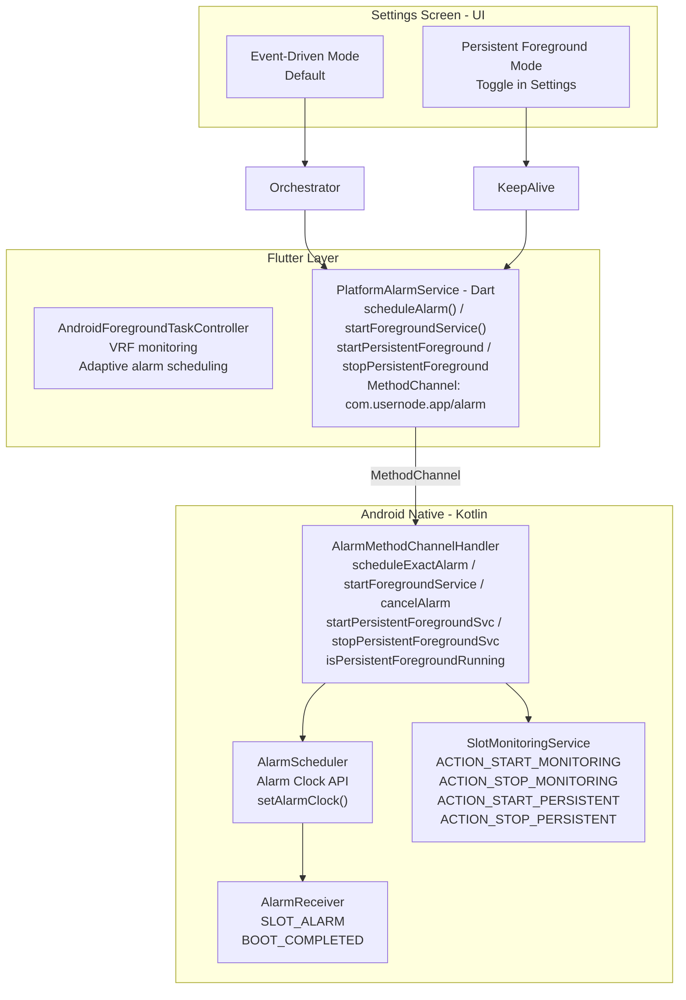
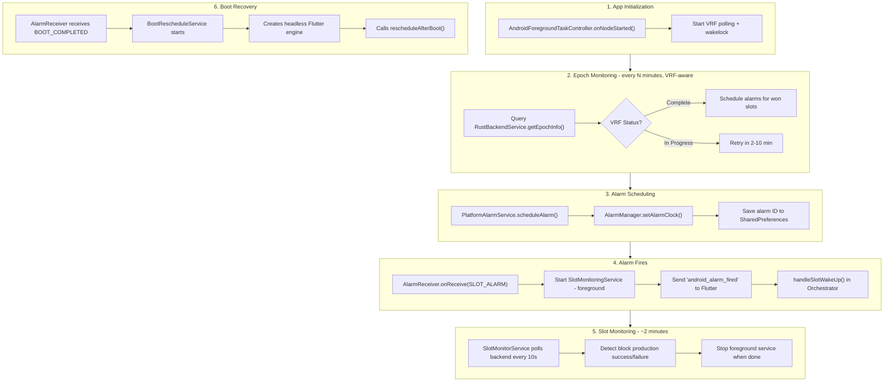
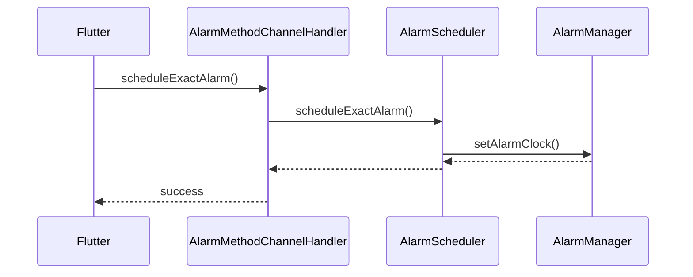
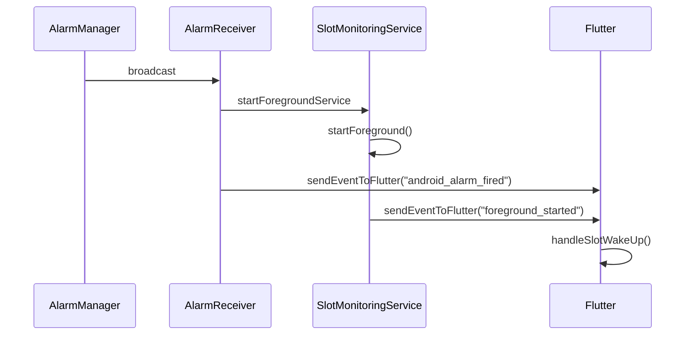
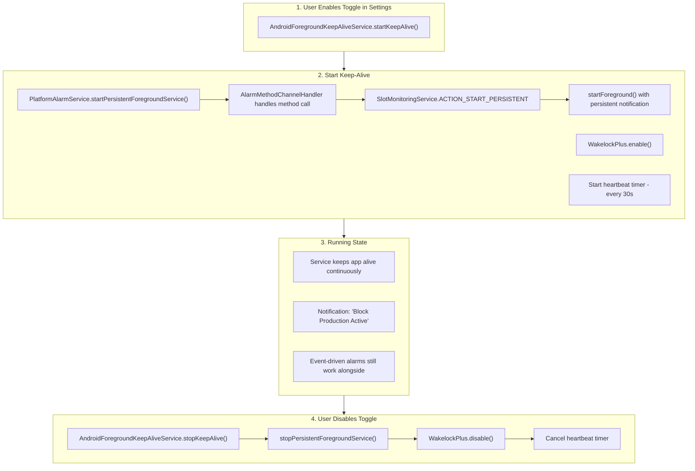
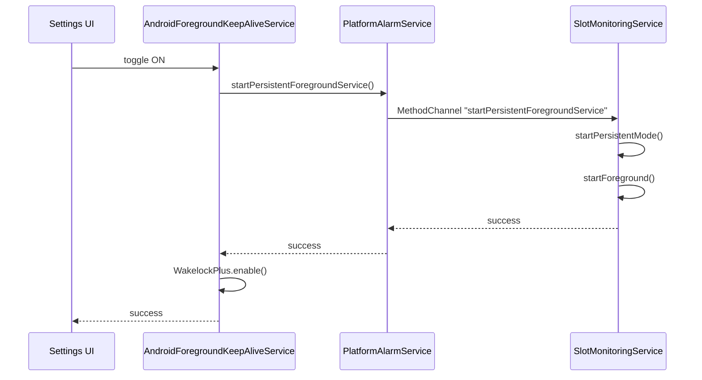

# Android Background Block Production Workflow

## Overview

The Android background block production system supports **two modes**:

1. **Event-Driven Mode** (Default) - Uses AlarmManager with exact alarms to wake the device only when needed. Battery efficient but may miss slots on aggressive OEMs.

2. **Persistent Foreground Mode** (Optional) - Keeps the app running continuously with a persistent notification. 100% reliable but uses more battery.

---

## Operating Modes Comparison

| Feature       | Event-Driven Mode           | Persistent Foreground Mode |
| ------------- | --------------------------- | -------------------------- |
| Reliability   | ~95% (varies by OEM)        | 100%                       |
| Battery Usage | Low                         | Higher (~5-10%/hour)       |
| Notification  | Only during slot monitoring | Always visible             |
| App Survival  | May be killed between slots | Always alive               |
| Best For      | Normal use                  | Critical block production  |

---

## Architecture Diagram



---

## Mode 1: Event-Driven (Default)

### Workflow



### Sequence Diagram: Alarm Scheduling



### Sequence Diagram: Alarm Firing



---

## Mode 2: Persistent Foreground (Optional)

### Overview

When enabled via the Settings toggle, this mode:

1. Starts a persistent foreground service that runs continuously
2. Enables WakelockPlus to prevent screen sleep
3. Shows a persistent notification ("Block Production Active")
4. App survives being backgrounded or swiped away

### Workflow



### Sequence Diagram: Starting Persistent Mode



---

## Critical Files & Line Numbers

### Android Native Code (Kotlin)

| File                           | Key Lines | Purpose                                          |
| ------------------------------ | --------- | ------------------------------------------------ |
| `AndroidManifest.xml`          | 14-20     | Background permissions                           |
| `AndroidManifest.xml`          | 77-100    | Service & receiver declarations                  |
| `MainActivity.kt`              | 15-26     | MethodChannel setup                              |
| `AlarmMethodChannelHandler.kt` | 72-173    | Method call handling                             |
| `AlarmMethodChannelHandler.kt` | 146-180   | **Persistent foreground handlers**               |
| `AlarmScheduler.kt`            | 22-91     | Exact alarm scheduling                           |
| `AlarmReceiver.kt`             | 14-28     | Broadcast receiver                               |
| `SlotMonitoringService.kt`     | 16-19     | Action constants (incl. PERSISTENT)              |
| `SlotMonitoringService.kt`     | 25-28     | **isPersistentModeActive flag**                  |
| `SlotMonitoringService.kt`     | 67-74     | Persistent mode action handling                  |
| `SlotMonitoringService.kt`     | 132-178   | **startPersistentMode() / stopPersistentMode()** |
| `BootRescheduleService.kt`     | 109-175   | Boot recovery with Flutter engine                |

### Flutter/Dart Code

| File                                            | Key Lines | Purpose                             |
| ----------------------------------------------- | --------- | ----------------------------------- |
| `platform_alarm_service.dart`                   | 23        | MethodChannel definition            |
| `platform_alarm_service.dart`                   | 340-375   | scheduleAlarm()                     |
| `platform_alarm_service.dart`                   | 471-503   | startForegroundService()            |
| `platform_alarm_service.dart`                   | 529-593   | **Persistent foreground methods**   |
| `android_foreground_keepalive_service.dart`     | 1-145     | **NEW: Android keep-alive service** |
| `background_block_production_orchestrator.dart` | 69-104    | initialize()                        |
| `background_block_production_orchestrator.dart` | 341-415   | handleSlotWakeUp()                  |
| `background_production_settings_screen.dart`    | 434-498   | **Android keep-alive UI section**   |
| `background_production_settings_screen.dart`    | 810-823   | **Toggle handler**                  |

---

## MethodChannel API

### Channel: `com.usernode.app/alarm`

#### Flutter -> Android

| Method                                | Parameters                             | Description                               |
| ------------------------------------- | -------------------------------------- | ----------------------------------------- |
| `scheduleExactAlarm`                  | alarmId, alarmTimeMs, slotNumber, data | Schedule exact alarm                      |
| `cancelAlarm`                         | alarmId                                | Cancel specific alarm                     |
| `cancelAllAlarms`                     | -                                      | Cancel all alarms                         |
| `startForegroundService`              | title, message, slotNumber             | Start slot-specific foreground            |
| `stopForegroundService`               | -                                      | Stop slot-specific foreground             |
| `startPersistentForegroundService`    | -                                      | **Start persistent mode**                 |
| `stopPersistentForegroundService`     | -                                      | **Stop persistent mode**                  |
| `isPersistentForegroundRunning`       | -                                      | **Check persistent mode status**          |
| `requestExactAlarmPermission`         | -                                      | Always returns true (SET_ALARM_CLOCK API) |
| `requestBatteryOptimizationExemption` | -                                      | Request battery exemption                 |
| `isBatteryOptimizationDisabled`       | -                                      | Check battery optimization                |

#### Android -> Flutter (Events)

| Event                                   | Data                           | Description                 |
| --------------------------------------- | ------------------------------ | --------------------------- |
| `android_alarm_fired`                   | slotNumber, alarmId, latencyMs | Alarm triggered             |
| `android_foreground_service_started`    | slotNumber                     | Slot monitoring started     |
| `android_foreground_service_stopped`    | slotNumber                     | Slot monitoring stopped     |
| `android_persistent_foreground_started` | -                              | **Persistent mode started** |
| `android_persistent_foreground_stopped` | -                              | **Persistent mode stopped** |
| `android_boot_reschedule_started`       | -                              | Boot recovery started       |
| `android_boot_reschedule_completed`     | slotsRescheduled               | Boot recovery done          |

---

## Permissions Required

```xml
<!-- AndroidManifest.xml:14-20 -->
<uses-permission android:name="android.permission.WAKE_LOCK" />
<uses-permission android:name="android.permission.RECEIVE_BOOT_COMPLETED" />
<uses-permission android:name="android.permission.FOREGROUND_SERVICE" />
<uses-permission android:name="android.permission.FOREGROUND_SERVICE_DATA_SYNC" />
```

---

## UI: Settings Screen

The Background Block Production settings screen includes:

### Android-Specific Sections

1. **Permissions** - Shows exact alarm permission status
2. **Battery Optimization** - Shows/requests battery exemption
3. **Foreground Keep-Alive Mode** - Toggle for persistent mode
   - Status: ACTIVE / INACTIVE
   - Tips when active (charger, notification info)
4. **Won Slots This Epoch** - VRF status and upcoming slots
5. **Production Statistics** - Success/failure counts

---

## Testing Checklist

### Event-Driven Mode

- [ ] Alarms schedule correctly for won slots
- [ ] Alarms fire at correct time
- [ ] Foreground service starts on alarm
- [ ] Block production detected
- [ ] Foreground service stops after monitoring
- [ ] Alarms survive device reboot

### Persistent Foreground Mode

- [ ] Toggle ON starts foreground service
- [ ] Notification shows "Block Production Active"
- [ ] Toggle OFF stops foreground service
- [ ] Service survives app backgrounded
- [ ] Service survives app swiped away
- [ ] State syncs correctly on app resume
- [ ] Works alongside event-driven alarms
