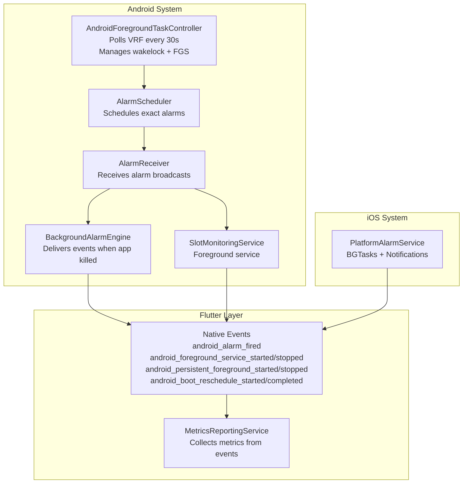
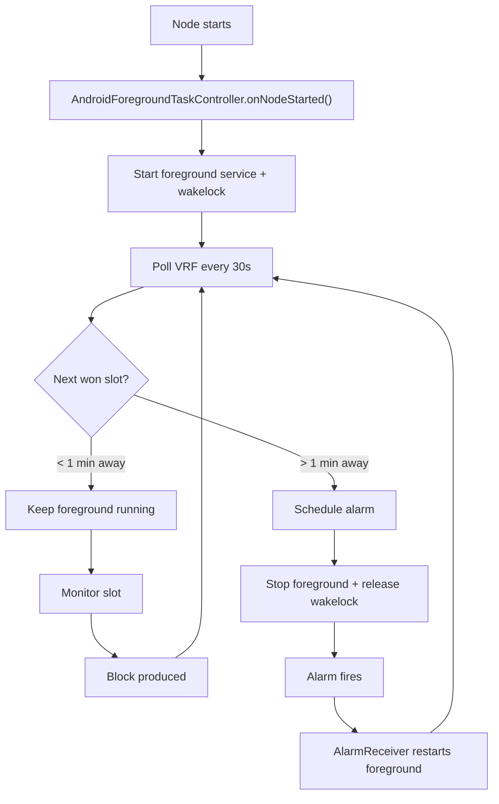
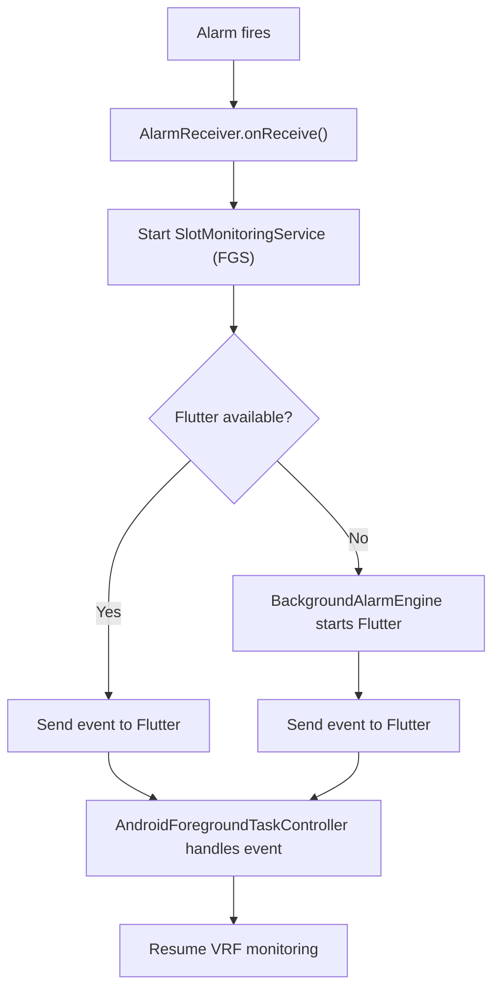
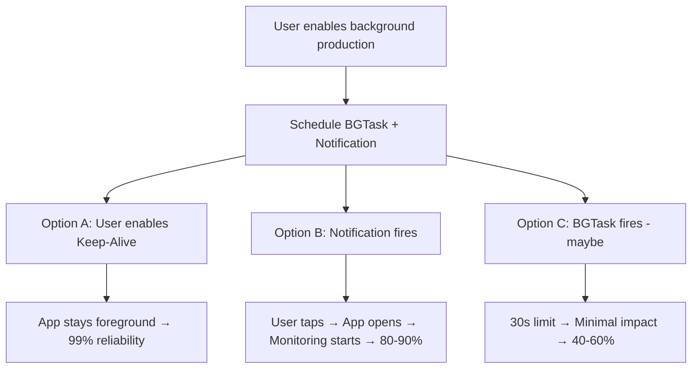
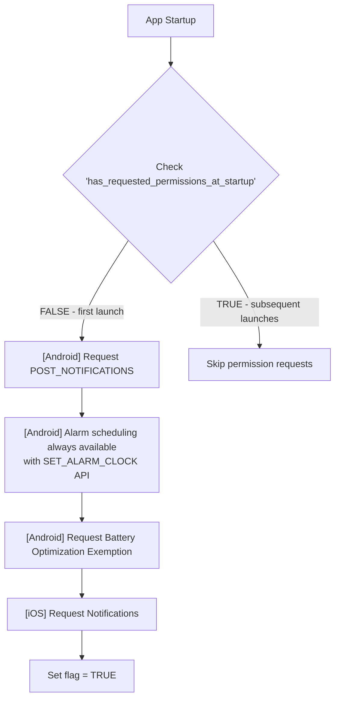

# Background Block Production System

**Status**: ✅ Complete (All 5 phases implemented)
**Last Updated**: 2025-11-23
**Implementation Date**: January 2025

## Table of Contents

- [Overview](#overview)
- [Architecture](#architecture)
- [Platform Implementation](#platform-implementation)
  - [Android](#android-implementation)
  - [iOS](#ios-implementation)
- [Migration Guide](#migration-guide)
- [Permissions](#permissions)
- [Configuration](#configuration)
- [Testing](#testing)
- [Troubleshooting](#troubleshooting)

---

## Overview

The background block production system enables the app to reliably wake up and produce blocks at scheduled slot times. The system uses platform-specific implementations optimized for each OS.

### Key Features

- **Android**: Uses `AndroidForegroundTaskController` for VRF polling and alarm scheduling with exact alarms and foreground service
- **iOS**: Uses `PlatformAlarmService` with BGTasks and notifications (unchanged)
- **VRF-Aware**: Smart epoch monitoring that adapts to VRF calculation status
- **Event-Driven**: Native events bridge to Flutter for metrics and UI updates
- **Automatic Permission Requests**: Requests required permissions at app startup
- **Resilient**: Handles app termination, device reboot, and network issues gracefully

### Reliability Targets

| Platform | Method | Reliability | User Interaction |
|----------|--------|-------------|------------------|
| **Android** | Exact Alarms + FGS | **90-95%** | Minimal (one-time setup) |
| **iOS Tier 1** | Foreground Keep-Alive | **99%** | Must keep app open |
| **iOS Tier 2** | BGTask + Notifications | **80-90%** | Must respond to notifications |
| **iOS Tier 3** | BGTask alone | **40-60%** | None (unreliable) |

---

## Architecture

### Architecture Overview



**Key Native Events:**
- `android_alarm_fired` - Alarm triggered at scheduled time
- `android_foreground_service_started/stopped` - Slot monitoring lifecycle
- `android_persistent_foreground_started/stopped` - Persistent mode lifecycle
- `android_boot_reschedule_started/completed` - Boot recovery process
- See [full event list](./ANDROID_BACKGROUND_BLOCK_PRODUCTION_WORKFLOW.md#android---flutter-events) for details

### Smart VRF Monitoring (Android)

The `AndroidForegroundTaskController` continuously polls VRF status and adaptively schedules:

- **Next won slot > 1 minute away**: Schedules alarm, stops foreground monitoring (saves battery)
- **Next won slot < 1 minute away**: Keeps foreground service running until slot time
- **No won slots, VRF complete**: Schedules alarm for epoch boundary minus 1 minute
- **VRF in progress**: Continues polling every 30 seconds

This adaptive approach maximizes battery life while ensuring reliable wake-ups.

---

## Platform Implementation

### Android Implementation

**Reliability**: 90-95% with exact alarms and foreground service (Event-Driven mode), 100% with persistent foreground mode

📖 **For detailed Android workflows, sequence diagrams, and persistent mode documentation, see [ANDROID_BACKGROUND_BLOCK_PRODUCTION_WORKFLOW.md](./ANDROID_BACKGROUND_BLOCK_PRODUCTION_WORKFLOW.md)**

#### Components

1. **AndroidForegroundTaskController** (`lib/core/services/android_foreground_task_controller.dart`)
   - Entry point for Android background block production
   - Polls VRF status every 30 seconds while node is running
   - Manages wakelock to prevent device sleep
   - Schedules alarms when slots are > 1 minute away
   - Stops foreground service when no imminent slots

2. **AlarmScheduler** (`AlarmScheduler.kt`)
   - Uses `setAlarmClock()` for precise timing (Google Play compliant)
   - Highest priority alarms, visible in system clock app
   - Automatically bypasses battery optimization and Doze mode
   - Persists alarms in SharedPreferences

3. **AlarmReceiver** (`AlarmReceiver.kt`)
   - Receives alarm broadcasts at scheduled times
   - Starts `SlotMonitoringService` as foreground service
   - Falls back to `BackgroundAlarmEngine` if Flutter unavailable
   - Handles `BOOT_COMPLETED` for alarm rescheduling

4. **SlotMonitoringService** (`SlotMonitoringService.kt`)
   - Foreground service that keeps app alive during monitoring
   - Type: `dataSync` (Android 12+ requirement)
   - Posts notification within 5 seconds
   - **Supports two modes:**
     - **Event-Driven** (default): Runs only during slot monitoring (~2 min per slot)
     - **Persistent** (optional): Runs continuously for 100% reliability (higher battery usage)
   - See [Android Workflow Doc](./ANDROID_BACKGROUND_BLOCK_PRODUCTION_WORKFLOW.md) for details

5. **BackgroundAlarmEngine** (`BackgroundAlarmEngine.kt`)
   - Launches minimal Flutter engine when app is killed
   - Delivers alarm events to Flutter even when main engine unavailable
   - Shares engine cache with MainActivity to avoid dual engines

6. **BootRescheduleService** (`BootRescheduleService.kt`)
   - Automatically restores alarms after device reboot
   - Launches Flutter engine in background
   - Reschedules slots for current epoch
   - Self-terminates after completion

#### Android Operating Modes

Android supports **two operating modes**:

1. **Event-Driven Mode** (Default): Uses exact alarms to wake device only when needed. Battery efficient (~95% reliability).
2. **Persistent Foreground Mode** (Optional): Keeps app running continuously with persistent notification. 100% reliable but higher battery usage.

See [Android Workflow Doc](./ANDROID_BACKGROUND_BLOCK_PRODUCTION_WORKFLOW.md) for mode comparison and detailed workflows.

#### Android Flow

**Event-Driven Mode - Normal Operation (App Running):**


**Background Operation (App Killed):**


#### Android 12+ Requirements

- **Alarm Scheduling**: Always available with SET_ALARM_CLOCK API (no permission required)
- **Foreground Service Type**: Must declare `foregroundServiceType="dataSync"`
- **Notification Required**: Must post notification within 5 seconds of FGS start
- **Fallback Strategy**: Expedited WorkManager if exact alarms unavailable

#### Android Permissions

**Runtime (require user approval):**
- `POST_NOTIFICATIONS` (Android 13+) - Display notifications
- ~~`SCHEDULE_EXACT_ALARM`~~ (removed - using SET_ALARM_CLOCK API instead)
- `REQUEST_IGNORE_BATTERY_OPTIMIZATIONS` - Prevent aggressive killing

**Manifest-only (auto-granted):**
- `FOREGROUND_SERVICE`
- `FOREGROUND_SERVICE_DATA_SYNC`
- `WAKE_LOCK`
- `RECEIVE_BOOT_COMPLETED`
- `INTERNET`
- `ACCESS_NETWORK_STATE`

---

### iOS Implementation

**Reliability**: 99% (Tier 1), 80-90% (Tier 2), 40-60% (Tier 3)

iOS has fundamental limitations for background execution, requiring a three-tier strategy:

#### Tier 1: Foreground Keep-Alive Mode (99% reliable)

**How it works:**
- User keeps app open during slot times
- WakeLock prevents screen from locking
- Periodic heartbeat prevents app suspension
- Node remains running with stable sync

**Requirements:**
- App must stay in foreground
- Screen on (minimum brightness recommended)
- Charger recommended
- Disable Auto-Lock in iOS Settings

**Best for**: Critical slots where maximum reliability is required

#### Tier 2: BGTask + Notifications (80-90% reliable)

**How it works:**
- Schedule `BGProcessingTask` + local notification
- Notification fires reliably at scheduled time
- User taps notification to open app
- App starts monitoring automatically

**Requirements:**
- Notification permission granted
- User must respond to notification
- User must tap within 1-2 minutes

**Best for**: Users willing to respond to alerts

#### Tier 3: BGTask Alone (40-60% reliable)

**How it works:**
- Schedule `BGProcessingTask` only
- iOS decides when (if) to execute
- 30-second execution limit
- Cannot start Rust node in this time

**Limitations:**
- iOS controls execution timing
- No guarantee task will run
- System resources must be available
- Battery level affects execution

**Best for**: "Set and forget" (but unreliable)

#### iOS Flow



#### iOS Permissions

**Runtime:**
- `Notifications` (alert, sound, badge) - Required for all tiers

**Capability:**
- `Background Modes` (fetch, processing) - Configured in Info.plist

**No boot recovery**: User must open app after reboot to reschedule tasks

---

## Usage

### Android

Background block production starts automatically when the node starts:

```dart
// Start node (in your startup code)
final started = await RustBackendService.instance.startNode();

// Android foreground task starts automatically
// No additional code needed - VRF monitoring begins immediately
```

### Handling Events

Native events from Android (and iOS) are delivered through the callback system:

```dart
// Set up event handler in main.dart
PlatformAlarmService.instance.setNativeEventCallback(
  AndroidForegroundTaskController.instance.handleNativeEvent,
);

// AndroidForegroundTaskController processes these events internally:
// - android_alarm_fired: Resumes VRF monitoring
// - android_foreground_service_started: Tracking (slot monitoring)
// - android_foreground_service_stopped: Tracking (slot monitoring)
// - android_persistent_foreground_started: Tracking (continuous mode)
// - android_persistent_foreground_stopped: Tracking (continuous mode)
// - android_boot_reschedule_started/completed: Boot recovery tracking
```

### Checking Status

```dart
// Check if foreground service is running
final running = await AndroidForegroundTaskController.instance.isForegroundServiceRunning();

// Check if wakelock is held
final wakelockHeld = await AndroidForegroundTaskController.instance.isWakelockHeld();
```

---

## Permissions

### Automatic Permission Requests

Permissions are automatically requested at app startup (one-time on first launch):

1. Check `has_requested_permissions_at_startup` in SharedPreferences
2. If false (first launch):
   - **Android**: Request `POST_NOTIFICATIONS`, battery optimization exemption (alarm scheduling always available)
   - **iOS**: Request notification permissions (alert, sound, badge)
3. Set flag to true (prevents repeated requests)

**Managed by**: `_requestPermissionsAtStartup()` in `main.dart`

See [startup flow diagram](#startup-permission-flow) for details.

### Managing Permissions After First Launch

**Via App**: Settings → Background Production Settings → Grant Permissions

**Via System Settings**:
- **Android**: Settings → Apps → [App] → Permissions / Alarms & reminders / Battery
- **iOS**: Settings → [App] → Notifications / Background App Refresh

### Startup Permission Flow



### Permission Status Monitoring

The app monitors permission status and emits events:

**Android Events:**
- `android_exact_alarm_permission_granted/denied`
- `android_post_notifications_permission_granted/denied`
- `android_battery_optimization_disabled`

**iOS Events:**
- `ios_notification_permission_granted/denied`
- `ios_background_refresh_status_checked`

**Note:** For a complete list of all 42 event types including alarm execution, foreground service lifecycle, boot recovery, and persistent mode events, see [METRICS.md](./METRICS.md) and [ANDROID_BACKGROUND_BLOCK_PRODUCTION_WORKFLOW.md](./ANDROID_BACKGROUND_BLOCK_PRODUCTION_WORKFLOW.md).

---

## Configuration

### Settings Screen

The Background Block Production settings screen provides comprehensive status and configuration options. The settings automatically refresh every 3 seconds to keep permission status, VRF state, and scheduled slots up-to-date.

### Environment Variables

Configure block production via `.env` file:

```bash
# Metrics collection interval for periodic health checks (seconds)
# Default: 30
METRICS_COLLECTION_INTERVAL_SECONDS=30

# Wake up time before slot (seconds)
# Allows time for app startup and node sync
# Default: 60 (1 minute before slot)
BLOCK_PRODUCTION_WAKE_BEFORE_SLOT_SECONDS=60

# Base epoch monitoring interval (seconds)
# Adjusted automatically based on VRF status:
# - VRF not started: 15 min (900s base)
# - VRF in progress: 5 min
# - VRF complete: 2 min
# - VRF error: 10 min
# Default: 900
EPOCH_MONITOR_BASE_INTERVAL_SECONDS=900
```

**Build with configuration:**
```bash
flutter run --dart-define-from-file=.env
```

### Platform-Specific Configuration

**Android** (`AndroidManifest.xml`):
- Declare permissions
- Register `AlarmReceiver` with `BOOT_COMPLETED` intent filter
- Declare `SlotMonitoringService` with `foregroundServiceType="dataSync"`
- Declare `BootRescheduleService`

**iOS** (`Info.plist`):
- Add `UIBackgroundModes`: `fetch`, `processing`
- Register BGTask identifiers: `com.usernode.app.slotmonitoring`

---

## Testing

### Test Categories

#### 1. Basic Orchestrator Lifecycle
- Initialize orchestrator successfully
- State persists across app restarts
- VRF status detected correctly
- Epoch monitoring intervals adjust based on VRF

#### 2. Slot Scheduling
- Slots scheduled when VRF completes
- Alarms fire at correct time (1 min before slot)
- Notifications delivered with alarms
- Alarms survive app closure (Android)

#### 3. Slot Monitoring
- Monitoring starts when alarm fires
- Block production completes successfully
- Failed production handled gracefully
- Timeout works (2-5 minutes depending on platform)

#### 4. Platform-Specific
**Android:**
- Exact alarms fire reliably
- Foreground service survives 3+ hours
- Boot recovery works (alarms restored after reboot)
- Battery optimization exemption works

**iOS:**
- BGTasks schedule correctly
- Notifications fire on time (100% reliable)
- Keep-Alive mode prevents sleep
- Notification tap opens app

#### 5. Error Scenarios
- No network connection
- Metrics endpoint down
- Insufficient permissions
- State corruption recovery
- Node offline during slot

### Platform-Specific Testing

**Android Devices (minimum 5 for OEM coverage):**
- Google Pixel (stock Android) - baseline
- Samsung Galaxy (One UI) - moderate optimization
- Xiaomi (MIUI) - aggressive killer
- Oppo/OnePlus - aggressive power management
- Budget device - memory pressure

**iOS Devices (minimum 2):**
- iPhone with iOS 16+
- iPad (optional)

### Test Scenarios

- App in foreground
- App in background
- App force-closed
- Device rebooted
- Low Power Mode (iOS)
- Battery Saver Mode (Android)
- Airplane mode during slot → reconnect before slot

---

## Troubleshooting

### Android: Alarms Not Firing

**Symptom**: Scheduled alarms don't wake the app

**Possible Causes:**
1. Alarm scheduling issues (rare with SET_ALARM_CLOCK API)
2. Battery optimization enabled
3. OEM-specific battery saver (Xiaomi, Oppo, Samsung)

**Solution:**
1. Settings → Background Production Settings → Check status
2. Grant "Alarms & reminders" permission
3. Disable battery optimization for app
4. Check OEM-specific settings:
   - **Xiaomi**: Battery & performance → App battery saver → No restrictions
   - **Samsung**: Battery → App power management → Unrestricted
   - **Oppo**: Battery → High background battery consumption → Allow

---

### Android: Notifications Not Showing

**Symptom**: No notifications for block production events

**Possible Causes:**
1. `POST_NOTIFICATIONS` permission denied (Android 13+)
2. Notification channel disabled
3. Do Not Disturb mode active

**Solution:**
1. Settings → Background Production Settings → Grant Permissions
2. Enable `POST_NOTIFICATIONS`
3. Android Settings → Apps → [App] → Notifications → Enable "Slot Monitoring" channel

---

### iOS: Background Tasks Not Executing

**Symptom**: Alarms/notifications don't fire reliably

**Possible Causes:**
1. Background App Refresh disabled
2. Low Power Mode active
3. iOS deprioritized background tasks (normal behavior)
4. Do Not Disturb mode

**Solution:**
1. **Enable Background App Refresh:**
   - Settings → General → Background App Refresh → On
   - Settings → [App] → Background App Refresh → On
2. **Disable Low Power Mode**: Settings → Battery
3. **Use app regularly** (iOS favors frequently-used apps)
4. **Consider Tier 1 approach**: Enable Keep-Alive for critical slots
5. **Best practice**: Keep device plugged in and WiFi connected during slots

**Note**: iOS background task execution is NOT guaranteed. For reliable monitoring, use Tier 1 (Keep-Alive) or Tier 2 (Notifications).

---

### Permission Revoked After Granted

**Symptom**: Permission was granted but now shows as denied

**Possible Causes:**
1. User manually revoked in system settings
2. App was uninstalled/reinstalled (resets permissions)
3. Android system revoked due to non-use

**Solution:**
1. Settings → Background Production Settings
2. Tap "Grant Permissions" button
3. Re-grant all required permissions

---

### Device Reboot Issues

**Android**: Should work automatically via `BootRescheduleService`

If alarms not restored after reboot:
1. Check `RECEIVE_BOOT_COMPLETED` permission in manifest
2. Verify boot receiver is registered
3. Check device logs for boot service execution
4. Manually open app to trigger reschedule

**iOS**: No automatic recovery

User must:
1. Open app after reboot
2. App will detect epoch transition on resume
3. Slots will be rescheduled automatically

---

### Epoch Transition Not Detected

**Symptom**: App doesn't reschedule slots when epoch changes

**Possible Causes:**
1. Epoch monitoring not running
2. Backend RPC not responding
3. App hasn't been opened in long time (iOS)

**Solution:**
1. Check orchestrator initialized: `isInitialized` should be true
2. Verify backend connectivity
3. Open app to trigger manual epoch check
4. Check logs for epoch monitoring activity

---

### Monitoring Timeout

**Symptom**: Slot monitoring times out without producing block

**Possible Causes:**
1. Node not synced
2. Node stopped/crashed
3. Network issues
4. VRF calculation failed

**Solution:**
1. Check node status: should be "running" and "synced"
2. Verify internet connection
3. Check VRF status in epoch info
4. Review node logs for errors
5. Restart node if necessary

---

## Best Practices

### For Android Users
1. **Grant all permissions on first launch**
2. **Whitelist app from battery optimization**
3. **Don't clear app data frequently** (resets permission flag)
4. **Keep app updated** (improvements in newer versions)

### For iOS Users
1. **Plan ahead**: Check upcoming slots in Slot Calculator
2. **Set reminders**: Enable notifications for 10-min alerts
3. **Use Keep-Alive for critical slots**: Open app early, enable mode
4. **Respond to notifications**: Tap within 1-2 minutes
5. **Keep device charged**: Connect to power during slots
6. **Disable Low Power Mode**: Improves background task reliability

### For Developers
1. **Always check permission status** before scheduling
2. **Handle permission denial gracefully** with clear error messages
3. **Re-check permissions on app resume** (catches system changes)
4. **Send permission events to metrics** (monitor grant/deny rates)
5. **Test on OEM devices** (Samsung, Xiaomi, Oppo)
6. **Set realistic user expectations** (iOS requires more involvement)

---

## Related Documentation

- [METRICS.md](./METRICS.md) - Metrics system with 42 event types
- [METRICS_FIELDS_REFERENCE.md](./METRICS_FIELDS_REFERENCE.md) - Detailed JSON field reference with iOS/Android platform differences

---

**Implementation Complete** ✅
**Ready for Production** 🚀
