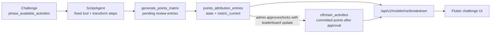

# Challenge Agent Operating Guide

Topochain's challenge automation changed shape with PR #141
(`smart-automator`). New challenge agents should be built as deterministic
`ScriptAgent` instances. The old prompt-driven `AIAgent` path is now legacy:
existing instances can keep running, but new challenge work should avoid it.

For mobile UI state checks, use
[Challenge Manual QA Matrix](CHALLENGE_MANUAL_QA_MATRIX.md). This guide is
about creating agents that produce the backend state the app renders.

## Current Mental Model



Key rules:

- `ScriptAgent` uses explicit steps. There is no LLM decision at run time.
- Auto Mode is author-time only: it generates a script, then the script runs
  deterministically.
- `Dry-run` is preview-only. Mobile sees progress only after a real run creates
  a points-attribution matrix.
- Admin approval/lock is still required before pending entries become committed
  leaderboard points.

## ScriptAgent Basics

A script is a list of steps. Each step is either:

- a **tool** step, such as `query_db_table`, `fetch_url`, or
  `generate_points_matrix`;
- a **transform** step, such as `filter`, `map`, `score`, `sort`, `top`, or
  `aggregate`.

Tool outputs are structured:

- `query_db_table` returns `{ rows: [...] }`.
- `fetch_url` returns `{ status, content_type, body }`.
- `fetch_url` with `parse: "json"` returns `{ status, content_type, json }`.
- `generate_points_matrix` buffers entries into the current run's pending
  matrix.

Expressions are deterministic and sandboxed:

- read prior outputs with dot access, for example `steps.accounts.rows`;
- use `row` inside transform steps;
- use `agent.challenge_id` and `agent.phase_id` for the bound challenge;
- use `{ "expr": "..." }` in tool args when the tool needs a real array or
  number instead of a rendered string;
- use `~` for string concatenation, not `+`.

Useful expression helpers include `trim`, `lower`, `upper`, `len`, `values`,
`keys`, `min`, `max`, `floor`, `ceil`, `round`, `sum`, and `avg`.

## What Makes The App Update

`generate_points_matrix` entries can identify a participant by:

- `participant_id` preferred;
- `wallet_address`, resolved against `onchain_accounts.address` or
  `onchain_accounts.public_key`;
- `discord_handle`, resolved against `participants.discord`.

For challenge UI:

- metric challenges must submit cumulative `metric_current`;
- no-metric or binary submissions can show pending state from pending points;
- `reasoning` is user-facing because mobile may show it in challenge detail.

Good reasoning:

- `You submitted the feedback form.`
- `You completed 1 verified action.`

Bad reasoning:

- `Matched spreadsheet row 2 for participant 15.`
- `wallet=ut1... matrix_id=93 committed_points=0.`

Put audit details in script outputs or run logs, not in public reasoning.

Challenge detail copy may include the mobile-supported wallet tag when a form
or external app asks the user to provide their address. The supported tags are
documented in [Challenge Manual QA Matrix](CHALLENGE_MANUAL_QA_MATRIX.md#challenge-copy-tags);
do not assume username, participant id, or Discord-handle tags exist yet.

## Google Sheet Wallet Matching

For the current form sheet:

```text
https://docs.google.com/spreadsheets/d/1qIZGpW3gDCEq9Vy7RUEY9chB3SVoJQQwt4e6_NYHxdM/edit?usp=sharing
```

The public `gid=0` export currently has:

- column H / 8: `And throughout your time in Season 1 Program...`
- column O / 15: `Your wallet address`

So do not build the script around "column 8". Use the header
`Your wallet address`. The JSON source should normalize that header to a stable
script-friendly key such as `wallet_address`.

`fetch_url` can fetch a public Google Sheet CSV export as raw text. This was
verified against the current feedback sheet with:

```text
https://docs.google.com/spreadsheets/d/1qIZGpW3gDCEq9Vy7RUEY9chB3SVoJQQwt4e6_NYHxdM/export?format=csv
```

The important limitation is one layer later: current `ScriptAgent` transforms do
not expose a first-class CSV parser in the documented expression surface. A
direct CSV fetch proves access, but it does not by itself prove that the script
can safely turn the CSV body into header-keyed rows. Do not award from raw CSV
unless the generated script has a real CSV parse step. If parsing is unavailable,
the script should stop with a clear output rather than falling back to all phase
accounts.

`fetch_url` with `parse: "json"` still requires plain JSON. Google Sheets
`gviz` JSON is wrapped in a JavaScript callback, not plain JSON, so it fails
with `Syntax error`.

For scoring today, use a JSON response source or a small adapter. The adapter
should use the Google Sheet header, not a physical column number, and return
plain rows with no wrapper, for example either:

```json
[
  { "wallet_address": "ut1..." }
]
```

or:

```json
{
  "rows": [
    { "wallet_address": "ut1..." }
  ]
}
```

Low-code option for a public sheet:

```text
https://opensheet.elk.sh/<spreadsheet_id>/<sheet_name>
```

For the current sheet this works as a JSON rows endpoint:

```text
https://opensheet.elk.sh/1qIZGpW3gDCEq9Vy7RUEY9chB3SVoJQQwt4e6_NYHxdM/Form%20Responses%201
```

For the first working ScriptAgent, it is fine to hardcode this URL directly in
the `fetch_url` step. Using `{{ inputs.responses_url }}` is cleaner later, but
it fails at run time unless the instance's **Inputs** field really contains a
matching `responses_url` key.

OpenSheet returns all columns using the original Google headers. If the
ScriptAgent expression editor accepts bracket access, extract the wallet with:

```text
trim(row['Your wallet address'])
```

If this fails with `Unable to get an item of non-array "row"`, Topochain wrapped
the JSON row as an object. In that case, use the simplest no-code adapter:
create a second tab in the same Google Sheet with a script-friendly header.

Example helper tab named `agent_wallet_rows`:

| wallet_address |
| --- |
| `=FILTER('Form Responses 1'!O2:O, LEN('Form Responses 1'!O2:O))` |

Then point OpenSheet at the helper tab:

```text
https://opensheet.elk.sh/1qIZGpW3gDCEq9Vy7RUEY9chB3SVoJQQwt4e6_NYHxdM/agent_wallet_rows
```

The ScriptAgent can then use normal dot access:

```text
trim(row.wallet_address)
```

If creating a helper tab is too much friction and the sheet shape is stable, a
temporary fallback is to use the original OpenSheet row and read the 15th value:

```text
trim(values(row)[14])
```

This works around headers with spaces by relying on current column order
instead of the header. Treat it as a short-term test shortcut, because adding or
moving columns will break it.

### Tested Feedback Form Script

This is the known-good shape for the Season 1 feedback test challenge. It uses
OpenSheet only to turn the Google Sheet into JSON rows. The candidate source is
still the submitted wallet column, not all phase accounts:

```json
[
  {
    "id": "fetch_responses",
    "type": "tool",
    "depends_on": [],
    "tool": "fetch_url",
    "args": {
      "url": "https://opensheet.elk.sh/1qIZGpW3gDCEq9Vy7RUEY9chB3SVoJQQwt4e6_NYHxdM/Form%20Responses%201",
      "parse": "json"
    }
  },
  {
    "id": "wallet_rows",
    "type": "transform",
    "depends_on": ["fetch_responses"],
    "op": "map",
    "from": "steps.fetch_responses.json",
    "expr": "{ \"wallet\": trim(values(row)[14]) }"
  },
  {
    "id": "valid_wallets",
    "type": "transform",
    "depends_on": ["wallet_rows"],
    "op": "filter",
    "from": "steps.wallet_rows",
    "expr": "row.wallet != \"\""
  },
  {
    "id": "wallet_values",
    "type": "transform",
    "depends_on": ["valid_wallets"],
    "op": "map",
    "from": "steps.valid_wallets",
    "expr": "row.wallet"
  },
  {
    "id": "accounts",
    "type": "tool",
    "depends_on": ["wallet_values"],
    "tool": "query_db_table",
    "args": {
      "table": "onchain_accounts",
      "columns": ["participant_id", "address", "phase_id"],
      "where": [
        {
          "column": "phase_id",
          "op": "=",
          "value": { "expr": "agent.phase_id" }
        },
        {
          "column": "address",
          "op": "in",
          "value": { "expr": "steps.wallet_values" }
        }
      ],
      "limit": 200
    }
  },
  {
    "id": "entries",
    "type": "transform",
    "depends_on": ["accounts"],
    "op": "map",
    "from": "steps.accounts.rows",
    "expr": "{ \"participant_id\": row.participant_id, \"points\": 500, \"reasoning\": \"You submitted the feedback form.\" }"
  },
  {
    "id": "award",
    "type": "tool",
    "depends_on": ["entries"],
    "when": "len(steps.entries) > 0",
    "tool": "generate_points_matrix",
    "args": {
      "entries": { "expr": "steps.entries" }
    }
  }
]
```

If Auto Mode generates a script that first fetches the direct CSV and then
fetches OpenSheet for parsed rows, read that correctly: the direct CSV fetch is
a proof that Google export access works; the award path is still powered by
OpenSheet JSON parsing. That hybrid is useful for learning, but it is not a
native CSV-scoring script.

## Recipe: Sheet Wallet To Pending Points

Use this for a simple form-submission challenge where one valid response should
create pending points for the matched current-phase participant.

Agent setup:

- agent class: `ScriptAgent`;
- binding: specific challenge;
- cadence: `manual` while testing;
- `dry_run`: `true` for first checks, then `false` for the real run;
- `enabled`: off until the script has produced the expected dry-run matrix.

Inputs:

```json
{
  "responses_url": "https://example.com/form-responses.json",
  "wallet_field": "Your wallet address",
  "wallet_key": "wallet_address",
  "points": 500,
  "reasoning": "You submitted the feedback form."
}
```

These values must be saved in the ScriptAgent **Inputs** JSON field. Mentioning
them in the Auto Mode prompt is not enough. If a run fails with
`Template "{{ inputs.responses_url }}" — segment "responses_url" missing`, the
script is valid but the instance inputs were not saved or the key name does not
match.

Script shape:

1. Fetch `inputs.responses_url` using `fetch_url` with `parse: "json"`.
2. Map each response to a trimmed wallet address from the normalized
   `inputs.wallet_key`.
3. Filter out empty wallet values.
4. Query `onchain_accounts` once:
   - `phase_id = agent.phase_id`;
   - `address IN wallets`.
5. Map matched accounts to entries:
   - `participant_id`;
   - `points = inputs.points`;
   - `reasoning = inputs.reasoning`.
6. Call `generate_points_matrix` only if entries are non-empty.

A script may include a direct CSV `fetch_url` proof step while testing Google
access, but do not build award entries from raw CSV unless a real CSV parser is
present. For today's working scoring path, build entries from already-parsed
JSON rows.

Minimal script example for a normalized JSON source. This assumes the adapter
has already mapped the sheet header `Your wallet address` to `wallet_address`:

```json
[
  {
    "id": "fetch_responses",
    "type": "tool",
    "tool": "fetch_url",
    "args": {
      "url": "{{ inputs.responses_url }}",
      "parse": "json"
    }
  },
  {
    "id": "wallet_rows",
    "type": "transform",
    "op": "map",
    "from": "steps.fetch_responses.json",
    "expr": "{ \"wallet\": trim(row.wallet_address) }"
  },
  {
    "id": "valid_wallets",
    "type": "transform",
    "op": "filter",
    "from": "steps.wallet_rows",
    "expr": "row.wallet != \"\""
  },
  {
    "id": "wallet_values",
    "type": "transform",
    "op": "map",
    "from": "steps.valid_wallets",
    "expr": "row.wallet"
  },
  {
    "id": "accounts",
    "type": "tool",
    "tool": "query_db_table",
    "args": {
      "table": "onchain_accounts",
      "columns": ["participant_id", "address", "phase_id"],
      "where": [
        { "column": "phase_id", "op": "=", "value": { "expr": "agent.phase_id" } },
        { "column": "address", "op": "in", "value": { "expr": "steps.wallet_values" } }
      ],
      "limit": 200
    }
  },
  {
    "id": "entries",
    "type": "transform",
    "op": "map",
    "from": "steps.accounts.rows",
    "expr": "{ \"participant_id\": row.participant_id, \"points\": inputs.points, \"reasoning\": inputs.reasoning }"
  },
  {
    "id": "award",
    "type": "tool",
    "tool": "generate_points_matrix",
    "when": "len(steps.entries) > 0",
    "args": {
      "entries": { "expr": "steps.entries" }
    }
  }
]
```

Avoid JSON keys with spaces in ScriptAgent expressions. Current Topochain
expressions are designed around dot access like `row.wallet_address`; normalize
sheet headers before ScriptAgent reads them unless Topochain adds first-class
dynamic key access.

## Idempotency For Recurring Agents

Manual one-shot challenges can be simple. Scheduled agents need a guard so they
do not create the same pending points every run.

Recommended guard:

- query existing `points_attribution_matrices` for the bound challenge;
- keep pending, approved, and locked matrices;
- query their `points_attribution_entries`;
- skip participants that already have a pending/approved/adjusted entry for
  this one-submission challenge;
- also query `offchain_activities` for committed participants and skip them.

If the source is cumulative, submit cumulative `metric_current` and only
propose the delta not already represented by pending or committed progress.

## Debugging Checklist

When an agent produces zero entries:

1. Confirm it is a `ScriptAgent`, not a retired `AIAgent`.
2. Confirm the source URL returns plain JSON if using `parse: "json"`.
3. Confirm the wallet field is present and non-empty.
4. Confirm the wallet values match `onchain_accounts.address` for
   `agent.phase_id`.
5. Confirm `generate_points_matrix` ran and did not drop wallets.
6. Confirm the run was a real run if you expect mobile to update.

When mobile does not update:

- dry-run results are invisible to mobile;
- pending matrices update `/me/breakdown`, but committed points require admin
  approval/lock;
- metric challenges need `metric_current`;
- no-metric challenges can show submitted/pending from pending points;
- stale or incorrect `reasoning` can leak into the detail page, so keep it
  intentional.
