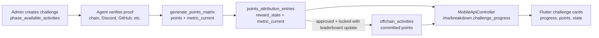

# Challenge Progress Operating Guide

This guide is for future debugging sessions where a Topochain challenge, an
agent run, and the mobile app need to agree on one simple story:

> What did the participant do, how much progress does that represent, and what
> should the app show?

The safest way to keep this predictable is to treat Topochain as the canonical
source of challenge state and keep Flutter as a renderer of that contract.

For hands-on release checks, use
[Challenge Manual QA Matrix](CHALLENGE_MANUAL_QA_MATRIX.md). It lists the
manual card/detail/Profile expectations for the backend-served state and field
combinations the app renders.

## Mental Model



The important split:

- `metric_current` is progress toward the challenge target.
- `suggested_points` / `approved_points` are points proposed or awarded.
- `reward_state` is derived and stored by Topochain.
- Flutter does not invent canonical progress from prose. Reasoning text is
  evidence/explanation, not a mobile data contract.

## Creating A New Challenge

For any challenge that needs a progress bar or `current / target` UI, configure
the metric on the Topochain challenge:

- `metric_type`: use `count` or `sum` for bounded progress, `percentage` for
  rate-style progress, `rank` for rank/prose status, and `binary` for explicit
  yes/no completion. Leave the metric empty for simple form-style submissions
  where there is no meaningful progress bar.
- `metric_target`: the target value, for example `3`.
- `metric_label`: the user-facing unit, for example `Actions`.
- `schedule_start` and `schedule_end`: the real scoring window.
- `reward`: the visible reward string, for example `300 pts`.
- `featured` / `featured_order`: optional display flags served by the mobile
  API for Featured grouping.

Rule of thumb:

- If users can see "1 / 3 Actions", the backend must expose `current: 1`, `target: 3`, and the challenge metric label.
- If `current` is null, the mobile app cannot know progress. It will render
  state-only text, or `0 / target` only for untouched `state=none` metric
  challenges.
- If `reward_state` says `earned`, the app will naturally treat the challenge as done or satisfying.

## How Topochain Evaluates Progress

Topochain exposes progress through `/api/v2/mobile/me/breakdown`.

For each enabled challenge, `challenge_progress[]` is built from:

- latest attribution entry for that participant/challenge:
  - `state` from `points_attribution_entries.reward_state`
  - `current` from `points_attribution_entries.metric_current`
  - `description` from the latest entry reasoning
- all non-locked, non-declined attribution entries:
  - `pending_points`
- committed ledger rows:
  - `earned_points` from `offchain_activities`
- challenge definition:
  - `target` from `phase_available_activities.effective_metric_target`

That means these fields can disagree if the data is inconsistent. Example:

```text
state = missed
current = null
pending_points = 500
```

This can happen because:

- `state` is copied from the latest stored entry.
- `current` is null if the agent did not submit `metric_current`.
- `pending_points` sums every non-locked, non-declined entry, including older duplicate matrices.

## Mobile-Side Interpretation

Flutter tries to stay thin, but it currently adds one generic interpretation for
state-only challenges:

- if the challenge has `metric = null` or `metric.kind = binary`
- and `/me/breakdown.challenge_progress.state = none`
- and `pending_points > 0`

then the app renders the card/detail as submitted/pending instead of "Not done".

This is for binary form-style challenges where there is no meaningful progress
bar. It lets users see that their submission was registered before admin
approval. Metric challenges with a target still require canonical
`current / target` data; the app should not parse reasoning text or pending
points to invent metric progress.

## Reward State Rules

Current Topochain logic is roughly:

- `declined`: admin declined the entry.
- `earned`: matrix is locked, entry approved/adjusted, and points were awarded.
- `none`: no metric/target, or metric exists but no progress yet.
- `pending`: target has been reached and awaits admin approval/commit.
- `missed`: challenge ended before target was reached.
- `in_progress`: progress is greater than zero, target not reached, challenge still open.

Important current caveat:

- `lockMatrix()` recomputes reward state after locking.
- `approveAndCommit()` currently approves/commits but does not recompute reward state after changing matrix status.

Until that backend gap is fixed, prefer the explicit approve then lock path for
metric challenges, or run a reward recompute after one-shot commit.

## Agent Review Flags And Mobile Visibility

The `update_leaderboard` checkbox in the agent edit UI does not control whether
an agent can create a review matrix. It controls whether an approved/locked
matrix writes rows into `offchain_activities`.

- `update_leaderboard = true`
  - admin approval/lock writes `offchain_activities`
  - points count toward leaderboard totals
  - locked approved entries can become `earned`
- `update_leaderboard = false`
  - the matrix can still be reviewed/approved
  - no `offchain_activities` rows are written
  - points do not count toward leaderboard totals

This is separate from mobile progress visibility. `/me/breakdown` reads
`points_attribution_entries` as well as committed `offchain_activities`:

- `current` comes from the latest attribution entry's `metric_current`.
- `state` comes from the latest attribution entry's derived `reward_state`.
- `pending_points` sums non-locked, non-declined attribution entries.
- `earned_points` sums committed `offchain_activities`.

That means an agent can make the mobile challenge card update before manual
approval, as long as it creates a real matrix entry that carries the fields the
mobile contract needs: `metric_current` for metric challenges, or pending
points for no-metric/binary submissions.

Hard rule for prompts:

```text
Every generate_points_matrix entry for a metric challenge must include
metric_current. Topochain does not infer progress from reasoning, points, or
the challenge title.
```

Reasoning text is also exposed through `/me/breakdown.challenge_progress.description`
and the mobile detail page may show it as helper text directly under the
challenge rail. Treat it as user-facing progress copy, not as a debug log.

Good reasoning:

- `You submitted the feedback form.`
- `You completed 1 verified dApp action.`
- `You reached the target with 3 verified actions.`

Avoid reasoning like:

- `Submitted form response row 2 as cyrcle_0.`
- `Participant 15 matched spreadsheet row 2.`
- `tx_id utx17s... observed; committed_points=0; proposed_points=100.`

If a reviewer needs row ids, tx ids, skip counts, or matching diagnostics, put
those in the agent step output or run summary. Until Topochain has separate
public status and private audit fields, keep `reasoning` short, intentional,
and safe to read in the app.

For count challenges, `metric_current` should be the participant's cumulative
valid count for the bound challenge, not the delta found in this one run. For
example, if the participant already had one recognized action and this run finds
one more, submit `metric_current = 2`, not `1`.

Recommended pattern for "show progress, do not award yet":

- keep the agent bound to the challenge
- run a real agent run, not the manual `Dry-run` preview
- call `generate_points_matrix`
- include `metric_current`
- below target, use `points = 0`
- once target is reached, submit the reward once and let it sit pending for
  admin approval

The admin `Dry-run` action is preview-only: it does not write
`points_attribution_matrices` or `offchain_activities`, so mobile cannot see
its result. The admin `Run now` action is a real run: it creates a
`PointsAttributionMatrix` row when the agent produces entries. Actual point
award still requires review/commit. If the instance itself is configured as a
dry-run-only workflow, do not expect mobile-visible pending progress from it.
Use a real `Run now` or scheduled run when you intentionally want the review
matrix to appear in `/me/breakdown`.

Example for a `count` challenge with target `3`:

```json
{
  "participant_id": 15,
  "points": 0,
  "metric_current": 1,
  "reasoning": "You completed 1 verified action."
}
```

Mobile should see `current = 1`, `target = 3`, `state = in_progress`, and
`pending_points = 0`.

When target is reached:

```json
{
  "participant_id": 15,
  "points": 300,
  "metric_current": 3,
  "reasoning": "You reached the target with 3 verified actions."
}
```

Mobile should see `state = pending` and `pending_points = 300` before approval.
After approval + lock with `update_leaderboard = true`, Topochain writes the
ledger rows and the state can become `earned`.

For recurring agents, add a duplicate guard before submitting reward points.
Without that guard, every scheduled run can create another non-locked entry and
inflate `pending_points` while the admin has not approved the first one. For
progress-only entries below target, `points = 0` keeps this safer, but the
agent should still prefer one latest cumulative progress entry per participant
where possible.

Prompt snippet to copy into Auto Mode:

```text
When calling generate_points_matrix, every entry must include metric_current.
metric_current is the participant's cumulative current value for this bound
challenge, in the challenge metric unit.

For count-to-complete challenges:
- below target: points=0 and metric_current=<cumulative_valid_count>
- at or above target: points=<full challenge reward> and
  metric_current=<cumulative_valid_count>

Do not rely on reasoning text to express progress. The mobile app only receives
progress from points_attribution_entries.metric_current.

Write reasoning as a short user-facing progress message because mobile may show
it under the detail rail. Keep audit/debug details in step output instead.
```

## Agent Creation Contract

Use this as the current source of truth before creating or editing an agent.

1. Bind the agent to one `phase_available_activities.id`.
2. Fetch challenge metadata from that bound id, especially `phase_id`,
   metric fields, reward, and schedule window.
3. Use one canonical proof source that fits the challenge:
   - form response sheet for form submissions;
   - Social Vibecoding JSON endpoints for social/dev metrics;
   - explorer or a purpose-built chain endpoint for on-chain proof;
   - Discord/GitHub only when those are the challenge's actual proof source.
4. Keep tools minimal: `query_db_table`, `fetch_url`,
   `generate_points_matrix`, and `set_output` are usually enough.
5. Before generating points, check both:
   - committed `offchain_activities`;
   - pending/approved/adjusted `points_attribution_entries` on non-declined
     matrices.
6. Emit at most one current matrix entry per participant/proof key.
7. For metric challenges, every generated entry must include cumulative
   `metric_current`.
8. For no-metric/binary submissions, pending points are acceptable to show
   "submitted" before approval, but the workflow still needs an idempotency
   guard.
9. Keep `reasoning` short and user-facing because Flutter may display it.
   Put audit details in `set_output`.
10. Use `Dry-run` only to inspect behavior. Use real `Run now` or cadence only
    after the workflow is idempotent.

## Simplest Agent Pattern

For a target challenge like "Complete 3 dApp actions", keep the agent boring:

1. Read the challenge metadata.
2. Verify canonical proof.
3. Count valid actions per participant.
4. Emit one matrix entry per participant with:
   - `participant_id`
   - `points`
   - `metric_current`
   - `reasoning`
5. Never submit an entry without canonical proof.

For dApp actions, canonical proof should be chain/explorer confirmed
transactions tied to participant wallets and allowlisted dApp memo/destination
rules. Mobile logs are diagnostic hints only. They are not scoring proof.

### Recommended Scoring Shape

For count-to-complete challenges, avoid awarding partial committed points unless
the product really wants partial earning. The most predictable shape is:

- Below target:
  - submit `points: 0`
  - submit `metric_current: <recognized_count>`
  - this lets mobile show progress such as `1 / 3 Actions`
  - no points are pending or committed yet
- At or above target:
  - submit `points: <full challenge reward>`
  - submit `metric_current: <recognized_count>`
  - reward state becomes `pending` until approved/locked
- After approval and lock:
  - points move to `offchain_activities`
  - reward state should become `earned`

This avoids the confusing state where one action awards partial points and makes
the app think the challenge is completed.

## Minimal Agent Prompt Template

Use this as the agent's high-level instruction. Keep the generated workflow to
five or six steps.

```text
Create a compact agent workflow for challenge id <CHALLENGE_ID>.

Goal:
Verify participant progress for this challenge and create a points matrix only
from canonical proof.

Tools:
Use only query_db_table, fetch_url, generate_points_matrix, and set_output.

Rules:
- Never award from mobile_logs.
- mobile_logs may only be used as optional debugging hints.
- Every scored entry must include metric_current when the challenge has a metric target.
- For count-to-complete challenges, submit points=0 until metric_current reaches target.
- When target is reached, submit the full challenge reward once.
- Do not submit duplicate entries for the same participant and proof.
- Keep outputs compact. No full account lists or full transaction dumps.

Workflow:
1. Query phase_available_activities for id=<CHALLENGE_ID>. Read phase_id, metric_type,
   metric_target, metric_label, reward, schedule_start, schedule_end.
2. Query phases for the challenge phase. Read chain_id and account inheritance fields.
3. Resolve participant accounts from onchain_accounts for the phase/account source.
4. Fetch explorer transactions with compact one-filter queries.
5. Filter confirmed transactions inside the challenge window that match the
   allowlisted proof rule for this challenge.
6. Deduplicate by tx_id and count valid actions per participant.
7. For each participant, call generate_points_matrix with:
   participant_id, points, metric_current, reasoning.

Output:
If no canonical proof exists, do not call generate_points_matrix. Explain what
proof was missing.
```

## Auto Mode Workflow Creation

Auto Mode is useful for drafting the workflow, but it needs a short prompt and
a strict review pass before saving.

Prefer one simple step when the agent only needs to fetch one source, match
participants, and create one matrix. Split into multiple steps only when there
is a real boundary that helps review, such as separate metadata fetch, external
source fetch, participant matching, and matrix submission.

Keep the Auto Mode prompt short. Describe:

- the canonical proof source
- the exact allowed tools/sources
- the exact tables and columns that must be used
- the exact external endpoint host
- the shape each step should output
- what to do when there is no proof

Avoid exhaustive implementation prose in the Auto Mode prompt. Long prompts
tend to return no config or generate brittle branches.

For chain-confirmed dApp scoring, the current useful prompt shape is:

```text
Create a compact AIAgent workflow for the bound challenge {{ agent.challenge_id }}.

Purpose: score a dApp action challenge from canonical chain proof only.
Never use mobile_logs.

Critical exact names:
- Explorer endpoint:
  https://testnet-explorer.usernodelabs.org/api/{{ steps.fetch_phase.chain_id }}/transactions
- Explorer request shape:
  method=POST, headers accept/application-json + Content-Type/application-json,
  body={"limit": 200, "recipient": "<dapp_pubkey>"}
- Existing committed progress:
  offchain_activities where phase_available_activity_id = {{ agent.challenge_id }}
- Wallet lookup:
  onchain_accounts.address IN wallets and is_used = true

Flow:
1. Fetch challenge metadata.
2. Fetch phase metadata.
3. Fetch only dapps.json. Do not fetch dApp homepages.
4. POST compact recipient-only explorer queries, one dApp pubkey per request,
   with a bounded limit.
5. Filter candidates from previous step output only.
6. Resolve only wallets from valid candidates.
7. Read committed progress and credited tx ids.
8. Generate entries only when new valid proof exists.
```

Review generated workflows before saving:

- `dapps.json` step must fetch exactly one URL and must not follow dApp URLs.
- Explorer step must use `testnet-explorer.usernodelabs.org`, not an invented
  host.
- Explorer step must use `POST` with JSON body. If the run log says
  `fetch_url: GET .../transactions` or returns `405 Method Not Allowed`, the
  workflow is wrong and should be fixed before any scoring run.
- Explorer step must include bounded query fields and must emit only compact
  candidates, not raw transaction pages.
- Explorer requests must use at most one filter. Do not combine sender,
  recipient, account, direction, or timestamp filters in one request.
- Explorer failures should fail closed. Do not let the model guess endpoint
  variants such as `/txs`, `/account/.../transactions`, or `/api/transactions`.
- Transform-only steps must explicitly say: "Do not call any tool other than
  set_output." In the admin UI, leaving all tools unchecked means no
  restriction, not "no tools".
- `offchain_activities` must filter by `phase_available_activity_id`.
- Repeated cron runs need a duplicate guard using already-credited `utx...`
  ids from committed descriptions/metadata.
- Do not ask the model to calculate epoch milliseconds from dates.

## Recurring Agent Efficiency

Agents that run on a schedule must be incremental. A workflow that recomputes
the full universe on every run is usually fine for a dry run, but it becomes
fragile when it runs hourly or daily:

- it rereads too much data
- it spends unnecessary LLM/tool budget
- it can propose duplicate points for proof that was already credited
- it makes debugging harder because every run re-discovers old evidence

For recurring agents, add an early duplicate/progress guard:

1. Fetch challenge metadata.
2. Fetch existing committed progress for the bound challenge:
   `offchain_activities where phase_available_activity_id = {{ agent.challenge_id }}`.
3. Fetch pending/approved matrix rows when duplicate proposals are possible.
4. Build a credited/proposed key set from durable proof identifiers:
   - form challenge: normalized handle or response row id
   - dApp chain challenge: tx id
   - kudos challenge: participant + week/source event id
   - GitHub challenge: PR id, issue id, or kudos id
5. Fetch only new candidate proof when the source supports it, using the latest
   credited timestamp or row id as a cursor.
6. Emit matrix entries only for keys not already credited or already pending.

If the source does not support efficient incremental fetches, keep the run
manual or low cadence until a better source endpoint exists.

Dry-run agents may scan the whole fixture/source while being designed. Live
agents should converge toward "new proof since last credited item" rather than
"re-evaluate the world."

### Idempotency For Pending Mobile Progress

Recurring agents must be idempotent against both committed points and pending
review rows. Mobile does not only read committed `offchain_activities`; it also
reads non-locked, non-declined attribution entries so users can see pending
progress before admin approval.

That means this failure mode is real:

```text
challenge reward = 500 pts
agent finds the same form submission every 10 minutes
agent creates one new pending entry each run
mobile pending_points = 500 + 500 + 500 + ...
```

In the June 25, 2026 `TEST: Share Form Feedback` check, the live mobile API
returned `pending_points = 4000` for a `500` point challenge. That was not a
Flutter rendering bug. It meant eight non-declined pending/proposed entries
were being summed for the same participant/challenge.

For recurring form-submission agents, use this simple rule:

```text
For this bound challenge, participant_id is the idempotency key.

If a participant_id already has any:
- committed offchain_activity for this challenge, or
- pending/approved/adjusted attribution entry on a non-declined matrix for this
  challenge,

then skip that participant and do not call generate_points_matrix for them.
```

For higher-stakes proof sources, prefer a more specific proof key as well, such
as `tx_id`, GitHub PR id, or spreadsheet row id. But for a one-submission form
challenge, participant-level idempotency is the clearest default.

Safe live rollout sequence:

1. Disable the agent while editing.
2. Clean duplicate pending matrices/entries for the challenge.
3. Dry-run once and inspect the proposed entries.
4. Run live once.
5. Run live again immediately.
6. The second live run must submit zero entries.

If the second live run proposes the same participant again, the workflow is not
safe for interval cadence.

## Explorer Fetch Failure Record

This records the June 24, 2026 attempt to score challenge `#62` from explorer
data. The goal was reasonable: count confirmed chain transactions from a
participant wallet to known dApp pubkeys during the challenge window. The
available explorer API did not give us a scoring-safe path.

### Current Explorer Guidance: Top Priority

After a follow-up call with the explorer developer, treat this as the current
rule:

- Use `POST /api/{chain_id}/transactions`.
- Method and body are part of the contract. The correct endpoint shape is not
  just the URL; it must be an HTTP `POST` with JSON body. A `GET` to this URL
  returns `405 Method Not Allowed` and means the agent did not follow the
  explorer contract.
- Do not use account endpoints for new agent work. Account endpoints are legacy
  and should be considered deprecated, even if some older systems still call
  them.
- Use `limit` plus at most one filter per query.
- Do not combine filters such as `sender + recipient`, `account + direction`,
  or `recipient + timestamp window`.
- If more filtering is needed, run multiple simple queries and do the remaining
  narrowing locally in the agent step.
- Keep `limit` bounded. Start with `200`.
- If pagination is needed, keep the same single filter and pass the returned
  cursor. If pagination makes the proof incomplete or ambiguous, fail closed.

For challenge scoring, that means a dApp usage agent should usually query one
dApp recipient at a time, then locally filter the returned compact rows by:

- participant wallet in `source`
- challenge window in `timestamp_ms`
- `status == "confirmed"`
- stable `tx_id`
- optional memo/action rule

Verified example:

```bash
curl -X 'POST' \
  'https://testnet-explorer.usernodelabs.org/api/utc1qenzs2d5jpgt5qgn0hc7xxmwqnynzj6wfz7muz3cz8fkkjq3dfjslrgztv/transactions' \
  -H 'accept: application/json' \
  -H 'Content-Type: application/json' \
  -d '{
    "limit": 200,
    "recipient": "ut1p0p7y8ujacndc60r4a7pzk45dufdtarp6satvc0md7866633u8sqagm3az"
  }'
```

This returned Usernode Hold'em recipient transactions with `items[]`,
`has_more`, and `next_cursor`. This is the shape to build around.

When prompting Auto Mode, spell this out explicitly:

```text
Call fetch_url with method POST, not GET.
URL: https://testnet-explorer.usernodelabs.org/api/<chain_id>/transactions
Headers: accept: application/json; Content-Type: application/json
JSON body: { "limit": 200, "recipient": "<dapp_pubkey>" }

If fetch_url cannot make a POST request with JSON body, stop. Do not try
alternate endpoint paths. Call set_output with status="explorer_post_not_supported".
```

Constants used during the test:

- explorer docs: `https://testnet-explorer.usernodelabs.org/api/docs/`
- active chain:
  `utc1qenzs2d5jpgt5qgn0hc7xxmwqnynzj6wfz7muz3cz8fkkjq3dfjslrgztv`
- test wallet:
  `ut1y48m9czwwnjv6t5xh8ju69sjy3vceqkfq4fhw8zumkj6lknkeq8su6vs80`
- challenge window:
  - `window_start_ms = 1782198000000`
  - `window_end_ms = 1782431940000`
- dApp registry:
  `https://usernode-dapp-homepage-87a553.social-vibecoding.usernodelabs.org/dapps.json`
- registry identity field: `pubkey`, not `address`

Registered dApp pubkeys checked:

- Opinion Market:
  `ut1zkj9p90e0w0hqsnmr70xmzdcvhrj80upajpw67eywszu2g0qknksl3mlms`
- Falling Sands:
  `ut1r96pdaa7h2k4vf62w3w598fyrelv9wru4t53qtgswgfzpsvz77msj588uu`
- Last One Wins:
  `ut1y8t50glzr7gm424yxm0tpkkyr8w5q64933sgd0dm3vzzm9ntwruqjncx05`
- Echo Diagnostic:
  `ut1rfa6arxcy84ysusvfg309ly6guk3kch9qvgktn32d88xk704u5tsges8uh`
- Usernode Hold'em:
  `ut1p0p7y8ujacndc60r4a7pzk45dufdtarp6satvc0md7866633u8sqagm3az`

What the explorer contract appeared to offer:

- `POST /api/{chain_id}/transactions`
  - supports `sender`, `recipient`, `account`, `direction`,
    `from_timestamp`, `to_timestamp`, `limit`, `cursor`, and
    `include_orphaned`
- `GET /api/{chain_id}/accounts/{account}/txs`
  - supports `direction`, `from_height`, `to_height`, `limit`, and `cursor`
  - does not support timestamp filters
  - now considered legacy/deprecated for new agent work
- analytics spending endpoints exist, but are aggregate/heuristic helpers, not
  a direct transaction proof endpoint

Observed failures from the old attempt:

- Raw time-window scans were too large for the agent:
  - one dry run with `limit = 1000` returned `55,199` bytes and was truncated
    to the agent tool cap of `51,200` bytes.
  - lowering to `limit = 300` still returned `147,089` bytes in a later dry run,
    again truncated to `51,200` bytes.
  - a direct local probe of `POST /transactions` with the challenge window and
    `limit = 1000` returned `1,000` rows, `has_more = true`, and about
    `489 KB` of JSON.
  - reducing page size would avoid some per-call truncation, but it would still
    push raw transaction pages through the model and burn context on irrelevant
    data.
- Raw rows and filtered rows disagreed:
  - local filtering of one raw window page found outgoing transactions where
    `source = <test wallet>`.
  - `POST /transactions` with `sender = <test wallet>` returned either zero
    rows or HTTP 500 in repeated probes.
  - `POST /transactions` with `account = <test wallet>` and
    `direction = "out"` returned either zero rows or HTTP 500 in repeated
    probes.
  - after the explorer-dev call, the likely issue is that the old workflow used
    multi-filter combinations and legacy account-style access patterns.
- dApp recipient filters did not find proof:
  - `recipient = <dApp pubkey>` returned zero rows for every registered dApp
    pubkey above.
  - combined `sender + recipient` and `account + recipient` queries also
    returned zero rows.
  - local filtering of raw outgoing rows found no destinations matching the
    current dApp registry pubkeys.
  - this note is historical. The current recommended check is recipient-only,
    one dApp pubkey per query, then local filtering.
- Account history was not usable for this scoring window:
  - `/accounts/{wallet}/txs?direction=out&limit=100` returned HTTP 500.
  - `direction=out&limit=50` succeeded, but returned older history first and
    the endpoint has no timestamp filter.
  - `include_orphaned=1&limit=100` returned a large page and included duplicate
    canonical/orphaned views of the same tx id.
- Analytics endpoints did not reconcile the data:
  - `/analytics/accounts/spendings` rejected the full challenge window with
    `400` because it currently supports a maximum 24h window.
  - `/analytics/accounts/{wallet}/spendings/bursts` returned `tx_count = 0`
    for the same window where raw transaction rows showed wallet activity.

Source-level diagnosis:

- The explorer route is implemented in
  `tools/block-explorer/src/routes/transactions.rs`.
- The request model is `TransactionsQueryRequest` in
  `tools/block-explorer/src/models.rs`.
- The filtered SQL paths use `account_tx_participation_rows` for
  `sender`, `recipient`, `account`, and `direction` filters.
- Raw transaction rows expose `transactions.source` and
  `transactions.destination`, but the filtered paths are not simply filtering
  those raw columns. They depend on the participation index.
- In live data, raw rows had source/destination values while the
  participation-filtered query paths returned zero rows or 500s. That means the
  participation-filtered API was not safe to use as points-scoring proof at the
  time of testing.

Conclusion:

- Do not build an agent that scans broad raw `/transactions` pages and asks the
  model to infer dApp actions.
- Do not build an agent that combines multiple explorer filters in one request.
- Do not build an agent that calls explorer transactions with `GET`. The
  explorer scoring path requires `POST` with JSON body.
- Do not let an agent recover from explorer `405` or `404` by guessing route
  variants. Treat that as a prompt/tool-shape failure and stop.
- Do not use account endpoints for new scoring work.
- Do not award from partial/truncated explorer responses.
- Build around recipient-only or sender-only `/transactions` queries with a
  bounded `limit`, then filter locally. If that still cannot produce complete
  proof, fail closed and produce no matrix.

Future endpoint idea, not current agent guidance:

```http
POST /api/{chain_id}/transactions/search
```

```json
{
  "senders": ["<participant_wallet>"],
  "recipients": ["<dapp_pubkey>"],
  "from_timestamp": 1782198000000,
  "to_timestamp": 1782431940000,
  "confirmed_only": true,
  "limit": 100,
  "cursor": null
}
```

This would still be useful if explorer grows a purpose-built scoring endpoint,
but current agents should not assume this contract exists. Today, use
`POST /transactions` with `limit` and one filter only.

The explorer-dev question we asked:

```text
Raw /transactions rows show source=<wallet> outgoing confirmed transactions in
the challenge window, but sender=<wallet> and account=<wallet>, direction=out
return zero rows or HTTP 500. Are account_tx_participation_rows expected to be
complete for scoring? If yes, is this a bug in the participation index or the
filtered query path? If not, what endpoint should scoring use for confirmed
outgoing wallet transactions inside a timestamp window?
```

Current answer: use `/transactions` with one filter per query. Avoid account
endpoints and multi-filter requests.

## Social Vibecoding API Sources

The June 25, 2026 Salah/Lukas challenge review clarified that Social
Vibecoding should be treated as an explicit proof source when it already
exposes the metric a challenge needs. Do not make agents scrape dashboard HTML
or infer behavior from mobile logs when a compact JSON endpoint exists.

Human/admin surfaces:

- `https://social-vibecoding.usernodelabs.org/admin`
- `https://social-vibecoding.usernodelabs.org/dashboard`

These are for people. The dashboard redirects to login and should not be used
as an agent source.

Agent-usable sources observed so far:

- `https://social-vibecoding.usernodelabs.org/api/leaderboard/users`
  - aggregate user metrics for social/dev challenges
  - observed fields include `username`, `address`, `kudos_received`,
    `prs_kudosed`, `kudos_received_prs_merged`,
    `kudos_received_prs_unmerged`, `prs_merged`, `last_kudos_at`,
    `kudos_given`, and `issues_created`
  - `fields=` is verified and should be used to keep payloads small, for
    example:
    `?fields=username,address,kudos_received_prs_merged,prs_merged,issues_created,last_kudos_at`
  - prefer `address` as the identity key, then resolve to Topochain
    participants through `onchain_accounts`
  - treat `username` as display/human context only
  - internal testers are expected to be tracked the same as external testers
- `https://usernode-dapp-homepage-87a553.social-vibecoding.usernodelabs.org/dapps.json`
  - dApp registry with names, URLs, and `pubkey`
  - useful for allowlists and mapping dApp pubkeys to human labels
- `https://usernode-dapp-homepage-87a553.social-vibecoding.usernodelabs.org/user_activity`
  - aggregate dApp usage keyed by wallet address
  - observed fields include `wallet_address`, `wallet_public_key`,
    `has_set_username`, `username`, `total_dapp_transactions`, and
    `transactions_by_dapp`
  - `transactions_by_dapp` is keyed by dApp pubkey and contains `dapp_name`
    plus aggregate transaction count

Use `user_activity` for simple cumulative challenges such as:

- used any dApp at least N times
- tried at least N different dApps
- used Echo / Opinion Market / Last One Wins / Hold'em at least once

Do not use `user_activity` as the only source for time-bounded or tx-id-proof
challenges unless the endpoint grows timestamped rows or cursor-safe proof
records. Today it is a useful aggregate, not a replacement for a transaction
proof API.

If an endpoint is missing the exact shape the challenge needs, the clean path
is to add/request a purpose-built Social Vibecoding endpoint. Keep it compact:

```json
{
  "items": [
    {
      "address": "ut1...",
      "username": "alice",
      "metric_current": 3,
      "proof_keys": ["event-or-tx-id-1"],
      "last_observed_at": "2026-06-25T09:00:00Z"
    }
  ],
  "cursor": null
}
```

Useful future endpoint shapes:

- kudos/dev metrics:
  `GET /api/challenge/kudos?since=...&until=...&fields=address,username,kudos_received_prs_merged,last_kudos_at`
- dApp usage:
  `GET /api/challenge/dapp-usage?since=...&until=...&fields=address,dapp_pubkey,activity_id,occurred_at`

For scheduled agents, compactness is not just nice-to-have. It is the
difference between a stable recurring job and a workflow that reprocesses the
world every run.

Debugging rule: if an expected user or field is missing, first remove
restrictive URL parameters and inspect the broader payload. Then add back only
the `fields=` values the workflow actually needs. A stale copied URL can hide
the metric you are trying to score.

## Kudos Challenge Recipe

The known-good reference is agent instance `#8`, linked to challenge `#59`
("dApp Improvement Challenges"). Its successful run was `#179`, producing
matrix `#62`.

What worked:

- source endpoint:
  `https://social-vibecoding.usernodelabs.org/api/leaderboard/users?include_0_values=0&fields=kudos_given,address`
- source shape:
  - top-level `items[]`
  - each item has `username`, `address`, and `kudos_given`
  - `kudos_given` is an object keyed by week start date, for example
    `{ "2026-06-15": 5 }`
- participant resolution:
  - match the source `address` to `onchain_accounts.address`
  - scope account matches to the challenge phase, for example `phase_id = 12`
  - join through `phase_participants` / `participants` to get
    `participant_id` and handle context
- scoring:
  - one matrix row per `(participant, week)` hit
  - `kudos_given >= 5` earns `500` points
  - below `5` earns no row
  - reasoning should be a short user-facing progress message, for example
    `You gave away 5 kudos during the week of Jun 15.`

Observed reference run:

- run `#179` fetched 53 kudos-givers with addresses at the time of the run.
- it resolved 84 unique registered participants from account data.
- matrix `#62` was locked and awarded `26,500` points across 53 participants.
- the report says `>= 5`, while the instance title says `> 5`; prefer
  `>= 5` because it matches the awarded matrix rows.

Gotchas:

- Keep the agent input URL aligned with the workflow prompt. Instance `#8`
  currently stores a stale `leaderboard_url` input with `fields=prs_merged`,
  even though its step prompt uses `fields=kudos_given,address`.
- Use the metric that matches the challenge copy. `prs_merged` is a merged-PR
  count. `kudos_received_prs_merged` is kudos received on merged PRs.
- Do not summarize multiple weeks into one row unless the challenge explicitly
  wants one row per participant. The reference kudos challenge awards per week.
- If you enable recurring cadence, add a duplicate guard before generating the
  matrix. Otherwise the same `(participant, week)` can be proposed again.
- If the challenge should show progress in mobile, send `metric_current`.
  The reference is a points-award challenge, so the rows focus on points rather
  than a count-to-complete progress bar.

Current preferred Auto Mode prompt for recreating the kudos-given workflow:

```text
Create one AIAgent workflow for the bound challenge {{ agent.challenge_id }}.

Purpose:
Track weekly kudos given from Social Vibecoding and propose progress/points
safely.

Settings:
- name: TEST: Give kudos to other builders
- enabled: true
- dry_run: false
- debug: true
- cadence: manual
- podium_scope: all
- update_leaderboard: false
- post_discord_recap: false

Input:
leaderboard_url =
https://social-vibecoding.usernodelabs.org/api/leaderboard/users?window=week&fields=username,address,kudos_given

Workflow:
Use exactly one step named score_kudos_given.
Tools for that step: query_db_table, fetch_url, generate_points_matrix.

Inside that single step:

1. Query phase_available_activities where id = {{ agent.challenge_id }}.
Select id, phase_id, metric_type, metric_target, metric_label, reward.
Set target = metric_target as a number, default 1.
Set max_points = reward as a number.

2. Fetch {{ inputs.leaderboard_url }} once.
Require response.window == "week".
Use response.items.
For each item, compute kudos_given_count:
- if kudos_given is an object, sum all numeric values
- if kudos_given is a number, use it
- otherwise use 0
Keep rows with address and kudos_given_count > 0.

3. Query onchain_accounts where phase_id = the challenge phase_id and address
is in the kept source addresses. Select address, participant_id, phase_id.
Match by exact address. Keep only addresses mapping to exactly one participant.

4. Prevent repeat proposals:
- query offchain_activities where phase_available_activity_id =
  {{ agent.challenge_id }}; select participant_id
- query points_attribution_matrices where phase_available_activity_id =
  {{ agent.challenge_id }}; select id, status; keep pending, approved, locked
- if matrix ids exist, query points_attribution_entries where matrix_id is in
  those ids; select participant_id, status, metric_current; keep pending,
  approved, adjusted
- remember the highest existing metric_current per participant

5. Build entries:
- metric_current = kudos_given_count
- skip if metric_current is not greater than existing metric_current
- skip if participant already has committed offchain activity and
  metric_current >= target
- points = 0 if metric_current < target
- points = max_points if metric_current >= target
- reasoning = "You gave <metric_current> kudos this week."

Every matrix entry must include participant_id, points, metric_current, and
reasoning.

If no entries remain, do not call generate_points_matrix. Call set_output with
a compact no-op summary.

If entries exist, call generate_points_matrix once, then call set_output with a
compact summary including entries_submitted, target, max_points, and
metric_source = "kudos_given".

Rules:
- One workflow step only.
- Do not reference steps.<id>.
- Do not query challenges, challenge_phases, participants, or
  points_matrix_entries.
- Do not use mobile_logs or explorer.
- Do not use prs_merged or kudos_received for scoring.
- Do not invent PR or kudos timestamps.
```

### Bound Challenge Metadata Variant

For bound agents, read challenge metadata from `phase_available_activities`
inside the same scoring step instead of carrying `phase_id`, target, or max
points as hand-maintained inputs. This reduces the number of places an admin can
update a challenge while forgetting to update the agent.

Older generated workflows split this into four steps
(`fetch_challenge_metadata -> fetch_source -> match_participants ->
build_matrix`). That shape worked, but it created fragile dependency wiring and
made Auto Mode more likely to reference an unreached step. For lightweight
leaderboard/API sources, prefer the current one-step shape:

```text
score_kudos_given:
  query challenge metadata
  fetch compact source URL
  resolve onchain_accounts
  guard duplicates/progress
  generate_points_matrix or set_output no-op
```

The one-step prompt can still be explicit about sequencing. The important rule
is that it must not reference `steps.<id>` because there are no earlier steps.

### On-Device Account Source Check

On June 24, 2026 we tested the known on-device wallet:

```text
ut1y48m9czwwnjv6t5xh8ju69sjy3vceqkfq4fhw8zumkj6lknkeq8su6vs80
```

against the Social Vibe Coding leaderboard endpoint. It did not appear in any
of these source calls:

- `fields=prs_merged,address`
- `fields=kudos_given,address`
- `fields=kudos_received,address`
- `fields=kudos,address`
- `fields=prs_merged,kudos_given,kudos_received,address`

This was true for both `include_0_values=0` and `include_0_values=1`; each call
returned 99 rows and 0 matches for the wallet. That means this failure mode is
not merely zero-value filtering. The source dataset did not know about that
wallet at all.

Interpretation:

- The device/internal wallet may exist in Topochain/app data while not being
  linked into the Social Vibe Coding leaderboard identity dataset.
- An agent built on the Social Vibe Coding leaderboard cannot award that wallet
  until the source endpoint includes it.
- To test this class of agent, use either an address already present in the
  source endpoint or ask the source app for a lower-level event endpoint that
  includes the on-device account.

## Form Submission Challenge Recipe

This is the simplest challenge proof path we found after dApp/explorer and
kudos experiments. Use it for low-stakes "submit feedback" or "fill this form"
challenges where a Google Form response is enough to move the participant to
pending review.

The clean split:

- challenge CTA URL: human-facing Google Form link opened from mobile
- response source URL: agent-facing Google Sheet CSV/JSON endpoint
- optional CTA prefill mapping: mobile convenience only, not identity proof

Do not use the Google Form `viewform` URL as the agent source. The agent should
read the linked responses sheet, not the form page.

### Public Sheet CSV Endpoint

For a public linked response sheet, the efficient Google Visualization CSV
endpoint is:

```text
https://docs.google.com/spreadsheets/d/<spreadsheet_id>/gviz/tq?tqx=out:csv&gid=<gid>
```

For the test form response sheet, the verified endpoint was:

```text
https://docs.google.com/spreadsheets/d/1jajV4N07oWs26EMDBEyOAM9KfaZyjcv9NVrVPxZ3rPQ/gviz/tq?tqx=out:csv&gid=0&tq=select%20A%2CB%20where%20B%20is%20not%20null
```

The sheet returned:

```csv
"Timestamp","discord handle"
"25/06/2026 09:55:09","cyrcle_0"
```

That is enough for a first agent because the bound Topochain agent already
knows which challenge it is scoring.

### Matching Model

For the MVP, use Discord handle as the matching key:

- trim whitespace
- remove a leading `@`
- lowercase for comparison
- deduplicate by normalized handle
- resolve only against participants enrolled in the bound challenge phase or
  its season phase, not against all historical `participants`
- match active/enrolled `participants.discord` with the same normalization

The active/enrolled scope matters. In the June 25, 2026 dry run, the submitted
handle `cyrcle_0` existed on two participant rows globally (`15` and `140`),
so global matching correctly skipped it as ambiguous. For a bound Season 1
challenge, the resolver should first narrow to the current challenge/season
participant set through `phase_participants`; that is expected to return one
scoring identity.

This is a convenience/data-hygiene proof, not security proof. It is good enough
for a low-stakes test challenge. For higher-stakes rewards, add a signed
one-use submission token later.

For new form challenges, prefer collecting a prefilled wallet address as a
hidden or low-friction field when possible. Wallet address is more stable than
Discord or username and maps naturally to `onchain_accounts`. Keep Discord or
username in the form for human review and fallback, not as the only long-term
identity key.

### Four-Step Production Agent Shape

The first generated workflow for instance `#12`, bound to challenge `#65`
("TEST: Share Form Feedback"), was useful for proving sheet parsing but was not
safe for recurring live runs because it did not block already-pending entries.
The production-safe shape has four steps:

1. `fetch_challenge_metadata`
   - query `phase_available_activities` by `{{ agent.challenge_id }}`
   - read `id`, `phase_id`, `reward`, schedule fields, and metric fields
   - parse `max_points` from `reward`
2. `fetch_existing_credit`
   - query `offchain_activities` for committed participants
   - query `points_attribution_matrices` for this challenge
   - query `points_attribution_entries` for pending/approved/adjusted entries
     on non-declined matrices
   - output `already_seen_participant_ids`
3. `fetch_and_match_new_responses`
   - fetch the CSV response URL once
   - parse `Timestamp` and `discord handle`
   - normalize and dedupe Discord handles
   - query `phase_participants` for the challenge `phase_id`
   - query only enrolled `participants` for `id` and `discord`
   - skip `participant_id` values already in `already_seen_participant_ids`
   - produce matched rows with `participant_id`, `row_id`, `submitted_at`,
     `original_handle`, and `normalized_handle`
   - count already-seen, unmatched, and ambiguous handles
4. `submit_matrix`
   - if new matched rows exist, call `generate_points_matrix`
   - one entry per matched participant
   - `points = max_points`
   - `metric_current = 1`
   - reasoning:
     `You submitted the feedback form.`
   - keep row id, submitted timestamp, and original handle in `set_output`
     evidence, not in reasoning
   - if no new matched rows exist, skip `generate_points_matrix` and output a
     no-op summary

Sanity checks before dry run:

- exactly four steps
- unique step ids
- no missing dependencies
- no self-dependencies
- `responses_url` points to the CSV endpoint, not the form URL
- `fetch_existing_credit` checks both committed and pending/approved/adjusted
  attribution rows
- `metric_current = 1` is present in generated entries

If you are only experimenting manually, a three-step workflow can be acceptable
for one dry-run iteration. Do not leave that shape on interval cadence. Before
hourly or live operation, add the guard step or fold it into the matching step:

- query `offchain_activities` for
  `phase_available_activity_id = {{ agent.challenge_id }}`
- query open/recent `points_attribution_entries` if the agent can create
  pending matrices that may not be committed yet
- skip any normalized handle that already has committed or pending proof

Without that guard, the three-step workflow is only safe as a manual/dry-run
test because it can propose the same form submitter again on every scheduled
run.

Clean Auto Mode prompt for an idempotent recurring-safe form agent:

```text
Create a minimal AIAgent workflow for the bound form-submission challenge {{ agent.challenge_id }}.

Purpose:
Propose this form challenge once per participant from a public Google Sheet CSV.
The workflow must be idempotent: repeated runs must not create duplicate pending
or committed points for the same participant.

Settings:
name "Form Submission Points Awarder"
enabled false
debug true
dry_run false
cadence manual
update_leaderboard false
post_discord_recap false

Inputs:
responses_url = https://docs.google.com/spreadsheets/d/1jajV4N07oWs26EMDBEyOAM9KfaZyjcv9NVrVPxZ3rPQ/gviz/tq?tqx=out:csv&gid=0&tq=select%20A%2CB%20where%20B%20is%20not%20null

Tools:
fetch_url, query_db_table, generate_points_matrix, set_output.

Workflow must have exactly 4 steps:

Step 1 — fetch_challenge_metadata
Tool: query_db_table
Query phase_available_activities where id = {{ agent.challenge_id }}.
Select id, phase_id, reward, schedule_start, schedule_end, metric_type,
metric_target, metric_label.
Parse max_points from reward, e.g. "500 pts" -> 500.
set_output {
  id,
  phase_id,
  max_points,
  schedule_start,
  schedule_end,
  metric_type,
  metric_target,
  metric_label
}.

Step 2 — fetch_existing_credit
Tool: query_db_table
Find every participant already credited or already pending for this bound
challenge.

First query offchain_activities where phase_available_activity_id =
{{ agent.challenge_id }}. Select participant_id. These are committed.

Then query points_attribution_matrices where phase_available_activity_id =
{{ agent.challenge_id }}. Select id, status. Keep matrices whose status is
pending, approved, or locked.

If there are kept matrix ids, query points_attribution_entries where matrix_id
IN those ids using op:"in". Select participant_id, status. Keep entries whose
status is pending, approved, or adjusted. Ignore declined entries.

Combine committed participant ids and kept entry participant ids into
already_seen_participant_ids.

set_output {
  already_seen_participant_ids,
  committed_count,
  matrix_entry_count
}.

Step 3 — fetch_and_match_new_responses
Tools: fetch_url, query_db_table
Fetch {{ inputs.responses_url }} once. It returns CSV with headers Timestamp and discord handle.
Parse rows after the header.
For each non-empty discord handle:
- row_id = 1-based sheet row number, first data row is 2
- submitted_at = Timestamp
- original_handle = discord handle
- normalized_handle = lower(trim(handle without leading @))

Deduplicate by normalized_handle; keep first row per handle.
Query phase_participants where phase_id = {{ steps.fetch_challenge_metadata.phase_id }}.
Select participant_id.
Then query participants where id IN the participant_id values from phase_participants.
Select id, discord.
Match by lower(trim(discord without leading @)) == normalized_handle, but only within this enrolled participant set.
Skip unmatched and ambiguous handles.
Skip any participant_id already in
{{ steps.fetch_existing_credit.already_seen_participant_ids }}.

set_output {
  matched_new: [{ participant_id, row_id, submitted_at, original_handle, normalized_handle }],
  fetched_rows,
  unique_handles,
  enrolled_participants,
  skipped_already_seen,
  skipped_unmatched,
  skipped_ambiguous
}.

Step 4 — submit_matrix
Tools: generate_points_matrix, set_output
If matched_new is empty, do not call generate_points_matrix. Only call
set_output with zero entries.

For each matched_new row from Step 3 create:
- participant_id
- points = {{ steps.fetch_challenge_metadata.max_points }}
- metric_current = 1
- reasoning = "You submitted the feedback form."

Call generate_points_matrix only if matched_new is non-empty.
Always call set_output with {
  entries_submitted,
  total_points,
  evidence: [{ participant_id, row_id, original_handle, submitted_at }],
  skipped_already_seen,
  skipped_unmatched,
  skipped_ambiguous
}.

Rules:
- For this one-submission form challenge, participant_id is the idempotency key.
- Never submit a participant_id that appears in already_seen_participant_ids.
- Include metric_current = 1. It is required if the challenge is configured as
  binary/count later and harmless for the no-metric mobile UI.
- Never retry generate_points_matrix without metric_current.
- Reasoning is user-facing in the mobile app. Keep it short and intentional.
  Do not put spreadsheet row ids, handles, participant ids, or debug math in
  reasoning; put those in set_output evidence instead.
- The form is dedicated to this bound challenge; do not require challenge_id in response rows.
- Discord handle is a matching hint for this low-stakes test challenge, not security proof.
- Do not invent participants.
- Do not propose or award more than once per participant for this challenge.
- Keep outputs compact; do not paste the full CSV payload.
```

### Mobile CTA Prefill

Prefilling a Google Form from mobile is useful for convenience and data hygiene,
especially to avoid inconsistent Discord handles. It is not needed for scoring
security.

Google Forms prefill requires form-specific `entry.<id>` parameters. Generic
parameters like `username=...` are harmless but will not fill fields.

Keep the mobile implementation generic:

- Topochain/admin stores optional prefill mapping next to the challenge CTA URL.
- Flutter appends known participant values only when mapping exists.
- Prefer prefilling wallet address when the form has a mapped field; it is the
  best join key for Topochain participant resolution.
- Do not scrape Google Forms HTML in Flutter to discover field ids.
- Do not include `challenge_id` for normal bound-agent flows; the agent already
  knows the bound challenge.

## Time Windows For Time-Bounded Agents

During the challenge #62 verification, Claude converted
`2026-06-23 07:00:00 UTC` to a 2025 epoch. Do not ask the model to invent epoch
milliseconds from prose dates inside a scoring workflow. Use one of these safer
approaches:

- pin exact epoch milliseconds for a temporary test challenge;
- add explicit `window_start_ms` / `window_end_ms` inputs and update them when
  the schedule changes;
- or add a Topochain/tool-side epoch field so the workflow reads deterministic
  values instead of doing date math in the model.

The final verified run for challenge #62 used:

- `window_start_ms = 1782198000000`
- `window_end_ms = 1782431940000`

It fetched one registry JSON, posted four bounded explorer queries, received no
in-window transactions, skipped `generate_points_matrix`, and produced matrix
`#88` with 0 entries by design.

After that verification, the agent was switched back to Manual. Current
Topochain still persists an empty matrix row even when the final step skips
`generate_points_matrix`, so do not leave experimental no-proof agents on a
short cron unless you intentionally want repeated empty review rows.

## For Challenge 62: Complete 3 dApp Actions

Desired backend behavior:

- `metric_type = count`
- `metric_target = 3`
- `metric_label = Actions`
- after one verified Echo transaction:
  - `current = 1`
  - `target = 3`
  - `state = in_progress`
  - `pending_points = 0` if using all-or-nothing scoring
- after three verified transactions:
  - `current = 3`
  - `target = 3`
  - `state = pending` before admin lock
  - `state = earned` after admin lock

If the API returns `current: null`, the agent did not persist
`metric_current`.

If the API returns `state: missed` while the schedule end is in the future, the
stored `reward_state` is stale or was computed against the wrong schedule.

If the API returns large `pending_points` from repeated runs, old non-locked
matrices are accumulating. Clean up duplicates or switch to zero-point progress
entries until the target is reached.

Verification note from June 24, 2026:

- The live challenge row still returned `metric_target = 10.0000` while the
  challenge name says "Complete 3 dApp actions".
- If the intended UI is `0 / 3 Actions`, update the Topochain challenge target
  to `3` first. Flutter should render the served target, not infer it from the
  title.

## What Flutter Does

Flutter currently fetches:

- `/challenges?season_id=<season>&participant_id=<participant>&active_only=1`
- `/me/breakdown?participant_id=<participant>&include_activity=1&season_id=<season>`
- `/me/ranking?participant_id=<participant>&season_id=<season>`
- Profile completed history also fetches global read-only history:
  - `/challenges?participant_id=<participant>&active_only=0`
  - `/me/breakdown?participant_id=<participant>&include_activity=1`

If an event is selected, `event_id` wins over `season_id`.

Flutter maps challenge cards from:

- challenge definition from `/challenges`
- progress from `/me/breakdown.challenge_progress`

Expected app behavior:

- `current / target MetricLabel` comes from backend `current`, `target`, and metric label.
- completed/earned visual treatment comes from backend state.
- featured grouping comes from backend `featured`.
- reasoning text is never parsed as progress. If the backend only includes
  "1 confirmed action" in `description` while `current` is null, Flutter treats
  progress as missing.

Flutter adds only these presentation decisions on top of Topochain:

- `earned` maps to completed card styling.
- `pending` maps to pending-finalization card styling for state-only metrics.
- For bounded multi-step metrics (`count` / `sum`), `pending` maps to
  pending-finalization only when canonical `current >= target`; otherwise the
  card keeps showing ordinary progress.
- `in_progress` maps to in-progress card styling.
- `none`, `missed`, and `declined` remain non-completed because the atomic card
  does not yet have distinct missed/declined visuals.
- count/sum rails render bounded progress only from canonical `current` and
  `target`.

## Debug Checklist

When the app looks wrong, inspect in this order:

1. Device context:
   - participant id
   - season id
   - event id, if selected
2. `/challenges`:
   - challenge exists
   - metric fields are present
   - schedule is correct
   - `featured` is correct
3. `/me/breakdown`:
   - `challenge_progress[].current`
   - `challenge_progress[].target`
   - `challenge_progress[].state`
   - `pending_points`
   - `earned_points`
4. Topochain DB:
   - latest `points_attribution_entries.metric_current`
   - latest `points_attribution_entries.reward_state`
   - `reward_state_manual`
   - matrix status
   - duplicate non-locked matrices
   - committed `offchain_activities`
5. Flutter:
   - only after backend data is internally consistent.

## Practical Defaults

For new experimental challenges:

- Start with manual cadence.
- Use `Dry-run` or `dry_run=true` only while proof extraction is being designed.
- Switch to a real `Run now` / scheduled run with `dry_run=false` when you want
  mobile-visible pending progress.
- Keep `update_leaderboard` off until you are ready for approved/locked rows to
  write committed `offchain_activities`.
- Use all-or-nothing points for target challenges.
- Always output `metric_current` for metric challenges.
- Turn on leaderboard updates only when one dry run and one real no-duplicate
  rerun produce exactly the matrix behavior you expect.
- Avoid mobile-log scoring. Use canonical sources: chain, GitHub, Discord, or
  explicit admin-reviewed data depending on the challenge.
- Prefer compact JSON proof endpoints over dashboard pages. For Social
  Vibecoding challenges, start with `fields=` on the public leaderboard API or
  ask for a purpose-built endpoint before making an agent parse broad payloads.
