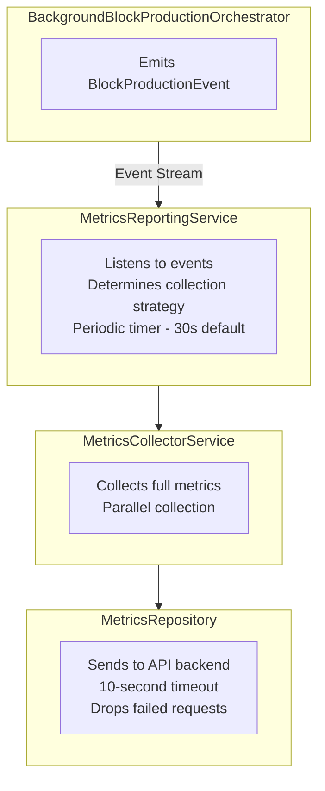

# Metrics Collection and Reporting

**Last Updated**: 2025-11-23
**Version**: 1.0.0

## Table of Contents

- [Overview](#overview)
- [Architecture](#architecture)
- [Event Types](#event-types)
- [API Specification](#api-specification)
- [Configuration](#configuration)
- [Usage](#usage)
- [Troubleshooting](#troubleshooting)

---

## Overview

The metrics system enables automatic collection and reporting of app health, node performance, and block production events to a centralized API. It uses both **periodic health checks** and **event-driven collection** for comprehensive visibility.

### Features

- **Compile-Time Configuration**: Configured via environment variables at build time
- **Dual Collection Triggers**: Periodic health checks (every 30 seconds by default) + event-driven metrics
- **Cross-Platform**: Works on Android and iOS, in all app states
- **42 Event Types**: Complete production lifecycle visibility
- **Full Collection**: Complete system state for all events
- **No Retry**: Failed uploads are dropped immediately (no storage overhead)

### Collection Strategy

All metrics collection uses the **Full strategy**, which collects complete app and node state for comprehensive analysis:
- **Periodic Health Checks**: Triggered every 30 seconds by default (configurable)
- **Event-Driven Metrics**: Triggered immediately by all `BlockProductionEvent` emissions
- **Full Collection**: All metrics categories collected for every event (device info, battery, network, permissions, node state, VRF, blockchain, peers, wallet)

---

## Architecture

### Components



### Service Roles

**MetricsCollectorService**: Gathers metrics from various sources (platform plugins, device info, Rust backend)

**MetricsReportingService**: Manages periodic reporting and event listening

**MetricsRepository**: HTTP client for API communication

**MetricsConfig**: Compile-time configuration from environment variables

---

## Event Types

The system supports **42 distinct event types**. All events collect full metrics (device info, battery, network, permissions, node state, VRF, blockchain, peers, wallet).

### Health & Lifecycle (5 events)

| Event Type | When | Purpose |
|------------|------|---------|
| `health_check` | Every 30s (default) | Regular system health monitoring |
| `epoch_transition` | New epoch detected | Track epoch changes and VRF status |
| `app_resumed` | App returns to foreground | Check system state after backgrounding |
| `app_suspended` | App goes to background | Not yet implemented |
| `android_boot_reschedule_completed` | Alarms rescheduled after reboot | Not yet implemented |

### Alarm & Background Execution (4 events)

| Event Type | When | Purpose |
|------------|------|---------|
| `app_wake_up` | Alarm fires, app wakes | **PROOF OF LIFE** - proves alarms work |
| `android_alarm_fired` | AlarmReceiver receives broadcast | Track alarm execution at native level |
| `ios_notification_delivered` | iOS notification delivered | Not yet implemented |
| `ios_bgtask_executed` | iOS BGTask executes | Track rare iOS background execution |

**app_wake_up Event Data:**
```json
{
  "event_type": "app_wake_up",
  "timestamp": "2025-11-23T12:00:00Z",
  "event_data": {
    "slotNumber": 12345,
    "alarmTime": "2025-11-23T12:00:00Z",
    "batteryLevel": 85,
    "alarmLatencyMs": 234,
    "deviceState": "locked",
    "networkStatus": "wifi"
  }
}
```

### Block Production (9 events)

| Event Type | When | Purpose |
|------------|------|---------|
| `slot_monitoring_start` | Monitoring begins after alarm | Track monitoring initialization |
| `slot_produced` | Block successfully produced | Record successful production |
| `slot_failed` | Production fails or slot missed | Diagnose failures |
| `monitoring_poll` | Each node status poll | Track monitoring progress |
| `block_production_detected` | Block propagation confirmed | Confirm propagation |
| `node_start_initiated` | Node start initiated | Track startup attempts |
| `node_start_completed` | Node start completes | Track startup performance |
| `node_start_failed` | Node start fails | Diagnose startup issues |

**slot_produced Event Data:**
```json
{
  "event_type": "slot_produced",
  "timestamp": "2025-11-23T12:00:05Z",
  "event_data": {
    "slotNumber": 12345,
    "blockHash": "0x1234...",
    "blockHeight": 567890,
    "productionTime": "2025-11-23T12:00:05Z",
    "nodeState": "running",
    "consensusState": "synced"
  }
}
```

### System Events (24 events)

**Alarm Events:**
- `alarm_scheduled` - Alarm/notification scheduled
- `alarm_cancelled` - Alarm cancelled (not yet implemented)
- `alarm_missed` - Expected alarm didn't fire

**Android Foreground Service:**
- `android_foreground_service_started/stopped`
- `android_boot_alarm_rescheduled`
- `android_boot_reschedule_started` (not yet implemented)

**Android Permissions:**
- `android_exact_alarm_permission_requested/granted/denied`
- `android_battery_optimization_checked/requested/disabled`
- `android_notification_permission_requested/granted/denied`

**iOS Notifications & BGTasks:**
- `ios_notification_scheduled/tapped/delivered`
- `ios_bgtask_scheduled/expired` (expired not yet implemented)

**iOS Permissions:**
- `ios_notification_permission_requested/granted/denied`
- `ios_background_refresh_status_checked`

**Error Events:**
- `error` - Error in production system

**Implementation Status**: ✅ 37 implemented, 🚧 5 not yet implemented

---

## API Specification

### Endpoint

**POST** `{METRICS_ENDPOINT}`

The endpoint URL is configured via `METRICS_ENDPOINT` environment variable.

**Headers:**
```
Content-Type: application/json
Accept: application/json
```

**Timeout:** 10 seconds

**Retry Policy:** None - failed requests are dropped

### Payload Structure

```json
{
  "event": {
    "event_type": "health_check",
    "timestamp": "2025-11-23T10:30:45.123Z"
  },
  "app": {
    "runtime": { /* app state, version, uptime */ },
    "platform": { /* OS, version, architecture */ },
    "device": { /* device ID, manufacturer, model */ },
    "battery": { /* level, state, optimization */ },
    "network": { /* type, connected */ },
    "permissions": { /* notification, alarm, battery */ },
    "foreground_service": { /* Android only */ }
  },
  "node": {
    "identity": { /* peer_id */ },
    "status": { /* running, state, sync, peers */ },
    "consensus": { /* epoch, slots, production */ },
    "blockchain": { /* height, latest block */ },
    "production": { /* background enabled */ },
    "wallet": { /* balance, address */ },
    "peers": [ /* peer list */ ]
  }
}
```

### Field Types

**Mandatory Fields** (always present):
- `event.*` - All event fields
- `app.runtime.*` - App state, version, uptime
- `app.platform.platform/platform_version` - OS info
- `app.device.*` - Device info
- `app.battery.*` - Battery metrics
- `app.network.*` - Network state
- `app.permissions.*` - Permission status
- `node.status.node_running/node_state/node_connected_peers`
- `node.production.background_production_enabled`
- `node.peers[]` - Array (can be empty)

**Optional Fields** (may be null/absent):
- `app.platform.system_architecture`
- `app.foreground_service.*` - Android only
- `node.identity.peer_id`
- `node.status.node_sync_status/node_best_tip_*`
- `node.consensus.*` - All consensus fields
- `node.blockchain.*` - All blockchain fields
- `node.wallet.*` - All wallet fields

### Response Handling

**Success**: HTTP 200-299
- Increments success counter
- Updates last report timestamp

**Failure**: Any other status or exception
- Increments failure counter
- Logs error
- Metrics are dropped (no retry)

---

## Configuration

### Environment Variables

Configure via `.env` file:

```bash
# Enable/disable metrics collection (true/false)
# Default: false
METRICS_ENABLED=false

# Full metrics endpoint URL
# Example: https://metrics.myapp.com/v1/metrics
# Default: '' (empty - no endpoint)
METRICS_ENDPOINT=

# Periodic health check interval in seconds (1-3600)
# How often MetricsCollectorService collects full metrics
# Note: Event-driven metrics trigger immediately regardless of this interval
# Default: 30
METRICS_COLLECTION_INTERVAL_SECONDS=30
```

**Build with configuration:**
```bash
flutter run --dart-define-from-file=.env
```

### Viewing Configuration

The Metrics Status screen provides a read-only view:

1. **Configuration**: Enabled status, endpoint URL, interval
2. **Statistics**: Success/failure counts, success rate, last report time
3. **Manual Actions**: "Send Now" to test, "Reset Stats" to clear counters

**Note**: Configuration cannot be changed at runtime. Update `.env` and rebuild.

### Programmatic Access

```dart
// Access config (read-only)
final config = ref.read(metricsConfigProvider);

if (config.enabled) {
  print('Endpoint: ${config.apiMetricsEndpoint}');
  print('Interval: ${config.intervalSeconds}s');
}

// Access stats
final stats = MetricsReportingService.instance.getStats();
print('Success: ${stats['success_count']}');
print('Failure: ${stats['failure_count']}');
```

---

## Usage

### 1. Configure via Environment Variables

**Create `.env`:**
```bash
METRICS_ENABLED=true
METRICS_ENDPOINT=https://api.example.com/v1/metrics
METRICS_COLLECTION_INTERVAL_SECONDS=30
```

**Build app:**
```bash
flutter run --dart-define-from-file=.env
```

Metrics start automatically if:
- `METRICS_ENABLED=true`
- `METRICS_ENDPOINT` is not empty
- Network connectivity available

### 2. View Metrics Status

Navigate to Metrics Status screen to see:

- **Status**: Running/Stopped
- **Configuration**: Endpoint, interval
- **Statistics**: Success/failure counts, success rate
- **Last Report**: Timestamp of last successful report

### 3. Manual Testing

Tap "Send Now" to manually trigger a report (useful for testing connectivity).

### 4. Verify Metrics

Check your API logs to verify:
- Reports sent every 30 seconds (or configured interval)
- Each report contains full payload (2-5 KB)
- Event-driven metrics appear immediately when events occur

---

## Troubleshooting

### Metrics Not Sending

**Possible Causes:**
1. `METRICS_ENABLED=false` or `METRICS_ENDPOINT` empty
2. Network connectivity issues
3. API endpoint unreachable
4. Invalid environment variables

**Solution:**
1. **Verify `.env` file:**
   ```bash
   METRICS_ENABLED=true
   METRICS_ENDPOINT=https://your-api.com/metrics
   METRICS_COLLECTION_INTERVAL_SECONDS=30
   ```

2. **Rebuild app:**
   Environment variables are compile-time, not runtime
   ```bash
   flutter run --dart-define-from-file=.env
   ```

3. **Check network:**
   - Ensure device has internet
   - Verify endpoint is reachable
   - Check firewall/network restrictions

4. **Review statistics:**
   - High failure count indicates API issues
   - Check "Last Report" timestamp
   - Use "Send Now" to test immediate reporting

### High Failure Rate

**Possible Causes:**
1. API endpoint down or slow
2. Network connectivity intermittent
3. Invalid API URL
4. Timeout too short (10 seconds)

**Solution:**
1. Verify API is responding (check API logs)
2. Test endpoint manually (curl/Postman)
3. Ensure URL is correct with full path
4. Check API returns 2xx status codes

### Background Collection Not Working (Android)

**Possible Causes:**
1. Battery optimization enabled
2. App killed by system
3. Exact alarm permission denied

**Solution:**
1. Disable battery optimization for app
2. Grant "Schedule exact alarms" permission (Android 12+)
3. Check foreground service is running

### Background Collection Not Working (iOS)

**Possible Causes:**
1. Background App Refresh disabled
2. Low Power Mode active
3. App not in use recently

**Solution:**
1. Enable Background App Refresh in Settings
2. Disable Low Power Mode
3. Use app regularly (iOS favors active apps)
4. Keep device plugged in during testing

**Note**: iOS background metrics are best-effort only. For guaranteed collection, keep app in foreground.

### Event-Driven Metrics Not Appearing

**Possible Causes:**
1. Event listener not connected
2. BackgroundBlockProductionOrchestrator not initialized
3. Events not being emitted

**Solution:**
1. Verify `MetricsReportingService.startListeningToEvents()` was called
2. Check orchestrator initialization in logs
3. Verify events are emitted (add debug logging to event stream)

---

## Performance Considerations

- **Parallel Collection**: Metrics gathered concurrently for efficiency
- **No Retry Overhead**: Failed uploads dropped immediately
- **Lightweight Storage**: SharedPreferences/UserDefaults only for task tracking
- **Adaptive Collection**: Targeted strategies reduce overhead for frequent events
- **Payload Size**: Typically 2-5 KB per report

---

## Privacy & Security

- **Device ID**: Uses platform-specific identifiers (Android ID, iOS Vendor ID)
- **No PII**: No personally identifiable information collected
- **Optional Data**: Wallet balance and address are optional fields
- **HTTPS Required**: Use HTTPS in production for encryption
- **No Persistence**: Failed metrics are not stored on device

---

## Data Sources

- **App Metrics**: device_info_plus, battery_plus, connectivity_plus, permission_handler, wakelock_plus, package_info_plus, PlatformAlarmService
- **Node Metrics**: RustBackendService.getStatus() - blockchain state, peers, sync status
- **Wallet Metrics**: Optional callback (WalletDataCallback) if configured

---

## Related Documentation

- [BACKGROUND_PRODUCTION.md](./BACKGROUND_PRODUCTION.md) - Background production architecture and event flow
- [METRICS_FIELDS_REFERENCE.md](./METRICS_FIELDS_REFERENCE.md) - Detailed JSON field reference with iOS/Android platform differences
- [DEVELOPMENT.md](./DEVELOPMENT.md) - Developer guidelines

---

**Version**: 1.0.0
**Last Updated**: 2025-11-23
**Status**: Production Ready ✅
