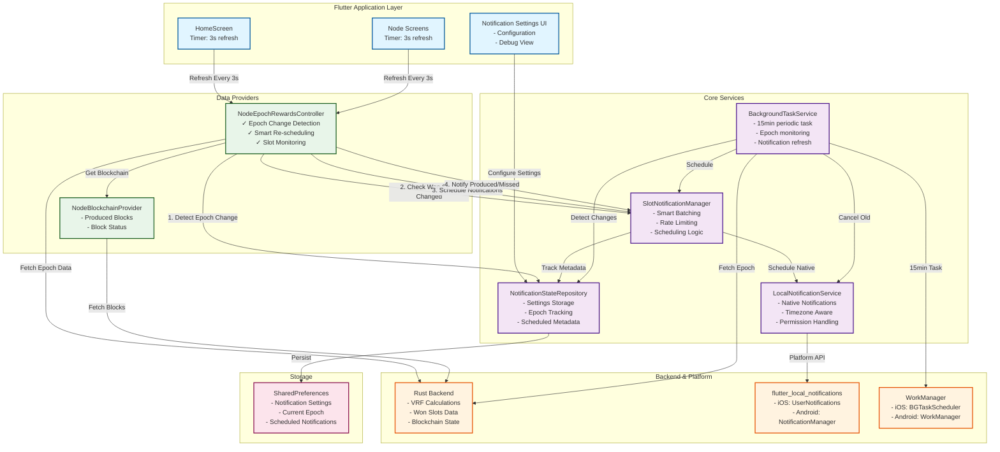
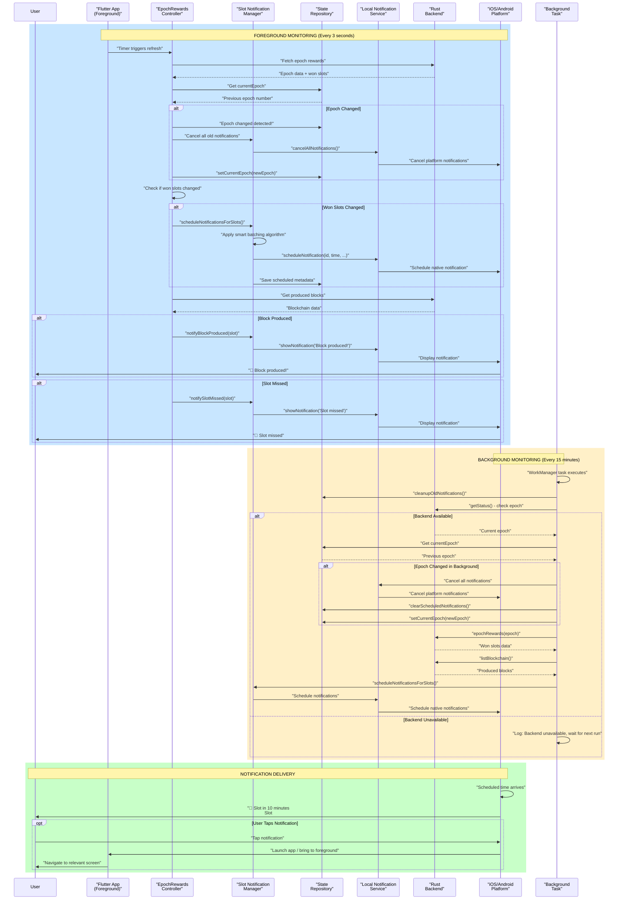
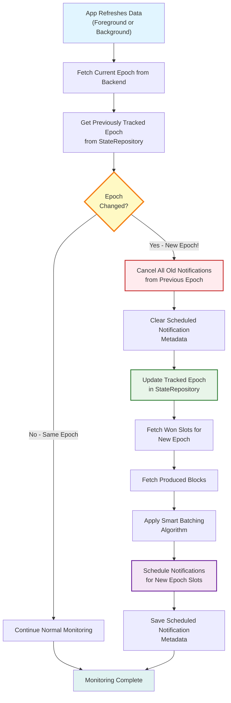
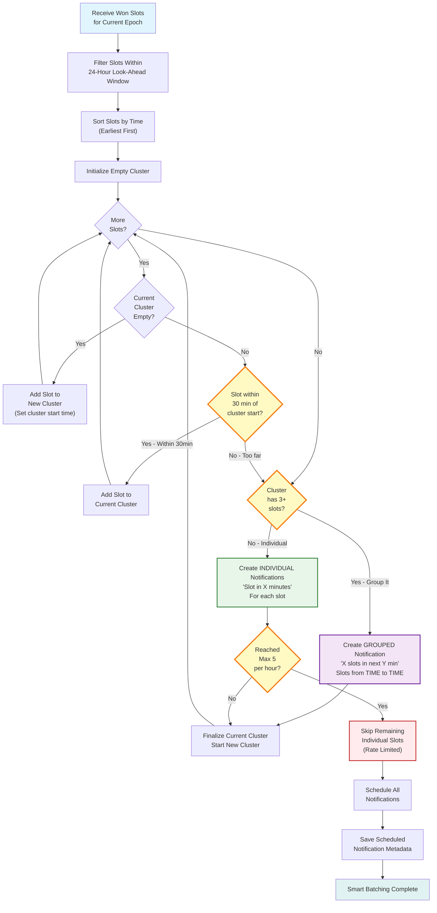

# Notification System Documentation

## Overview

This app implements a comprehensive notification system for won slots in the blockchain node. The system monitors upcoming slots, successfully produced blocks, and missed slots, providing timely notifications to users while preventing notification overload through smart batching.

## System Architecture Diagram



## Complete Notification Flow Diagram



## Epoch Change Detection Flow



## Smart Batching Algorithm Flow



## Architecture

### System Components

```
┌─────────────────────────────────────────────────────────────┐
│                     Flutter Application                      │
├─────────────────────────────────────────────────────────────┤
│                                                               │
│  ┌─────────────────────────────────────────────────────┐   │
│  │         Notification Settings Screen                 │   │
│  │  - User configuration UI                             │   │
│  │  - Debug view for scheduled notifications            │   │
│  └─────────────────────────────────────────────────────┘   │
│                           │                                   │
│                           ▼                                   │
│  ┌─────────────────────────────────────────────────────┐   │
│  │      Slot Notification Manager                       │   │
│  │  - Smart batching algorithm                          │   │
│  │  - Schedules upcoming notifications                  │   │
│  │  - Triggers produced/missed notifications            │   │
│  └─────────────────────────────────────────────────────┘   │
│           │                      │                            │
│           ▼                      ▼                            │
│  ┌──────────────────┐   ┌──────────────────────────┐       │
│  │ Notification      │   │  Local Notification      │       │
│  │ State Repository  │   │  Service                 │       │
│  │ - Persistence     │   │  - Native notifications  │       │
│  │ - Settings        │   │  - Scheduling            │       │
│  └──────────────────┘   └──────────────────────────┘       │
│                                   │                            │
├───────────────────────────────────┼───────────────────────────┤
│         Platform Layer            │                            │
│                                   ▼                            │
│  ┌────────────────────────────────────────────────────┐     │
│  │   flutter_local_notifications                      │     │
│  │   - iOS: UserNotifications framework               │     │
│  │   - Android: NotificationManager                   │     │
│  └────────────────────────────────────────────────────┘     │
│                                                               │
│  ┌────────────────────────────────────────────────────┐     │
│  │   WorkManager (Background Tasks)                   │     │
│  │   - iOS: BGTaskScheduler                           │     │
│  │   - Android: WorkManager                           │     │
│  └────────────────────────────────────────────────────┘     │
└─────────────────────────────────────────────────────────────┘
```

## Core Services

### 1. LocalNotificationService
**Location**: `lib/core/services/local_notification_service.dart`

Manages native platform notifications using `flutter_local_notifications`.

#### Key Features:
- Platform-specific initialization (Android & iOS)
- Permission requests
- Notification channel management (Android)
- Scheduled notifications using timezone-aware DateTime
- Immediate notifications

#### Methods:
```dart
// Initialize service
Future<bool> initialize()

// Request permissions
Future<bool> requestPermissions()

// Show immediate notification
Future<void> showNotification({
  required int id,
  required String title,
  required String body,
  String? payload,
  bool isSlotNotification = false,
})

// Schedule future notification
Future<void> scheduleNotification({
  required int id,
  required String title,
  required String body,
  required DateTime scheduledTime,
  String? payload,
  bool isSlotNotification = false,
})

// Cancel notifications
Future<void> cancelNotification(int id)
Future<void> cancelAllNotifications()
```

### 2. SlotNotificationManager
**Location**: `lib/core/services/slot_notification_manager.dart`

Implements the smart batching algorithm and manages slot-specific notifications.

#### Key Features:
- **Smart Batching**: Groups nearby slots to prevent overwhelming users
- **Rate Limiting**: Maximum 5 notifications per hour
- **Notification Types**:
  - Upcoming slots (configurable advance warning)
  - Blocks produced
  - Slots missed

#### Smart Batching Algorithm:

```dart
1. Fetch all pending won slots within next 24 hours
2. Sort slots by time
3. Group slots within 30-minute windows
4. If group has 3+ slots → create grouped notification
5. If group has <3 slots → create individual notifications
6. Apply rate limit (max 5 notifications/hour)
7. Schedule all notifications
```

#### Methods:
```dart
// Schedule notifications for won slots
Future<void> scheduleNotificationsForSlots({
  required List<RpcEpochWonSlot> wonSlots,
  required Set<int> producedSlots,
  required int epoch,
})

// Notify block produced
Future<void> notifyBlockProduced({
  required int globalSlot,
  required int epoch,
})

// Notify slot missed
Future<void> notifySlotMissed({
  required int globalSlot,
  required DateTime slotTime,
  required int epoch,
})

// Cancel and reschedule all
Future<void> rescheduleNotifications({
  required List<RpcEpochWonSlot> wonSlots,
  required Set<int> producedSlots,
  required int epoch,
})
```

### 3. NotificationStateRepository
**Location**: `lib/core/data/notification_state_repository.dart`

Persists notification settings and scheduled notification metadata using SharedPreferences.

#### Stored Data:
- **Settings**:
  - Notifications enabled/disabled
  - Notification type toggles (upcoming, produced, missed)
  - Advance warning time (5, 10, 15, 30 minutes)
  - Smart batching enabled/disabled

- **Scheduled Notifications**:
  - Notification ID
  - Slot number
  - Notification type
  - Scheduled time
  - Slot time

#### Methods:
```dart
// Settings getters/setters
bool get notificationsEnabled
Future<void> setNotificationsEnabled(bool enabled)

int get advanceWarningMinutes
Future<void> setAdvanceWarningMinutes(int minutes)

// Scheduled notification tracking
List<ScheduledNotification> getScheduledNotifications()
Future<void> addScheduledNotification(ScheduledNotification notification)
Future<void> removeScheduledNotification(int notificationId)
Future<void> cleanupOldNotifications()
```

### 4. BackgroundTaskService
**Location**: `lib/core/services/background_task_service.dart`

Manages background tasks for notification scheduling when app is not in foreground.

#### Features:
- Periodic task every 15 minutes
- Cleans up old notifications
- Attempts to refresh slot data (when Rust backend is available)

#### Platform Implementation:
- **Android**: Uses WorkManager with constraints
- **iOS**: Uses BGTaskScheduler with background fetch

---

## Platform-Specific Configuration

### Android Configuration

#### 1. Manifest Permissions
**File**: `android/app/src/main/AndroidManifest.xml`

```xml
<!-- Notification permissions for Android 13+ -->
<uses-permission android:name="android.permission.POST_NOTIFICATIONS" />

<!-- Background task permissions -->
<uses-permission android:name="android.permission.WAKE_LOCK" />
<uses-permission android:name="android.permission.RECEIVE_BOOT_COMPLETED" />
<uses-permission android:name="android.permission.SCHEDULE_EXACT_ALARM" />
<uses-permission android:name="android.permission.USE_EXACT_ALARM" />
```

#### 2. WorkManager Configuration
**File**: `android/app/src/main/AndroidManifest.xml`

```xml
<application>
  <!-- WorkManager configuration -->
  <provider
      android:name="androidx.startup.InitializationProvider"
      android:authorities="${applicationId}.androidx-startup"
      android:exported="false"
      tools:node="merge">
      <meta-data
          android:name="androidx.work.WorkManagerInitializer"
          android:value="androidx.startup"
          tools:node="remove" />
  </provider>

  <!-- Boot receiver for rescheduling -->
  <receiver
      android:name="androidx.work.impl.background.systemalarm.ConstraintProxy$BatteryNotLowProxy"
      android:enabled="false"
      android:exported="false">
      <intent-filter>
          <action android:name="android.intent.action.BOOT_COMPLETED" />
      </intent-filter>
  </receiver>
</application>
```

#### 3. Notification Channels

Two notification channels are created:

**Slot Notifications** (High Priority)
- Channel ID: `slot_notifications`
- Importance: High
- Sound: Enabled
- Vibration: Enabled
- Used for: Upcoming slots, produced blocks, missed slots

**General Notifications** (Default Priority)
- Channel ID: `general_notifications`
- Importance: Default
- Sound: Enabled
- Used for: Rewards, transactions, general info

#### 4. Permission Request Flow (Android 13+)

```dart
// Runtime permission request
final granted = await androidPlugin.requestNotificationsPermission();
if (!granted) {
  // Permission denied - notifications won't work
  // Guide user to settings if needed
}
```

---

### iOS Configuration

#### 1. Info.plist Configuration
**File**: `ios/Runner/Info.plist`

```xml
<key>UIBackgroundModes</key>
<array>
    <string>fetch</string>
    <string>processing</string>
</array>
```

These background modes enable:
- **fetch**: Background fetch for updating data
- **processing**: Background processing tasks

#### 2. Permission Request

iOS requests notification permissions at runtime:

```dart
final iosPlugin = notifications
    .resolvePlatformSpecificImplementation<IOSFlutterLocalNotificationsPlugin>();

final granted = await iosPlugin?.requestPermissions(
  alert: true,
  badge: true,
  sound: true,
);
```

#### 3. Notification Presentation

Notifications are configured to show:
- **Alert**: Visual notification
- **Badge**: App icon badge count
- **Sound**: Notification sound

---

## Notification Types & Behaviors

### 1. Upcoming Slot Notifications

**Trigger**: X minutes before slot time (configurable)

**Title**: "Slot in {X} minutes"

**Body**: "Slot #{globalSlot} at {time}"

**Example**:
```
Title: "Slot in 10 minutes"
Body: "Slot #31727 at 9:03 AM"
```

**Notification ID**: `1000 + globalSlot`

**Scheduling Logic**:
```dart
final slotTime = DateTime.fromMillisecondsSinceEpoch(
  slot.expectedTimeMs.toInt(),
  isUtc: true,
).toLocal();

final notificationTime = slotTime.subtract(
  Duration(minutes: advanceWarningMinutes)
);

await scheduleNotification(
  id: 1000 + slot.globalSlot,
  title: 'Slot in $advanceWarningMinutes minutes',
  body: 'Slot #${slot.globalSlot} at ${timeFormatter.format(slotTime)}',
  scheduledTime: notificationTime,
);
```

### 2. Grouped Slot Notifications

**Trigger**: When 3+ slots are within 30-minute window

**Title**: "{count} slots in next {X} min"

**Body**: "Slots from {startTime} to {endTime}"

**Example**:
```
Title: "3 slots in next 10 min"
Body: "Slots from 9:25 AM to 9:45 AM"
```

**Notification ID**: `4000 + firstSlotNumber`

**Grouping Logic**:
```dart
// Group slots within 30-minute window
if (currentCluster.length >= 3) {
  // Create grouped notification
  await scheduleGroupedNotification(
    cluster: currentCluster,
    advanceMinutes: advanceMinutes,
  );
}
```

### 3. Block Produced Notifications

**Trigger**: When block is successfully produced

**Title**: "Block produced!"

**Body**: "Successfully produced block for slot #{globalSlot}"

**Example**:
```
Title: "Block produced!"
Body: "Successfully produced block for slot #31727"
```

**Notification ID**: `2000 + globalSlot`

**Rate Limiting**: Max 1 per minute to prevent spam

### 4. Missed Slot Notifications

**Trigger**: When slot time passes without block production

**Title**: "Slot missed"

**Body**: "Slot #{globalSlot} at {time} was not produced"

**Example**:
```
Title: "Slot missed"
Body: "Slot #31727 at 9:03 AM was not produced"
```

**Notification ID**: `3000 + globalSlot`

**Rate Limiting**: Max 1 per minute

---

## Smart Batching Algorithm Details

### Purpose
Prevent overwhelming users when node wins many consecutive slots.

### Configuration
**Location**: `lib/core/config/notification_config.dart`

```dart
// Maximum notifications per hour
static const int maxNotificationsPerHour = 5;

// Time window for grouping slots
static const Duration groupingWindow = Duration(minutes: 30);

// Look ahead window for scheduling
static const Duration lookAheadWindow = Duration(hours: 24);
```

### Algorithm Steps

#### 1. Fetch & Filter
```dart
// Get all won slots within next 24 hours
final upcomingSlots = wonSlots.where((slot) {
  final slotTime = DateTime.fromMillisecondsSinceEpoch(
    slot.expectedTimeMs.toInt(),
    isUtc: true,
  ).toLocal();

  return slotTime.isAfter(now) &&
         slotTime.isBefore(now.add(Duration(hours: 24)));
}).toList();
```

#### 2. Sort by Time
```dart
final sortedSlots = List<RpcEpochWonSlot>.from(upcomingSlots)
  ..sort((a, b) => a.expectedTimeMs.compareTo(b.expectedTimeMs));
```

#### 3. Group Nearby Slots
```dart
List<RpcEpochWonSlot> currentCluster = [];
DateTime? clusterStart;

for (final slot in sortedSlots) {
  final slotTime = getSlotTime(slot);

  if (currentCluster.isEmpty) {
    currentCluster.add(slot);
    clusterStart = slotTime;
    continue;
  }

  final timeSinceClusterStart = slotTime.difference(clusterStart!);

  if (timeSinceClusterStart <= Duration(minutes: 30)) {
    // Add to current cluster
    currentCluster.add(slot);
  } else {
    // Finalize current cluster
    if (currentCluster.length >= 3) {
      // Create grouped notification
      scheduleGrouped(currentCluster);
    } else {
      // Create individual notifications
      scheduleIndividual(currentCluster);
    }

    // Start new cluster
    currentCluster = [slot];
    clusterStart = slotTime;
  }
}
```

#### 4. Apply Rate Limiting
```dart
int scheduledCount = 0;

for (final slot in individualSlots) {
  if (scheduledCount >= maxNotificationsPerHour) {
    logger.d('Rate limit reached, skipping remaining slots');
    break;
  }

  await scheduleUpcomingSlotNotification(slot);
  scheduledCount++;
}
```

### Example Scenarios

#### Scenario 1: Sparse Slots
**Input**: 3 slots at 9:00, 10:00, 11:00

**Output**: 3 individual notifications
- "Slot in 10 min" at 8:50
- "Slot in 10 min" at 9:50
- "Slot in 10 min" at 10:50

#### Scenario 2: Clustered Slots
**Input**: 5 slots at 9:00, 9:10, 9:20, 9:30, 9:40

**Output**: 1 grouped notification
- "5 slots in next 10 min" at 8:50
- Body: "Slots from 9:00 AM to 9:40 AM"

#### Scenario 3: Mixed Pattern
**Input**:
- 3 slots at 9:00, 9:10, 9:20 (cluster)
- 1 slot at 11:00 (isolated)
- 4 slots at 14:00, 14:05, 14:10, 14:15 (cluster)

**Output**:
- 1 grouped notification for first cluster
- 1 individual for isolated slot
- 1 grouped notification for second cluster
- Total: 3 notifications instead of 8

---

## User Configuration

### Settings UI
**Location**: `lib/features/settings/presentation/screens/notification_settings_screen.dart`

### Available Settings

#### 1. Global Enable/Disable
Toggle all notifications on/off. When disabled:
- All scheduled notifications are cancelled
- No new notifications are scheduled
- Background tasks continue but don't schedule notifications

#### 2. Notification Type Toggles

**Upcoming Slots**
- Enable/disable advance warnings
- Default: Enabled

**Block Produced**
- Enable/disable success notifications
- Default: Enabled

**Missed Slots**
- Enable/disable missed slot alerts
- Default: Enabled

#### 3. Advance Warning Time

User can select: 5, 10, 15, or 30 minutes

**Default**: 10 minutes

When changed:
- All scheduled notifications are cancelled
- Notifications are rescheduled with new timing

#### 4. Smart Batching

Toggle smart batching on/off

**Enabled** (default):
- Groups nearby slots
- Applies rate limiting
- Optimizes notification count

**Disabled**:
- Creates individual notification for every slot
- No grouping or rate limiting
- May result in many notifications

---

## Debug Features

### Scheduled Notifications Debug View

**Location**: Settings → Notifications → "Scheduled Notifications (Debug)"

### Features

#### 1. List View
Shows all scheduled notifications with:
- Notification type (color-coded badge)
- Slot number
- Notification time (formatted)
- Relative time ("in 2 minutes")
- Actual slot time

#### 2. Color Coding
- 🔵 **Blue**: Upcoming
- 🟣 **Purple**: Grouped
- 🟢 **Green**: Produced
- 🔴 **Red**: Missed

#### 3. Refresh Button
Manual refresh to update the list after changes

#### 4. Empty State
Shows message when no notifications are scheduled

### Example Display

```
┌─ Scheduled Notifications (Debug) ────────▼
│
│  5 notifications scheduled  [↻]
│
│  ┌────────────────────────────────────┐
│  │ 🔵 Upcoming      Slot #31727       │
│  │ 🔔 Notify: Oct 29, 8:53 AM  in 2m │
│  │ ⏰ Slot at: Oct 29, 9:03 AM        │
│  └────────────────────────────────────┘
│
│  ┌────────────────────────────────────┐
│  │ 🟣 Grouped       Slot #31730       │
│  │ 🔔 Notify: Oct 29, 9:15 AM  in 24m│
│  │ ⏰ Slot at: Oct 29, 9:25 AM        │
│  └────────────────────────────────────┘
│
└──────────────────────────────────────────
```

---

## Monitoring & Integration

### Continuous Slot Monitoring

The app implements a **hybrid monitoring approach** to ensure notifications are updated continuously:

#### Foreground Monitoring (Active)
**When**: App is in foreground with screens active
**Frequency**: Every 3 seconds
**Capabilities**:
- ✅ Epoch change detection
- ✅ New won slots detection
- ✅ Produced block detection
- ✅ Missed slot detection
- ✅ Smart re-scheduling (only when needed)

#### Background Monitoring (Passive)
**When**: App is backgrounded or closed
**Frequency**: Every 15 minutes
**Capabilities**:
- ✅ Epoch change detection
- ✅ Notification re-scheduling for new epochs
- ⚠️ Requires Rust backend to be running
- ✅ Graceful fallback if backend unavailable

### Slot Monitoring Integration

**Location**: `lib/features/node/presentation/controllers/node_data_providers.dart`

The `NodeEpochRewardsController` monitors slots and triggers notifications with intelligent epoch tracking:

```dart
class NodeEpochRewardsController extends AsyncNotifier<RpcEpochRewardsResp?> {
  Set<int> _previousProducedSlots = {};
  List<int> _previousWonSlots = [];

  Future<void> _monitorSlots(RpcEpochRewardsResp rewards, int epoch) async {
    final stateRepo = NotificationStateRepository.instance;

    // 1. EPOCH CHANGE DETECTION
    final previousEpoch = stateRepo.currentEpoch;
    final epochChanged = previousEpoch != null && previousEpoch != epoch;

    if (epochChanged) {
      // NEW EPOCH! Cancel all old notifications
      await SlotNotificationManager.instance.cancelAllScheduledNotifications();
      await stateRepo.setCurrentEpoch(epoch);
      LoggingService.instance.info('Epoch changed: $previousEpoch → $epoch');
    }

    // Get produced slots from blockchain
    final producedSlots = getProducedSlots();

    // 2. CHECK FOR NEWLY PRODUCED BLOCKS
    final newlyProduced = producedSlots.difference(_previousProducedSlots);
    for (final slot in newlyProduced) {
      await SlotNotificationManager.instance.notifyBlockProduced(
        globalSlot: slot,
        epoch: epoch,
      );
    }

    // 3. CHECK FOR MISSED SLOTS
    for (final wonSlot in wonSlots) {
      if (slotTimePassed && !produced && wasPreviouslyWon) {
        await SlotNotificationManager.instance.notifySlotMissed(
          globalSlot: wonSlot.globalSlot,
          slotTime: slotTime,
          epoch: epoch,
        );
      }
    }

    // 4. SMART RE-SCHEDULING (only when won slots change)
    final currentWonSlots = wonSlots.map((s) => s.globalSlot).toList();
    final wonSlotsChanged = epochChanged ||
        _previousWonSlots.isEmpty ||
        !_listsEqual(currentWonSlots, _previousWonSlots);

    if (wonSlotsChanged) {
      // Won slots changed - reschedule notifications
      await SlotNotificationManager.instance.scheduleNotificationsForSlots(
        wonSlots: wonSlots,
        producedSlots: producedSlots,
        epoch: epoch,
      );
    }

    // Update tracking
    _previousProducedSlots = producedSlots;
    _previousWonSlots = currentWonSlots;
  }
}
```

### Refresh Frequency

**Foreground**: Every 3 seconds (via Timer in HomeScreen)
- Detects epoch changes immediately
- Schedules notifications only when won slots change
- Monitors for newly produced blocks every 3 seconds
- Checks for missed slots continuously

**Background**: Every 15 minutes (via WorkManager)
- Fetches latest epoch data from Rust backend (if running)
- Detects epoch changes and cancels old notifications
- Schedules notifications for new epoch slots
- Falls back gracefully if backend unavailable

---

## Initialization Flow

### App Startup
**Location**: `lib/main.dart`

```dart
Future<void> _bootstrapAsync(LoggingService log) async {
  // 1. Initialize notification state repository
  await NotificationStateRepository.instance.initialize();

  // 2. Initialize local notification service
  final notificationInitialized =
      await LocalNotificationService.instance.initialize();

  if (notificationInitialized) {
    // 3. Request permissions
    final permissionsGranted =
        await LocalNotificationService.instance.requestPermissions();

    // 4. Initialize background tasks
    final backgroundInitialized =
        await BackgroundTaskService.instance.initialize();

    if (backgroundInitialized && notificationsEnabled) {
      // 5. Register periodic background task
      await BackgroundTaskService.instance.registerSlotMonitoringTask();
    }
  }

  // 6. Continue with backend initialization...
}
```

### Initialization Steps

1. **NotificationStateRepository.initialize()**
   - Loads SharedPreferences
   - Reads saved settings
   - Loads scheduled notification metadata

2. **LocalNotificationService.initialize()**
   - Initializes timezone database
   - Configures platform-specific settings
   - Creates notification channels (Android)
   - Returns success/failure status

3. **requestPermissions()**
   - Shows permission dialog (first time)
   - Returns granted status
   - Required for iOS always
   - Required for Android 13+

4. **BackgroundTaskService.initialize()**
   - Initializes WorkManager
   - Sets up callback dispatcher
   - Returns success/failure status

5. **registerSlotMonitoringTask()**
   - Registers periodic task (15 min interval)
   - Sets constraints (network required)
   - Configures backoff policy

---

## Epoch Change Handling

### What is an Epoch?
An epoch is a time period in the blockchain where the node's slot assignments are determined. When a new epoch starts, the node receives a new set of won slots based on its stake and VRF calculations.

### Epoch Transition Flow

```
Old Epoch Running
   ↓
New Epoch Starts (detected by polling or background task)
   ↓
Epoch Change Detection Triggers
   ↓
Cancel All Old Notifications (from previous epoch)
   ↓
Clear Scheduled Notification Metadata
   ↓
Update Tracked Epoch Number
   ↓
Fetch New Won Slots for New Epoch
   ↓
Schedule Notifications for New Epoch Slots
   ↓
User Receives Notifications for New Epoch
```

### Detection Mechanisms

**Foreground Detection** (Every 3 seconds):
```dart
// In NodeEpochRewardsController._monitorSlots()
final previousEpoch = stateRepo.currentEpoch;
final epochChanged = previousEpoch != null && previousEpoch != epoch;

if (epochChanged) {
  // Cancel old notifications
  await SlotNotificationManager.instance.cancelAllScheduledNotifications();
  // Update epoch
  await stateRepo.setCurrentEpoch(epoch);
  // Notifications will be rescheduled below
}
```

**Background Detection** (Every 15 minutes):
```dart
// In background_task_service.dart
final currentEpoch = status.epoch;
final previousEpoch = stateRepo.currentEpoch;

if (previousEpoch != null && previousEpoch != currentEpoch) {
  // Epoch changed in background!
  await LocalNotificationService.instance.cancelAllNotifications();
  await stateRepo.clearScheduledNotifications();
  await stateRepo.setCurrentEpoch(currentEpoch);
  // Fetch and schedule new epoch slots
}
```

### Why Epoch Tracking Matters

1. **Prevents Stale Notifications**: Old epoch slots are no longer relevant
2. **Ensures Accuracy**: Only schedules notifications for current epoch
3. **Efficient Resource Use**: Cancels outdated notifications immediately
4. **Seamless Transitions**: Users don't receive notifications for wrong epoch

### Storage

**Key**: `current_epoch` in SharedPreferences
**Type**: `int`
**Persistence**: Survives app restarts
**Usage**: Compared on every data refresh to detect changes

---

## Data Flow

### Notification Scheduling Flow

```
1. User's node wins slots
   ↓
2. Rust backend calculates won slots via VRF
   ↓
3. Flutter fetches epoch rewards (includes won slots)
   ↓
4. NodeEpochRewardsController._monitorSlots() called
   ↓
5. SlotNotificationManager.scheduleNotificationsForSlots()
   ↓
6. Smart batching algorithm runs
   ↓
7. Notifications scheduled via LocalNotificationService
   ↓
8. Metadata saved to NotificationStateRepository
   ↓
9. Platform schedules notifications
   ↓
10. At scheduled time, notification fires
```

### Notification Delivery Flow

```
Scheduled Time Arrives
   ↓
Platform delivers notification
   ↓
User sees notification in status bar/notification center
   ↓
User taps notification (optional)
   ↓
App opens (if not already open)
   ↓
Navigation handler processes payload (future enhancement)
   ↓
User navigates to relevant screen
```

---

## Persistence & State Management

### SharedPreferences Keys

**Settings**:
- `notifications_enabled`: bool
- `upcoming_notifications_enabled`: bool
- `produced_notifications_enabled`: bool
- `missed_notifications_enabled`: bool
- `advance_warning_minutes`: int
- `smart_batching_enabled`: bool

**Scheduled Notifications**:
- `scheduled_notifications`: JSON string array

### JSON Format

```json
[
  {
    "notificationId": 1031727,
    "globalSlot": 31727,
    "type": "upcoming",
    "scheduledTime": "2025-10-29T08:53:55.000",
    "slotTime": "2025-10-29T09:03:55.000"
  },
  {
    "notificationId": 4031730,
    "globalSlot": 31730,
    "type": "grouped",
    "scheduledTime": "2025-10-29T09:15:00.000",
    "slotTime": "2025-10-29T09:25:00.000"
  }
]
```

### Cleanup Strategy

**Automatic Cleanup**:
- Runs during app initialization
- Runs during background task execution
- Removes notifications older than 24 hours

```dart
Future<void> cleanupOldNotifications() async {
  final notifications = getScheduledNotifications();
  final cutoffTime = DateTime.now().subtract(Duration(hours: 24));

  final activeNotifications = notifications.where((n) {
    return n.slotTime.isAfter(cutoffTime);
  }).toList();

  await saveScheduledNotifications(activeNotifications);
}
```

---

## Error Handling

### Permission Denied

```dart
final granted = await LocalNotificationService.instance.requestPermissions();
if (!granted) {
  // Show user message
  ScaffoldMessenger.of(context).showSnackBar(
    SnackBar(content: Text('Notification permissions denied')),
  );

  // Optionally guide to settings
  // - Android: Open app settings
  // - iOS: Open app settings
}
```

### Scheduling Failures

```dart
try {
  await _notifications.zonedSchedule(...);
} catch (e) {
  logger.e('Error scheduling notification: $e');
  // Notification won't be delivered, but app continues
  // Consider retry logic or user notification
}
```

### Background Task Failures

```dart
Workmanager().executeTask((task, inputData) async {
  try {
    await _performSlotMonitoring();
    return Future.value(true); // Success
  } catch (e) {
    logger.e('Background task failed: $e');
    return Future.value(false); // Will retry with backoff
  }
});
```

---

## Testing

### Manual Testing Checklist

#### Permissions
- [ ] First launch shows permission dialog
- [ ] Granting permission enables notifications
- [ ] Denying permission disables notifications
- [ ] Re-requesting after denial works

#### Notification Delivery
- [ ] Upcoming slot notifications arrive at correct time
- [ ] Block produced notifications appear immediately
- [ ] Missed slot notifications appear after slot time
- [ ] Grouped notifications consolidate multiple slots

#### Settings
- [ ] Toggling notifications on/off works
- [ ] Changing advance warning time reschedules
- [ ] Enabling/disabling smart batching affects grouping
- [ ] Settings persist across app restarts

#### Background
- [ ] Notifications work when app is backgrounded
- [ ] Notifications work when app is closed
- [ ] Background task runs every 15 minutes
- [ ] Notifications survive device reboot (Android)

#### Debug View
- [ ] Shows all scheduled notifications
- [ ] Refresh button updates list
- [ ] Times are accurate and formatted correctly
- [ ] Color coding matches notification types

### Testing on Devices

**Android**:
- Test on Android 12 (no permission needed)
- Test on Android 13+ (runtime permission required)
- Test with battery optimization enabled/disabled
- Test notification channels in system settings

**iOS**:
- Test on iOS 15+
- Test with background fetch enabled/disabled
- Test notification settings in iOS Settings
- Test with Low Power Mode enabled

### Debugging Tips

**Enable Verbose Logging**:
```dart
// In background_task_service.dart
await Workmanager().initialize(
  callbackDispatcher,
  isInDebugMode: true, // Shows detailed logs
);
```

**Check Scheduled Notifications**:
```dart
final pending = await LocalNotificationService.instance.getPendingNotifications();
print('Pending: ${pending.length}');
for (final n in pending) {
  print('ID: ${n.id}, Title: ${n.title}, Body: ${n.body}');
}
```

**Monitor Background Tasks** (Android):
```bash
adb shell dumpsys jobscheduler | grep crypto_mobile_app
```

---

## Troubleshooting

### Notifications Not Appearing

**Check**:
1. Permissions granted? (Settings → Notifications)
2. Notifications enabled in app settings?
3. Notification type enabled? (upcoming/produced/missed)
4. Device in Do Not Disturb mode?
5. Battery optimization blocking? (Android)
6. Background refresh enabled? (iOS)

**Debug**:
- Check debug view for scheduled notifications
- Verify notification count > 0
- Check logs for scheduling errors
- Test with "Send Test Notification" button

### Background Tasks Not Running

**Android**:
- Check WorkManager constraints (network, battery)
- Verify app not force-stopped
- Check Doze mode exemption
- View logs: `adb logcat | grep WorkManager`

**iOS**:
- Background modes enabled in Info.plist?
- Background App Refresh enabled in Settings?
- App recently used? (iOS limits background for unused apps)

### Duplicate Notifications

**Cause**: Multiple scheduling without cleanup

**Fix**:
```dart
// Always cancel before rescheduling
await SlotNotificationManager.instance.cancelAllScheduledNotifications();
await SlotNotificationManager.instance.scheduleNotificationsForSlots(...);
```

### Notification Timing Issues

**Cause**: Timezone conversion errors

**Fix**: Always use `tz.TZDateTime.from(scheduledTime, tz.local)`

```dart
// WRONG - Will use UTC
await schedule(scheduledTime);

// CORRECT - Converts to local timezone
await schedule(tz.TZDateTime.from(scheduledTime, tz.local));
```

---

## Performance Considerations

### Memory

**Notification Metadata Storage**:
- Average: ~100 bytes per notification
- Max 100 scheduled notifications tracked
- Total: ~10 KB in SharedPreferences

**In-Memory State**:
- Settings cached in repository
- Scheduled notifications list cached
- Minimal memory footprint

### Battery Impact

**Foreground**:
- Timer runs every 3 seconds
- Negligible impact (only when app active)

**Background**:
- WorkManager task every 15 minutes
- Executes for ~1-2 seconds
- Very low battery impact

**Optimization**:
- Use `exactAllowWhileIdle` for critical notifications
- Batch network requests
- Clean up old data regularly

### Network Usage

**Minimal**:
- No external API calls
- Only local Rust backend RPC
- Background tasks use existing data flow

---

## Future Enhancements

### Potential Improvements

1. **Navigation from Notification**
   - Implement payload parsing
   - Navigate to specific slot/block on tap
   - Deep linking support

2. **Notification Actions**
   - "View Details" button
   - "Dismiss All" button
   - "Snooze" option

3. **Advanced Filtering**
   - Filter by slot importance
   - Filter by time of day
   - Quiet hours configuration

4. **Notification History**
   - Store delivered notifications
   - View past notifications in app
   - Statistics dashboard

5. **Push Notifications**
   - Firebase Cloud Messaging integration
   - Server-triggered notifications
   - Real-time slot updates

6. **Wear OS / watchOS Support**
   - Smartwatch notifications
   - Quick actions from watch
   - Complications showing upcoming slots

7. **Notification Grouping** (Android)
   - Group by epoch
   - Expandable notification groups
   - Summary notifications

---

## Dependencies

### Required Packages

```yaml
dependencies:
  flutter_local_notifications: ^17.0.0
  workmanager: ^0.5.2
  timezone: ^0.9.0
  timeago: ^3.7.0
  intl: any
  shared_preferences: ^2.2.3
  logger: ^2.0.0
```

### Platform Requirements

**Android**:
- Minimum SDK: 21 (Android 5.0)
- Target SDK: 34 (Android 14)
- Gradle: 7.0+
- Kotlin: 1.7+

**iOS**:
- Minimum: iOS 12.0
- Recommended: iOS 15.0+
- Swift 5.0+

---

## Security & Privacy

### Data Handling

**Local Only**:
- All notification data stored locally
- No data sent to external servers
- SharedPreferences encrypted on device

**Permissions**:
- Minimal permissions requested
- Only notification permission required
- No location, contacts, or sensitive data access

**Privacy**:
- No tracking or analytics for notifications
- No personal data in notification content
- Slot numbers are public blockchain data

---

## Conclusion

This notification system provides a comprehensive, platform-native solution for alerting users about won slots, produced blocks, and missed opportunities. The smart batching algorithm prevents notification fatigue while ensuring users stay informed about critical events.

For questions or issues, refer to the source code or contact the development team.

---

**Last Updated**: October 29, 2025
**Version**: 1.0.0
**Author**: Claude AI Assistant
