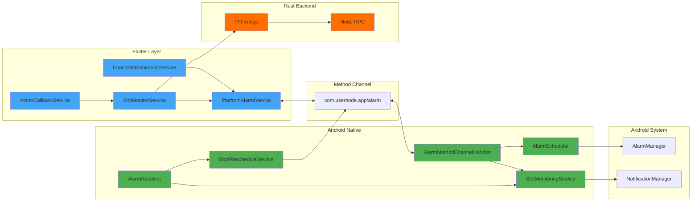
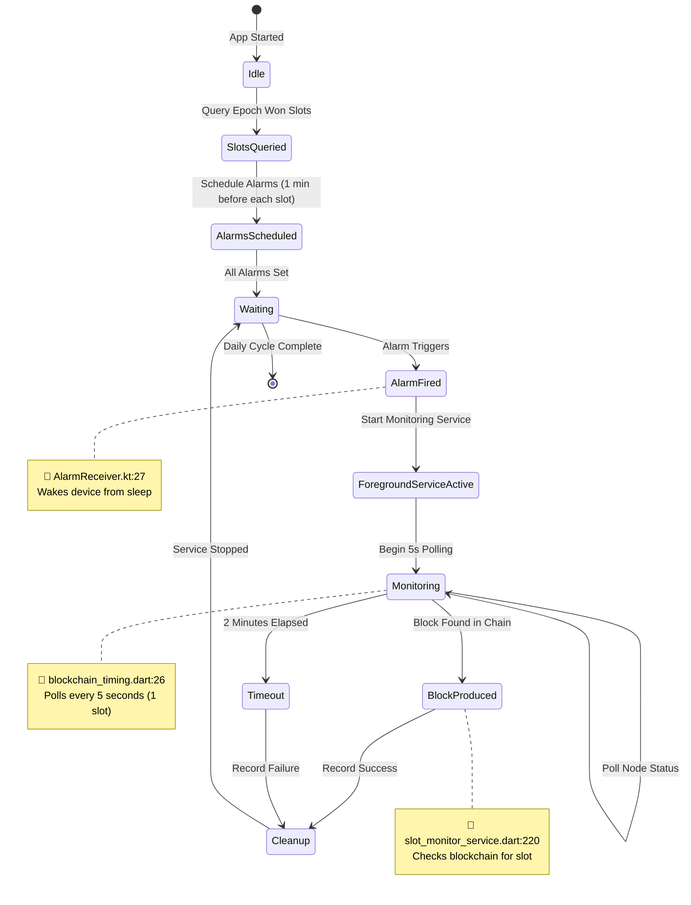

# Android Background Block Production - Flow Diagram

## Complete System Flow

```mermaid
flowchart TB
    %% Styling
    classDef flutter fill:#42A5F5,stroke:#1976D2,color:#fff
    classDef android fill:#4CAF50,stroke:#388E3C,color:#fff
    classDef rust fill:#FF6F00,stroke:#E65100,color:#fff
    classDef decision fill:#FFA726,stroke:#F57C00,color:#fff
    classDef notification fill:#9C27B0,stroke:#7B1FA2,color:#fff

    %% INITIALIZATION PHASE
    START([User Enables Background Production]):::flutter
    START --> INIT[PlatformAlarmService.initialize<br/>📄 platform_alarm_service.dart:93]:::flutter
    INIT --> CHECK_PERMS{Check Android Permissions<br/>📄 AlarmMethodChannelHandler.kt:98}:::decision

    CHECK_PERMS -->|Missing| REQ_PERMS[Request Permissions:<br/>- Exact Alarms<br/>- Battery Optimization<br/>📄 platform_alarm_service.dart:200]:::flutter
    CHECK_PERMS -->|Granted| SCHEDULE_START
    REQ_PERMS --> SCHEDULE_START

    %% SCHEDULING PHASE
    SCHEDULE_START[EpochSlotSchedulerService.scheduleEpochSlots<br/>📄 epoch_slot_scheduler_service.dart:195]:::flutter
    SCHEDULE_START --> QUERY_RUST[Query Rust Backend<br/>rpc.epochRewards includeWonSlots: true<br/>📄 rust_backend_service.dart:658]:::rust

    QUERY_RUST --> RUST_RESPONSE[Rust Returns Won Slots<br/>List of slotNumber + expectedTimeMs + epoch]:::rust
    RUST_RESPONSE --> LOOP_SLOTS{For Each Won Slot}:::decision

    LOOP_SLOTS --> CALC_TIME[Calculate Alarm Time<br/>slotTime - 1 minute (12 slots)<br/>📄 blockchain_timing.dart:21]:::flutter
    CALC_TIME --> SCHEDULE_ALARM[PlatformAlarmService.scheduleAlarm<br/>📄 platform_alarm_service.dart:200]:::flutter

    SCHEDULE_ALARM --> METHOD_CHANNEL["Method Channel Call<br/>com.usernode.app/alarm<br/>Method: scheduleExactAlarm"]:::flutter
    METHOD_CHANNEL --> ALARM_SCHEDULER[AlarmScheduler.scheduleExactAlarm<br/>📄 AlarmScheduler.kt:22]:::android

    ALARM_SCHEDULER --> SET_ALARM[AlarmManager.setExactAndAllowWhileIdle<br/>RTC_WAKEUP mode<br/>📄 AlarmScheduler.kt:54]:::android
    SET_ALARM --> SAVE_PREFS[Save to SharedPreferences<br/>Key: scheduled_alarms<br/>📄 AlarmScheduler.kt:123]:::android

    SAVE_PREFS --> LOOP_SLOTS
    LOOP_SLOTS -->|All Scheduled| WAIT[Wait for Alarm Time]:::notification

    %% ALARM FIRING PHASE
    WAIT --> ALARM_FIRES([⏰ Alarm Fires<br/>1 min before slot]):::notification
    ALARM_FIRES --> ALARM_RECEIVER[AlarmReceiver.onReceive<br/>Action: SLOT_ALARM<br/>📄 AlarmReceiver.kt:14]:::android

    ALARM_RECEIVER --> HANDLE_ALARM[handleSlotAlarm<br/>Extract slotNumber<br/>📄 AlarmReceiver.kt:27]:::android
    HANDLE_ALARM --> START_SERVICE[Start SlotMonitoringService<br/>Foreground Service<br/>📄 AlarmReceiver.kt:45]:::android

    START_SERVICE --> START_FOREGROUND[startForeground<br/>Post Notification<br/>Monitoring slot X<br/>📄 SlotMonitoringService.kt:59]:::notification
    START_FOREGROUND --> LAUNCH_APP[Launch Flutter App<br/>FLAG_ACTIVITY_NEW_TASK<br/>📄 SlotMonitoringService.kt:53]:::android

    LAUNCH_APP --> APP_RUNNING{App State}:::decision
    APP_RUNNING -->|Not Running| APP_START[onCreate - Read Intent<br/>📄 MainActivity.kt]:::android
    APP_RUNNING -->|Running| APP_RESUME[onNewIntent - Read Intent<br/>📄 MainActivity.kt]:::android

    APP_START --> HANDLE_CALLBACK
    APP_RESUME --> HANDLE_CALLBACK

    %% MONITORING PHASE
    HANDLE_CALLBACK[AlarmCallbackService.handleAlarmCallback<br/>📄 alarm_callback_service.dart:21]:::flutter
    HANDLE_CALLBACK --> START_MONITOR[SlotMonitorService.startMonitoringSlot<br/>📄 slot_monitor_service.dart:53]:::flutter

    START_MONITOR --> POLL_TIMER[Start 5s Polling Timer (1 slot)<br/>📄 blockchain_timing.dart:26]:::flutter
    POLL_TIMER --> POLL_LOOP([Every 5 Seconds]):::notification

    POLL_LOOP --> GET_STATUS[RustBackendService.getStatus<br/>📄 rust_backend_service.dart:158]:::rust
    GET_STATUS --> EXTRACT_DATA[Extract:<br/>- nodeState<br/>- bestTipSlot<br/>📄 slot_monitor_service.dart:129]:::flutter

    EXTRACT_DATA --> CHECK_TIP{bestTipSlot >= slotNumber?}:::decision
    CHECK_TIP -->|No| CHECK_TIMEOUT{2 min elapsed?}:::decision
    CHECK_TIMEOUT -->|No| POLL_LOOP
    CHECK_TIMEOUT -->|Yes| TIMEOUT_EVENT[Emit timeout Event<br/>📄 slot_monitor_service.dart:189]:::flutter

    %% BLOCK DETECTION PHASE
    CHECK_TIP -->|Yes| QUERY_CHAIN[RustBackendService.listBlockchain<br/>limit: 50, fromTip: true<br/>📄 slot_monitor_service.dart:208]:::rust
    QUERY_CHAIN --> SEARCH_BLOCK{Search for block<br/>globalSlot == slotNumber}:::decision

    SEARCH_BLOCK -->|Not Found| CHECK_TIMEOUT
    SEARCH_BLOCK -->|Found| SUCCESS_EVENT[Emit slotProduced Event<br/>Record blockHeight<br/>📄 slot_monitor_service.dart:220]:::flutter

    SUCCESS_EVENT --> STOP_MONITOR
    TIMEOUT_EVENT --> STOP_MONITOR

    %% CLEANUP PHASE
    STOP_MONITOR[SlotMonitorService.stopMonitoring<br/>📄 slot_monitor_service.dart:91]:::flutter
    STOP_MONITOR --> STOP_FG_SERVICE[PlatformAlarmService.stopForegroundService<br/>📄 platform_alarm_service.dart:357]:::flutter

    STOP_FG_SERVICE --> STOP_NATIVE[SlotMonitoringService.stopMonitoring<br/>📄 SlotMonitoringService.kt:62]:::android
    STOP_NATIVE --> REMOVE_NOTIFICATION[stopForeground<br/>STOP_FOREGROUND_REMOVE<br/>📄 SlotMonitoringService.kt:67]:::android

    REMOVE_NOTIFICATION --> STOP_SELF[stopSelf<br/>Service Destroyed]:::android
    STOP_SELF --> RECORD_STATS[Record Statistics<br/>Success/Failure]:::flutter
    RECORD_STATS --> END([Monitoring Complete]):::flutter

    %% REBOOT RECOVERY FLOW
    REBOOT([Device Reboots]):::notification
    REBOOT --> BOOT_BROADCAST[ACTION_BOOT_COMPLETED<br/>Broadcast Received]:::android
    BOOT_BROADCAST --> BOOT_RECEIVER[AlarmReceiver.onReceive<br/>📄 AlarmReceiver.kt:14]:::android

    BOOT_RECEIVER --> HANDLE_BOOT[handleBootCompleted<br/>📄 AlarmReceiver.kt:61]:::android
    HANDLE_BOOT --> BOOT_SERVICE[Start BootRescheduleService<br/>Foreground Service<br/>📄 AlarmReceiver.kt:68]:::android

    BOOT_SERVICE --> BOOT_NOTIFICATION[Post Notification<br/>Restoring alarms...<br/>📄 BootRescheduleService.kt:56]:::notification
    BOOT_NOTIFICATION --> CREATE_ENGINE[Create FlutterEngine<br/>Background Context<br/>📄 BootRescheduleService.kt:90]:::android

    CREATE_ENGINE --> WAIT_ENGINE[Wait 2 seconds<br/>Engine Initialization<br/>📄 BootRescheduleService.kt:96]:::android
    WAIT_ENGINE --> CALL_FLUTTER[MethodChannel Call<br/>rescheduleAfterBoot<br/>📄 BootRescheduleService.kt:105]:::android

    CALL_FLUTTER --> FLUTTER_RESCHEDULE[_handleRescheduleAfterBoot<br/>📄 platform_alarm_service.dart:72]:::flutter
    FLUTTER_RESCHEDULE --> CALLBACK[Invoke _onBootReschedule<br/>Callback to SlotScheduler<br/>📄 platform_alarm_service.dart:75]:::flutter

    CALLBACK --> SCHEDULE_START
```

## System Architecture Overview



## State Transition Diagram



## File Reference Index

### Flutter Services (Dart)

| File | Key Lines | Purpose |
|------|-----------|---------|
| **platform_alarm_service.dart** | 93, 200, 331, 357, 72 | Method channel bridge, alarm scheduling interface |
| **epoch_slot_scheduler_service.dart** | 195, 259 | Epoch-aware slot scheduling with periodic monitoring and auto-rescheduling |
| **slot_monitor_service.dart** | 53, 82, 121, 189, 208, 220, 91 | Real-time monitoring and block detection |
| **alarm_callback_service.dart** | 21 | Handles alarm callbacks from native |
| **rust_backend_service.dart** | 158, 658 | Rust FFI interface for node operations |

### Android Native (Kotlin)

| File | Key Lines | Purpose |
|------|-----------|---------|
| **AlarmMethodChannelHandler.kt** | 21, 98 | Method channel handler for Flutter ↔ Android |
| **AlarmScheduler.kt** | 22, 54, 123 | Core alarm scheduling with AlarmManager |
| **AlarmReceiver.kt** | 14, 27, 45, 61, 68 | Broadcast receiver for alarms and boot events |
| **SlotMonitoringService.kt** | 53, 59, 62, 67 | Foreground service for monitoring phase |
| **BootRescheduleService.kt** | 56, 90, 96, 105 | Reschedules alarms after device reboot |

### Configuration

| File | Key Lines | Purpose |
|------|-----------|---------|
| **AndroidManifest.xml** | 14-20, 76-84, 87-91, 94-98 | Permissions, receivers, services |

## Method Channel API

**Channel Name:** `com.usernode.app/alarm`

### Flutter → Android Methods

- `scheduleExactAlarm` - Schedule alarm for specific slot
- `cancelAlarm` - Cancel specific alarm by ID
- `cancelAllAlarms` - Cancel all scheduled alarms
- `startForegroundService` - Start monitoring foreground service
- `stopForegroundService` - Stop monitoring foreground service
- `hasExactAlarmPermission` - Check if exact alarm permission granted
- `requestExactAlarmPermission` - Request exact alarm permission
- `isBatteryOptimizationDisabled` - Check battery optimization status

### Android → Flutter Methods

- `rescheduleAfterBoot` - Trigger rescheduling after device reboot

## Key Implementation Details

### 1. Alarm Timing
- **Scheduled:** 1 minute before slot time (12 slots)
- **Location:** `blockchain_timing.dart:21` (alarmAdvanceTime)
- **Reason:** Gives time for app startup and node synchronization
- **Dynamic:** Calculated from `slotDurationMs × 12`

### 2. Monitoring Poll Interval
- **Interval:** 5 seconds (1 slot)
- **Location:** `blockchain_timing.dart:26` (pollInterval)
- **Timeout:** 2 minutes maximum (24 slots)
- **Dynamic:** Calculated from `slotDurationMs`

### 3. Foreground Service Requirement
- **Platform:** Android 8.0+ (API 26+)
- **Type:** `dataSync` (Android 12+)
- **Must Start:** Within 5 seconds to prevent ANR
- **Location:** `SlotMonitoringService.kt:59`

### 4. Exact Alarm API
- **Method:** `AlarmManager.setExactAndAllowWhileIdle()`
- **Clock Type:** `RTC_WAKEUP` (wakes device from sleep)
- **Doze Mode:** Bypassed via exact alarm permission
- **Location:** `AlarmScheduler.kt:54`

### 5. Epoch Monitoring and Auto-Rescheduling
- **Poll Interval:** Adaptive (5-30 minutes based on epoch progress)
  - **Early epoch (0-25%):** 30 minutes
  - **Mid epoch (25-75%):** 15 minutes
  - **Late epoch (75-100%):** 5 minutes
- **Method:** Queries `rpc.epochRewards()` to detect epoch transitions
- **Location:** `blockchain_timing.dart:46` (getEpochCheckInterval)
- **Adaptive Logic:** `epoch_slot_scheduler_service.dart:105` (_adjustEpochMonitoringFrequency)
- **On Epoch Change:**
  1. Cancels all old epoch alarms
  2. Sends user notification about new epoch
  3. Queries new epoch won slots
  4. Schedules new alarms automatically
  5. Persists new epoch metadata
- **Persistence:** Current epoch, scheduled slots, last check time stored in SharedPreferences
- **Blockchain Constants:** `slotsPerEpoch = 720`, `slotDurationMs = 5000ms` (1 hour epochs)

### 6. Boot Recovery Pattern
- **Trigger:** `ACTION_BOOT_COMPLETED` broadcast
- **Mechanism:** Background FlutterEngine creation
- **Timeout:** 30 seconds maximum execution
- **Location:** `BootRescheduleService.kt:90`
- **Process:** Automatically checks for epoch transitions and reschedules slots

## Reliability Metrics

**Expected Success Rate:** 90-95% on stock Android

### Success Factors
- Exact alarms bypass Doze mode restrictions
- Foreground service prevents process termination
- WAKE_LOCK ensures device wakes from sleep
- Boot receiver automatically restores alarms after reboot
- Persistent tracking in SharedPreferences
- Periodic epoch monitoring (every 30 min) ensures automatic rescheduling
- Epoch-aware scheduling prevents stale alarms from old epochs

### Common Failure Scenarios
1. **OEM Battery Optimization** - Some manufacturers aggressively kill background services
2. **Permission Revocation** - User manually disables exact alarm permission
3. **Network Issues** - No internet connection during slot time
4. **Low Memory** - System kills process under extreme memory pressure

## Testing Checklist

- [ ] Schedule alarm and verify AlarmManager registration
- [ ] Wait for alarm to fire, verify foreground service starts
- [ ] Verify notification appears during monitoring
- [ ] Test block production detection when node produces block
- [ ] Test timeout scenario (2 minutes)
- [ ] Reboot device and verify alarms are rescheduled
- [ ] Test with battery saver mode enabled
- [ ] Test on OEM devices (Xiaomi, Samsung, Oppo)
- [ ] Verify cleanup after monitoring completes
- [ ] Check SharedPreferences for alarm persistence

---

**Generated for:** Android Background Block Production System
**App:** Lingash Usernode Flutter Mobile App
**Date:** 2025-11-15
