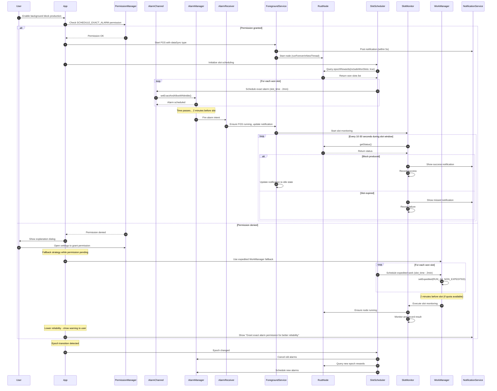
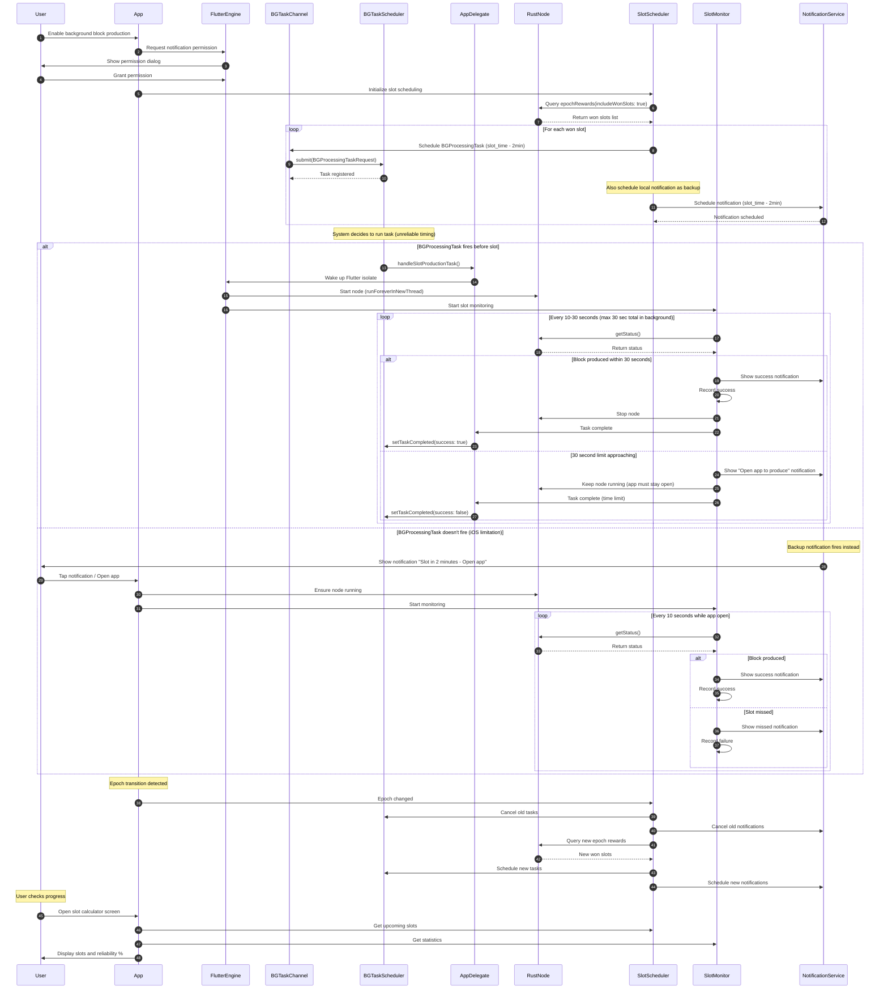
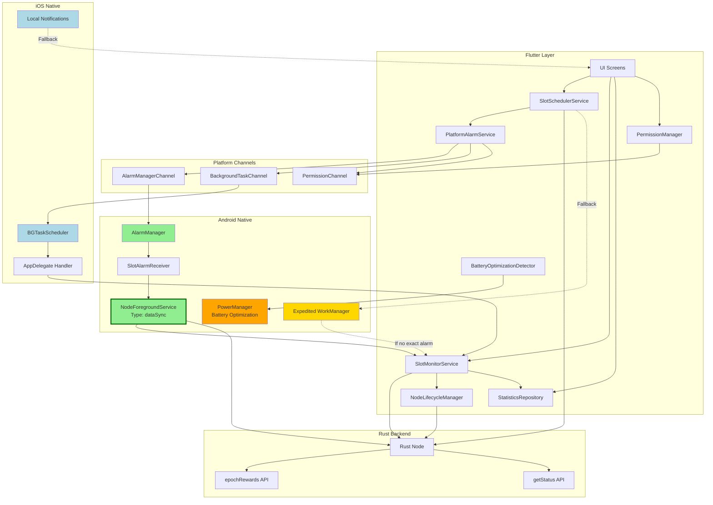
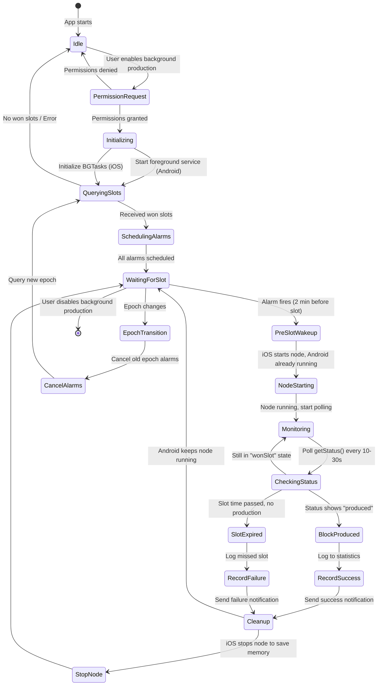
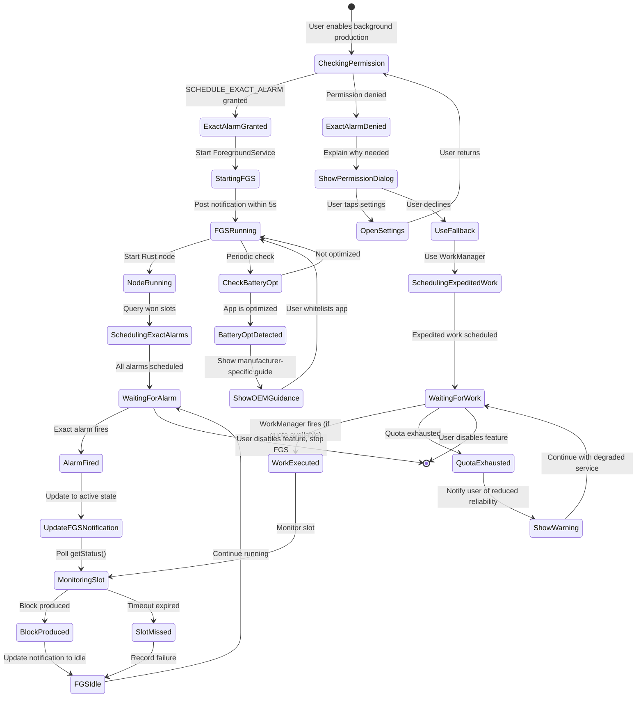

# Background Block Production - Flutter App Implementation Plan

## Executive Summary

**Architecture**: Scheduled discrete wake-ups (NOT continuous operation)

**Strategy**:

- **Android**: Keep node running + use exact alarms to ensure app wakes before slots (90-95% reliability)
- **iOS**: Start/stop node on demand + use BGProcessingTask + notifications for user alerts (60-90% reliability)

**Key Approach**:

1. Query Rust backend for won slots via `epochRewards(includeWonSlots: true)`
2. Schedule platform-specific alarms/tasks before each slot
3. When alarm fires: ensure node is running, monitor status until block is produced
4. Between slots: Keep node running on Android, stop/start on demand for iOS

---

## Rust Backend API (Already Available)

### 1. Get Won Slots

```dart
final rpc = RustBackendService.instance.rpc;
final epochData = await rpc.epochRewards(
  epoch: null,  // null = current epoch
  includeWonSlots: true,
);

// Returns:
// epochData.wonSlots: List<RpcEpochWonSlot>
//   - globalSlot: int
//   - expectedTimeMs: BigInt (timestamp in milliseconds)
```

### 2. Monitor Block Production Status

```dart
final status = await rpc.status();

// status.blockProducer?.status can be:
// - idle()
// - wonSlot(wonSlot)
// - wonSlotProduceInit(wonSlot)
// - batchesAssemblePending(wonSlot)
// - produced(wonSlot)
// - injected(wonSlot)
// etc.
```

### 3. Node Lifecycle (Already Available)

```dart
// Start node
await RustBackendService.instance.startForActiveAccount();

// Stop node
await RustBackendService.instance.stopNode();

// Get RPC handle
final rpc = RustBackendService.instance.rpc;
```

---

## PLATFORM LIMITATIONS & CONSTRAINTS

### Android Constraints

| Constraint                                        | Impact                                                  | Workaround                                                | Severity |
| ------------------------------------------------- | ------------------------------------------------------- | --------------------------------------------------------- | -------- |
| **Exact Alarm Permission Required (Android 14+)** | User must grant permission to schedule exact alarms     | Request permission at runtime with clear explanation      | Medium   |
| **Background Service Restrictions**               | Foreground service needed for reliable operation        | Use short-lived FGS during slot production only           | Medium   |
| **OEM-Specific Killing**                          | Xiaomi, Oppo, OnePlus kill background apps aggressively | Educate users to whitelist app; use persistent connection | High     |
| **Doze Mode**                                     | System restricts background activity in deep sleep      | Exact alarms bypass Doze; use setExactAndAllowWhileIdle() | Low      |

### iOS Constraints

| Constraint                      | Impact                                        | Workaround                                             | Severity     |
| ------------------------------- | --------------------------------------------- | ------------------------------------------------------ | ------------ |
| **BGProcessingTask Unreliable** | System decides when to run; not guaranteed    | Use notifications to prompt user before critical slots | **Critical** |
| **30-Second Background Limit**  | Without special mode, app suspended after 30s | Start/stop node on demand; keep work under 30s window  | **Critical** |
| **No Exact Alarm Equivalent**   | Cannot schedule precise wake-ups              | Combine BGTask (early) + notification (fallback)       | **Critical** |
| **Memory Limits**               | ~50MB in background; terminated if exceeded   | Stop node between slots to free memory                 | **Critical** |
| **No Boot Receiver**            | Cannot auto-start after device reboot         | Prompt user to open app daily to recalculate slots     | High         |

### Cross-Platform Constraints

| Constraint             | Both Platforms                                   | Workaround                                   | Severity |
| ---------------------- | ------------------------------------------------ | -------------------------------------------- | -------- |
| **Network Dependency** | Node needs internet to sync and produce blocks   | Detect offline state; warn user before slots | High     |
| **Battery Impact**     | Multiple wake-ups per day drain battery          | Optimize: only wake 2 min before slots       | Medium   |
| **User Awareness**     | Users may force-close app or disable permissions | Clear UI explaining validator requirements   | High     |

---

## ANDROID 12+ SPECIFIC REQUIREMENTS

### Foreground Service Type Declaration

Android 12+ requires explicit `foregroundServiceType` declaration in the manifest:

```xml
<manifest>
    <uses-permission android:name="android.permission.FOREGROUND_SERVICE" />
    <uses-permission android:name="android.permission.FOREGROUND_SERVICE_DATA_SYNC" />

    <application>
        <service
            android:name=".NodeForegroundService"
            android:foregroundServiceType="dataSync"
            android:enabled="true"
            android:exported="false" />
    </application>
</manifest>
```

**Type**: We use `dataSync` because the node is syncing blockchain data and producing blocks.

### Background Start Restrictions

Android 12+ restricts starting FGS from the background. Our approach:

1. **Alarm fires** → BroadcastReceiver wakes up
2. **Receiver immediately starts FGS** (within 5 seconds) using `ContextCompat.startForegroundService()`
3. **FGS posts notification** within 5 seconds of start
4. If background start fails → fallback to expedited WorkManager

### Exact Alarm Permission Flow

```kotlin
// Check permission (Android 12+)
if (Build.VERSION.SDK_INT >= Build.VERSION_CODES.S) {
    val alarmManager = getSystemService(AlarmManager::class.java)
    if (!alarmManager.canScheduleExactAlarms()) {
        // Show explanation, then:
        val intent = Intent(Settings.ACTION_REQUEST_SCHEDULE_EXACT_ALARM)
        startActivity(intent)
        // Fallback to expedited WorkManager until permission granted
    }
}
```

### Expedited WorkManager Fallback

When exact alarms are unavailable:

```kotlin
val workRequest = OneTimeWorkRequestBuilder<SlotMonitorWorker>()
    .setExpedited(OutOfQuotaPolicy.RUN_AS_NON_EXPEDITED_WORK_REQUEST)
    .setInputData(workDataOf("SLOT_NUMBER" to slotNumber))
    .setConstraints(Constraints.Builder()
        .setRequiredNetworkType(NetworkType.CONNECTED)
        .build())
    .build()

WorkManager.getInstance(context).enqueue(workRequest)
```

**Quota Management**: When quota is exhausted, expedited work degrades to normal scheduling. Show user notification about reduced reliability.

---

## DAILY WORKFLOW

```
┌──────────────────────────────────────────────────────────┐
│ DAY START (00:00)                                        │
│   ↓                                                       │
│ User opens app OR scheduled task runs                    │
│   ↓                                                       │
│ Query Rust: epochRewards(includeWonSlots: true)         │
│   → Returns: [Slot 145 at 03:27, Slot 892 at 14:54, ...] │
│   ↓                                                       │
│ Schedule alarms for each slot (2 minutes before)         │
│   • Android: Exact alarms via AlarmManager               │
│   • iOS: BGProcessingTask + notification fallback        │
│   ↓                                                       │
│ [Android] Node keeps running in background               │
│ [iOS] Stop node to save memory                           │
│                                                           │
├──────────────────────────────────────────────────────────┤
│ 03:25 - ⏰ ALARM FIRES (2 min before Slot 145)           │
│   ↓                                                       │
│ [Android] Wake app, ensure node still running            │
│ [iOS] Wake app, start node, fast sync                    │
│   ↓                                                       │
│ Monitor status() every 5 seconds                         │
│   ↓                                                       │
│ 03:27 - Slot 145 arrives                                 │
│   → Node automatically produces block                    │
│   → Status changes: wonSlot → produced → injected        │
│   ↓                                                       │
│ Block confirmed ✓                                        │
│   ↓                                                       │
│ [Android] Node continues running                         │
│ [iOS] Stop node after 30s to save battery/memory         │
│   ↓                                                       │
│ Wait for next slot alarm...                              │
│                                                           │
├──────────────────────────────────────────────────────────┤
│ 14:52 - ⏰ Next alarm (Slot 892)                         │
│   ... repeat process ...                                 │
│                                                           │
└──────────────────────────────────────────────────────────┘
```

---

## FLOW DIAGRAMS

### Android Background Execution Flow (Enhanced with Android 12+ Requirements)

This diagram illustrates the complete Android flow including permission handling, FGS lifecycle management, and fallback strategies.



### iOS Background Execution Flow

This diagram shows the iOS implementation with BGProcessingTask scheduling and local notification fallback due to iOS platform limitations.



### High-Level Architecture Diagram (Enhanced)

This diagram shows the relationships between Flutter services, platform channels, native components, and the Rust backend, including Android 12+ components.



### Component Interaction State Machine

This state diagram shows the complete lifecycle of the background execution system from initialization through slot monitoring and epoch transitions.



### Android Permission & FGS Lifecycle State Diagram

This diagram shows Android-specific permission handling, FGS lifecycle, and fallback strategies.



---

## IMPLEMENTATION CHECKLIST

### Phase 1: Core Services (Platform-Agnostic)

#### Slot Scheduler Service

- [ ] Create `lib/core/services/slot_scheduler_service.dart`
- [ ] Define `SlotSchedulerService` class with methods:
  - [ ] `Future<void> scheduleDailySlots()` - Query epoch won slots and schedule alarms
  - [ ] `Future<List<ScheduledSlot>> getScheduledSlots()` - Get upcoming scheduled slots
  - [ ] `Future<void> cancelAllSlots()` - Cancel all scheduled alarms
  - [ ] `Future<void> rescheduleSlots()` - Re-schedule after app restart
- [ ] Implement platform detection (Android vs iOS)
- [ ] Add persistence layer (save scheduled slots to local storage)
- [ ] Handle epoch transitions (detect new epoch, recalculate, reschedule)

#### Slot Monitor Service

- [ ] Create `lib/core/services/slot_monitor_service.dart`
- [ ] Define `SlotMonitorService` class with methods:
  - [ ] `Stream<BlockProductionStatus> monitorSlot(int slotNumber)` - Monitor specific slot
  - [ ] `Future<bool> waitForBlockProduction(int slotNumber, Duration timeout)` - Wait until produced or timeout
  - [ ] `Future<SlotResult> getSlotResult(int slotNumber)` - Get production outcome (success/missed)
- [ ] Poll `status()` RPC every 3-5 seconds during active slot window
- [ ] Detect production state changes (wonSlot → produced → injected)
- [ ] Record success/failure statistics

#### Statistics Repository

- [ ] Create `lib/core/repositories/block_production_stats_repository.dart`
- [ ] Define data models:
  - [ ] `SlotResult` - Outcome of a single slot (produced, missed, error)
  - [ ] `DailyStats` - Daily summary (total slots, produced, missed, reliability %)
- [ ] Implement local storage (SQLite or Hive)
- [ ] Methods:
  - [ ] `Future<void> recordSlotResult(SlotResult result)`
  - [ ] `Future<DailyStats> getDailyStats(DateTime date)`
  - [ ] `Future<double> getReliabilityPercentage(Duration period)`

---

### Phase 2: Android Implementation

#### Native Android Code

##### AlarmManager Integration

- [ ] Create `android/app/src/main/kotlin/com/usernode_labs/usernode/SlotAlarmReceiver.kt`
- [ ] Extend `BroadcastReceiver` to handle alarm intents
- [ ] In `onReceive()`:
  - [ ] Extract slot number and time from intent extras
  - [ ] **Start ForegroundService immediately** using `ContextCompat.startForegroundService()`
  - [ ] Send slot number to FGS via intent extras
- [ ] Add receiver to `AndroidManifest.xml`

**Code Example:**

```kotlin
class SlotAlarmReceiver : BroadcastReceiver() {
    override fun onReceive(context: Context, intent: Intent) {
        val slotNumber = intent.getIntExtra("SLOT_NUMBER", -1)
        val slotTime = intent.getLongExtra("SLOT_TIME", 0L)

        val serviceIntent = Intent(context, NodeForegroundService::class.java).apply {
            action = NodeForegroundService.ACTION_MONITOR_SLOT
            putExtra("SLOT_NUMBER", slotNumber)
            putExtra("SLOT_TIME", slotTime)
        }

        // Start FGS (Android 12+ compatible)
        ContextCompat.startForegroundService(context, serviceIntent)
    }
}
```

##### Foreground Service Implementation (Android 12+ Required)

- [ ] Create `android/app/src/main/kotlin/com/usernode_labs/usernode/NodeForegroundService.kt`
- [ ] Extend `Service` with foreground service capabilities
- [ ] **Post notification within 5 seconds** of `onStartCommand()`
- [ ] Implement notification states:
  - [ ] Idle: "Usernode - Waiting for slots"
  - [ ] Active: "Producing block for slot #123"
  - [ ] Success/Failure: Brief update then back to idle
- [ ] Handle node lifecycle (start/ensure running)
- [ ] Handle slot monitoring via coroutines
- [ ] Proper cleanup with `stopForeground(STOP_FOREGROUND_REMOVE)`

**Code Example:**

```kotlin
class NodeForegroundService : Service() {
    companion object {
        const val ACTION_START = "START_SERVICE"
        const val ACTION_MONITOR_SLOT = "MONITOR_SLOT"
        const val ACTION_STOP = "STOP_SERVICE"
        const val NOTIFICATION_ID = 1001
        const val CHANNEL_ID = "block_production"
    }

    private val serviceScope = CoroutineScope(Dispatchers.Default + SupervisorJob())

    override fun onStartCommand(intent: Intent?, flags: Int, startId: Int): Int {
        // Must call startForeground within 5 seconds (Android 12+)
        val notification = createNotification("Waiting for slots...")
        startForeground(NOTIFICATION_ID, notification)

        when (intent?.action) {
            ACTION_START -> handleStart()
            ACTION_MONITOR_SLOT -> {
                val slotNumber = intent.getIntExtra("SLOT_NUMBER", -1)
                handleSlotMonitoring(slotNumber)
            }
            ACTION_STOP -> handleStop()
        }

        return START_STICKY
    }

    private fun handleSlotMonitoring(slotNumber: Int) {
        serviceScope.launch {
            updateNotification("Producing block for slot #$slotNumber")

            // Monitor for up to 5 minutes
            val result = withTimeoutOrNull(5.minutes) {
                monitorSlotProduction(slotNumber)
            }

            if (result == true) {
                updateNotification("Block $slotNumber produced ✓")
                delay(3.seconds)
            } else {
                updateNotification("Slot $slotNumber missed ✗")
                delay(3.seconds)
            }

            updateNotification("Waiting for slots...")
        }
    }

    private fun createNotification(text: String): Notification {
        // Create notification channel on Android 8+
        if (Build.VERSION.SDK_INT >= Build.VERSION_CODES.O) {
            val channel = NotificationChannel(
                CHANNEL_ID,
                "Block Production",
                NotificationManager.IMPORTANCE_LOW
            ).apply {
                description = "Monitors and produces blocks for won slots"
            }
            val notificationManager = getSystemService(NotificationManager::class.java)
            notificationManager.createNotificationChannel(channel)
        }

        return NotificationCompat.Builder(this, CHANNEL_ID)
            .setContentTitle("Usernode Validator")
            .setContentText(text)
            .setSmallIcon(R.drawable.ic_notification)
            .setPriority(NotificationCompat.PRIORITY_LOW)
            .setOngoing(true)
            .build()
    }

    override fun onBind(intent: Intent?): IBinder? = null
}
```

##### Method Channel Handler

- [ ] Update `android/app/src/main/kotlin/com/usernode_labs/usernode/MainActivity.kt`
- [ ] Create method channel: `com.usernode_labs.usernode/slot_scheduler`
- [ ] Implement methods:
  - [ ] `scheduleExactAlarm(slotNumber, timestampMs)` - Schedule single alarm
  - [ ] `scheduleMultipleAlarms(List<Map>)` - Batch schedule
  - [ ] `cancelAlarm(slotNumber)` - Cancel specific alarm
  - [ ] `cancelAllAlarms()` - Cancel all alarms
  - [ ] `checkExactAlarmPermission()` - Check if permission granted
  - [ ] `requestExactAlarmPermission()` - Open settings to grant permission

##### Manifest Updates (Android 12+ Compliant)

- [ ] Update `android/app/src/main/AndroidManifest.xml`
- [ ] Add permissions:
  - [ ] `<uses-permission android:name="android.permission.SCHEDULE_EXACT_ALARM" />`
  - [ ] `<uses-permission android:name="android.permission.USE_EXACT_ALARM" />`
  - [ ] `<uses-permission android:name="android.permission.WAKE_LOCK" />`
  - [ ] **`<uses-permission android:name="android.permission.FOREGROUND_SERVICE" />`**
  - [ ] **`<uses-permission android:name="android.permission.FOREGROUND_SERVICE_DATA_SYNC" />`**
- [ ] Declare `SlotAlarmReceiver`:
  ```xml
  <receiver
      android:name=".SlotAlarmReceiver"
      android:enabled="true"
      android:exported="false" />
  ```
- [ ] **Declare NodeForegroundService with type:**
  ```xml
  <service
      android:name=".NodeForegroundService"
      android:foregroundServiceType="dataSync"
      android:enabled="true"
      android:exported="false" />
  ```

**Complete Manifest Example:**

```xml
<manifest xmlns:android="http://schemas.android.com/apk/res/android">
    <!-- Exact Alarm Permissions -->
    <uses-permission android:name="android.permission.SCHEDULE_EXACT_ALARM" />
    <uses-permission android:name="android.permission.USE_EXACT_ALARM" />
    <uses-permission android:name="android.permission.WAKE_LOCK" />

    <!-- Foreground Service Permissions (Android 12+) -->
    <uses-permission android:name="android.permission.FOREGROUND_SERVICE" />
    <uses-permission android:name="android.permission.FOREGROUND_SERVICE_DATA_SYNC" />

    <!-- Existing permissions -->
    <uses-permission android:name="android.permission.INTERNET" />
    <uses-permission android:name="android.permission.POST_NOTIFICATIONS" />

    <application>
        <!-- Alarm Receiver -->
        <receiver
            android:name=".SlotAlarmReceiver"
            android:enabled="true"
            android:exported="false" />

        <!-- Foreground Service (Android 12+ requires type) -->
        <service
            android:name=".NodeForegroundService"
            android:foregroundServiceType="dataSync"
            android:enabled="true"
            android:exported="false" />

        <!-- Rest of your app configuration -->
    </application>
</manifest>
```

#### Flutter Android Service

- [ ] Create `lib/core/services/android_slot_scheduler.dart`
- [ ] Implement `SlotScheduler` interface
- [ ] Methods:
  - [ ] `Future<void> scheduleSlot(ScheduledSlot slot)` - Call native `scheduleExactAlarm`
  - [ ] `Future<void> scheduleMultipleSlots(List<ScheduledSlot> slots)` - Batch schedule
  - [ ] `Future<void> cancelSlot(int slotNumber)` - Cancel via method channel
  - [ ] `Future<bool> hasExactAlarmPermission()` - Check permission
  - [ ] `Future<void> requestExactAlarmPermission()` - Request via settings
- [ ] Handle method channel communication
- [ ] Error handling (permission denied, scheduling failed)

---

### Phase 3: iOS Implementation (Realistic Approach)

> **⚠️ iOS Reality Check**: iOS **cannot reliably** wake apps at precise times for background computation without server assistance. Expected automatic reliability: **40-60%** with BGProcessingTask alone.

#### iOS Three-Tier Strategy

**Tier 1: Foreground Keep-Alive Mode (99% reliability)** ← Recommended for critical slots
**Tier 2: BGProcessingTask + Notifications (80-90% reliability)** ← Best practical automatic option
**Tier 3: Server-Assisted Silent Push (70-85% reliability)** ← Future enhancement

---

#### Tier 1: Foreground Keep-Alive Mode (Priority Implementation)

##### Purpose
User keeps app open during won slots for guaranteed block production.

##### Implementation

- [ ] Create `lib/core/services/ios_foreground_mode.dart`
- [ ] Implement "Keep Awake" mode:
  ```dart
  class ForegroundMode {
    static Future<void> enableKeepAwake() async {
      // Prevent screen sleep
      await WakeLock.enable();
      // Start monitoring if slot is imminent
      if (slotWithin10Minutes()) {
        await prepareForSlot();
      }
    }

    static Future<void> prepareForSlot() async {
      // Ensure node is running
      await RustBackendService.instance.startForActiveAccount();
      // Start proactive monitoring
      SlotMonitorService.instance.startMonitoring();
    }
  }
  ```

- [ ] Add background task for 30s buffer when app backgrounds:
  ```swift
  // In AppDelegate.swift
  func applicationDidEnterBackground(_ application: UIApplication) {
      if slotIsImminent() {
          backgroundTaskID = application.beginBackgroundTask {
              // Expiration - warn user
              self.sendUrgentNotification()
              application.endBackgroundTask(self.backgroundTaskID)
          }

          // We have ~30 seconds
          continueSlotMonitoring {
              application.endBackgroundTask(self.backgroundTaskID)
          }
      }
  }
  ```

##### UI Components

- [ ] Add "Keep App Open" toggle in settings
- [ ] Show prominent warning when won slots detected:
  ```
  "You have 3 won slots today. For best results, keep the app
   open during these times or respond to notifications."
  ```
- [ ] Display countdown in slot calculator: "Next slot in 1h 23m - Open app before then"
- [ ] Add "Prevent Sleep" toggle (automatically enables when slot < 10 min away)

---

#### Tier 2: BGProcessingTask Setup (Best-Effort Automatic)

> **Expected Reliability: 40-60%** (iOS decides when to run, not guaranteed timing)

##### Info.plist Configuration

- [ ] Update `ios/Runner/Info.plist`:
  ```xml
  <key>UIBackgroundModes</key>
  <array>
      <string>processing</string>
      <string>fetch</string>
  </array>

  <key>BGTaskSchedulerPermittedIdentifiers</key>
  <array>
      <string>com.usernode.slot</string>
  </array>
  ```

##### BGTask Registration & Handling

- [ ] Update `ios/Runner/AppDelegate.swift`:

**Code Example:**

```swift
import BackgroundTasks
import Flutter

@UIApplicationMain
class AppDelegate: FlutterAppDelegate {
    var backgroundTaskID: UIBackgroundTaskIdentifier = .invalid

    override func application(
        _ application: UIApplication,
        didFinishLaunchingWithOptions launchOptions: [UIApplication.LaunchOptionsKey: Any]?
    ) -> Bool {
        // Register BGProcessingTask handler
        BGTaskScheduler.shared.register(
            forTaskWithIdentifier: "com.usernode.slot",
            using: nil
        ) { task in
            self.handleSlotProductionTask(task: task as! BGProcessingTask)
        }

        return super.application(application, didFinishLaunchingWithOptions: launchOptions)
    }

    func handleSlotProductionTask(task: BGProcessingTask) {
        // Extract slot info from task (passed via userInfo if possible)
        // Note: BGTask doesn't support userInfo well, use Flutter channel instead

        let queue = OperationQueue()
        queue.maxConcurrentOperationCount = 1

        let operation = BlockOperation {
            // Log actual execution time vs expected
            print("BGTask fired at \(Date())")

            // Start node (if not running)
            self.startNodeViaChannel()

            // Monitor for up to 25 seconds
            let success = self.monitorSlotViaChannel(timeout: 25)

            if success {
                self.sendSuccessNotification()
            } else {
                self.sendMissedNotification()
            }

            // Stop node to save memory
            self.stopNodeViaChannel()
        }

        // Handle expiration (iOS killing us early)
        task.expirationHandler = {
            queue.cancelAllOperations()
            self.stopNodeViaChannel()
            print("BGTask expired before completion")
        }

        queue.addOperation(operation)
        operation.completionBlock = {
            task.setTaskCompleted(success: true)
        }
    }
}
```

##### Method Channel Integration

- [ ] Create method channel: `com.usernode_labs.usernode/ios_background`
- [ ] Implement methods:
  - [ ] `scheduleBGTask(slotNumber, timestamp)` - Schedule BGProcessingTask
  - [ ] `scheduleNotification(slotNumber, timestamp)` - Schedule notification
  - [ ] `enableKeepAwake()` - Prevent screen sleep
  - [ ] `disableKeepAwake()` - Allow screen sleep

**Flutter Channel Code:**

```dart
class IOSBackgroundChannel {
  static const platform = MethodChannel('com.usernode_labs.usernode/ios_background');

  static Future<bool> scheduleBGTask(int slotNumber, DateTime slotTime) async {
    try {
      // Schedule for 2 min before slot
      final earliestBegin = slotTime.subtract(Duration(minutes: 2));

      final result = await platform.invokeMethod('scheduleBGTask', {
        'slot_number': slotNumber,
        'earliest_begin': earliestBegin.millisecondsSinceEpoch,
      });

      print('BGTask scheduled for slot $slotNumber (may not run on time)');
      return result as bool;
    } catch (e) {
      print('Failed to schedule BGTask: $e');
      return false;
    }
  }
}
```

**iOS Swift Channel Handler:**

```swift
// In AppDelegate.swift
let backgroundChannel = FlutterMethodChannel(
    name: "com.usernode_labs.usernode/ios_background",
    binaryMessenger: controller.binaryMessenger
)

backgroundChannel.setMethodCallHandler { [weak self] (call, result) in
    switch call.method {
    case "scheduleBGTask":
        if let args = call.arguments as? [String: Any],
           let slotNumber = args["slot_number"] as? Int,
           let earliestBegin = args["earliest_begin"] as? Int64 {

            let request = BGProcessingTaskRequest(identifier: "com.usernode.slot")
            request.earliestBeginDate = Date(timeIntervalSince1970: Double(earliestBegin) / 1000.0)
            request.requiresNetworkConnectivity = true
            request.requiresExternalPower = false

            do {
                try BGTaskScheduler.shared.submit(request)
                print("Scheduled BGTask for slot \(slotNumber)")
                result(true)
            } catch {
                print("BGTask scheduling failed: \(error)")
                result(false)
            }
        } else {
            result(FlutterError(code: "INVALID_ARGS", message: nil, details: nil))
        }

    default:
        result(FlutterMethodNotImplemented)
    }
}
```

---

#### Local Notifications (Primary User Alert)

- [ ] Request notification permission in AppDelegate
- [ ] Create notification categories with actions:

**Code Example:**

```swift
func setupNotificationCategories() {
    let openAction = UNNotificationAction(
        identifier: "OPEN_APP",
        title: "Open App",
        options: [.foreground]
    )

    let slotCategory = UNNotificationCategory(
        identifier: "SLOT_REMINDER",
        actions: [openAction],
        intentIdentifiers: [],
        options: [.customDismissAction]
    )

    UNUserNotificationCenter.current().setNotificationCategories([slotCategory])
}

func scheduleSlotNotification(slotNumber: Int, slotTime: Date) {
    // First notification: 10 min before
    let earlyContent = UNMutableNotificationContent()
    earlyContent.title = "Slot #\(slotNumber) in 10 minutes"
    earlyContent.body = "Open the app to ensure block production"
    earlyContent.sound = .default
    earlyContent.categoryIdentifier = "SLOT_REMINDER"

    let earlyTrigger = UNCalendarNotificationTrigger(
        dateMatching: Calendar.current.dateComponents([.year, .month, .day, .hour, .minute],
                                                      from: slotTime.addingTimeInterval(-10 * 60)),
        repeats: false
    )

    let earlyRequest = UNNotificationRequest(
        identifier: "slot-\(slotNumber)-early",
        content: earlyContent,
        trigger: earlyTrigger
    )

    // Second notification: 2 min before (URGENT)
    let urgentContent = UNMutableNotificationContent()
    urgentContent.title = "⚠️ URGENT: Slot #\(slotNumber) in 2 MINUTES"
    urgentContent.body = "Open app NOW to produce block!"
    urgentContent.sound = .defaultCritical
    urgentContent.categoryIdentifier = "SLOT_REMINDER"
    urgentContent.interruptionLevel = .timeSensitive

    let urgentTrigger = UNCalendarNotificationTrigger(
        dateMatching: Calendar.current.dateComponents([.year, .month, .day, .hour, .minute],
                                                      from: slotTime.addingTimeInterval(-2 * 60)),
        repeats: false
    )

    let urgentRequest = UNNotificationRequest(
        identifier: "slot-\(slotNumber)-urgent",
        content: urgentContent,
        trigger: urgentTrigger
    )

    UNUserNotificationCenter.current().add(earlyRequest)
    UNUserNotificationCenter.current().add(urgentRequest)
}
```

- [ ] Handle notification taps → open app to slot monitoring screen
- [ ] Use `interruptionLevel = .timeSensitive` for critical notifications (iOS 15+)

---

#### Flutter iOS Service

- [ ] Create `lib/core/services/ios_slot_scheduler.dart`
- [ ] Implement three-tier scheduling:

```dart
class IOSSlotScheduler {
  Future<void> scheduleSlot(ScheduledSlot slot) async {
    // Tier 1: Always schedule notifications (most reliable user alert)
    await scheduleNotifications(slot);

    // Tier 2: Schedule BGTask (best-effort automatic)
    final bgTaskSuccess = await IOSBackgroundChannel.scheduleBGTask(
      slot.slotNumber,
      slot.slotTime,
    );

    if (!bgTaskSuccess) {
      print('BGTask scheduling failed for slot ${slot.slotNumber}');
    }

    // Track scheduling strategy
    await _recordSchedulingMethod(slot, bgTaskSuccess);
  }

  Future<void> scheduleNotifications(ScheduledSlot slot) async {
    // 10 min warning
    await platform.invokeMethod('scheduleNotification', {
      'slot_number': slot.slotNumber,
      'time_offset': -10 * 60,  // seconds before slot
      'title': 'Slot #${slot.slotNumber} in 10 minutes',
      'body': 'Open app to ensure block production',
      'urgent': false,
    });

    // 2 min urgent warning
    await platform.invokeMethod('scheduleNotification', {
      'slot_number': slot.slotNumber,
      'time_offset': -2 * 60,
      'title': '⚠️ URGENT: Slot #${slot.slotNumber} in 2 MINUTES',
      'body': 'Open app NOW to produce block!',
      'urgent': true,
    });
  }
}
```

---

#### Memory Management

- [ ] Implement memory monitoring:

```swift
func monitorMemoryUsage() {
    var info = mach_task_basic_info()
    var count = mach_msg_type_number_t(MemoryLayout<mach_task_basic_info>.size)/4

    let kerr: kern_return_t = withUnsafeMutablePointer(to: &info) {
        $0.withMemoryRebound(to: integer_t.self, capacity: 1) {
            task_info(mach_task_self_,
                     task_flavor_t(MACH_TASK_BASIC_INFO),
                     $0,
                     &count)
        }
    }

    if kerr == KERN_SUCCESS {
        let usedMB = Double(info.resident_size) / 1024.0 / 1024.0
        print("Memory usage: \(usedMB) MB")

        if usedMB > 50 {
            // Approaching limit, stop node
            print("Memory limit approaching, stopping node")
            stopNodeViaChannel()
        }
    }
}
```

- [ ] Stop node immediately after slot monitoring completes
- [ ] Handle memory warnings gracefully

---

#### User Education & UI

- [ ] Add iOS limitations banner in settings:
  ```
  ⚠️ iOS Limitations

  iOS cannot reliably wake apps for background block production.
  For best results:

  ✓ Keep app open during won slots (99% reliable)
  ✓ Respond to notifications immediately (80-90% reliable)
  ⚠️ Automatic background mode (40-60% reliable)

  We recommend enabling "Keep App Open" mode for critical slots.
  ```

- [ ] Track and display BGTask success rate:
  ```dart
  "BGTask Success Rate This Week: 12/30 (40%)"
  "Recommendation: Enable notifications and respond promptly"
  ```

- [ ] Add "Foreground Mode" toggle:
  - When enabled: app stays awake when slot < 10 min away
  - Shows persistent banner: "Keeping app awake for slot #123 in 5 min"

---

#### Debugging BGTasks (Development Only)

Use Xcode breakpoint command to simulate BGTask execution:

```bash
# In Xcode console after setting breakpoint
e -l objc -- (void)[[BGTaskScheduler sharedScheduler] _simulateLaunchForTaskWithIdentifier:@"com.usernode.slot"]
```

- [ ] Add debug logging to track when BGTask actually runs vs. expected time
- [ ] Log reliability metrics for analysis

---

### Phase 4: Flutter UI Integration

#### Epoch Calculator Page

- [ ] Create `lib/features/epochs/presentation/pages/epoch_calculator_page.dart`
- [ ] UI Components:
  - [ ] "Calculate Won Slots" button
  - [ ] Loading indicator during calculation
  - [ ] Display won slots count for today
  - [ ] List of upcoming slots with countdown timers
  - [ ] "Schedule Alarms" button (manual trigger)
  - [ ] "Auto-schedule daily" toggle (enable/disable)
- [ ] Logic:
  - [ ] On button press: call `epochRewards(includeWonSlots: true)`
  - [ ] Parse `RpcEpochWonSlot` list
  - [ ] Display slots with formatted times
  - [ ] Call `SlotSchedulerService.scheduleDailySlots()`
  - [ ] Show success/error feedback

#### Upcoming Slots Widget

- [ ] Create `lib/features/epochs/presentation/widgets/upcoming_slots_list.dart`
- [ ] Display each upcoming slot as a card:
  - [ ] Slot number
  - [ ] Expected time (formatted: "Today at 3:27 PM")
  - [ ] Countdown timer ("in 2h 15m")
  - [ ] Alarm status (scheduled ✓ or not scheduled ✗)
  - [ ] Platform-specific indicator (Android alarm icon vs iOS notification icon)
- [ ] Sort by time (nearest first)
- [ ] Refresh on pull-down

#### Settings Integration

- [ ] Update `lib/features/settings/presentation/pages/settings_page.dart`
- [ ] Add "Block Production" section
- [ ] Settings items:
  - [ ] **Auto-calculate daily** toggle
    - [ ] When enabled: schedule background task to run daily at 00:05 to recalculate won slots
    - [ ] Android: Use WorkManager periodic task
    - [ ] iOS: Use BGAppRefreshTask
  - [ ] **Exact alarm permission** (Android only)
    - [ ] Show permission status (granted/denied)
    - [ ] Button to request permission → opens system settings
  - [ ] **Notification permission** (iOS only)
    - [ ] Show permission status
    - [ ] Button to request permission
  - [ ] **Current reliability** stat
    - [ ] Display: "85% (17/20 blocks produced this week)"
  - [ ] **View Statistics** button → navigate to stats page

#### Statistics Dashboard

- [ ] Create `lib/features/epochs/presentation/pages/block_production_stats_page.dart`
- [ ] Display metrics:
  - [ ] **Today**: X won slots, Y produced, Z missed (reliability %)
  - [ ] **This week**: Aggregate stats
  - [ ] **All time**: Total blocks produced
- [ ] Charts (optional, use fl_chart package):
  - [ ] Line chart: reliability % over time
  - [ ] Bar chart: blocks per day
- [ ] Detailed slot history table:
  - [ ] Slot number | Time | Status (✓ Produced / ✗ Missed / ⏳ Pending)
  - [ ] Filter by date range
- [ ] Export button (optional): Export CSV of slot history

#### Real-time Slot Monitor Widget

- [ ] Create `lib/features/epochs/presentation/widgets/slot_production_monitor.dart`
- [ ] Show during active slot window (2 min before → 1 min after):
  - [ ] Large countdown timer: "Slot 145 in 1m 32s"
  - [ ] Current status (from `status().blockProducer.status`):
    - [ ] "Waiting..." (idle)
    - [ ] "Slot won! Producing block..." (wonSlot)
    - [ ] "Assembling batches..." (batchesAssemblePending)
    - [ ] "Signing block..." (signingPending)
    - [ ] "Block produced ✓" (produced)
    - [ ] "Broadcast complete ✓" (injected)
  - [ ] Progress indicator
  - [ ] Error display if production fails
- [ ] Auto-dismiss after block produced or timeout

---

### Phase 5: Background Automation

#### Daily Slot Calculation Task

##### Android: WorkManager

- [ ] Update `lib/core/services/background_task_service.dart`
- [ ] Add new task: `daily_slot_calculation`
- [ ] Schedule periodic work:
  ```dart
  Workmanager().registerPeriodicTask(
    "daily-slot-calc",
    "daily_slot_calculation",
    frequency: Duration(hours: 24),
    initialDelay: Duration(minutes: 5), // Run at 00:05 daily
    constraints: Constraints(networkType: NetworkType.connected),
  );
  ```
- [ ] In `callbackDispatcher`, handle task:
  - [ ] Initialize `RustBackendService` (if not running)
  - [ ] Call `epochRewards(includeWonSlots: true)`
  - [ ] Schedule alarms via `SlotSchedulerService`
  - [ ] Return success

##### iOS: BGAppRefreshTask

- [ ] In `ios/Runner/AppDelegate.swift`:
  - [ ] Register handler for `com.usernode.dailySlotCalc`
  - [ ] In handler: send message to Flutter to trigger calculation
- [ ] In Flutter, schedule next refresh:
  ```dart
  const platform = MethodChannel('com.usernode_labs.usernode/slot_scheduler');
  await platform.invokeMethod('scheduleDailyRefresh');
  ```

#### App Lifecycle Handling

- [ ] Update `lib/core/utils/lifecycle.dart`
- [ ] In `didChangeAppLifecycleState`:
  - [ ] **On resume**:
    - [ ] Check if new epoch started → recalculate slots
    - [ ] Verify scheduled alarms still exist
    - [ ] If Android & node not running → restart node
  - [ ] **On pause (iOS only)**:
    - [ ] Stop node after 30 seconds to save memory
    - [ ] Save current state

#### Slot Alarm Handler

- [ ] Create `lib/core/services/slot_alarm_handler.dart`
- [ ] Singleton service that handles incoming slot alarms
- [ ] Method: `Future<void> handleSlotAlarm(int slotNumber, int timestampMs)`
  - [ ] **Android**:
    - [ ] Check if node is running → if not, start it
    - [ ] Wait 10 seconds for node to sync
  - [ ] **iOS**:
    - [ ] Start node
    - [ ] Wait for sync (up to 2 minutes)
  - [ ] Start monitoring via `SlotMonitorService.monitorSlot(slotNumber)`
  - [ ] Show real-time monitoring UI (if app in foreground)
  - [ ] Wait for production or timeout (5 minutes)
  - [ ] Record result to stats repository
  - [ ] **iOS**: Stop node after 30 seconds to free memory
- [ ] Handle errors gracefully:
  - [ ] If node fails to start → record as missed, show notification
  - [ ] If timeout → record as missed, log for debugging

---

### Phase 6: Testing & Validation

#### Unit Tests

- [ ] Test `SlotSchedulerService`:
  - [ ] Mock Rust backend responses
  - [ ] Verify slot scheduling logic
  - [ ] Test epoch transitions
- [ ] Test `SlotMonitorService`:
  - [ ] Mock status responses with different states
  - [ ] Verify state transition detection
  - [ ] Test timeout handling
- [ ] Test `BlockProductionStatsRepository`:
  - [ ] Verify persistence
  - [ ] Test reliability calculations

#### Integration Tests

- [ ] Test Android alarm flow:
  - [ ] Schedule alarm → wait → verify receiver fired
  - [ ] Test with app in background
  - [ ] Test with device in Doze mode (use ADB to force Doze)
- [ ] Test iOS BGTask flow:
  - [ ] Schedule task → simulate task execution (Xcode "Simulate Background Fetch")
  - [ ] Verify Flutter receives slot context
- [ ] Test node start/stop cycle (iOS):
  - [ ] Stop node → wait → start node → verify sync completes

#### End-to-End Tests

- [ ] Full 24-hour simulation:
  - [ ] Calculate won slots for test epoch
  - [ ] Schedule alarms
  - [ ] Fast-forward time (modify system clock or use mock timestamps)
  - [ ] Verify all alarms fire
  - [ ] Verify blocks produced (or simulated)
- [ ] Multi-day test:
  - [ ] Day 1: Calculate and schedule
  - [ ] Day 2: Verify epoch transition detected, new slots scheduled
  - [ ] Verify old alarms canceled

#### Device Testing

- [ ] **Android devices** (minimum 5 for comprehensive OEM coverage):
  - [ ] Google Pixel (stock Android 14) - baseline reference
  - [ ] Samsung Galaxy (One UI) - moderate battery optimization
  - [ ] Xiaomi (MIUI) - **aggressive battery killer**
  - [ ] Oppo/OnePlus (ColorOS/OxygenOS) - aggressive power management
  - [ ] Budget device (low RAM) - memory pressure testing
- [ ] **iOS devices** (minimum 2):
  - [ ] iPhone with iOS 16+
  - [ ] iPad (optional)
- [ ] Test scenarios:
  - [ ] App in foreground
  - [ ] App in background
  - [ ] App force-closed
  - [ ] Device rebooted
  - [ ] Low Power Mode (iOS)
  - [ ] Battery Saver Mode (Android)
  - [ ] Airplane mode during slot → reconnect before slot time

#### OEM-Specific Testing & Workarounds

##### Testing on Xiaomi (MIUI)

**Known Issues:**
- MIUI kills background apps aggressively even with exact alarms
- "Battery Saver" and "MIUI Optimization" interfere with FGS
- Autostart permission required

**Testing Checklist:**
- [ ] Test with default MIUI settings (expect failures)
- [ ] Enable all workarounds, verify improved reliability
- [ ] Test after device reboot (autostart crucial)
- [ ] Test with "Battery Saver" ON and OFF
- [ ] Use `adb shell dumpsys deviceidle force-idle` to simulate Doze

**Required Workarounds:**
```kotlin
// Detect MIUI
fun isMIUI(): Boolean {
    return !TextUtils.isEmpty(getSystemProperty("ro.miui.ui.version.name"))
}

// Check if battery optimization is disabled
fun isBatteryOptimizationDisabled(context: Context): Boolean {
    val pm = context.getSystemService(Context.POWER_SERVICE) as PowerManager
    return pm.isIgnoringBatteryOptimizations(context.packageName)
}

// Request battery optimization exemption
fun requestBatteryOptimizationExemption(context: Context) {
    if (Build.VERSION.SDK_INT >= Build.VERSION_CODES.M) {
        val intent = Intent(Settings.ACTION_REQUEST_IGNORE_BATTERY_OPTIMIZATIONS).apply {
            data = Uri.parse("package:${context.packageName}")
        }
        context.startActivity(intent)
    }
}
```

**User Guidance (MIUI):**
1. Settings → Apps → Manage apps → Usernode
2. Battery saver → No restrictions
3. Autostart → Enable
4. Other permissions → Display pop-up windows while running in the background → Enable
5. Settings → Battery & performance → turn off "Battery saver"

##### Testing on Samsung (One UI)

**Known Issues:**
- "Optimize battery usage" can kill FGS
- "Put apps to sleep" feature interferes
- Generally less aggressive than Xiaomi

**Testing Checklist:**
- [ ] Test with "Optimize battery usage" ON
- [ ] Verify FGS survives after 3+ hours in background
- [ ] Test after device idle for 1+ hour

**User Guidance (Samsung):**
1. Settings → Apps → Usernode → Battery
2. Set to "Unrestricted"
3. Settings → Battery → Background usage limits
4. Remove Usernode from "Sleeping apps" and "Deep sleeping apps"

##### Testing on Oppo/OnePlus (ColorOS)

**Known Issues:**
- "Battery optimization" very aggressive
- "App auto-launch" must be enabled
- ColorOS 11+ has improved, but still problematic

**User Guidance:**
1. Settings → Battery → App Battery Management → Usernode → Don't optimize
2. Settings → Apps → App Management → Usernode → Auto-launch → Enable
3. Settings → Privacy → App Permissions → Auto-start → Usernode → Allow

##### Battery Optimization Detection & Guidance

**Implement in Flutter:**

```dart
class BatteryOptimizationDetector {
  static const platform = MethodChannel('com.usernode/battery');

  static Future<bool> isOptimized() async {
    try {
      return await platform.invokeMethod('isBatteryOptimized');
    } catch (e) {
      return false;
    }
  }

  static Future<String> getManufacturer() async {
    return await platform.invokeMethod('getManufacturer');
  }

  static Future<void> requestExemption() async {
    await platform.invokeMethod('requestBatteryExemption');
  }

  static String getGuidanceForManufacturer(String manufacturer) {
    switch (manufacturer.toLowerCase()) {
      case 'xiaomi':
        return '''
1. Go to Settings → Apps → Manage apps → Usernode
2. Set Battery saver to "No restrictions"
3. Enable Autostart
4. Enable "Display pop-up windows"
5. Disable MIUI Battery Saver
        ''';
      case 'samsung':
        return '''
1. Settings → Apps → Usernode → Battery
2. Select "Unrestricted"
3. Remove from Sleeping apps list
        ''';
      case 'oppo':
      case 'oneplus':
      case 'realme':
        return '''
1. Settings → Battery → App Battery Management
2. Set Usernode to "Don't optimize"
3. Enable Auto-launch for Usernode
        ''';
      default:
        return '''
1. Go to Settings → Apps → Usernode
2. Disable battery optimization
3. Allow background activity
        ''';
    }
  }
}
```

##### Doze Mode Testing (All Android Devices)

**Force device into Doze:**

```bash
# Connect device via ADB
adb shell dumpsys deviceidle enable
adb shell dumpsys deviceidle force-idle

# Verify FGS and alarms still work

# Exit Doze
adb shell dumpsys deviceidle unforce

# Check logs
adb logcat | grep "NodeForegroundService\|AlarmManager"
```

**Expected Behavior:**
- FGS should remain running (notification visible)
- Exact alarms should fire even in Doze
- Node should stay connected

##### Testing Reliability Metrics by OEM

Track and report reliability by manufacturer:

| Manufacturer | Expected Reliability | Common Issues | Workaround Success Rate |
|--------------|---------------------|---------------|------------------------|
| Google Pixel | 95-98% | Minimal issues | N/A |
| Samsung | 85-92% | Battery optimizer | 90% with exemption |
| Xiaomi | 60-75% (without workarounds) | Aggressive killing | 85% with all settings |
| Oppo/OnePlus | 70-80% | Auto-launch disabled | 88% with exemption |
| Other | 80-90% | Varies | 85% average |

---

### Phase 7: User Experience & Polish

#### Permission Request Flow

- [ ] Create onboarding screen explaining block production requirements
- [ ] Step-by-step permission requests:
  - [ ] **Android**: Exact alarm permission
    - [ ] Show dialog: "Why we need this: To wake app before won slots"
    - [ ] "Grant Permission" button → opens settings
    - [ ] Verify granted → show success checkmark
  - [ ] **iOS**: Notification permission
    - [ ] Show dialog: "Why we need this: To alert you before won slots"
    - [ ] Request permission
    - [ ] If denied: show fallback strategy (must keep app open)
- [ ] Battery optimization guidance (Android):
  - [ ] Detect if app is battery-optimized
  - [ ] Show instructions for user's specific device (Xiaomi, Samsung, etc.)
  - [ ] Link to external guides (dontkillmyapp.com)

#### Notifications

- [ ] **Android**:
  - [ ] "Slot 145 in 2 minutes" - when alarm fires
  - [ ] "Block produced for slot 145 ✓" - on success
  - [ ] "Missed slot 145 ✗ - Node was offline" - on failure
- [ ] **iOS**:
  - [ ] "Slot 145 in 10 minutes - Open app to ensure production"
  - [ ] "Slot 145 in 2 minutes - Open app now"
  - [ ] Tap action → open app in slot monitor view

#### Error Handling & Retry

- [ ] If alarm fires but node is offline:
  - [ ] Attempt to start node (3 retries with 10s delay)
  - [ ] If fails: show notification "Unable to produce block for slot X - check internet"
  - [ ] Record failure reason in stats
- [ ] If epoch calculation fails:
  - [ ] Retry every 5 minutes (max 12 attempts = 1 hour)
  - [ ] Show persistent notification: "Unable to calculate slots - tap to retry"
- [ ] If scheduling fails (permission denied):
  - [ ] Show prominent warning in app
  - [ ] Disable auto-scheduling
  - [ ] Prompt user to grant permission

#### Documentation for Users

- [ ] In-app help section:
  - [ ] "How block production works"
  - [ ] "Why you receive notifications"
  - [ ] "What to do if you miss slots"
  - [ ] Platform-specific tips (Android vs iOS)
- [ ] FAQ:
  - [ ] Q: "Do I need to keep the app open?"
    - [ ] A (Android): "No, the app will wake automatically"
    - [ ] A (iOS): "For best reliability, yes. We'll send notifications as reminders."
  - [ ] Q: "Why did I miss a slot?"
    - [ ] A: Link to troubleshooting guide
  - [ ] Q: "How much battery does this use?"
    - [ ] A: "Minimal - we only wake up for your won slots"

---

## RELIABILITY ESTIMATES (Realistic Assessment)

### Android

| Method                         | Expected Reliability | Battery Impact     | User Interaction                     | Feasibility |
| ------------------------------ | -------------------- | ------------------ | ------------------------------------ | ----------- |
| Exact Alarms + FGS (24/7 node) | **90-95%**           | Medium (node 24/7) | Minimal (grant permissions once)     | ✅ Recommended |
| Exact Alarms + FGS (on-demand) | **85-90%**           | Low                | Minimal                              | ✅ Alternative |
| Expedited WorkManager Fallback | **70-85%**           | Very Low           | None (automatic)                     | ✅ Fallback only |

**Best Android Strategy:** Exact Alarms + FGS with 24/7 node

---

### iOS (Honest Reality)

| Method                                  | Expected Reliability | Battery Impact | User Interaction                | Feasibility    |
| --------------------------------------- | -------------------- | -------------- | ------------------------------- | -------------- |
| **Foreground Keep-Alive Mode**          | **99%**              | Low            | Must keep app open during slots | ✅ **Recommended** |
| **BGTask + Notifications (user taps)**  | **80-90%**           | Very Low       | Respond to notifications        | ✅ Best automatic |
| **BGTask alone (no user interaction)**  | **40-60%**           | Very Low       | None (but unreliable)           | ⚠️ Not recommended |
| **Server-Assisted Silent Push**         | **70-85%**           | Low            | None (automatic)                | ⚠️ Requires server |

**Best iOS Strategy:** Foreground Keep-Alive Mode for critical slots + BGTask + Notifications as backup

---

### Platform Comparison Summary

| Platform    | Best Reliable Method               | Realistic Reliability | User Burden         |
| ----------- | ---------------------------------- | --------------------- | ------------------- |
| **Android** | Exact Alarms + FGS (24/7)          | **90-95%**            | Very Low (set & forget) |
| **iOS**     | Foreground Keep-Alive + Notifications | **80-90%** (with user response) | **High** (must respond) |

**Key Insight:** Android can achieve 90-95% automatic reliability. iOS **requires user involvement** (either keeping app open or responding to notifications) to achieve >80% reliability.

---

## RECOMMENDED IMPLEMENTATION ORDER

1. **Phase 1** (Core Services): Foundation for both platforms
2. **Phase 2** (Android): Fastest to implement, highest reliability
3. **Phase 4** (Flutter UI): Enable testing and user feedback
4. **Phase 3** (iOS): More complex, lower reliability
5. **Phase 5** (Background Automation): Enable hands-off operation
6. **Phase 6** (Testing): Validate reliability
7. **Phase 7** (Polish): Improve UX based on feedback

---

## EXPECTED OUTCOMES

### Battery Life

- **Android (continuous node)**: 10-15% daily increase
- **Android (on-demand node)**: 3-5% daily increase (only wakes for slots)
- **iOS (on-demand)**: 3-5% daily increase

### User Experience

- **Android**: Nearly invisible - one-time permission, then automatic
- **iOS**: Requires attention - respond to notifications before slots

### Reliability

- **Android**: 90-95% with proper permissions and user whitelisting
- **iOS**: 80-90% if user responds to notifications promptly

### Development Effort (Updated with Android 12+ Requirements)

**Implementation Phases:**

1. **Phase 1** - Core Services (Platform-Agnostic)
2. **Phase 2** - Android Implementation:
   - Native code (AlarmReceiver + FGS + Method Channels)
   - Flutter integration
3. **Phase 3** - iOS Implementation (Realistic):
   - Tier 1: Foreground Keep-Alive Mode
   - Tier 2: BGProcessingTask + Notifications
   - Memory management + user education UI
4. **Phase 4** - UI Components
   - iOS limitations banners and warnings
5. **Phase 5** - Background Automation
6. **Phase 6** - Testing & Validation:
   - Unit/Integration tests
   - OEM device testing (Android) - critical for reliability
   - iOS BGTask reliability testing - track actual vs expected timing
7. **Phase 7** - User Experience & Polish

**Complexity Factors:**
- Android 12+ FGS implementation complexity
- Realistic iOS three-tier implementation (Foreground + BGTask + Notifications)
- Comprehensive OEM testing requirements
- iOS reliability testing and user education
- Battery optimization workaround development
- Permission fallback strategies

**Complexity Assessment:**
- **Core + Android (with FGS)**: **High complexity** (Android 12+ restrictions, OEM variations)
- **iOS**: **Very high complexity** (BGTasks fundamentally unreliable, requires three-tier approach + user education)
- **Testing**: **Very high effort** (5+ device types, 24+ hour soak tests, OEM-specific workarounds, iOS BGTask timing analysis)

---

## iOS VS ANDROID REALITY CHECK

### Android: Near-Automatic (90-95% Reliable)

**What Works:**
- ✅ Exact alarms fire reliably (bypasses Doze)
- ✅ FGS keeps running with persistent notification
- ✅ Node stays connected 24/7
- ✅ User sets permissions once, then "set it and forget it"

**User Experience:**
1. Grant exact alarm permission (one-time)
2. Whitelist from battery optimization (one-time)
3. Done - blocks produce automatically

---

### iOS: Fundamentally Limited (40-60% automatic, 80-90% with user help)

**What Doesn't Work:**
- ❌ BGProcessingTask timing is unreliable (iOS decides when to run)
- ❌ No exact alarm equivalent
- ❌ 30-second background limit without foreground mode
- ❌ Cannot keep node running in background

**What Actually Works:**
- ✅ Local notifications fire on time (but don't wake app)
- ✅ Foreground mode works perfectly (if user keeps app open)
- ⚠️ BGProcessingTask *sometimes* runs near requested time (40-60%)

**User Experience (3 Options):**

**Option 1: Foreground Keep-Alive (99% reliable)**
1. User opens app before slots
2. App prevents sleep
3. Node monitors and produces blocks
4. **User must keep app open** during slots

**Option 2: Notifications + Manual Response (80-90% reliable)**
1. App sends notifications 10min and 2min before slot
2. **User must tap notification and open app**
3. App produces block
4. User can close app after

**Option 3: BGTask Automatic (40-60% reliable)**
1. App schedules BGProcessingTask
2. iOS *might* run it near slot time
3. If it runs, block produces
4. **No guarantees - system decides**

---

## DEPENDENCIES & BLOCKERS

### Hard Dependencies (Must Have)

✅ Rust backend already exposes `epochRewards(includeWonSlots: true)`
✅ Rust node already supports start/stop via `RustBackendService`
✅ Flutter can call Rust via FFI (flutter_rust_bridge)

### Soft Dependencies (Nice to Have, but not blockers)

⚠️ Rust backend API to explicitly trigger sync (currently implicit via node running)
⚠️ Rust backend API to produce block for specific slot (currently automatic)

**These are NOT blockers** - the current "node runs and produces automatically" model works fine. The Flutter app just needs to:

1. Ensure node is running before slot time
2. Monitor status to verify production happened
3. Record statistics

---

## ANDROID 12+ BEST PRACTICES SUMMARY

This implementation plan follows modern Android development best practices:

### ✅ Exact Alarm → Foreground Service Pattern

```kotlin
// 1. Schedule exact alarm
alarmManager.setExactAndAllowWhileIdle(RTC_WAKEUP, time, pendingIntent)

// 2. Receiver starts FGS immediately
class SlotAlarmReceiver : BroadcastReceiver() {
    override fun onReceive(ctx: Context, intent: Intent) {
        ContextCompat.startForegroundService(ctx, serviceIntent)
    }
}

// 3. FGS posts notification within 5 seconds
override fun onStartCommand(...): Int {
    startForeground(NOTIFICATION_ID, notification)  // Android 12+ requirement
    // ... do 30s work
    return START_STICKY
}
```

### ✅ Manifest Compliance

- `foregroundServiceType="dataSync"` declared
- `FOREGROUND_SERVICE_DATA_SYNC` permission
- `SCHEDULE_EXACT_ALARM` permission with fallback

### ✅ Fallback Strategy

1. **Primary**: Exact alarms + FGS (90-95% reliability)
2. **Fallback**: Expedited WorkManager (70-85% reliability)
3. **Last Resort**: User notifications (60-70% reliability)

### ✅ OEM Compatibility

- Battery optimization detection
- Manufacturer-specific guidance (Xiaomi, Samsung, Oppo)
- Doze mode testing procedures
- Reliability tracking by OEM

### ✅ Permission Handling

- Runtime permission checks (Android 12+)
- User education dialogs
- Settings deep-links
- Graceful degradation

---

### ✅ iOS Reality Integration

- Three-tier strategy (Foreground + BGTask + Notifications)
- Realistic reliability expectations (40-60% automatic, 80-90% with user help)
- User education about iOS limitations
- Foreground keep-alive mode for critical slots

---

## NEXT STEPS

1. ✅ Review this plan
2. ✅ Integrate Android 12+ best practices
3. ✅ Integrate realistic iOS limitations and three-tier approach
4. ⏳ Start Phase 1: Core services (platform-agnostic)
5. ⏳ Implement Phase 2: Android (exact alarms + FGS)
6. ⏳ Test on 5+ Android devices (including Xiaomi, Samsung)
7. ⏳ Implement Phase 3: iOS (Foreground + BGTask + Notifications)
8. ⏳ iOS BGTask reliability testing (track actual vs expected timing)
9. ⏳ Implement Phase 4-5: UI + automation (including iOS limitation warnings)
10. ⏳ Phase 6: Comprehensive OEM testing (Android and iOS)
11. ⏳ Phase 7: Polish + user guidance (platform-specific instructions)
12. ⏳ Real-world validation (24+ hour soak test per device)

---

## FINAL RECOMMENDATIONS

### For Android Users
**Recommended Setup:**
- Enable exact alarm permission
- Whitelist app from battery optimization
- Use 24/7 FGS mode for maximum reliability (90-95%)
- Minimal user interaction required after initial setup

### For iOS Users
**Recommended Setup (Choose One):**

**For Critical Slots (99% reliability):**
- Use "Foreground Keep-Alive" mode
- Keep app open 10 minutes before slot
- App prevents sleep and monitors automatically

**For Convenience (80-90% reliability):**
- Enable notifications
- Respond to 2-minute warning notification
- Open app when alerted
- Close app after slot completes

**For "Set and Forget" (40-60% reliability):**
- Enable BGProcessingTask
- Accept that iOS may not wake up on time
- Check statistics weekly to see actual reliability
- Switch to notification mode if reliability is poor

---

## CONCLUSION

**Implementation follows modern best practices:**
- ✅ Android 12+ FGS with exact alarms (reliable 30-second background work)
- ✅ iOS realistic three-tier approach (acknowledges platform limitations)
- ✅ Comprehensive OEM testing and workarounds
- ✅ User education about platform differences
- ✅ Graceful degradation with fallback strategies

**Expected Outcome:**
- Android: 90-95% automatic block production (set and forget)
- iOS: 80-90% with user notification response OR 99% with foreground mode
- Platform-aware UX that sets correct expectations
