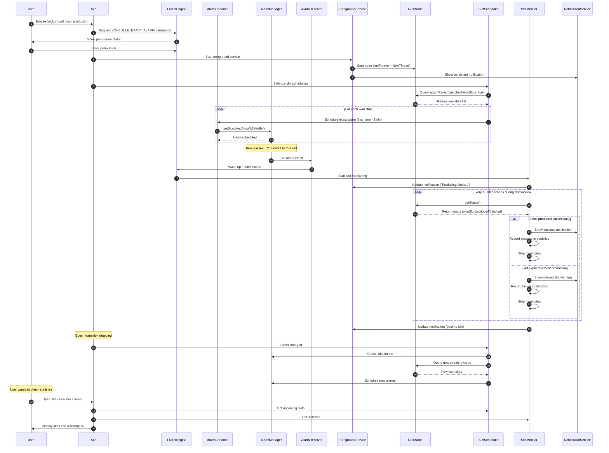
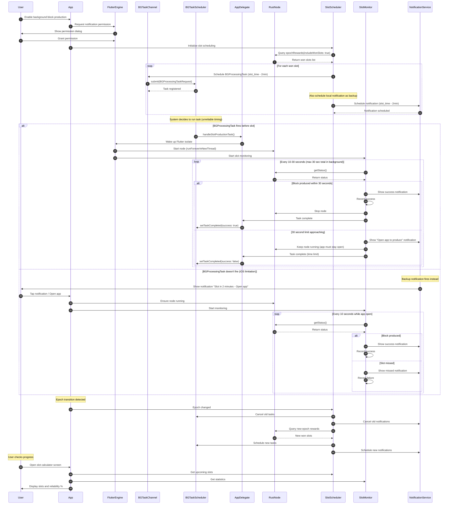
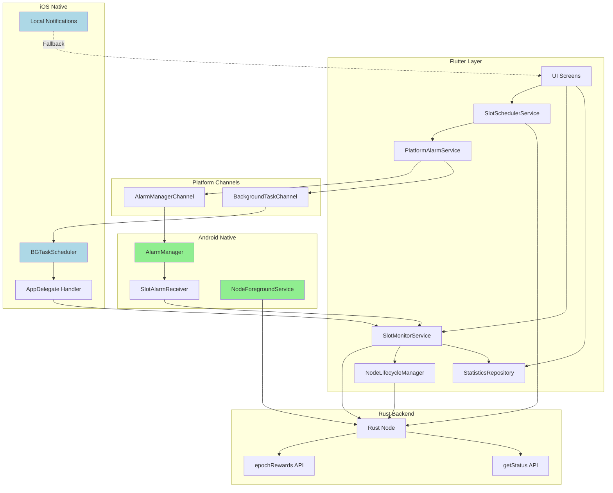
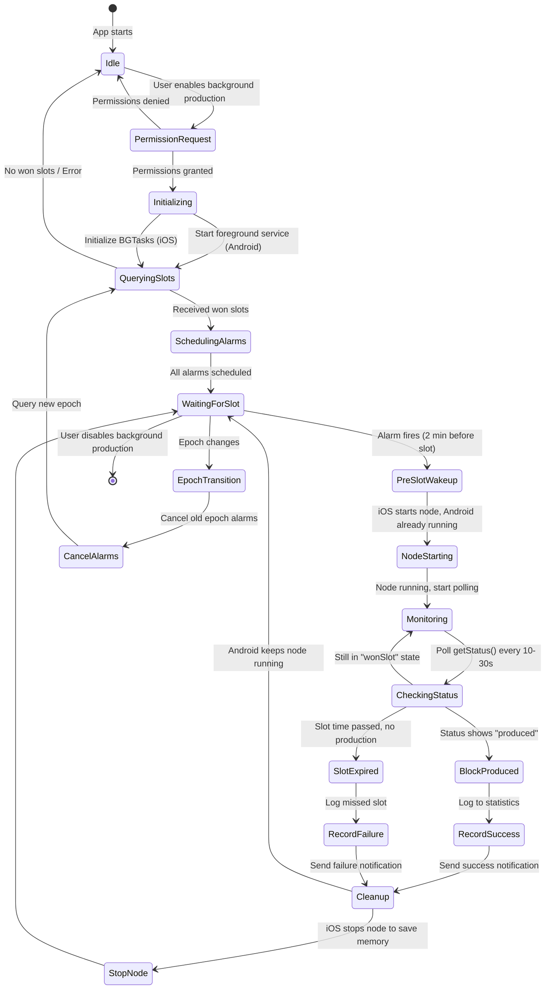

# Background Block Production - Flutter App Implementation Plan

## Executive Summary

**Architecture**: Scheduled discrete wake-ups (NOT continuous operation)

**Strategy**:

- **Android**: Keep node running + use exact alarms to ensure app wakes before slots (90-95% reliability)
- **iOS**: Start/stop node on demand + use BGProcessingTask + notifications for user alerts (60-90% reliability)

**Key Approach**:

1. Query Rust backend for won slots via `epochRewards(includeWonSlots: true)`
2. Schedule platform-specific alarms/tasks before each slot
3. When alarm fires: ensure node is running, monitor status until block is produced
4. Between slots: Keep node running on Android, stop/start on demand for iOS

---

## Rust Backend API (Already Available)

### 1. Get Won Slots

```dart
final rpc = RustBackendService.instance.rpc;
final epochData = await rpc.epochRewards(
  epoch: null,  // null = current epoch
  includeWonSlots: true,
);

// Returns:
// epochData.wonSlots: List<RpcEpochWonSlot>
//   - globalSlot: int
//   - expectedTimeMs: BigInt (timestamp in milliseconds)
```

### 2. Monitor Block Production Status

```dart
final status = await rpc.status();

// status.blockProducer?.status can be:
// - idle()
// - wonSlot(wonSlot)
// - wonSlotProduceInit(wonSlot)
// - batchesAssemblePending(wonSlot)
// - produced(wonSlot)
// - injected(wonSlot)
// etc.
```

### 3. Node Lifecycle (Already Available)

```dart
// Start node
await RustBackendService.instance.startForActiveAccount();

// Stop node
await RustBackendService.instance.stopNode();

// Get RPC handle
final rpc = RustBackendService.instance.rpc;
```

---

## PLATFORM LIMITATIONS & CONSTRAINTS

### Android Constraints

| Constraint                                        | Impact                                                  | Workaround                                                | Severity |
| ------------------------------------------------- | ------------------------------------------------------- | --------------------------------------------------------- | -------- |
| **Exact Alarm Permission Required (Android 14+)** | User must grant permission to schedule exact alarms     | Request permission at runtime with clear explanation      | Medium   |
| **Background Service Restrictions**               | Foreground service needed for reliable operation        | Use short-lived FGS during slot production only           | Medium   |
| **OEM-Specific Killing**                          | Xiaomi, Oppo, OnePlus kill background apps aggressively | Educate users to whitelist app; use persistent connection | High     |
| **Doze Mode**                                     | System restricts background activity in deep sleep      | Exact alarms bypass Doze; use setExactAndAllowWhileIdle() | Low      |

### iOS Constraints

| Constraint                      | Impact                                        | Workaround                                             | Severity     |
| ------------------------------- | --------------------------------------------- | ------------------------------------------------------ | ------------ |
| **BGProcessingTask Unreliable** | System decides when to run; not guaranteed    | Use notifications to prompt user before critical slots | **Critical** |
| **30-Second Background Limit**  | Without special mode, app suspended after 30s | Start/stop node on demand; keep work under 30s window  | **Critical** |
| **No Exact Alarm Equivalent**   | Cannot schedule precise wake-ups              | Combine BGTask (early) + notification (fallback)       | **Critical** |
| **Memory Limits**               | ~50MB in background; terminated if exceeded   | Stop node between slots to free memory                 | **Critical** |
| **No Boot Receiver**            | Cannot auto-start after device reboot         | Prompt user to open app daily to recalculate slots     | High         |

### Cross-Platform Constraints

| Constraint             | Both Platforms                                   | Workaround                                   | Severity |
| ---------------------- | ------------------------------------------------ | -------------------------------------------- | -------- |
| **Network Dependency** | Node needs internet to sync and produce blocks   | Detect offline state; warn user before slots | High     |
| **Battery Impact**     | Multiple wake-ups per day drain battery          | Optimize: only wake 2 min before slots       | Medium   |
| **User Awareness**     | Users may force-close app or disable permissions | Clear UI explaining validator requirements   | High     |

---

## DAILY WORKFLOW

```
┌──────────────────────────────────────────────────────────┐
│ DAY START (00:00)                                        │
│   ↓                                                       │
│ User opens app OR scheduled task runs                    │
│   ↓                                                       │
│ Query Rust: epochRewards(includeWonSlots: true)         │
│   → Returns: [Slot 145 at 03:27, Slot 892 at 14:54, ...] │
│   ↓                                                       │
│ Schedule alarms for each slot (2 minutes before)         │
│   • Android: Exact alarms via AlarmManager               │
│   • iOS: BGProcessingTask + notification fallback        │
│   ↓                                                       │
│ [Android] Node keeps running in background               │
│ [iOS] Stop node to save memory                           │
│                                                           │
├──────────────────────────────────────────────────────────┤
│ 03:25 - ⏰ ALARM FIRES (2 min before Slot 145)           │
│   ↓                                                       │
│ [Android] Wake app, ensure node still running            │
│ [iOS] Wake app, start node, fast sync                    │
│   ↓                                                       │
│ Monitor status() every 5 seconds                         │
│   ↓                                                       │
│ 03:27 - Slot 145 arrives                                 │
│   → Node automatically produces block                    │
│   → Status changes: wonSlot → produced → injected        │
│   ↓                                                       │
│ Block confirmed ✓                                        │
│   ↓                                                       │
│ [Android] Node continues running                         │
│ [iOS] Stop node after 30s to save battery/memory         │
│   ↓                                                       │
│ Wait for next slot alarm...                              │
│                                                           │
├──────────────────────────────────────────────────────────┤
│ 14:52 - ⏰ Next alarm (Slot 892)                         │
│   ... repeat process ...                                 │
│                                                           │
└──────────────────────────────────────────────────────────┘
```

---

## FLOW DIAGRAMS

### Android Background Execution Flow

This diagram illustrates the complete Android flow from user enablement through alarm scheduling, foreground service management, and slot monitoring.



### iOS Background Execution Flow

This diagram shows the iOS implementation with BGProcessingTask scheduling and local notification fallback due to iOS platform limitations.



### High-Level Architecture Diagram

This diagram shows the relationships between Flutter services, platform channels, native components, and the Rust backend.



### Component Interaction State Machine

This state diagram shows the complete lifecycle of the background execution system from initialization through slot monitoring and epoch transitions.



---

## IMPLEMENTATION CHECKLIST

### Phase 1: Core Services (Platform-Agnostic)

#### Slot Scheduler Service

- [ ] Create `lib/core/services/slot_scheduler_service.dart`
- [ ] Define `SlotSchedulerService` class with methods:
  - [ ] `Future<void> scheduleDailySlots()` - Query epoch won slots and schedule alarms
  - [ ] `Future<List<ScheduledSlot>> getScheduledSlots()` - Get upcoming scheduled slots
  - [ ] `Future<void> cancelAllSlots()` - Cancel all scheduled alarms
  - [ ] `Future<void> rescheduleSlots()` - Re-schedule after app restart
- [ ] Implement platform detection (Android vs iOS)
- [ ] Add persistence layer (save scheduled slots to local storage)
- [ ] Handle epoch transitions (detect new epoch, recalculate, reschedule)

#### Slot Monitor Service

- [ ] Create `lib/core/services/slot_monitor_service.dart`
- [ ] Define `SlotMonitorService` class with methods:
  - [ ] `Stream<BlockProductionStatus> monitorSlot(int slotNumber)` - Monitor specific slot
  - [ ] `Future<bool> waitForBlockProduction(int slotNumber, Duration timeout)` - Wait until produced or timeout
  - [ ] `Future<SlotResult> getSlotResult(int slotNumber)` - Get production outcome (success/missed)
- [ ] Poll `status()` RPC every 3-5 seconds during active slot window
- [ ] Detect production state changes (wonSlot → produced → injected)
- [ ] Record success/failure statistics

#### Statistics Repository

- [ ] Create `lib/core/repositories/block_production_stats_repository.dart`
- [ ] Define data models:
  - [ ] `SlotResult` - Outcome of a single slot (produced, missed, error)
  - [ ] `DailyStats` - Daily summary (total slots, produced, missed, reliability %)
- [ ] Implement local storage (SQLite or Hive)
- [ ] Methods:
  - [ ] `Future<void> recordSlotResult(SlotResult result)`
  - [ ] `Future<DailyStats> getDailyStats(DateTime date)`
  - [ ] `Future<double> getReliabilityPercentage(Duration period)`

---

### Phase 2: Android Implementation

#### Native Android Code

##### AlarmManager Integration

- [ ] Create `android/app/src/main/kotlin/com/usernode_labs/usernode/SlotAlarmReceiver.kt`
- [ ] Extend `BroadcastReceiver` to handle alarm intents
- [ ] In `onReceive()`:
  - [ ] Extract slot number and time from intent extras
  - [ ] Launch Flutter activity or trigger app wake-up
  - [ ] Send slot number to Flutter via method channel
- [ ] Add receiver to `AndroidManifest.xml`

##### Method Channel Handler

- [ ] Update `android/app/src/main/kotlin/com/usernode_labs/usernode/MainActivity.kt`
- [ ] Create method channel: `com.usernode_labs.usernode/slot_scheduler`
- [ ] Implement methods:
  - [ ] `scheduleExactAlarm(slotNumber, timestampMs)` - Schedule single alarm
  - [ ] `scheduleMultipleAlarms(List<Map>)` - Batch schedule
  - [ ] `cancelAlarm(slotNumber)` - Cancel specific alarm
  - [ ] `cancelAllAlarms()` - Cancel all alarms
  - [ ] `checkExactAlarmPermission()` - Check if permission granted
  - [ ] `requestExactAlarmPermission()` - Open settings to grant permission

##### Manifest Updates

- [ ] Update `android/app/src/main/AndroidManifest.xml`
- [ ] Add permissions:
  - [ ] `<uses-permission android:name="android.permission.SCHEDULE_EXACT_ALARM" />`
  - [ ] `<uses-permission android:name="android.permission.USE_EXACT_ALARM" />`
  - [ ] `<uses-permission android:name="android.permission.WAKE_LOCK" />`
- [ ] Declare `SlotAlarmReceiver`:
  ```xml
  <receiver
      android:name=".SlotAlarmReceiver"
      android:enabled="true"
      android:exported="false" />
  ```

#### Flutter Android Service

- [ ] Create `lib/core/services/android_slot_scheduler.dart`
- [ ] Implement `SlotScheduler` interface
- [ ] Methods:
  - [ ] `Future<void> scheduleSlot(ScheduledSlot slot)` - Call native `scheduleExactAlarm`
  - [ ] `Future<void> scheduleMultipleSlots(List<ScheduledSlot> slots)` - Batch schedule
  - [ ] `Future<void> cancelSlot(int slotNumber)` - Cancel via method channel
  - [ ] `Future<bool> hasExactAlarmPermission()` - Check permission
  - [ ] `Future<void> requestExactAlarmPermission()` - Request via settings
- [ ] Handle method channel communication
- [ ] Error handling (permission denied, scheduling failed)

---

### Phase 3: iOS Implementation

#### Native iOS Code

##### BGProcessingTask Setup

- [ ] Update `ios/Runner/Info.plist`
- [ ] Add background modes:
  ```xml
  <key>UIBackgroundModes</key>
  <array>
      <string>processing</string>
      <string>fetch</string>
  </array>
  ```
- [ ] Add BGTask identifiers:
  ```xml
  <key>BGTaskSchedulerPermittedIdentifiers</key>
  <array>
      <string>com.usernode.slot</string>
  </array>
  ```

##### BGTask Registration & Handling

- [ ] Update `ios/Runner/AppDelegate.swift`
- [ ] In `application(_:didFinishLaunchingWithOptions:)`:
  - [ ] Register BGTask handler:
    ```swift
    BGTaskScheduler.shared.register(
        forTaskWithIdentifier: "com.usernode.slot",
        using: nil
    ) { task in
        self.handleSlotTask(task as! BGProcessingTask)
    }
    ```
- [ ] Implement `handleSlotTask(_ task: BGProcessingTask)`:
  - [ ] Extract slot info from task
  - [ ] Send message to Flutter via method channel
  - [ ] Set expiration handler to save work if terminated
  - [ ] Call `task.setTaskCompleted(success:)` when done

##### Method Channel Handler

- [ ] Create method channel: `com.usernode_labs.usernode/slot_scheduler`
- [ ] Implement methods in AppDelegate:
  - [ ] `scheduleBGTask(slotNumber, timestampMs)` - Schedule BGProcessingTask
  - [ ] `scheduleNotification(slotNumber, timestampMs)` - Schedule local notification
  - [ ] `cancelBGTask(identifier)` - Cancel BGTask
  - [ ] `cancelNotification(identifier)` - Cancel notification

##### Local Notifications

- [ ] Request notification permission in AppDelegate
- [ ] Create notification category "SLOT_REMINDER"
- [ ] Define notification actions (optional: "Open App")
- [ ] Handle notification taps → launch app with slot context

#### Flutter iOS Service

- [ ] Create `lib/core/services/ios_slot_scheduler.dart`
- [ ] Implement `SlotScheduler` interface
- [ ] Methods:
  - [ ] `Future<void> scheduleSlot(ScheduledSlot slot)` - Schedule both BGTask and notification
  - [ ] `Future<void> scheduleMultipleSlots(List<ScheduledSlot> slots)` - Batch schedule
  - [ ] `Future<void> cancelSlot(int slotNumber)` - Cancel both BGTask and notification
  - [ ] `Future<bool> hasNotificationPermission()` - Check notification permission
  - [ ] `Future<void> requestNotificationPermission()` - Request permission
- [ ] Notification strategy:
  - [ ] Schedule BGTask 5 minutes before slot (system may run early/late)
  - [ ] Schedule notification 10 minutes before slot (user fallback)
  - [ ] Schedule second notification 2 minutes before slot (final warning)

---

### Phase 4: Flutter UI Integration

#### Epoch Calculator Page

- [ ] Create `lib/features/epochs/presentation/pages/epoch_calculator_page.dart`
- [ ] UI Components:
  - [ ] "Calculate Won Slots" button
  - [ ] Loading indicator during calculation
  - [ ] Display won slots count for today
  - [ ] List of upcoming slots with countdown timers
  - [ ] "Schedule Alarms" button (manual trigger)
  - [ ] "Auto-schedule daily" toggle (enable/disable)
- [ ] Logic:
  - [ ] On button press: call `epochRewards(includeWonSlots: true)`
  - [ ] Parse `RpcEpochWonSlot` list
  - [ ] Display slots with formatted times
  - [ ] Call `SlotSchedulerService.scheduleDailySlots()`
  - [ ] Show success/error feedback

#### Upcoming Slots Widget

- [ ] Create `lib/features/epochs/presentation/widgets/upcoming_slots_list.dart`
- [ ] Display each upcoming slot as a card:
  - [ ] Slot number
  - [ ] Expected time (formatted: "Today at 3:27 PM")
  - [ ] Countdown timer ("in 2h 15m")
  - [ ] Alarm status (scheduled ✓ or not scheduled ✗)
  - [ ] Platform-specific indicator (Android alarm icon vs iOS notification icon)
- [ ] Sort by time (nearest first)
- [ ] Refresh on pull-down

#### Settings Integration

- [ ] Update `lib/features/settings/presentation/pages/settings_page.dart`
- [ ] Add "Block Production" section
- [ ] Settings items:
  - [ ] **Auto-calculate daily** toggle
    - [ ] When enabled: schedule background task to run daily at 00:05 to recalculate won slots
    - [ ] Android: Use WorkManager periodic task
    - [ ] iOS: Use BGAppRefreshTask
  - [ ] **Exact alarm permission** (Android only)
    - [ ] Show permission status (granted/denied)
    - [ ] Button to request permission → opens system settings
  - [ ] **Notification permission** (iOS only)
    - [ ] Show permission status
    - [ ] Button to request permission
  - [ ] **Current reliability** stat
    - [ ] Display: "85% (17/20 blocks produced this week)"
  - [ ] **View Statistics** button → navigate to stats page

#### Statistics Dashboard

- [ ] Create `lib/features/epochs/presentation/pages/block_production_stats_page.dart`
- [ ] Display metrics:
  - [ ] **Today**: X won slots, Y produced, Z missed (reliability %)
  - [ ] **This week**: Aggregate stats
  - [ ] **All time**: Total blocks produced
- [ ] Charts (optional, use fl_chart package):
  - [ ] Line chart: reliability % over time
  - [ ] Bar chart: blocks per day
- [ ] Detailed slot history table:
  - [ ] Slot number | Time | Status (✓ Produced / ✗ Missed / ⏳ Pending)
  - [ ] Filter by date range
- [ ] Export button (optional): Export CSV of slot history

#### Real-time Slot Monitor Widget

- [ ] Create `lib/features/epochs/presentation/widgets/slot_production_monitor.dart`
- [ ] Show during active slot window (2 min before → 1 min after):
  - [ ] Large countdown timer: "Slot 145 in 1m 32s"
  - [ ] Current status (from `status().blockProducer.status`):
    - [ ] "Waiting..." (idle)
    - [ ] "Slot won! Producing block..." (wonSlot)
    - [ ] "Assembling batches..." (batchesAssemblePending)
    - [ ] "Signing block..." (signingPending)
    - [ ] "Block produced ✓" (produced)
    - [ ] "Broadcast complete ✓" (injected)
  - [ ] Progress indicator
  - [ ] Error display if production fails
- [ ] Auto-dismiss after block produced or timeout

---

### Phase 5: Background Automation

#### Daily Slot Calculation Task

##### Android: WorkManager

- [ ] Update `lib/core/services/background_task_service.dart`
- [ ] Add new task: `daily_slot_calculation`
- [ ] Schedule periodic work:
  ```dart
  Workmanager().registerPeriodicTask(
    "daily-slot-calc",
    "daily_slot_calculation",
    frequency: Duration(hours: 24),
    initialDelay: Duration(minutes: 5), // Run at 00:05 daily
    constraints: Constraints(networkType: NetworkType.connected),
  );
  ```
- [ ] In `callbackDispatcher`, handle task:
  - [ ] Initialize `RustBackendService` (if not running)
  - [ ] Call `epochRewards(includeWonSlots: true)`
  - [ ] Schedule alarms via `SlotSchedulerService`
  - [ ] Return success

##### iOS: BGAppRefreshTask

- [ ] In `ios/Runner/AppDelegate.swift`:
  - [ ] Register handler for `com.usernode.dailySlotCalc`
  - [ ] In handler: send message to Flutter to trigger calculation
- [ ] In Flutter, schedule next refresh:
  ```dart
  const platform = MethodChannel('com.usernode_labs.usernode/slot_scheduler');
  await platform.invokeMethod('scheduleDailyRefresh');
  ```

#### App Lifecycle Handling

- [ ] Update `lib/core/utils/lifecycle.dart`
- [ ] In `didChangeAppLifecycleState`:
  - [ ] **On resume**:
    - [ ] Check if new epoch started → recalculate slots
    - [ ] Verify scheduled alarms still exist
    - [ ] If Android & node not running → restart node
  - [ ] **On pause (iOS only)**:
    - [ ] Stop node after 30 seconds to save memory
    - [ ] Save current state

#### Slot Alarm Handler

- [ ] Create `lib/core/services/slot_alarm_handler.dart`
- [ ] Singleton service that handles incoming slot alarms
- [ ] Method: `Future<void> handleSlotAlarm(int slotNumber, int timestampMs)`
  - [ ] **Android**:
    - [ ] Check if node is running → if not, start it
    - [ ] Wait 10 seconds for node to sync
  - [ ] **iOS**:
    - [ ] Start node
    - [ ] Wait for sync (up to 2 minutes)
  - [ ] Start monitoring via `SlotMonitorService.monitorSlot(slotNumber)`
  - [ ] Show real-time monitoring UI (if app in foreground)
  - [ ] Wait for production or timeout (5 minutes)
  - [ ] Record result to stats repository
  - [ ] **iOS**: Stop node after 30 seconds to free memory
- [ ] Handle errors gracefully:
  - [ ] If node fails to start → record as missed, show notification
  - [ ] If timeout → record as missed, log for debugging

---

### Phase 6: Testing & Validation

#### Unit Tests

- [ ] Test `SlotSchedulerService`:
  - [ ] Mock Rust backend responses
  - [ ] Verify slot scheduling logic
  - [ ] Test epoch transitions
- [ ] Test `SlotMonitorService`:
  - [ ] Mock status responses with different states
  - [ ] Verify state transition detection
  - [ ] Test timeout handling
- [ ] Test `BlockProductionStatsRepository`:
  - [ ] Verify persistence
  - [ ] Test reliability calculations

#### Integration Tests

- [ ] Test Android alarm flow:
  - [ ] Schedule alarm → wait → verify receiver fired
  - [ ] Test with app in background
  - [ ] Test with device in Doze mode (use ADB to force Doze)
- [ ] Test iOS BGTask flow:
  - [ ] Schedule task → simulate task execution (Xcode "Simulate Background Fetch")
  - [ ] Verify Flutter receives slot context
- [ ] Test node start/stop cycle (iOS):
  - [ ] Stop node → wait → start node → verify sync completes

#### End-to-End Tests

- [ ] Full 24-hour simulation:
  - [ ] Calculate won slots for test epoch
  - [ ] Schedule alarms
  - [ ] Fast-forward time (modify system clock or use mock timestamps)
  - [ ] Verify all alarms fire
  - [ ] Verify blocks produced (or simulated)
- [ ] Multi-day test:
  - [ ] Day 1: Calculate and schedule
  - [ ] Day 2: Verify epoch transition detected, new slots scheduled
  - [ ] Verify old alarms canceled

#### Device Testing

- [ ] **Android devices** (minimum 3):
  - [ ] Pixel (stock Android 14)
  - [ ] Samsung (One UI)
  - [ ] Xiaomi/Oppo (aggressive battery management)
- [ ] **iOS devices** (minimum 2):
  - [ ] iPhone with iOS 16+
  - [ ] iPad (optional)
- [ ] Test scenarios:
  - [ ] App in foreground
  - [ ] App in background
  - [ ] App force-closed
  - [ ] Device rebooted
  - [ ] Low Power Mode (iOS)
  - [ ] Battery Saver Mode (Android)
  - [ ] Airplane mode during slot → reconnect before slot time

---

### Phase 7: User Experience & Polish

#### Permission Request Flow

- [ ] Create onboarding screen explaining block production requirements
- [ ] Step-by-step permission requests:
  - [ ] **Android**: Exact alarm permission
    - [ ] Show dialog: "Why we need this: To wake app before won slots"
    - [ ] "Grant Permission" button → opens settings
    - [ ] Verify granted → show success checkmark
  - [ ] **iOS**: Notification permission
    - [ ] Show dialog: "Why we need this: To alert you before won slots"
    - [ ] Request permission
    - [ ] If denied: show fallback strategy (must keep app open)
- [ ] Battery optimization guidance (Android):
  - [ ] Detect if app is battery-optimized
  - [ ] Show instructions for user's specific device (Xiaomi, Samsung, etc.)
  - [ ] Link to external guides (dontkillmyapp.com)

#### Notifications

- [ ] **Android**:
  - [ ] "Slot 145 in 2 minutes" - when alarm fires
  - [ ] "Block produced for slot 145 ✓" - on success
  - [ ] "Missed slot 145 ✗ - Node was offline" - on failure
- [ ] **iOS**:
  - [ ] "Slot 145 in 10 minutes - Open app to ensure production"
  - [ ] "Slot 145 in 2 minutes - Open app now"
  - [ ] Tap action → open app in slot monitor view

#### Error Handling & Retry

- [ ] If alarm fires but node is offline:
  - [ ] Attempt to start node (3 retries with 10s delay)
  - [ ] If fails: show notification "Unable to produce block for slot X - check internet"
  - [ ] Record failure reason in stats
- [ ] If epoch calculation fails:
  - [ ] Retry every 5 minutes (max 12 attempts = 1 hour)
  - [ ] Show persistent notification: "Unable to calculate slots - tap to retry"
- [ ] If scheduling fails (permission denied):
  - [ ] Show prominent warning in app
  - [ ] Disable auto-scheduling
  - [ ] Prompt user to grant permission

#### Documentation for Users

- [ ] In-app help section:
  - [ ] "How block production works"
  - [ ] "Why you receive notifications"
  - [ ] "What to do if you miss slots"
  - [ ] Platform-specific tips (Android vs iOS)
- [ ] FAQ:
  - [ ] Q: "Do I need to keep the app open?"
    - [ ] A (Android): "No, the app will wake automatically"
    - [ ] A (iOS): "For best reliability, yes. We'll send notifications as reminders."
  - [ ] Q: "Why did I miss a slot?"
    - [ ] A: Link to troubleshooting guide
  - [ ] Q: "How much battery does this use?"
    - [ ] A: "Minimal - we only wake up for your won slots"

---

## RELIABILITY ESTIMATES

| Platform    | Method                           | Expected Reliability | Battery Impact     | User Interaction                     |
| ----------- | -------------------------------- | -------------------- | ------------------ | ------------------------------------ |
| **Android** | Exact Alarms + Continuous Node   | **90-95%**           | Low (node running) | Minimal (just grant permission once) |
| **Android** | Exact Alarms + On-Demand Node    | **85-90%**           | Very Low           | Minimal                              |
| **iOS**     | BGTask only                      | **50-70%**           | Very Low           | None (but unreliable)                |
| **iOS**     | BGTask + Notifications           | **80-90%**           | Low                | Must respond to notifications        |
| **iOS**     | Foreground Mode (user opens app) | **99%**              | Low                | Must keep app open during slots      |

---

## RECOMMENDED IMPLEMENTATION ORDER

1. **Phase 1** (Core Services): Foundation for both platforms
2. **Phase 2** (Android): Fastest to implement, highest reliability
3. **Phase 4** (Flutter UI): Enable testing and user feedback
4. **Phase 3** (iOS): More complex, lower reliability
5. **Phase 5** (Background Automation): Enable hands-off operation
6. **Phase 6** (Testing): Validate reliability
7. **Phase 7** (Polish): Improve UX based on feedback

---

## EXPECTED OUTCOMES

### Battery Life

- **Android (continuous node)**: 10-15% daily increase
- **Android (on-demand node)**: 3-5% daily increase (only wakes for slots)
- **iOS (on-demand)**: 3-5% daily increase

### User Experience

- **Android**: Nearly invisible - one-time permission, then automatic
- **iOS**: Requires attention - respond to notifications before slots

### Reliability

- **Android**: 90-95% with proper permissions and user whitelisting
- **iOS**: 80-90% if user responds to notifications promptly

### Development Effort

- **Core + Android**: Medium complexity (exact alarms are straightforward)
- **iOS**: High complexity (BGTasks unreliable, need multi-tier fallback)
- **Testing**: High effort (need real device testing over 24+ hours)

---

## DEPENDENCIES & BLOCKERS

### Hard Dependencies (Must Have)

✅ Rust backend already exposes `epochRewards(includeWonSlots: true)`
✅ Rust node already supports start/stop via `RustBackendService`
✅ Flutter can call Rust via FFI (flutter_rust_bridge)

### Soft Dependencies (Nice to Have, but not blockers)

⚠️ Rust backend API to explicitly trigger sync (currently implicit via node running)
⚠️ Rust backend API to produce block for specific slot (currently automatic)

**These are NOT blockers** - the current "node runs and produces automatically" model works fine. The Flutter app just needs to:

1. Ensure node is running before slot time
2. Monitor status to verify production happened
3. Record statistics

---

## NEXT STEPS

1. ✅ Review this plan
2. ⏳ Start Phase 1: Core services (platform-agnostic)
3. ⏳ Implement Phase 2: Android (exact alarms)
4. ⏳ Test on real Android device
5. ⏳ Implement Phase 3 & 4: iOS + UI
6. ⏳ Real-world validation (24-hour test)

**Ready to begin implementation when you approve the plan!**
