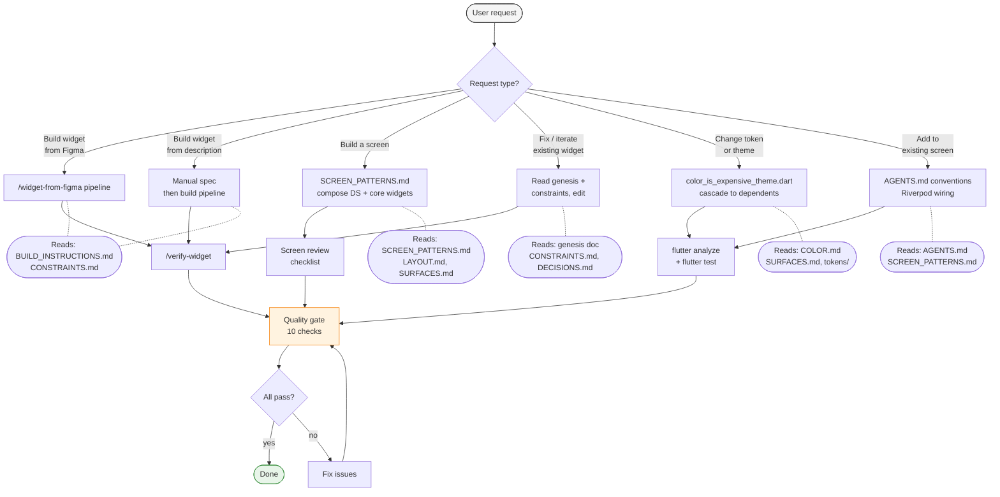
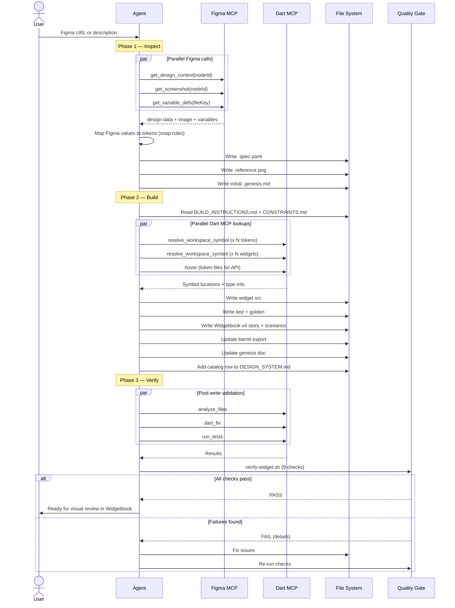
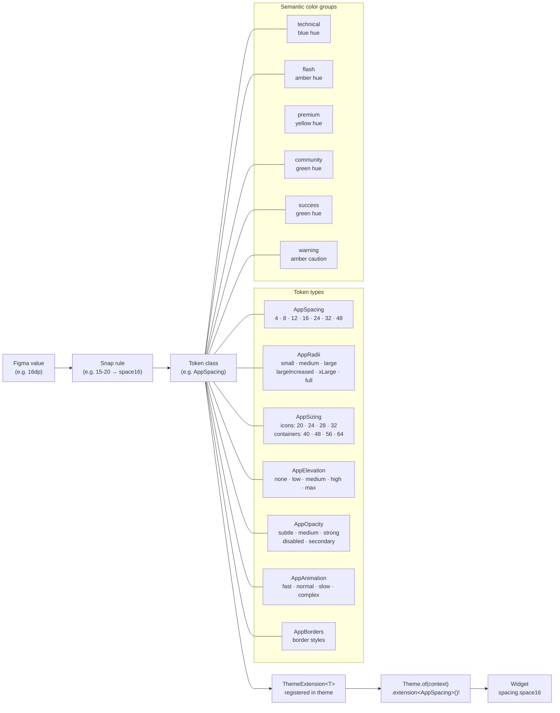
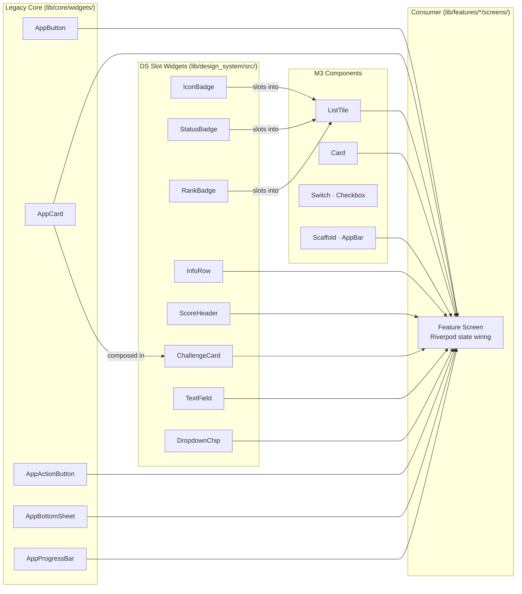
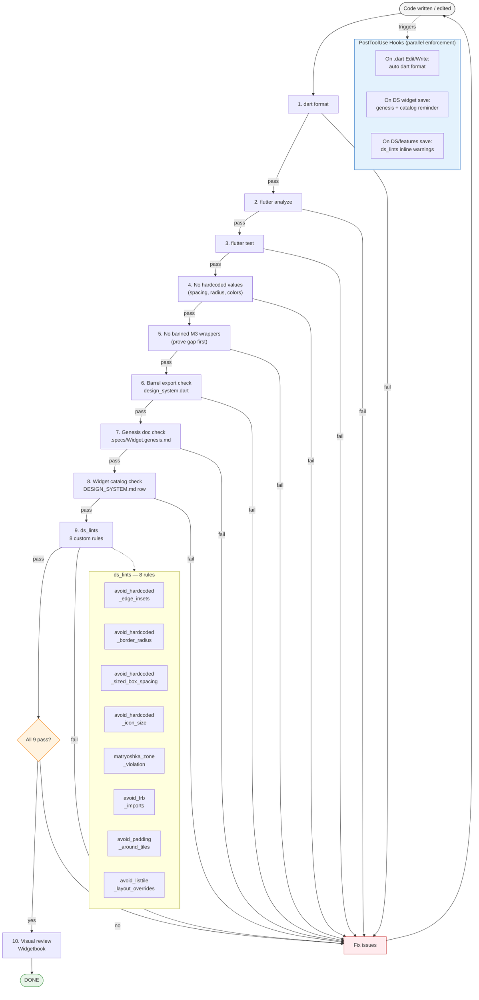

# Design System Harness — Agent Architecture

Visual map of the orchestration system that guides AI agents through design-to-code work. Six diagrams, read top-to-bottom.

---

## 1. Harness Information Architecture

Everything the agent navigates, layered by distance from code.

```mermaid
graph TD
    subgraph L0["L0 — Entry Points"]
        CLAUDE["CLAUDE.md"]
        AGENTS["AGENTS.md"]
        CMD_WFF["/widget-from-figma"]
        CMD_FI["/figma-inspect"]
        CMD_VW["/verify-widget"]
        AGENT_WB["widget-builder agent"]
    end

    subgraph L1["L1 — Constraint Docs"]
        CONSTRAINTS["CONSTRAINTS.md"]
        COLOR["COLOR.md"]
        SURFACES["SURFACES.md"]
        LAYOUT["LAYOUT.md"]
        TYPOGRAPHY["TYPOGRAPHY.md"]
        SCREEN_PAT["SCREEN_PATTERNS.md"]
        DECISIONS["DECISIONS.md"]
    end

    subgraph L2["L2 — Build References"]
        BUILD_INST["BUILD_INSTRUCTIONS.md"]
        SPEC_YAML[".spec.yaml files"]
        GENESIS[".genesis.md docs"]
        REF_PNG[".reference.png screenshots"]
    end

    subgraph L3["L3 — Tooling"]
        DART_MCP["Dart MCP\nanalyze · resolve · hover\ntest · format · fix"]
        FIGMA_MCP["Figma MCP\nscreenshot · context\nvariables"]
        DS_LINTS["ds_lints\n8 rules"]
        VERIFY_SH["verify-widget.sh\n9 checks"]
        HOOKS["PostToolUse hooks\nauto-format · genesis check\nds_lint on save"]
    end

    subgraph L4_DS["L4a — DS Code Track"]
        TOKENS["tokens/\n9 token classes"]
        THEME["theme/\nColorIsExpensiveTheme"]
        SRC["src/\n35 widgets"]
        WB["widgetbook/\nv4 stories"]
        BARREL["design_system.dart\nbarrel export"]
    end

    subgraph L4_LEGACY["L4b — Legacy Code Track"]
        CORE["lib/core/widgets/\nAppButton · AppCard\nAppActionButton\nAppBottomSheet\nAppProgressBar"]
    end

    subgraph L4_CONSUMER["L4c — Consumer"]
        FEATURES["lib/features/*/screens/\nRiverpod wiring\ncomposes DS + legacy"]
    end

    %% L0 reads L1
    CLAUDE -->|reads| AGENTS
    CLAUDE -->|reads| CONSTRAINTS
    CMD_WFF -->|reads| BUILD_INST
    CMD_WFF -->|reads| CONSTRAINTS
    CMD_FI -->|reads| BUILD_INST
    AGENT_WB -->|reads| BUILD_INST

    %% L0 invokes L3
    CMD_WFF -->|invokes| DART_MCP
    CMD_WFF -->|invokes| FIGMA_MCP
    CMD_FI -->|invokes| FIGMA_MCP
    CMD_VW -->|invokes| VERIFY_SH
    CMD_VW -->|invokes| DS_LINTS

    %% L2 produced by pipeline
    CMD_FI -->|produces| SPEC_YAML
    CMD_FI -->|produces| REF_PNG
    CMD_WFF -->|produces| GENESIS

    %% L3 enforces L4
    DS_LINTS -->|enforces| SRC
    DS_LINTS -->|enforces| FEATURES
    HOOKS -->|enforces| SRC
    DART_MCP -->|validates| SRC
    VERIFY_SH -->|validates| SRC

    %% L4 code flow
    TOKENS --> THEME
    THEME --> SRC
    SRC --> BARREL
    SRC --> WB

    %% Consumer composition
    SRC -->|consumed by| FEATURES
    CORE -->|consumed by| FEATURES
    CORE -->|composed in| SRC
```



---

## 2. Agent Decision Flow

How the agent routes a user request to the right entry point and quality gate.



---

## 3. Widget Pipeline

Full sequence for building a widget from Figma URL to verified output.



---

## 4. Token Resolution & Composition

### 4a — Token Flow

How a Figma value becomes a pixel on screen.



### 4b — Widget Composition

The M3-first rule in practice: DS slot widgets plug into M3 containers; legacy core widgets can be composed.



---

## 5. Quality Gate Pipeline

The 10-point check sequence, with PostToolUse hooks as a parallel enforcement lane.



---

## 6. Real-World Context-Loading Loop

How the agent actually navigates the harness — not linear, but a lazy-loading loop where docs are pulled in on demand as questions arise mid-build.

```mermaid
stateDiagram-v2
    [*] --> Orient

    state "Orient" as Orient {
        note left of Orient
            Skim DESIGN_SYSTEM.md
            + request analysis
        end note
    }

    state "Pattern-Match" as PatternMatch {
        note left of PatternMatch
            Scan src/ for similar widgets
            Read 1-2 existing impls
        end note
    }

    state "Build" as Build {
        note left of Build
            Write widget, test,
            widgetbook, barrel, genesis
        end note
    }

    state "Hook Fires" as Hook {
        note left of Hook
            PostToolUse: auto-format,
            ds_lint, genesis reminder
        end note
    }

    state "React to Feedback" as React {
        note left of React
            Read hook output,
            interpret lint warning
        end note
    }

    state "Pull Doc on Demand" as PullDoc {
        note left of PullDoc
            Lazy-load the specific
            constraint or reference
        end note
    }

    state "Verify" as Verify {
        note left of Verify
            verify-widget.sh
            9 automated checks
        end note
    }

    state "Fix" as Fix {
        note left of Fix
            Targeted edit based
            on failure message
        end note
    }

    Orient --> PatternMatch
    PatternMatch --> Build

    Build --> Hook : file saved
    Hook --> React : output returned
    React --> Build : understood, continue
    React --> PullDoc : need more context

    PullDoc --> Build : question answered

    Build --> Verify : all files written
    Verify --> [*] : all pass
    Verify --> Fix : failure
    Fix --> PullDoc : re-read constraint
    Fix --> Build : simple fix
```

The key difference from Diagram 3: docs aren't read upfront in a batch — they're pulled in **reactively** when a specific question arises. Common triggers:

| Trigger | Doc pulled |
|---------|-----------|
| "Is this an M3 gap?" | CONSTRAINTS.md (M3 gap-proof checklist) |
| "What token snaps to 14dp?" | BUILD_INSTRUCTIONS.md (snap rules) |
| "How did the last similar widget handle this?" | Existing `.genesis.md` |
| "What's the surface model here?" | SURFACES.md |
| "Matryoshka lint fired — who owns this spacing?" | SCREEN_PATTERNS.md (spacing ownership) |
| "Which color group for this semantic?" | COLOR.md (semantic color groups) |
| Hook warns "missing genesis" | BUILD_INSTRUCTIONS.md (genesis format) |
| Hook warns "missing catalog entry" | DESIGN_SYSTEM.md (catalog table) |
| ds_lint fires `avoid_padding_around_tiles` | LAYOUT.md (ListTile collision rules) |

---

*Source files: [CONSTRAINTS.md](CONSTRAINTS.md) · [BUILD_INSTRUCTIONS.md](../.specs/BUILD_INSTRUCTIONS.md) · [SCREEN_PATTERNS.md](SCREEN_PATTERNS.md) · [DECISIONS.md](DECISIONS.md) · [widget-from-figma](../../../.claude/commands/widget-from-figma.md) · [verify-widget](../../../.claude/commands/verify-widget.md)*
